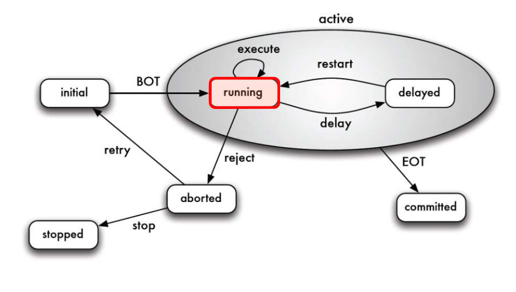

# SQL

## Datentypen

| Datentyp                    | Erklärung                                                                             |
| --------------------------- | ------------------------------------------------------------------------------------- |
| CHAR(n)/Character(n)        | String mit einer fixen Länge                                                          |
| Char Varying(n)/VARCHAR(n)  | String, welcher beliebig Lang sein kann . Kann aber ein Limit haben                   |
| TEXT                        | String, mit beliebiger Länge                                                          |
| Int/INTEGER                 | Ganzzahl                                                                              |
| REAL                        | Fliesskomazahl                                                                        |
| NUMERIC(p, s)/DECIMAL(p, s) | Festkomazahl. `p` steht für die Stellen nach dem 0, `s`für die Stellen nach vor dem 0 |
| INDEX                       | Shortcut für                                                                          |

### Domains

```sql
GENERATED BY DEFAULT AS IDENTITYDomains sind Typenalias.
```

#### Domain erstellen

`create domain <name> as <datentyp>`

Der Name ist der Name, welcher zukünfigt als Typ verwendet werden können, der Datentyp ist ein Typ, wie "CHAR(10)".

#### Domain Löschen

Löscht eine Domain

`drop domain <name`

## Schemas

### Schema Erstellen

Um eine neues Schema zuerstellen zu können:

`create schema <name> [authorization <user>]`

In Postgressql ist ein Schema ein Teil einer Datenbank. In MySQL diese Terme kann man gleich setzten.

### Schema Löschen

`drop schema <name> [cascade]`

Löscht das angegebene Schema

- "casecade" löscht ohne nach zu fragen.

### Schema auswählen

`use schema <name>`

Mit diesem Befehl wird ein Schema ausgewählt, dass für zukünfigite Befehle, wie `create table` benützt werden soll.

## Tabellen

### Tabellen Erstellen

Um eine neue Tabelle erstellen zu können:

`create table <tablename> (<columnName1> <columnTyp1> <optionen> | table constraint, ...) `

* optionen
  * `NOT NULL` - Attribut kann nicht null sein
  * `DEFAULT (<value>)` - Setzt ein Default Wert
  * `CHECK (<condition>)` - Das Attribut muss die Kondition erfüllen
  * `PRRIMARY KEY` (impliziert `NOT NULL`) - Definiert ein Attribut als Primary Key
  * `UNIQUE` - Attribute muss einzigartig sein
* table constraint - Anstatt ein Attribut kann auch ein Table Constraint definiert werden

### Tabelle Kopieren

Wenn man das Schema (ohne Constraints) kopieren möchte, kann man folgenden Befehl benützten: `CREATE TABLE <tablename> LIKE <table_copy_from> [INCLUDING CONSTRAINTS]`

Mit `INCLUDING CONSTRAINTS` können auch die Constraints übernommen werden.

Um mit Daten eine neue Tabelle zu erstellen, kann man auch den folgenden Befehl benützten: `CREATE TABLE <tablename> AS (<subquery>)` . Dies erstellt eine neue Tabelle auf Basis der Subquery.

Eine normale Tabelle kann nicht mit `update materialized view` geupdated werden.

### Tabellen Löschen

`drop table <tablename> [cascade]`

Löscht die angegebene Tabelle

* "casecade" löscht ohne nach zu fragen.

### Tabellen Ändern

`ALTER TABLE <tableName> ADD <column|contraint>`

`ALTER TABLE <tableName> DROP <column|contraint>`

`ALTER TABLE <tableName> ALTER <column|contraint>`

## Constraints

### Arten

- `NOT NULL` - Attribut kann nicht null sein
- `DEFAULT (<value>)` - Setzt ein Default Wert
- `CHECK (<condition>)` - Das Attribut muss die Kondition erfüllen
- `PRRIMARY KEY [(<spalte1>, ...)]` (impliziert `NOT NULL` und `UNIQUE`) - Definiert ein oder mehrere  Attribute als Primary Key. (max 1 pro Tabelle)
- `FOREIGN KEY <spalte1> REFERENCES <table> [<spalte>]` - erstellt ein Foreign Key
- `UNIQUE [(<spalte1>, ...)]` - Attribute muss einzigartig sein

## Daten Hinzufügen

`INSERT INTO <tabelle> [(<attribut1>, ...)] VALUES (<value1>,...)`

`INSERT INTO <tabelle> [(<attribut1>, ...)] (<query>)`

Fügt ein Tupel in eine Tabelle ein. Ebenfalls kann anstatt fixe Werte ein SELECT angegeben werden. In diesem Fall werden die Werte von der Query übernommen

## Daten Updaten

`UPDATE <tableName> SET <attribut1> = <value1> , ... [WHERE <condition>]`

Ändert alle Tupels, bei welchen die Kondition zutrifft. Falls kein WHERE angegeben wurde, werden alle Tupels in der Spalte geändert.

### Daten Abfragen`

`SELECT <spalte1>, ... FROM <tabellen> [WHERE <condition>] [GROUP BY <spalte>, ... [HAVING <condition>]] [ORDER BY <column> [ASC|DESC]] [LIMIT <limit>] [OFFSET <start>]`

* Als Spalte kann folgendes angegeben werden
  
  * Spalten von Tabellen vom FROM-Teil 
    
    * Mathe/Funktionen mit spalten (z.B. saler * 1.2 + 1000 als spalte)
  
  * `DISTINCT <spalte>` - dies eliminiert Duplikate in der angegebenen Spalte
  
  * '*' steht für alle Spalten vom FROM-Teil
  
  * Konstante (z.B. 1)
  
  * Aggregate Funktionen, wie `AVG(<spalte>)`, `SUM(<spalte>)`. Dafür sollte aber auch `GROUP BY` spezifiziert sein
  
  * Jede "Spalte" von dieser Liste kann mit `AS <name>` umbenennt werden

* Als tabellen kann folgendes geschrieben werden:
  
  * Eine oder mehrere Tabellen. Wenn mehrere Tabellen definiert werden, wird das Kreuzprodukt gebildet
  
  * Nach einer Tabelle kann ein Name angegeben werden (z.B. `BestellPosition BP` BestellPostion könnte in der Query als BP benutzt werden)
  
  * `<tabelle> CROSS JOIN <tabelle>` - bildet das Kreuzprodukt
  
  * `<tabelle> LEFT JOIN <tabelle>` - Alle Einträge von der linken Seite werden übernommen. Wenn keine Eintrag auf der rechten Seite gefunden wird, sind die entsprechenden Spalten `NULL`
  
  * `<tabelle> RIGHT JOIN <tabelle>` - Alle Einträge von der rechten Seite werden übernommen. Die Spalten der linken Seite werden `NULL`, wenn kein Eintrag zu der rechten Seite gefunden wurde.
  
  * `<tabelle> OUTER JOIN <tabelle>` - LEFT und RIGHT JOIN kombiniert
  
  * `<tabelle> FULL OUTER JOIN <tabelle>` - 
  
  * `<tabelle NATURAL FULL OUTER JOIN <tabelle>` - 
  
  * `<tabelle> [INNER] JOIN <tabelle>` - Liefert nur Resultate, welche auf beiden Tabellen einen Eintrag haben. Es gibt den alternativ Syntax `SELECT * FROM a, b WHERE a.x = b.x `
  
  * `<tabelle> NATURAL JOIN <tabelle>` - Ist das Equivalente zu $\bowtie$. Es werden gemeinsame Attribute benutzt. Falls es keine gibt, wird ein Kreuzprodukt gebildet
  
  * Subqueries - `<subquery> AS <variable>` Das `AS` weisst der Subquery einen Namen zu, welchen man wie als Tabellennamen benutzten kann

* conditions
  
  * `<column> LIKE <likeStr>` Like funktioniert ählich, wie `=`, nur das `%` anstatt beliebiege Zeichen eingesetzt werden können und `_` als **ein** bestimmtes Zeichen. Dies funktioniert nur für Strings
  
  * `<column> BETWEEN <start> AND <end>` Findet alle Werte zwischen dem start und end (inklusiv start und end). Dies funktioniert auch mit Strings oder Daten
  
  * `<column> IS NULL` - prüft, ob ein Wert `NULL` ist
  
  * `<>` - steht für nicht gleich, wie != in den meisten Sprachen
  
  * `EXISTS (subquery)` - überprüft, ob die subquery etwas zurück geliefert hat
  
  * `<column> IN (<wert1>, ...)` ODER `<column> IN (<subquery>)` - Stelltsicher, dass der Wert der Spalte in der Wertelist ist oder in der Subquery gefunden wird. Die Subquery muss eine Spalte zurück geben oder der `<column>`-Teil muss ein Tupel sein (wie `(<column1>, <column2>, ...) IN (select <column1>, <column2>, ...) from ...`). Die Reihenfolge wird beachtet, nicht die Namen selbst! 
  
  * `<column> NOT IN (<wert1>, ...)` oder `<column> NOT IN (<subquery>)` - Gleich wie `IN` nur, dass der Wert der Spalte nicht in der Werteliste oder Subquery vorkommen darf.

* `ORDER BY`
  
  * `ASC` - Aufsteigend (default)
  
  * `DESC` - Absteigend

#### Reihenfolge

In der folgenden Reihenfolge werden SQL Queries abgearbeitet. Speziell wo `WHERE`und `HAVING` steht.

1. FROM

2. WHERE

3. GROUP BY

4. HAVING

5. SELECT

6. ORDER BY

#### Aggregatsfunktionen

SQL kennt folgende Aggregationsfunktionen `COUNT(<spalte>)`, `AVG(<spalte>)`, `SUM(<spalte>)`, `MIN(<spalte>)`, `MAX(<spalte>)`

(`AVG(<splate>)` ist nicht dasselbe, wie `SUM(<spalte>)/COUNT(<spalte>)`, da COUNT auch `NULL` Werte zählt)

Die Aggregationsfunktionen operieren auf den Gruppen, welche von `GROUP BY` erstellt wurde.

Wichtig zu erwähnen ist, dass `HAVING` auf dem aggregiertem Ergebniss filtert und `WHERE` vor dem Gruppieren. 

### Subqueries

Abfragen können miteinander verbunden werden:

`<query> (UNIION | INTERSECT | EXCEPT) [ALL|DISTINCT] <query>` 

* `UNION ALL` = Bag Concatenation 

* `INTERSECT ALL` = $\cap$

* `EXCEPT ALL` = \

#### `ALL` und `ANY`

`where <column> <|>|<=|>= [NOT] ALL(<subquery>)`

`where <column> <|>|<=|>= [NOT]ANY (<subquery>)`

`WHERE alter > all(select alter from person)` würde sicher stellen, dass das Alter grösser ist als alle Alter der Personen der Tabelle Person.

`WHERE alter > ANY(select alter from person)` würde sicher stellen, dass das Alter grösser ist als mindestens ein Alter einer Person der Tabelle Person.

#### EXISTS

`where [NOT] EXISTS(<subquery>)`

`EXISTS` wird true, wenn die Subquery **kein** leeres Resultat zurück bringt.

Beispiel: `select * from person as P where exists (select 1 from angestellte as A where P.name=A.name)`angestellte

## Views

### Materialized View

Eine materialized View updaten nicht automatisch, sondern muss manuell geupdated werden mit `REFRESH MATERIALIZED VIEW <name>`.

Dies kann auch mit Triggers erledigt werden. So könnte man z.B. nach einem Zeitintervall die Materialized View updaten.

### View erstellen

`CREATE [MATERIALIZED] VIEW <name> AS <abfrage>`

Damit wird eine View erstellt. Dies kann nützlich sein, um die Schreibarbeit zu minimieren. Ebenfalls kann es dazu verwendet werden, Rechte auf nur einen Teil einer Tabelle zu verteilen.

Views können auch von anderen Views abhängig sein.

Wenn eine View von mehreren Tabellen abhängig ist (oder andere Speziallfälle), können keine neue Daten eingefügt werden. Wenn eine View mit `AS select * from <tabelle>` erstellt, dann können Daten geändert werden.

### View ändern

`ALTER VIEW <name> ..`

Kann dazu verwedet werden, um verschiedene Eigenschaften einer View zu ändern. Um die Spalten einer View zu ändern, ist es aber einfacher einfach die View zu löschen und neu zu erstellen.

### View löschen

`DROP VIEW <name>`

Damit wird eine View gelöscht.

## Stored Procedures/Funktion

`CREATE PROCEDURE <name>`

`ALTER PROCEDURE <name>...`

`DROP PROCEDURE <name>`

`CREATE FUNCTION <name>`

`ALTER FUNCTION <name>...`

`DROP FUNCTION <name>`

Die Grundstruktur einer Funktion sieht folgendermassen aus:

```plsql
CREATE OR REPLACE FUNCTION <name>() RETURNS <returnType> AS
$body$
BEGIN
<mainLogicBlock>
EXCEPTION
<exceptionBlock>
END
$body$
```

Mit `SELECT <name>()` kann man diese Funktion danach aufraufen.

### Variabeln

`<name> [CONSTANT] <type> [NOT NULL] <expression>`

`<name> [CONSTANT] <type> [NOT NULL] DEFAULT <expression>`

Mit dem obigen SQL können Variabeln in einer Funktion erstellt werden. 

### Cursor

```sql
DECLARE <cursor_name> CURSOR
FOR <select_expression>
[FOR UPDATE]
```

Mit `OPEN <cursor_name>` kann der Cursor geöffnet werden und mit `CLOSE <cursor_name>` wieder geschlossen.

```plsql
CREATE OR REPLACE FUNCTION Show_AlleBesuchernamen()
RETURNS VOID AS $$
DECLARE
    rec_Besucher record;
    c_Namen CURSOR FOR SELECT Name,Vorname FROM Besucher;
BEGIN
    OPEN c_Namen;
    LOOP
        FETCH c_Namen INTO rec_Besucher;
        EXIT WHEN NOT FOUND;
        RAISE NOTICE 'Name: % Vorname: % ',rec_Besucher.Name, rec_Besucher.Vorname;
END LOOP;
CLOSE c_Namen;
END; $$
LANGUAGE plpgsql;
```

## Trigger

Triggers werden ausgeführt, wenn ein sich eine Tabelle ändert. Einen Trigger kann für INSERT, UPDATE und DELETE definiert werden.

Mit den typeschen SQL Statements können Triggers erstellt werden.

`CREATE TRIGGER <name> (BEFORE|AFTER|INSTEAD OF) ON <tabelle> FOR EACH ROW EXECUTE PROCEDURE <procedure/function>()`
`ALTER TRIGGER  <name> (DISABLE|ENABLE)`

`DROP TRIGGER <name>`

## Index

Mit `CREATE INDEX <name> on <table>(<column>, ...)` kann ein Index erstelt werden und mit `DROP INDEX <name>` weder gelöscht werden.

Ein Index hat einige Vorteile, aber auch Nachteille:

* Vorteil:
  
  * Zugriffzeit
    Da die Daten nun eine Sortierung haben, kann die DB schneller auf die Daten zugreifen

* Nachteile:
  
  * Speicherplatz
    Der Index böntigt platz
  
  * Zeit
    Um den Index zu erstellen und nocht wichtiger **beim Updaten**, benötigt die DB Zeit, um den Index neu zu schreiben

### Wann lohnt sich ein Index?

* Attribute, welche oft Abgefragt werden

* Femdschlüssel sollten indexiert werden

* Generell, Attribute, über die oft gejoint weden, sollten indexiert werden

* Attribute mit niedriger Kardinalität sollten **nicht** indexiert weden (dafür gibt es spezielle Indexstrukturen, welche wir allerdings nicht behandeln)

### Dünn- vs. Dichtbesetzer Index

## Transaktionen

Im folgenden Bild sind die verschiedenen Statis einer Transakti



### Lost-Update

* Es darf nicht gleizeitig aus zwei Transaktionen geschrieben werden. Dies verhindert ein Lost-Update

### Dirty Read


### Non-Repeatable Read

### Phantom-Read
