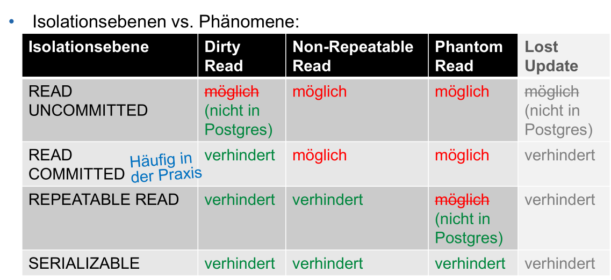
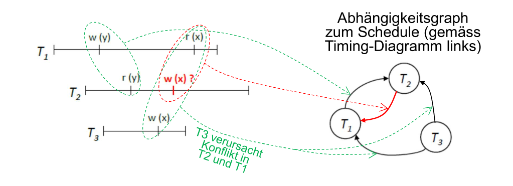

# Integritätsregeln

Wichtig anzumerken, nur weill die Datenbank konsistenz ist, heisst nicht, dass die Daten darin korrekt sind.

## Überprüfbare Regeln

* **Bereichintegrität**
  Das DB-System stellt sicher, dass der Wert eines Attributes in einem Wertebereich ist. Dafür können z.B. `NULL` und `NOT NULL`, wie auch Domänen verwendet werden

* **Entitätsintegrität**
  Der Primätschlüssel kann nicht leer sein. Also nicht `NULL`

* **Refentielle Integrität**
  Der Wert eines Fremdschlüssel muss `NULL` sein oder **genau einen** Primärschlüssel referezieren

* **Constraints**
  Zusätzlich können Constraints geschrieben werden, um weitere Bedingungen zu überprüfen. Siehe [SQL](04_SQL.md)

## Isolationsebenen

Mit `SET TRANSACTION ISOLATION LEVEL {READ UNCOMMITED | READ COMMITTED | REPEATABLE READ | SERIALIZABLE}` kann die Isolationsebenen verändert werden.

(In Postgresql ist `READ UNCOMMITTED` das selbe, wie `READ COMMITTED`)

## Defered Constraint Checking

## Schedules

Der vollständige Schedule beinhaltet alle Schritte, inklusive `COMMIT` und `ROLLBACK` Befehle. Ebenfalls ist für jede Transaktion festgehalten, ob sie erfolgreich war oder nicht. Wenn eine neue Abfrage an den DB-Server gesendet wird, landet diese zuerst im vollständigen Schedule bevor die Befehle auf einen Schedule geplant werden konnten.

Ein Schedule (**nicht** ein vollständiger Schedule) wird von der DB geplant anhand des vollständigen Schedule. Die Planung kann während des Ausführens eines Schedules laufen, so bald dieser fertig ist, wird der nächste ausgeführt.

### Darstellung

### konfliktserialisierbar

Ein Schedule ist konfliktserialisierbar, wenn:

1. d

Anders ausgedrückt, ein Schedule ist serialisierbar, wenn dieser keine Zyklen enthält.

### Scheduler / Transaktionsmanager

Der Scheduler erstellt ein serialisierbaren Schedule für parallel auszuführende Transaktionen.

* Aggresiver Scheduler
  Lässt Konflikte zu und probiert wenn diese auftreten, die zu lösen. Dies führt zu einer höhreren Parallelität
* Konservative Scheduler
  Verscuht möglichst Konflikte zu vermeiden. Dies führt zu einer niedrigen Parallelität

## Sperrverfahre

### Lese-Spere

Bei einer Lese sperre können andere Transaktionen immer noch vom gelockten Bereich lesen, aber nicht mehr Schreiben. Diese Sperre kann nur gesetzt werden, wenn **keine** Schreib-Sperre existiert.

Ein Lesezugriff kann nur getätigt werden, wenn eine Lese-Sperre (oder Schreib-Sperre) auf dem zu lesenden Bereich existiert. 

### Schreib-Sperre

...

### Regeln

* Bei einem Commit oder Rollback werden alle Sperren aufgehoben

### Probleme

1. **Block**: Eine gesperrte Resource zwingt einen anderen Prozess zu warten, bis die Sperre wieder entfernt wurde
2. **Verhungern**, Livelock: Eine Transaktion kommt nie daran, weil immer wieder andere Transaktionen vor der Transaktion abgearbeitet werden.
3. **Deadlock**: Dies passiert, wenn sich mehrere Transaktionen gegenseitig Sperren.
   Das RDBms erkennt solche Deadlocks. Wenn dies passiert, wird eine Transaktion ausgewählt und zurück gesetzt, um den Deadlock zu behben.
4. **Phantom-Read**
   Lösungen:
   1. ..

## Recovery

Wenn die DB nicht ordnungsgemäss herunter gefahren wurde (z.B. mit `pkill` im Terminal), wird eine Recovery eingeleitet, um wieder auf einen konsistenten Zustand zu kommen

1. Der Recovery-Manager kann aus den Transaktionslogs einen vorherigen Zustand wieder herstellen
2. ...

### Fehlerklassifikation

1. Transaktionsfehler
   ...
2. ...
