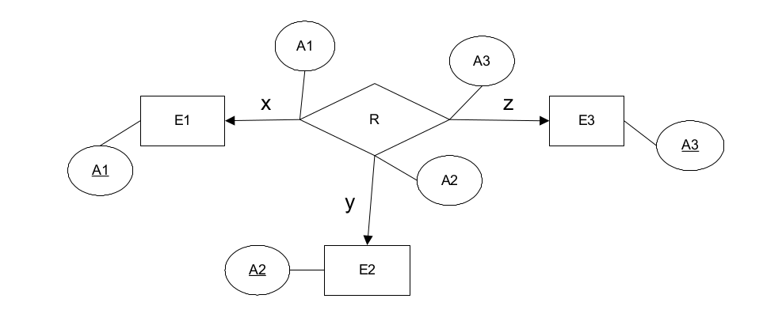
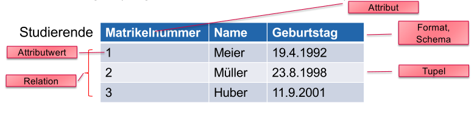

# DB Summary 25.01.2022

## Relationale Algebra

| Operation | Erklärung           | Beispiel              |
| --------- | ------------------- | --------------------- |
| $\sigma$  | Selektion/ `WHERE`  | $\sigma_{Länge>3}(R)$ |
| $\pi$     | Projektion/`SELECT` | $\pi_{}$              |
|           |                     |                       |
|           |                     |                       |
|           |                     |                       |
|           |                     |                       |
|           |                     |                       |
|           |                     |                       |
|           |                     |                       |

## ERD

### Korrektes ER-Diagramm

Mit folgenden Regeln, wird ein korrektes ER-Diagramm erstellt:

1. Definiere die unabhängige Entitäts-Typen (Tabellen, welche keine Fremdschlüssel besitzen)
2. Definiere die Beziehungs-Typen (Rhomben), wenn mehr als eine unabhängige Entitäts-Typen existiert.
3. Definiere die Attribute und Schlüssel
4. Wandle Beziehungstypen ind zusammengesetzte Entitätstypen um, wenn nötig
5. Definiere die ID-Abhänigen Entitästypen (Pfeile mit ID)
6. Definiere die ISA-Abhänigen Entitätstypen (Pfeile mit ISA)

### Schlüssel Gruppen

| Diagramm         | Schlüssel Beschreibung                              |
| ---------------- | --------------------------------------------------- |
| E 1 -- <> -- 1 F | Schlüssel von E und F in seperaten Schlüsselgruppen |
| E 1 -- <> -- m F | Schlüssel von F                                     |
| E m -- <> -- 1 F | Schlüssel von E                                     |
| E m -- <> -- m F | Schlüssel von E und F in einer Schlüsselgruppe      |

| x    | y    | z    | Schlüssel          |
| ---- | ---- | ---- | ------------------ |
| m    | m    | m    | {A1, A2, A3}       |
| m    | m    | 1    | {A1, A2}           |
| m    | 1    | m    | {A1, A3}           |
| m    | 1    | 1    | {A1, A2}, {A1, A3} |
| 1    | m    | m    | {A2, A3}           |
| 1    | m    | 1    | {A2, A1}, {A2, A3} |
| 1    | 1    | m    | {A3, A1}, {A3, A2} |
| 1    | 1    | 1    | {A1}, {A2}, {A3}   |

### ID und ISA Bezihungen

* ISA - Übernimmt den Schlüssel
* ID - Erweirtert den Schlüssel

## SQL

### Reihenfolge

In der folgenden Reihenfolge werden SQL Queries abgearbeitet. Speziell wo `WHERE`und `HAVING` steht.

1. FROM

2. WHERE

3. GROUP BY

4. HAVING

5. SELECT

6. ORDER BY

## Stuff

### Datenarten

| Name                     | Erklärung                            | Beispiel                |
| ------------------------ | ------------------------------------ | ----------------------- |
| Strukturierte Daten      | Daten mit fest vorgegebenen Struktur | DBs                     |
| Semi-strukturierte Daten | Daten,  mit unvollstöndigen Struktur | JSON, XML,...           |
| Unstrukturierte Daten    | Daten, ohne explizite Struktur       | Text, Bilder, Film, ... |

Eine Domäne ist ein Wertebereich

* **Domäne**: Ein Wertebereich, bzw. Datentyp
* **Attribute**: Eigenschaften von Tabellen
* **Attributwerte**: Die eigentlichen Werte eines Attributes
* **n-Tupel**: Eine Reihe in einer Relation, eine Menge von Attributwerten
* **Relationsschema, Format, Heading, Relationsvariable**: Menge von Attributen
* **Relation**: Relationsschema und Menge von Tupeln zusammen
  * Sind ungeordnet
* **Schlüssel**: Identifiziert ein Tupel eindeutig
  * **Surrogatschlüssel**: Künstlicher Schlüssel (zB. eine ID)
  * **Primärschlüssel**: Ein Schlüssel, auf welchen ein Fremdschlüssel zeigt
