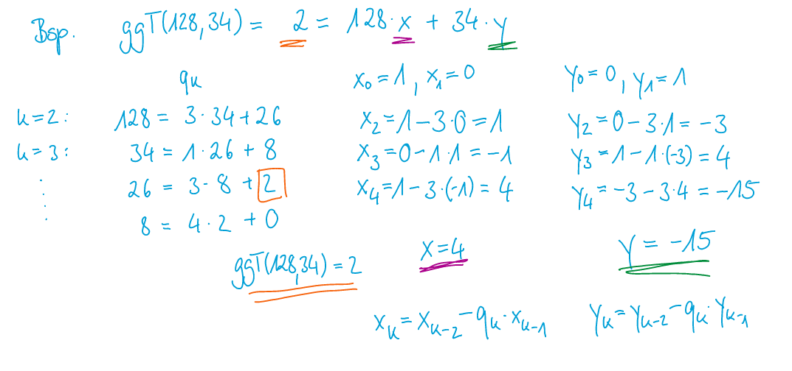

# Ganz Zahlen

[TOC]

## Begriffe

| Begriff           | Erklärung                                                                        |
| ----------------- | -------------------------------------------------------------------------------- |
| Neutrales Element | Das neutrale Element einer Operation, gibt wieder das eigentliche Element zurück |
| Absorbtion        | Das Element, welches bei jedem anderen Element 0 zurück gibt.                    |

### Teilbarkeit

Um zu schreiben, dass die Zahl x teilt die Zahl y, wird dies auch in der Form x|y geschrieben.

$x|y \Leftrightarrow(y=k\cdot x)$

Beispiel: $5|10=\text{wahr}$ 

Folgende Gesetzte gellten:

- $z|z=\text{wahr}$ (reflexiv)

- $x|y \Rightarrow x|k\cdot y \wedge k \in \Z$

- $x|y \wedge x|(y+z)=x|z$

- $x|y \wedge y|z=x|z$  (transitive)

- $x|y \wedge x|z \Rightarrow x|(y-z)$ (Wenn y und z durch x teilbar ist, ist auch (y-z) durch x teilbar)

## Teilermenge

Die Menge aller **natürlichen** Teiler der Zahl. Man schreibt nur die positiven Zahl auf.

Als Beispiel:

$T(15)=\{1, 3, 5, 15\}$

$T(-15)=\{1, 3, 5, 15\}$

## Teilen mit Rest

Das Teilen durch Rest kann auch als $m=kn+r$ dargestellt werden.

Beispiel: 

$$
28:5=4\text{ Rest } 3 = 5\cdot 5 + 3\\
7:3=2 \text{ Rest } 1 = 2\cdot 3 + 1\\
-7:3=-3 \text{ Rest } 2 = -3 \cdot 3 + 2 \\
7:-3=-3 \text{ Rest } -2 = -3 \cdot -3 - 2 \\
-7:-3=2 \text { Rest } -1 = -3 \cdot 2 - 1
$$

## GGT & KGV

Der grösste gemeinsame Teiler kann als $ggT(n, m)=max\{k \in \N \mid k|n \wedge k|m\}$ (max holt das grösste Elemente der Liste)

Das kleinste gemeinsame Vielfache kann als $kgV(n, m)=min \{k \in \N \mid n | k \wedge m|k\}$

$n\cdot m = kgV(n, m)\cdot ggT(n, m) \Rightarrow kgV(n, m)=\frac{n\cdot m}{ggT(n, m)}$

### Rechenregeln GGT

1. $ggT(n, n) = n$

2. $ggT(n, 1)=1$

3. $ggT(n, 0)=n$

4. $ggT(n, m)=ggT(m, n)$

5. $ggT(n, m)=ggT(n, m-n)$

6. $ggT(n, m)=ggT(n, m-k\cdot n) \text{ wenn } k\cdot n \le m$

### Euklischer Algorithmus

Mit diesem Algorithmus kann der ggT(n, m) bestummen weden.

Allgeimein Für $n, m \in \Z \setminus \{0\}$ :

1. Berechne $k, r \in \N$ mit
   $n=k\cdot m + r$ mit $0 \le |r| \lt m$

2. Falls $r \ne 0 $ setze $n=m$ und $m = r$ Wiederhole Schritt 1 

3. Falls $r=0$ ist $m$ der ggT

#### Beispiel 1

1. $ggT(693, 286)=ggT(286, 693-2\cdot 286)=ggT(286, 121)$

2. $ggT(286, 121)=ggT(121, 286-2\cdot 121)=ggT(121, 44)$

3. $ggT(121, 44)=ggT(44, 121 - 2\cdot 44) = ggT(44, 33)$

4. $ggT(44, 33)=ggT(33, 44 - 1\cdot 33)=ggT(33, 11)$

5. $ggT(33, 11)=ggT(11, 33 - 3\cdot 11)=ggT(11, 0)=11$

oder Verkürzt geschrieben:

1. $693=2\cdot 286+121$

2. $286=2\cdot 121 + 44$

3. $121=2\cdot 44 + 33$

4. $44=1\cdot 33 + 11$

5. $33=3\cdot 11 + 0$

#### Beispiel 2

### Teilerfremd

Zwei Zahlen $x, y \in \Z$ heissen teilerfremd, falls $ggT(x, y)=1$ ist.

In Deutsch, zwei Zahlen haben keinen gemeinsammen Teiler (ausser 1 natürlich).

### Lemma von Bézout 

$ggT(x, y)=ax+by$, wenn $x, y \neq 0$

### Erweiterter euklidischen Algorithmus

Diesen Algorithmus kann dazu verwendet werden **eine** Lösung  für $x$ und $y$ zur Gleichung $ggT(a, b)=xb+yc$ zu finden (wenn $x > y$ ist). Solche Gleichungen nennt man lineare diophalische Gleichungen.

Dieser Algorithmus erweitert den euklidischen Algorithmus. Zuerst wird dieser durchgeführt für den $ggT(a, b)$. Danach folgen die unteren Schritte. $q_k$ ist dabei der Quotient in der Reihe $k$ vom euklidischen Algorithmus.
$$
x_0=1\\
x_1=0\\
x_k=x_{k-2}-q_k\cdot x_{k-1}\\
\space \\
y_0=0\\
y_1=1\\
y_k=y_{k-2}-q_k\cdot y_{k-1}
$$

Beispiel:

## Primzahlen

> Definition: Primzahlen sind natürliche Zahlen, die nur durch 1 und durch sich selbst teilbar sind (1 selbst ist keine Primzahl)
> $|T(p)|=2$

### Eigenschaften

* Jede ganze Zahl $z$ mit $z \notin \{-1, 1\}$ besitzt ein Primfaktor (ein Faktor, welcher eine Primzahl ist)
* Jede natürliche Zahl kann als Primfaktoren dargestellt werden
* Mersenne-Primzahl hat die Form $2^n-1$
* Es gibt unendlich viele Primzahlen

### Primzahlen finden (Sieb des Eratosthenes)

Man geht jede (noch nicht gestrichene) Zahl und streicht die Vielfachen der Zahl. Dies wiederholt man so lange, bis die Quadradtzahl der aktuellen Zahl ist ausserhalb dem Suchbereich.

### $\pi$ Funktion

Die Funktion $\pi(n)$ gibt zurück, wie viele Primzahlen es gibt, welche kleiner als n sind.

## Modulare Arithmetik

### Der `mod` Operator

Der `mod` Operator gibt zurück, wie viel Rest bei einer Division ergibt. Das Vorzeichen des Resultates hat meistens dasselbe Vorzeichen, wie der Divident (die zweite Zahl).

### Kongruenz

Zwei Zahlen sind konkruent, wenn sie denselben Resten ergeben, wenn man sie durch die selbe Zahl teilt.

$r\equiv_n s \Leftrightarrow n|(r-s)$ (n teilbar durch r-s)

Als Beispiel: $26\equiv_8 18\equiv_8 10 \equiv_8 2 \equiv_8 -6 \equiv_8 -14$

Dieses Denken, kann helfen das Resultat von Minuszahlen sich vorzustellen.

Dieser Operator kann auch als Äquivalenrelation beschrieben werden, da die Eigenschaft reflexiv, symmetrisch und transitiv ist. In einer Äquivalenzklasse dieser Relation sind alle Zahlen, welche den selben Rest haben. Diese nennet man auch Restklassen

Beispiel: $[10]_8=\{..., -22, -14, -6, 2, 10, 18, 26, ...\}$

nützlich sein kann: $[38]_9+[22]_9=[2]_9+[4]_9=[6]_9$

#### Notation für Restklassen

| Formel                    | Erklärung                                                                                                                                                                                                      |
| ------------------------- | -------------------------------------------------------------------------------------------------------------------------------------------------------------------------------------------------------------- |
| $\Z/n=\{[z]_n\|z\in \Z\}$ | Die Menge aller Restklasse                                                                                                                                                                                     |
| $\Z^*_{/n}$               | Das Primes Restklassenssytem, welches nur die Restklassen enthält, welche zu n teilerfremd sind. Alle Restklassen in diesem System können multipliziert werden (Siehe [Prime Restklassen](#prime-restklassen)) |
| $[z]_n=\overline{z}$      | Die Restklasse, bzw. Äquivalenzklasse mit dem Teiler n und dem Vertreter $z$                                                                                                                                   |

## Restklassen-Rechnen

Das Berechnen der Restklassen kann man auch vereinfachen.

$$
[a]_n+[b]_n=[a+b]_n\\
[a]_n\cdot[b]_n=[a\cdot b]_n
$$

### Addition

* Das neutrale Element dabei ist: $[0]_n$

* Das inverse Element von $[a]_n=[-a]_n=[n-a]_n$

In der folgenden Tabelle sieht man, alle Additionen von $[n]_6$

|         | $[0]_6$ | $[1]_6$ | $[2]_6$ | $[3]_6$ | $[4]_4$ | $[5]_6$ |
| ------- | ------- | ------- | ------- | ------- | ------- | ------- |
| $[0]_6$ | $[0]_6$ | $[1]_6$ | $[2]_6$ | $[3]_6$ | $[4]_4$ | $[5]_6$ |
| $[1]_6$ | $[1]_6$ | $[2]_6$ | $[3]_6$ | $[4]_6$ | $[5]_6$ | $[0]_6$ |
| $[2]_6$ | $[2]_6$ | $[3]_6$ | $[4]_6$ | $[5]_6$ | $[0]_6$ | $[1]_6$ |
| $[3]_6$ | $[3]_6$ | $[4]_6$ | $[5]_6$ | $[0]_6$ | $[1]_6$ | $[2]_6$ |
| $[4]_6$ | $[4]_6$ | $[5]_6$ | $[0]_6$ | $[1]_6$ | $[2]_6$ | $[3]_6$ |
| $[5]_6$ | $[5]_6$ | $[0]_6$ | $[1]_6$ | $[2]_6$ | $[3]_6$ | $[4]_6$ |

## Multiplikation

In der folgenden Tabelle sieht man, alle Multiplikationen von $[n]_6$

|         | $[0]_6$ | $[1]_6$          | $[2]_6$ | $[3]_6$ | $[4]_4$ | $[5]_6$ |
| ------- | ------- | ---------------- | ------- | ------- | ------- | ------- |
| $[0]_6$ | $[0]_6$ | $[0]_6$          | $[0]_6$ | $[0]_6$ | $[0]_6$ | $[0]_6$ |
| $[1]_6$ | $[0]_6$ | $\mathbf{[1]_6}$ | $[2]_6$ | $[3]_6$ | $[4]_6$ | $[5]_6$ |
| $[2]_6$ | $[0]_6$ | $[2]_6$          | $[4]_6$ | $[0]_6$ | $[2]_6$ | $[4]_6$ |
| $[3]_6$ | $[0]_6$ | $[3]_6$          | $[0]_6$ | $[3]_6$ | $[0]_6$ | $[3]_6$ |
| $[4]_6$ | $[0]_6$ | $[4]_6$          | $[2]_6$ | $[0]_6$ | $[4]_6$ | $[2]_6$ |
| $[5]_6$ | $[0]_6$ | $[5]_6$          | $[4]_6$ | $[3]_6$ | $[2]_6$ | $[1]_6$ |

* Neutrales Element: $[1]_6$

* Inverse Element: 
  
  * Nur Zahlen, welche teilerfremd sind (ggT(Zahl, N)=1)
  * Eine Zahl multipliziert mit ihrem inveren Element muss 1 geben
  * Beispiel: $[5]_6\cdot[5]_6=[1]_6$
  * Beispiel 2: $[7^{49}]_{10}=(7^2)^{24}\cdot 7 \equiv_{10} 49^{24}\cdot7\equiv_{10}(-1)^{24}\cdot 7 \equiv_{10}\cdot 7=[7]_{10}$

### Beispiel für Modulare Arithmetik

$$
3\cdot x \equiv_7 4 \\
[3]\cdot[3^{-1}]\cdot x \equiv_7 4\\
-2\cdot 3 \cdot x \equiv_7 (-2)\cdot 4\\
x \equiv_7 -8\equiv_7 6
$$

## Prime Restklassen

Prime Restklassen sind die Restklassen, welche ein Inverseselement für die Multiplikation besitzen. Dies wird mit einem Stern geschrieben, wie hier zu sehen: $\Z_{/7}^{*}$ .

> Beispiel:
> 
> $\Z^*_{/7}=\{[1], [2], [3], [4], [5], [6]\}$
> 
> $\Z^*_{/6}=\{[1], [5]\}$

### Eulersche $\varphi$-Funktion

Um die Mächtigkeit einer Prime Restklasse zu bestimmen kann folgenden getan werden:

1. $\varphi(n\cdot m)=\varphi(n)\cdot \varphi(m)$, wobei gillt $ggT(n, m)=1$

2. $\varphi(p)=p-1$, wobei gillt $p\in \mathbb P$

3. $\varphi(p^k)=p^k-p^{k-1}$, wobei gillt $k\in \N_{\gt0}$

> Beispiel:
>
> $$
> |\Z_{/8}^*|=\varphi(8)=\varphi(2^3)=2^3-2^{3-1} = 8 -4 =4\\
> |\Z_{/15}^*|=\varphi(15)=\varphi(3\cdot5)=\varphi(3)\cdot \varphi(5)\\
> |\Z_{/240}^*|=\varphi(240)=\varphi(2^4\cdot3\cdot5)=..
> $$

### Chinesischer Restsatz

Der chinesischer Restsatz hilft ein Gleichungssystem mit mehreren Kongruenzen ( $\equiv_n$) . Es gibt garantiert eine Lösung, wenn alle Modulos paarweise teilerfremd sind (alle mit allen den ggT von 1 haben). Falls dies nicht der Fall ist, kann es trotzdem noch eine Lösung geben, dies ist aber nicht garantiert.

Hier sind die Schritte für den Algorithmus:

1. $M_k$ berechnen
   Mit $M_k=\frac{\sum_k m_k}{m_k}$ kann $M$ für jede Gleichung berechnet werden. Dabei werden alle Modulos ($\sum_k m_k$) durch das Module der aktuellen Zeile ($m_k$) gerechnet
2. Das multiplikative Inverse $N_k$ für jedes $M_k$ berechnen.
   Bei kleinen Zahlen kann hier für gepröpelt werden
3. Nun folgt die Formel: $x=\sum^n_{k=1}a_kM_kN_k=a_1M_1N_1+...+a_nM_nN_n$

> Beispiel:
>
> Folgendes ist die Gleichung und die daraus resultierende $a_k$ und $m_k$ Werte:
> $$
> x\equiv_3 2 &\rightarrow &a_1=2&m_1=3\\
> x\equiv_5 7 &\rightarrow &a_2=3 &m_2=5\\
> x\equiv_7 2 &\rightarrow&a_3=2 &m_3=7\\
> $$
>
> 1. Nun werden die $M_k$ berechnet
>    $$
>    M_1=\frac{m_1\cdot m_2 \cdot m_3}{m_1}=m_2\cdot m_3 = 5\cdot 7 = 35\\
>    M_2=\frac{m_1\cdot m_2 \cdot m_3}{m_2}=m_1\cdot m_3 = 3\cdot 7 = 21\\
>    M_3=\frac{m_1\cdot m_2 \cdot m_3}{m_3}=m_1\cdot m_2 = 3\cdot 5 = 15\\
>    $$
>
> 2. Als nächstes werden die multiplikative Inverse $N_k$ berechnet
>    $$
>          
>    $$
>    

Beispiel:
$$
x &\equiv 2 \mod3\\
x &\equiv 5 \mod 7\\
$$

1. Inverse der Modulen gegenseitig:
   Dies kann man mit dem erweiterten Euklidischen Algorithmus ausrechnen oder mit ausprobieren finden
   $$
   M_1=7: 7\cdot N_1\equiv_3 1 \rightarrow [N_1]_3=[1]_3\\
   M_2=3:  3\cdot N_2 \equiv_7 1 \rightarrow [N_2]_7=[5]_7\\
   $$

2.  Kongurenz Zusammenfassen
   $$
   x & \equiv 2 \cdot 7 \cdot 1 + 5 \cdot 3 \cdot 5 \mod (3\cdot 7)\\
   & \equiv (14 + 75)\equiv 89 \equiv 5 \mod 21
   $$

$$
x\equiv2 \mod3 & a_1=2 &m_1=3\\
x\equiv3 \mod 5 & a_2=3 &m_2=5\\
x\equiv2 \mod 7& a_3=2 &m_3=7\\
$$

1. $M_n$ bestimmen:
   $$
   M_1=\frac m {m_1}
   $$

2. $N_k$ bestimmen Multiplikative Inverse von $[N_k]_{mk}=[M_k^{-1}]_{mk}$
   $$
   N_1: [N_1]_3=[35^{-1}]_3=[2^{-1}]_3=[2]_3 &N_1=2\\
   N_2: [N_2]_5=[21^{-1}]_5=[1^{-1}]_5=[1]_5 &N_2=1\\
   N_3: [N_3]_7=[15^{-1}]_7=[1^{-1}]_7=[1]_7 &N_3=1\\
   $$

3. Kongruenz
   $$
   x\equiv 2\cdot35\cdot2+ 3\cdot 21 \cdot1 + 2\cdot 15 \cdot 1 \mod 105\\
   \equiv 233 \mod105 \equiv 23 \mod 105\\
   \mathbb L=[23]_105
   $$

### Satz von Euler

$$
   a^e ... \mod n\\
   3^{160}\equiv_{10}(3^2)^{80}\equiv_{10}9^{80}\equiv{10}(-1)^{80}\equiv_{10}1
$$

   

Der Satz von Euler besagt: $ggT(a, m)=1\Rightarrow a^{\varphi(m)}\equiv1 \mod m$

### Kleiner Satz von Fermat

Für $(p \in \R \wedge a \in \Z)\wedge p \not{|} a$ gillt $a^{p-1}\equiv 1 \mod p$

> Beispiel: 
>
> $$
> 26^{123}\mod 7 & ggT(26, 7)=1\\
> 26^{7-1}\equiv_7 26^6\equiv_7 1\\
> 26^{123}\equiv_7 (26^6)^{20}\cdot 26^3\equiv_7 1^20\cdot 26^3\equiv_7 5^3\equiv_7(-2^3) \equiv_7 -8 \equiv_76
> $$

