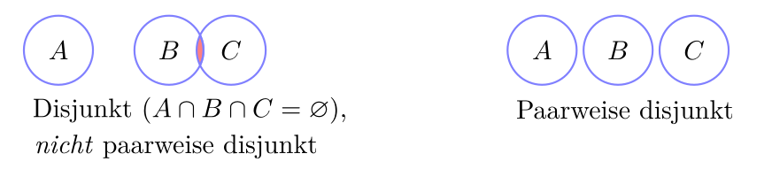
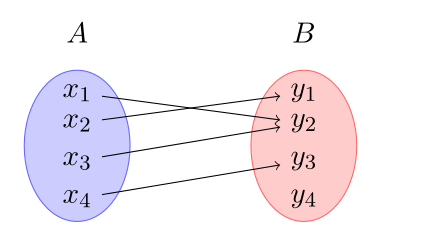
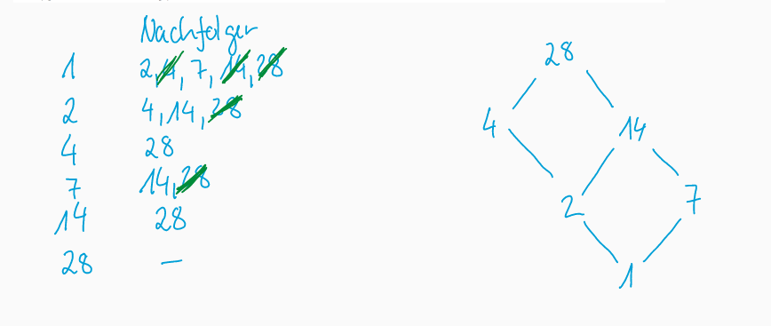
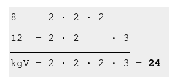
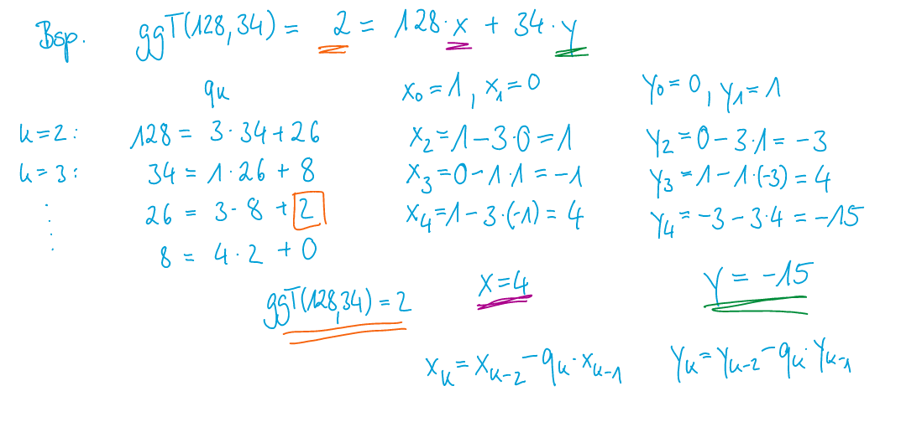

# Summary - 2022-01-17

[TOC]

## Aussagenlogik

| Begriff               | Erklärung    |
| --------------------- | ------------ |
| $\top$ (Tautologie)   | immer wahr   |
| $\bot$ (Wiederspruch) | immer falsch |
| $\vee$                | oder         |
| $\wedge$              | und          |

Bindung: $\neg, \wedge, \vee, \Rightarrow, \Leftrightarrow$

### Gesetze

* Distributivgesetzt:
  $A \wedge (B \vee C) \Leftrightarrow (A \wedge B) \vee (A \wedge C)$
* Der Morgen:
  $\neg(A\vee B) \Leftrightarrow \neg A \wedge \neg B$
* Implikation:
  $A \Rightarrow B \Leftrightarrow \neg A \vee B$
* Kontraposition:
  $A \Rightarrow B \Leftrightarrow \neg B \Rightarrow \neg A$
* Äquivalenz
  $(A \Leftrightarrow B) \Leftrightarrow (A \Rightarrow B) \wedge (B \Rightarrow A) \Leftrightarrow (\neg A \vee B) \wedge (\neg B \vee A)$

| Formel                                                                                                               | Erklärung                         |
| -------------------------------------------------------------------------------------------------------------------- | --------------------------------- |
| $A(x):=\text{"x ist einfach"}$                                                                                       | Aussage                           |
| $\neg\exists x\in P A(x)$ oder $\forall x \in P(\neg A(x))$                                                          | Keine Prüfung ist einfach         |
| $\exists x \in P A(x) \wedge (\forall y,z\in P(A(x)\wedge A(y)\Rightarrow x=y))$                                     | Genau eine Prüfung ist einfach    |
| $\exists x \in P A(x) \wedge (\forall a, b, c \in P (a\neq b \neq c \Rightarrow \neg(A(a) \wedge A(b) \wedge A(c)))$ | Genau zwei Prüfungen sind einfach |
| $\exists a,b \in P(a\neq b \wedge A(a) )$                                                                            |                                   |

### Beweistechniken

* Direkten Beweis
  
  * So veralgemeinern, dass der einte der Term gleich dem anderen Term ist

* Beweis durch Widerspruch
  
  * Anstatt zu zeigen, dass die Aussage A immer wahr ist, wird bewiessen, dass A niemals falsch ist.
    Also Anstatt $\forall n (A(n) \Rightarrow B(n)): true$ soll man beweissen $\neg (\forall n(A(n)\Rightarrow B(n))):false$ ist
- Beweis durch (Gegen-) Beispiel
  
  - Wenn beweissen werden soll, dass etwas immer korrekt oder immer falsch ist, kann mit ein korrekten, bzw. falschem Beispiel gezeigt werden, dass die Aussage falsch ist 

- Beweis durch Kontraposition
  
  - Es gillt die Aussage von der Form $A \Rightarrow B \Leftrightarrow \neg B \Rightarrow \neg A$

- Äquivalenz
  
  - Da eine Äquivalenz $(A \Leftrightarrow B) \Leftrightarrow (A \Rightarrow B \wedge B \Rightarrow A)$ ist, kann einfach das zweitere bewiessen werden.

## Semantik

| Begriff                      | Erklärung                                                                                                   |
| :--------------------------- | ----------------------------------------------------------------------------------------------------------- |
| Gülltig oder Wahr            | Bei einer spezifischen Belegung wahr                                                                        |
| Allgemeingülltig             | Bei allen Belegungen wahr                                                                                   |
| Erfüllbar                    | mind. eine Belegung ist erfüllbar                                                                           |
| Unerfüllbar                  | immer falsch                                                                                                |
| Wiederlegbar                 | mind. einmal falsch; nicht umbedingt immer falsch                                                           |
| Literale                     | $\neg a \text{ oder } a$                                                                                    |
| Negotions Normalform (NNF)   | Keine Implikationen und alle$\neg$ in Literale                                                              |
| Disjunktive Normalform (DNF) | Form:$(L_1 \wedge L_2 \wedge ...)\vee (L_3 \wedge L_4) \vee ...$                                            |
| Konjuktive Normalform (KNF)  | Form:$L_1 \vee L_2 \vee ...) \wedge (L_3 \vee L_4)\wedge ...$                                               |
| Funktional Vollständig       | Menge von Logischen Verknüpfungen, welche die Funktionen$\vee, \wedge, \neg, \rightarrow$ darstellen können |

## Mengen

| Begriff                            | Erklärung                                                                                                                                                                                                                          |
| :--------------------------------- | ---------------------------------------------------------------------------------------------------------------------------------------------------------------------------------------------------------------------------------- |
| Natürliche Zahlen ($\N$)           | $[0; \infty]$                                                                                                                                                                                                                      |
| Ganze Zahlen ($\Z$)                | $[-\infty;\infty]$                                                                                                                                                                                                                 |
| Rationale Zahlen ($\mathbb Q$)     | Alle Zahlen, darstellbar durch einen Bruch                                                                                                                                                                                         |
| Reele Zahlen ($\R$)                | Alle Zahlen mit einem Komma ($\pi$, $e$, 2.32, 2, ...)                                                                                                                                                                             |
| Intervallschreibweisse             | Ist immer im Zahlenbereich $\R$                                                                                                                                                                                                    |
| Teilmenge ($X \subseteq Y$)        | $\forall x (x \in X \Rightarrow x \in Y)$ / X ist eine Teilmenge von Y, X=Y kann auch sein                                                                                                                                         |
| Echte Teilmenge ($X \subsetneq Y$) | $X \subseteq Y \wedge X \neq Y$ / X ist eine Teilmenge von Y, X kann **nicht** Y sein                                                                                                                                              |
| Potenzmenge ($\mathcal P(X)$)      | Menge aller Teilmenge ($\mathcal P(\{0, 1\})=\{\emptyset, \{0\}, \{1\}, \{0, 1\} \}$. Die Mächtigkeit ist $\mathcal \vert P(A)\vert=2^{ \vert A \vert}$; $\mathcal P(A)=\{x\mid x \subseteq A\}$                                   |
| Partition                          | Eine Menge von Teilmengen von A, welche nicht leer sind ($\bigcup_{i\in I}P_i=A$) (nicht leer, paarweise disjunkt, Vereinigung gibt Ursprungsmenge)                                                                                |
| Kardinalität/Mächtigkeit           | Anzahl Elemente in Menge                                                                                                                                                                                                           |
| Schnittmenge ($X \cap Y$)          | Alle Elemente, welche in beiden enthalten sind ($X\cup U=\{x\mid x \in X \wedge x \in Y\}$) Distributivgesetz: $A\cap(B\cup C)=(A\cap B)\cup (A\cap C)$ DeMorgan: $(C\setminus A)\cap(C\setminus B)=C\setminus(A\cup B)$ |
| Vereinigung ($X \cup Y$)           | Alle Elemente von beiden Mengen ($X\cup U=\{x\mid x \in X \vee x \in Y\}$)                                                                                                                                                         |
| Komplement ($X\setminus Y)$        | Alle Elemente aus X, welche nicht in Y vorkommen ($X \cap \bar Y$)                                                                                                                                                                 |
| (nicht paarweise) Disjunkte Mengen | Zwei Mengen teilen keine Elemente                                                                                                                                       |
| paarwweise Disjunkte Mengen        | Alle Mengen teilen keine Elemente                                                                                                                                                                                                  |
| Abzählbare Menge                   | Wenn eine surjektive Funktion $F: \N \rightarrow X$ existiert: Abzählbar: $\N\times\N$ , $\Z\times\Z$,                                                                                                                        |
| Überabzählbare Menge               | Wenn es keine surjektive Funktion $F: \N \rightarrow X$ existiert Überabzählbar: $\mathcal P(\N)$, $[0;1]$; *Die Menge aller unendlichen Binärsequenzen* (2. Diagonalargument)                                                |

## Relationen

| Begriff                                | Erklärung                                                                                                                                                                                    |
| -------------------------------------- | -------------------------------------------------------------------------------------------------------------------------------------------------------------------------------------------- |
| Injektiv (linkseindeutig)              | Wenn zu jedem y höchsten ein x gibt                                                                                                                                                          |
| Surjektiv (rechtstotal)                | Wenn es zu jedem y mindestens ein x gibt                                                                                                                                                     |
| Funktion (Relation)                    | Eine Relation, bei welchem ein x Element **nicht** zwei y Werte gibt. Von einem Element dürfen also nur maximal ein Pfeil wegzeigen.                                                         |
| Bijektive Funktion                     | Eine Funktion, welche injektiv und surjktiv ist                                                                                                                                              |
| Homogene Relation                      | $A=B, R\subseteq A\times A$                                                                                                                                                                  |
| Wohldefiniertheit                      | Eine Funktion, welche eine Äquivalenzrelation als Argument nimmt, ist wohldefiniert, wenn $xRy \Rightarrow F(x)=F(y)$ bedeutet.                                                              |
| Äquivalenzrelationen                   | Eine reflexive, symmetrische und transitive Relation, in welcher alle Elemente zu einander eine Beziehung haben                                                                              |
| Restklasse                             | Eine Menge von Elementen in einer Äquivalenzrelation, welche miteinander verbunden                                                                                                           |
| $x\equiv_5y $                          | $(x - y) \text{ ist ein vielfaches von 5}$                                                                                                                                                   |
| transitiver Abschluss ($R^+$)          | Eine Relation $R^+$, enhält zusätzlich zu R, alle Relation, damit R transitiv wird                                                                                                           |
| reflexiv-transitiven Abschluss ($R^*$) | Eine Relation $R^*$, enhält zusätzlich zu $R^+$, alle Relationen, damit $R^+$ reflexiv wird.                                                                                                 |
| DAG                                    | Ein gerichteten zyklenfreien Graphen ist ein Graph, welcher keine zyklen enhält                                                                                                              |
| Dipartir Graph                         |  Ein Graph, welcher nicht auf einer  Homogenen Relation funktioniert           |
| **Ordnungsrelation**                   | Ordnung, welche sicherlich reflexiv, transitiv                                                                                                                                               |
| R-unvergleichbar                       | Zwei elemente, wenn weder $xRy$ und $yRx$ gillt                                                                                                                                              |
| R-minimal                              | Ein Element, wenn kein Pfeil **auf** das Element zeigen                                                                                                                                      |
| R-maximal                              | Ein Element, wenn es keine Pfeile **weg** vom Element zeigen                                                                                                                                 |
| Präordnung                             | reflexiv und transitiv                                                                                                                                                                       |
| Halbordnung                            | Eine Präordnung (reflexiv und transitiv), welche auch noch antisymmetrisch ist (zyklenfrei)                                                                                                  |
| totale/lineare Ordnung                 | Eine Halbordnung (reflexiv, transitiv und antisymmetrisch) ohne R-unvergleichbaren Elemente (zyklenfrei)                                                                                     |
| Wohlordnung                            | Eine totale Ordnung, bei welcher alle nicht leeren Teilmenge mindestens ein R-minimales Element (Element, auf welches keine Pfeile zeigen) enhalte (zyklenfrei)                              |
| topologische Sortierung                | Einen Pfad von Elemente, welche alle miteinander verbunden sind. Matematisch ist dies eine Ordnung: $(\preceq) \subseteq (M\times M$). $a\preceq b$ sagt aus, dass a der Vorgänger von b ist |

### Hase Diagram

Funktioniert nur auf Halbordnungen, welche DAGs sind (also zyklen frei). Für grössere Diagramme kann man alle Elemente mit ihren Nachfolgern aufschreiben und danach alle Nachfolger streichen, welche ein Nachfolger eines Nachfolgers sind. Es lohnt sich zudemmit dem R-maximalen Element zu starten.

## Volständige Induktion

1. IV - Induktions Verankerung: $A(0)$, $A(1)$, oder anderen Startwert
2. IA - Induktions Annahme: $A(n)$
3. IB - Induktions Behauptung: $A(n+1)$
4. IS - Induktions Schluss: $A(n)\Rightarrow A(n+1)$

## Kleinster Verbrecher

Es gibt eine Aussage $A(n), n\in \N$, welche wahr sein soll.

1. Behauptung: Es gibt ein "kleinsten Verbrecher" aka. die kleinste Zahl, welche die eigentlich Behaupt verletzt. ($A(n_0):f$)
2. Man versucht nun mit der kleinsten Zahl aus $\N$, $0$: $A(0): t$ $\Rightarrow$ Daher muss gelten $n>0 \Rightarrow k+1=n$ (wobei $k\in \N$)
3. Nun kann $k+1$ als $n$ in $A(n)$ eingesetzt werden ($A(k+1)$). Falls dies ein Wiederspruch ergibt, ist die Aussage $A(n)$ wahr, da es keinen kleinsten Verbrecher gibt

## Teilbarkeit

| Begriff                         | Erklärung                                                                                                                                                                             |
| ------------------------------- | ------------------------------------------------------------------------------------------------------------------------------------------------------------------------------------- |
| $x                              | y$                                                                                                                                                                                    | X teilt y (achtung Reihenfolge) |
| $T(x)$                          | Menge aller Teile von $x$ ($T(15)=\{1, 3, 5, 15\}$)                                                                                                                                   |
| $\pi(n)$                        | Wie viel Primzahlen kleiner als n sind                                                                                                                                                |
| Prime Restklassen ($\Z^*_{/7}$) | Eine Menge von Elementen mit einem multiplikativen inversem Element                                                                                                                   |
| Peano-Axiomen                   | Die Zahl 0 ist eine natürliche Zahl. Jede natürliche Zahl $k$ hat gtenau einen Nachfolger $k+1$, welcher auch eine natürliche Zahl ist.  Die Zahl $0$ ist die einzige Zahl, welc |

### Rechnenregeln ggT

* $n\cdot m=kgv(n, m)\cdot ggT(n, m) \Rightarrow kgV(n, m)=\frac{n \cdot m}{ggT(n, m)}$
* $ggT(n, n)=n$
* $ggT(n, 1)=1$
* $ggT(n, 0)=n$
* $ggT(n, m)=ggT(n, m-n)$
* $ggT(n, m)=ggT(n, m-k\cdot n)$, wenn $k\cdot n \le m$
* $ggT(n, m)=a\cdot n + b \cdot m$, wenn $x\neq y$ und $a,b \in \N$

Um das $kgV(x, y)$ zu bestimmen, wird eine Primfaktorzerlegung von $x$ und $y$ durchgeführt. Danach werden die höchsten Potenzen zusammen gerechnet.
Für den $ggT$ werden die tiefsten Potenzen verwendet.

### (Erweiterten) Euklischer Algorithmus

$$
x_0=1\\
x_1=0\\
x_k=x_{k-2}-q_k\cdot x_{k-1}\\
\space \\
y_0=0\\
y_1=1\\
y_k=y_{k-2}-q_k\cdot y_{k-1}
$$

### Modulare Arithmethik

für Multiplikation:

* neutrales Element: $[1]_n$
* inverses Element:
  * Nur Zahlen, welche teilefrmed sind ($ggT(Zahl, N)=1$)
  * Eine Zahl multipliziert mt ihrem inversen Element gibt $1$

### Eulerische $ \varphi$-Funktion

Findet die Möchtigkeit einer Prime Restklassen heraus:

1. $\varphi(n\cdot m)=\varphi(n)\cdot \varphi(m)$, wobei gillt $ggT(n, m)=1$
2. $\varphi(p)=p-1$, wobei gillt $p\in \mathbb P$
3. $\varphi(p^k)=p^k-p^{k-1}$, wobei gillt $k\in \N_{\gt0}$

> Beispiel:
>
> $$
> |\Z_{/8}^*|=\varphi(8)=\varphi(2^3)=2^3-2^{3-1} = 8 -4 =4\\
> |\Z_{/15}^*|=\varphi(15)=\varphi(3\cdot5)=\varphi(3)\cdot \varphi(5)\\
> |\Z_{/240}^*|=\varphi(240)=\varphi(2^4\cdot3\cdot5)=..
> $$

### Chinesischer Restsatz

Es gibt garantiert eine Lösung, wenn alle Modulos paarweise teilerfremd sind (alle mit allen den $ggT$ von $1$ haben)

Beispiel, um zu sehen, wie $a_1$ und $m_1$ zustande kommen:
$$\begin{aligned}
  x\equiv_3 2 & \rightarrow &a_1=2 &m_1=3\\
  x\equiv_5 7 & \rightarrow &a_2=3 &m_2=5\\
  x\equiv_7 2 & \rightarrow &a_3=2 &m_3=7
\end{aligned}$$

1. $M_k$ berechnen: $M_k=\frac{\sum_i m_i}{m_k}$
2. Das multiplaktive Inverse $N_k$ für jedes $M_k$ berechnen
3. Das Ergebnis mit $x=\sum^n_{k=1}a_kM_kN_k$ berechnen

### Kleiner Satz von Fermat

Für $(p \in \R \wedge a \in \Z)\wedge p \not{|} a$ gillt $a^{p-1}\equiv 1 \mod p$

> Beispiel: 
>
> $$
> \begin{aligned}
> \begin{gathered}
> 26^{123}\mod 7 & ggT(26, 7)=1\\
> 26^{7-1}\equiv_7 26^6\equiv_7 1\\
> 26^{123}\equiv_7 (26^6)^{20}\cdot 26^3\equiv_7 1^20\cdot 26^3\equiv_7 5^3\equiv_7(-2^3) \equiv_7 -8 \equiv_76
> \end{gathered}
> \end{aligned}
> $$
