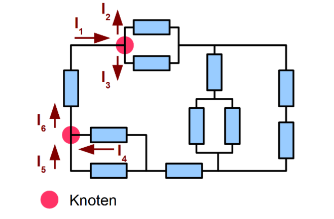
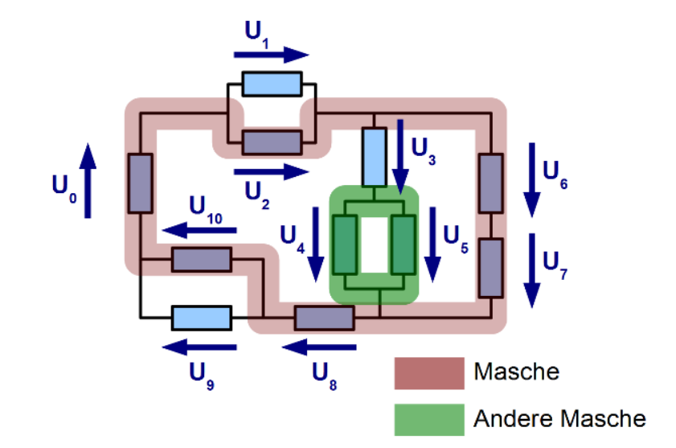
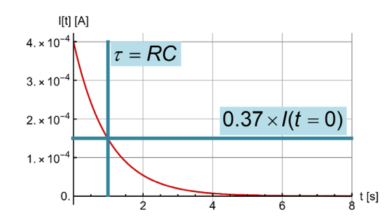
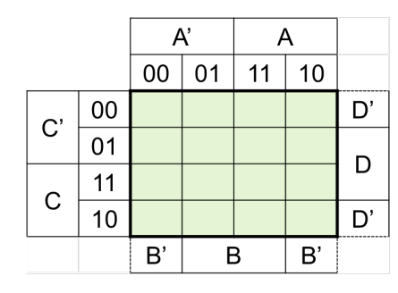
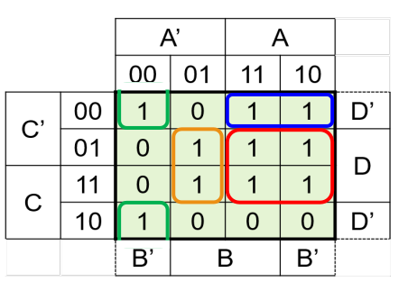
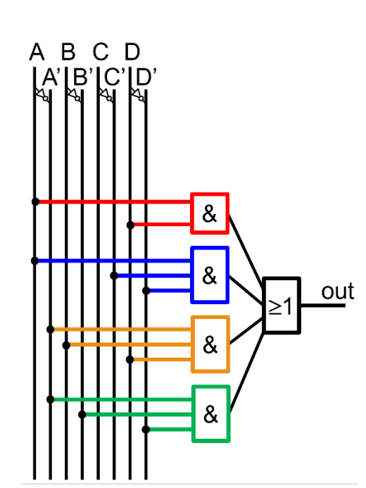

# Elektrotechnik

[TOC]
## Strom, Spannung und Leistung

Ampere ist die Einheit des Stromes $I$ und ist Coulomb pro Sekunde $[Cs^{-1}]$. 

Die Höhe zwischen zwei Energiepotentialen nennt sich die Spannung $U$ ($U(\vec r_A,\vec r_B)=\varphi(\vec r_A)-\varphi(\vec r_B)$)

## Schaltung

### Knotenregel

Die Knotenregel besagt, dass was in einen Knoten hinein geht, muss auch wieder aus dem Knoten hinaus.

Oder $I_1=I_2+I_3$ bzw. $I_6=i_5+I_4$

### Maschenregel

Die Maschenregel besagt, dass alle Spannungen in einer Masche zusammen $0$ ergeben müssen. Man rechnet `plus` wenn es in die Referenzrichtung eines Bauteils geht und `minus`, wenn es gegen die Referenzrichtung geht.

Ebenfalls wichtig zu erwähnt ist, dass eine Batterie in die andere Richtung zeigt, als die anderen Bauteile (Dies ist einwenig komisch im Beispiel oben). 

In der grünen Maschen sieht man, wie dies aussehen kann, für eine Masche, welche nicht über die Baterie geht: $U_4-U_5=0$

### Baterien

### Wiederstand

Ein Wiederstand folgt dem Ohm'sche Gesetzt. Dass heisst, ein Wiederstand kann mit $U=R\cdot I$ berechnet werden.

Da für die Leistung gillt $P=U\cdot I$ , kann in diese Formel das Ohm'sche Gesetzt eingesetzt werden, um die Formel $P=\frac {U^2} R=I^2R$ zu bekommen.

### Kondensator

Ein Kondensator (oder Capacitor) kann man sich als Feder vorstellen, welche aus zwei Metallplatten nahe bei einander bestehen. Es wird Strom hinein "gepumpt". Dies wird immer schwerer, je voller der Kondensator wird, bis am Ende der Kondensator voll ist. Das zweite wichtige an einem Kondensator ist, dass keine Elektronen durch ihn durch fliessen können. Anstelle dessen sammeln sich auf der einen Seite mehr Elektronen an, auf der anderen Seite werden die bereits vorhanden Elektronen abgesaugt.

| formel                                          | Erklärung                                                    |
| ----------------------------------------------- | ------------------------------------------------------------ |
| $CU_c=Q$                                        | Der Zusammenhang zwischen der Spannung $U$ und der Ladung $Q$ |
| $Q(t)=CU_0(1-e^{-\frac t{RC}})$                 | Wie sich die Ladung $Q$ beim Laden                           |
| $U_C(t)=\frac{Q(t)}{C}=U_0(1-e^{-\frac t{RC}})$ | Wie sich die Spannung $U$ beim Laden verhaltet               |
| $I(t)=\frac{U_0}{R}e^{-\frac t {RC}}$           | Wie sich der Strom $I$ beim Laden verhaltet                  |
| $\tau=R\cdot C$                                 | Der Kondensator fällt/steigt auf ca $\frac 1 e\approx0.37$ auf/ab in der Zeit $\tau$ |

### Ungedämpfte Schwingkreise

### Gedämpfte Schwingungskreise

## Draht

Der Wiederstand in einem Kabel ist ungefähr: $R=\rho\frac L A$, wobei $\rho$ den `spezifischen Wiederstand` mit der Einheit $[mm^2m^{-1}\Omega]$. $L$ ist die Länge in $[m]$ und $A$ ist die Querschnittsfläche in $[mm^2]$.

## Karnaugh-Veitsch Diagramme

Ein KV-Diagram kann praktisch sein, um eine Wahrheitstabelle mit vier Inputs in eine Schaltung zu verwandeln.

Dafür wird zuerst die Wahrheitstabelle in das folgende Raster einführt. Dabei ist oben, bzw. auf der linken Seite das erste Bit und auf der unteren/rechten Seite das linke Bit. Das Feld oben rechts stellt also für den Wert aus der Wahrheitstabelle A=1, B=0, C=0, D=0. 

Wenn dies getan ist, versucht man Blöcke mit Einsen zu finden. Die Blöcke können 1, 2, 4, 8 oder 16 lang und/oder breit sein. Falls es egal ist, ob ein Input `0` oder `1` ist, kann er so betrachtet werden, dass es schönere Blöcke gibt. Ebenfalls wichtig, ein Block darf über die Kante hinausgehen.

Im letzten Schritt wird nun aus den Blöcken Und-Schaltungen gebaut. Dabei müssen zwei Dinge beachtet werden:

1. Wenn ein Block über den not und "normalen" Block geht (z.B. A und not-A), dann muss das And-Gate keine Verbindung zu diesem Input haben, da es in beiden Fällen true ist.
2. Wenn ein Block nur übr ein Block geht (z.B. nur über den A oder nur den not-A Block), dann muss das And-Gate mit diesem Input verbunden sein.

Hier sieht man noch das Beispiel für die oberigen Blöcke.

## Transformer

