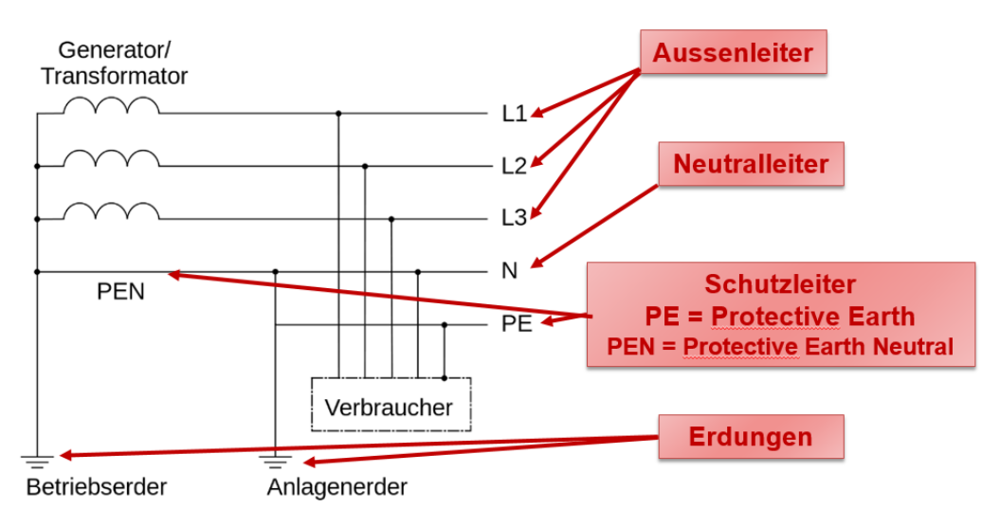

# Elektrotechnik

## Strom, Spannung und Leistung

Ampere ist die Einheit des Stromes $I$ und ist Coulomb pro Sekunde $[Cs^{-1}]$. 

Die Höhe zwischen zwei Energiepotentialen nennt sich die Spannung $U$ ($U(\vec r_A,\vec r_B)=\varphi(\vec r_A)-\varphi(\vec r_B)$). 

Spannung kann aber auch über Arbeit definiert werden. Die Spannung zwischen zwei Punkten $A$ und $B$ ist die Energie pro Ladung, welche frei wird, wenn die Ladung von $A$ nach $B$ bewegt wird: $U=\int^{\vec r_B}_{\vec r_A}\vec E d\vec r$. 
Die kinetische Energie, welche eine Ladung $q$ gewinnt, wenn sie eine Spannung $U$ "herunterfällt" beträgt: $\Delta E_{kin}=\int^{\vec r_B}_{\vec r_A}\vec q\cdot E d\vec r=q\cdot U$

## Schaltung

### Knotenregel

Die Knotenregel besagt, dass was in einen Knoten hinein geht, muss auch wieder aus dem Knoten hinaus.

Oder $I_1=I_2+I_3$ bzw. $I_6=i_5+I_4$

### Maschenregel

Die Maschenregel besagt, dass alle Spannungen in einer Masche zusammen $0$ ergeben müssen. Man rechnet `plus` wenn es in die Referenzrichtung eines Bauteils geht und `minus`, wenn es gegen die Referenzrichtung geht.

Ebenfalls wichtig zu erwähnt ist, dass eine Batterie in die andere Richtung zeigt, als die anderen Bauteile (Dies ist einwenig komisch im Beispiel oben). 

In der grünen Maschen sieht man, wie dies aussehen kann, für eine Masche, welche nicht über die Baterie geht: $U_4-U_5=0$

### Batterien

Reale Batterien haben einen Innenwiederstand, welcher in Serie mit der Batterie geschalten ist. Dass heisst, dass die realte Spanung einer Batterie kleiner als $U_0$ ist, da $U_{in}$ abgezogen werden muss.

### Wiederstand

Ein Wiederstand folgt dem Ohm'sche Gesetzt. Dass heisst, ein Wiederstand kann mit $U=R\cdot I$ berechnet werden.

Da für die Leistung gillt $P=U\cdot I$ , kann in diese Formel das Ohm'sche Gesetzt eingesetzt werden, um die Formel $P=\frac {U^2} R=I^2R$ zu bekommen.

Wegen der Knoten und Maschenregeln verhalten sich Wiederstände (wie auch andere Bauteile) anderst, jenach dem, ob sie Parallel oder Serial angeschlossen sind.

| Name                | Erklärung                                                                                                                                | Bild                                                        |
| ------------------- | ---------------------------------------------------------------------------------------------------------------------------------------- | ----------------------------------------------------------- |
| Parallel geschaltet | In einer Parallelschaltung müssen Wiederstände folgendermassen zusammen gefasst werden: $R_{12}=\frac 1 {\frac 1 {R_1} + \frac 1 {R_2}}$ |  |
| Seriel geschaltet   | In einer Serielschaltung müssen Wiederstände folgendermassen zusamengefasst werden: $R_{12}=R_1+R_2$                                     |  |

### Kondensator

Ein Kondensator (oder Capacitor) kann man sich als Feder vorstellen, welche aus zwei Metallplatten nahe bei einander bestehen. Es wird Strom hinein "gepumpt". Dies wird immer schwerer, je voller der Kondensator wird, bis am Ende der Kondensator voll ist. Das zweite wichtige an einem Kondensator ist, dass keine Elektronen durch ihn durch fliessen können. Anstelle dessen sammeln sich auf der einen Seite mehr Elektronen an, auf der anderen Seite werden die bereits vorhanden Elektronen abgesaugt. 

| formel                                          | Erklärung                                                                                                                                                                                                                                                          |
| ----------------------------------------------- | ------------------------------------------------------------------------------------------------------------------------------------------------------------------------------------------------------------------------------------------------------------------ |
| $\frac {dQ}{dt}=I$                              | Die Veränderungsrate der Ladung, ist der Strom $I$                                                                                                                                                                                                                 |
| $CU_c=Q$                                        | Der Zusammenhang zwischen der Spannung $U [V]$ und der Ladung $Q$ abhängig von der Kapazität $C [F]$ in Farad                                                                                                                                                      |
| $Q(t)=CU_0(1-e^{-\frac t{RC}})$                 | Wie sich die Ladung $Q$ beim Laden                                                                                                                                                                                                                                 |
| $U_C(t)=\frac{Q(t)}{C}=U_0(1-e^{-\frac t{RC}})$ | Wie sich die Spannung $U$ beim Laden verhaltet                                                                                                                                                                                                                     |
| $U_C(t)=U_0\cdot e^{-\frac t {RC}}$             | Wie sich die Spannung $U$ beim Entladen verhaltet                                                                                                                                                                                                                  |
| $I(t)=\frac{U_0}{R}e^{-\frac t {RC}}$           | Wie sich der Strom $I$ beim Laden verhaltet                                                                                                                                                                                                                        |
| $\tau=R\cdot C$                                 | Die Zeitkonstante $\tau$ . Der Strom des Kondensator fällt auf ca $\frac 1 e\approx0.37$ ab in der Zeit $\tau$ oder steigt auf $1-\frac 1 e\approx0.63$ in $\tau$ an, wenn der Kondensator geladen wird |

### Spulen

Wenn durch ein Draht Strom fliesst, entsteht ein Magnetfeld. Dies ist ebenfalls der Fall bei einer Spule. Wenn der Strom hochgefahren wird, dann wird ein Magnetfeld aufgebaut. Dies benötigt aber Energie, was wiederum einen Wiederstand erzeugt.

Wenn der Strom abgebaut wird, wir die Energie des Magnetfeldes wieder zurück in die Spannung gespiessen und über der Spule entsteht eine Spannung, welche den Strom antreibt.

Die Richtung des Magnetfeldes findet man heraus, in dem man die **Rechte**hand nimmt und mit dem Daumen in die Ricthung des `-` zeigt, bzw. die Stromrichtung auf dem Schaltungsplan (nicht die physikalische Stromrichtung, die ist in die andere Richtung). 

| Formel               | Erklärung                                                                                               |
| -------------------- | ------------------------------------------------------------------------------------------------------- |
| $U_L=L\frac{dI}{dt}$ | Die Veränderungsrate von dem Strom $I$ mit der Konstante $L [Henry]$ multipliziert, ergibt die Spannung |
|                      |                                                                                                         |

### Ungedämpfte Schwingkreise

In einem Schwingungskreis, schwingen die Elektronen zwischen den zwei Platten des Kondensators hin und her. Dies kann man in die folgende Schritte unterteilen:

1. Der Kondensator ist geladen und es herrscht eine Spanung $U_0$ über dem Kondensator. Der Schalter ist aber noch offen.
2. Der Schalter $s_1$ wurde geschlossen und der Strom fliesst. Wegen dem Maschensatz muss $U_C=U_L$  sein. Da die Spannung $U_C$wächst, muss auch der Strom $I$ wachsen und somit ein Magnetfeld über L entstehen.
3. Der Strom $I$ und somit auch das Magnetfeld $B$ sind maximal. Irgendwann wird der Kondensator leer sein (Auf beiden Seiten der Platte sind gleich viele Elektronen) und $U_L$ und $UC$ sind 0. Somit gilt auch $I=0$. 
4. Da nun der Strom in der Spule freigesetzt wird, lädt sich der Kondensator wieder auf (allerdings mit einem anderen Vorzeichen) und so entsteht wieder eine Spannung $U_C$ über dem Kondensator.
5. So bald die Spule "leer" ist, wechselt die Stromrichtung wieder
6. Der Zyklus wiederholt sich nun wiede

| Formel                                                                        | Erklärung                                                                                                                             |
| ----------------------------------------------------------------------------- | ------------------------------------------------------------------------------------------------------------------------------------- |
| $Q(t)=CU_0\cdot \cos(\frac 1 {\sqrt {LC}}\cdot t)$                            | Die Ladung $Q$ eines Schwinungskreises                                                                                                |
| $I(t)=-\sqrt {\frac C L}\cdot U_0\cdot \sin(\frac 1 {\sqrt {LC}}\cdot t)$     | Der Strom $I$ eines Schwinungskreises                                                                                                 |
| $U_L(t)=-\frac 1 {\sqrt{LC}}\cdot U_0\cdot \cos(\frac 1 {\sqrt{LC}} \cdot t)$ | Die Spannun $U_L$ eines Schwinungskreises                                                                                             |
| $f=\frac 1 {2\pi\sqrt{LC}}$                                                   | Die Frequenz $f$, mit welcher der Schwingunskreis schwingt                                                                            |
| $T=2\pi\sqrt{LC}$                                                             | Die Periodendauer $T$, welche eine Schwinung des Schwingungskreis benötigt |

### Gedämpfte Schwingungskreise

Der Strom im Schwinungskreis wird schwächer, wenn $R < 2\sqrt {\frac L C}$  (oder wenn $\frac{R^2}{4L^2}>\frac 1 {LC}$ ist) Wenn dies gegeben ist, dann ist es ein gedämpfter Schwingungskreis.

| Formel                                                                  | Erklärung                                                                                                                               |
| ----------------------------------------------------------------------- | --------------------------------------------------------------------------------------------------------------------------------------- |
| $Q(t)=Q_0e^{-\frac t \tau}\cos(\omega_dt-\phi_0)$                       | Die Ladung des Schwinungskreis1                                                                                                         |
| $f=\frac 1 {2\pi}\sqrt{\frac 1 {LC} -\frac{R^2}{4L^2}}$ , $T=\frac 1 f$ | Die (Kreis-)frequenz $\omega_d$                                                                                                         |
| $\tau=\frac{2L} R$                                                      | Die Zeitkonstante $\tau$ der Dämpfung. Der Strom des Kondensator fällt/steigt auf ca $\frac 1 e\approx0.37\%$ auf/ab in der Zeit $\tau$ |

### Low-Pass und High-Pass-Filter

Bei einem Low-Pass-Filter werden die tiefen Frequenzen durchgelassen und die Hochen weggefiltert.

Bei einem High-Pass-Filter ist es umgekehrt und die hochen Frequenzen werden duch gelassen und die tiefen weggefiltert.

Über dem Wiederstand misst man ein Signal, bei welchem die tiefen Frequenzen gedämpft wurden und die hochen Frequenzen fast unverändert. Dies wäre ein High-Pass-Filter.

Hingegen über dem Kondensator misst werden die hochen Frequenzen gedämpft und die tiefen durchgelassen, was ein Low-Pass-Filter ist.

## Draht

Der Wiederstand in einem Kabel ist ungefähr: $R=\rho\frac L A$, wobei $\rho$ den `spezifischen Wiederstand` mit der Einheit $[mm^2m^{-1}\Omega]$. $L$ ist die Länge in $[m]$ und $A$ ist die Querschnittsfläche in $[mm^2]$.

## Karnaugh-Veitsch Diagramme

Ein KV-Diagram kann praktisch sein, um eine Wahrheitstabelle mit vier Inputs in eine Schaltung zu verwandeln.

Dafür wird zuerst die Wahrheitstabelle in das folgende Raster einführt. Dabei ist oben, bzw. auf der linken Seite das erste Bit und auf der unteren/rechten Seite das linke Bit. Das Feld oben rechts stellt also für den Wert aus der Wahrheitstabelle A=1, B=0, C=0, D=0. 

Wenn dies getan ist, versucht man Blöcke mit Einsen zu finden. Die Blöcke können 1, 2, 4, 8 oder 16 lang und/oder breit sein. Falls es egal ist, ob ein Input `0` oder `1` ist, kann er so betrachtet werden, dass es schönere Blöcke gibt. Ebenfalls wichtig, ein Block darf über die Kante hinausgehen.

Im letzten Schritt wird nun aus den Blöcken Und-Schaltungen gebaut. Dabei müssen zwei Dinge beachtet werden:

1. Wenn ein Block über den not und "normalen" Block geht (z.B. A und not-A), dann muss das And-Gate keine Verbindung zu diesem Input haben, da es in beiden Fällen true ist.
2. Wenn ein Block nur übr ein Block geht (z.B. nur über den A oder nur den not-A Block), dann muss das And-Gate mit diesem Input verbunden sein.

Hier sieht man noch das Beispiel für die oberigen Blöcke.

## Transformer

## Stromnetz

In unserem Stromnetzt werden mehrere Spannungen genützt. Zum einten möchte man hohe Spannungen fürs Transportieren von Strom benützten, da dies um einiges effizienter ist. Allerdings ist es zu gefährlich Hochspannung direkt im Haus zu gebrauchen. Daher hat man vier Netzebenen, welche mit Transformern gekoppelt sind.

- 1 Ebene - **Höchstspannungsebene**: 380kV, bzw. 220 kV aus dem Kraftwerk oder vom Ausland
- 3 Ebene - **Hochspannungsebene**: 36kV - 150kV: Überregionale Verteilungsnetzte
- 5 Ebene - **Mittelspannungsebene**: 1kV - 36kV: Regionale Verteilungsnetzte
- 7 Ebene - **Niederspannungsebene**: < 1kV: Lokale Verteilungsnetzte

Die Ebenen 2, 4 und 6 sind die Transformatorenebenen. Auf diesen Ebenen wird der Strom auf die nächst tiefere oder höhere Ebene transformiert.

## Wechsel- vs. Gleichstrom

Man hat sich in der Vergangenheit auf Wechselstrom geeinigt, weil es relativ einfach ist, Wechselstrom zu transformieren. Heute ist dies aber auch mit Gleichstrom möglich. Gleichstrom erzeugt weniger Verlüste, wenn transportiert auf lange Streckenen, als Wechselstrom, da Wechselstrom nah an der Kabeloberflächse fliest und daher ein stärkeres Magnetfeld erzeugt.

Der $U_{Eff}$ kann mit der folgender Formel berechnet werden: $U_{Eff}=\frac{U_S}{\sqrt 2}$ . Dies berechnet den quadratischen Mittelwert einer Wechselspannung.

Der Sinus kann mit der folgenden Formel angegebene werden: $f(t)=U_{Eff}\cos(\omega\cdot t)=U_{Eff}\cos(f\cdot 2\pi\cdot t)$

## Drehstrom

(Siehe Script_GED_Lect_3_4.pdf)

Drehstrom ist praktisch für Motoren, da es keine "Totenpünkte" gibt, an dem ein Magnet stoppen könnte. Zudem sind alle Häuser in der Schweiz an einem Drehstrom angeschlossen.

Auf den Aussenleiter wird der Strom "transportiert" und stehen gegenüber der Erde unter einer Spannung von 230V. 

Der Neutralleiter ist der "Ausgang" für die Elektronen, welche über die Aussenleiter hinein gepumpt werden.

## Gefahr durch Strom

Wie gefährlich Strom ist hängt von der Stromstärke und der Dauer ab. 

Gefahrebereiche:

1. Wird nicht wahrgenommen, da der Strom zu klein ist
2. Kribbeln, Krämpfte, aber keine bleibenden Schäden
3. Stromquelle kann wegen Museklverkrampfung nicht mehr losgelassen werden (bei Gleichstrom)
4. Tödlich, wegen z.B. Herzkammerflimmern
