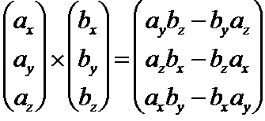
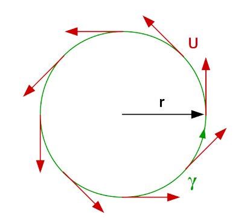
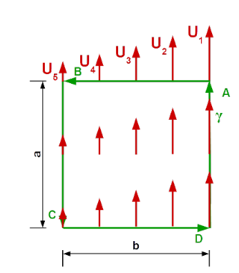
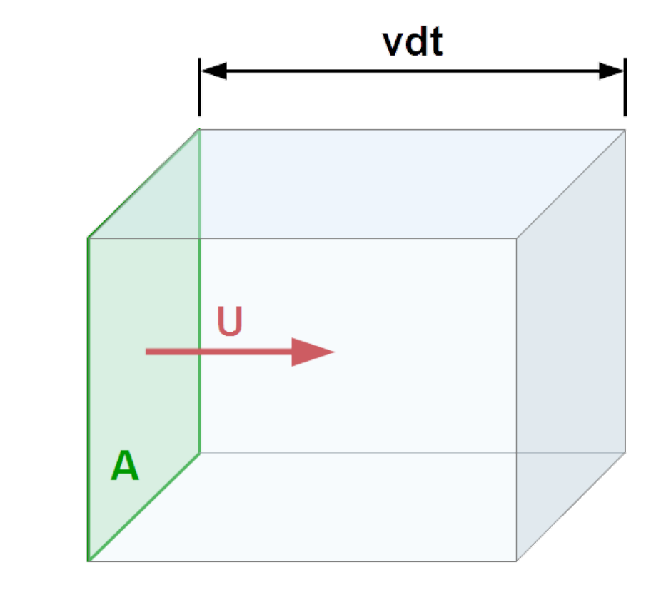
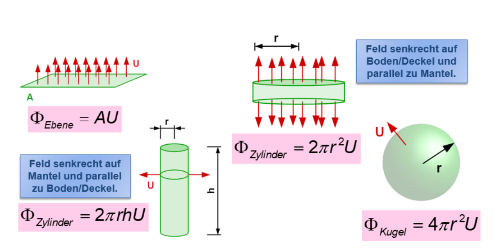
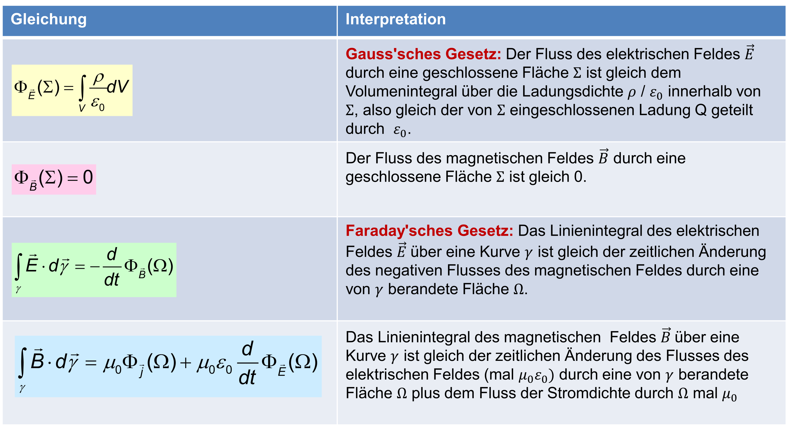
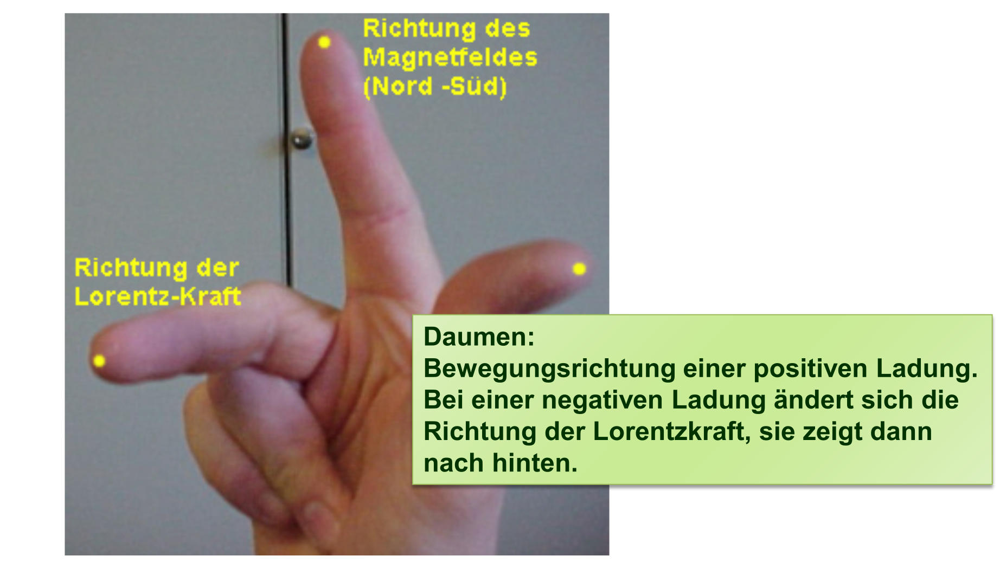
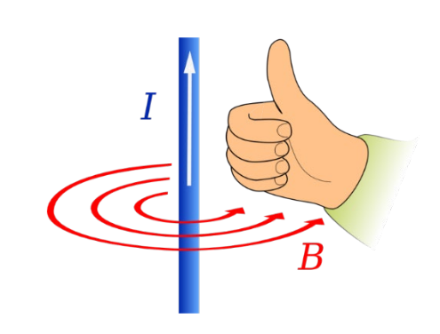
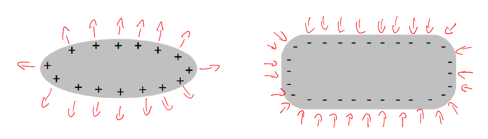

# Elektromagnetismus

## Formeln

| Formel                                                       | Erklärung                                                    |
| ------------------------------------------------------------ | ------------------------------------------------------------ |
| $\vec F_{12}=\frac 1 {4\pi\varepsilon_0}\cdot \frac {Q_1Q_2}{|\vec r_{12}|^2}\cdot \vec n_{12}$ | Kraft zwischen den Ladungen $Q_1$ und $Q_2$.  Der Einheitsvektor $\vec n_{12}$ von Ladung $Q_2$ zu $Q_1$ $\vec n_{12}=\frac{\vec r_{12}}{|\vec r_{12}|}$(Konstante: $\varepsilon_0=8.859\cdot 10^{-12}[\frac {C^2}{Jm}]$) |
| $\vec E(\vec r)=\frac 1 {4\pi\varepsilon_0}\cdot \frac Q {|\vec r - \vec r_Q|^2}\cdot\frac {\vec r - \vec r_Q}{|\vec r - \vec r_Q|}$ | Das Elektrische Feld $\vec E$ einer Ladung am Ort $\vec r_Q$, welches von der Ladung $Q$ erzeugt wurde |
| $\vec F =q\vec E(\vec r, t)$                                 | Die Kraft $\vec F$, welche das Feld $\vec E$ die Probeladung $q$ anzieht |
| $\vec F_L=q\cdot(\vec v\times\vec B)$                        | Die Kraft, eines Magnetfeldes auf eine Ladung $q$, welche sich mit $\vec v$ bewegt. |
| $m=\frac{rq|\vec B|}{v}$                                     | Speziallfall, wenn $\vec v$ senkrecht auf $\vec B$ steht und $\vec B$ konstant ist. $m$ ist die Masse von der Ladung $q$ mit der Geschwindigkeit $\vec v$ |
|                                                              |                                                              |

Auf dem TI-nspire cx gibt es den Befehl $crossP(x, y)$, um mit den Vektoren $\vec x$ und $\vec y$ ein Kreuzprodukt zu rechnen.

Das Skalarprodukt ist folgendermassen definiert: $\vec a \cdot \vec b=|\vec a| \cdot |\vec b|\cdot \cos(\alpha)$ 
Aus dem kann geschlossen werden, dass wenn $\alpha=90°$ , bzw. die Vektoren $\vec a$ und $\vec b$ senkrecht aufeinander stehen, dass das Skalarprodukt `0` is

## Linienintegrale

$W=\int_\gamma\vec F\cdot d\vec \gamma$

Arbeit wurde in der BMS als $W=F\cdot s$ definiert. Nun kann aber $F$ und $s$ auch Vektoren sein. Hier kommt das Linienintegral ins Spiel, denn mit diesem kann man die Arbeit mit Vektoren ausrechnen.

Der Vektor $\vec F$ und $\vec \gamma$ müssen nicht umbedingt in dieselbe Richtung zeigen. Wenn man z.B. einen Schlitten zieht, hat die Kraft $\vec F$ ca. eine 45° gegen oben, während $\vec \gamma$ die Strecke des Schlittens darstellt.

Spannung kann auch als Linienintegral angesehen werden: $U(\gamma)=\int_\gamma\vec E \cdot d\vec \gamma$

### Spezialfälle

| Name                                                         | Formel                                               | Bild                                                        |
| ------------------------------------------------------------ | :--------------------------------------------------- | ----------------------------------------------------------- |
| **Kreis** Das Vektorfeld liegt überall tangential an der Kurve und alle Vektoren haben dieselbe Länge. | $\int_\gamma\vec U\cdot d\vec\gamma =2\pi r|\vec U|$ |  |
| **Rechteck** Das Vektorfeld ist parallel zu zwei Seiten (A, C) des Rechteck. Entlang einer Seite haben die Vektoren eine konstante Grösse | $\int_\gamma\vec U \cdot d\vec \gamma=aU_1-aU_5$     |  |

## Flussintegrale

Beim Flussintegral wie viel Volumen $vdt$ fliesst durch $A$, wenn es die Geschwindigkeit $\vec U$ hat. Dies kann als Integral geschrieben werden, in GED wird allerdings nur folgende Spezialfälle behandelt.

$U$ sind in diesen Formel die Länge der Pfeile.

## Maxwellgleichungen

### Geschlossene und nicht-geschlossene Flächen

Eine geschlossene Fläche hat keinen Rand (wie zB. eine Kugel) und es gibt ein klares Innen und Aussen.

Eine nicht geschlossene Fläche hat einen Rand. 

### Gauss'sche Gesetzt

#### Metalle

## Rechte-Hand Regel

## Rechte-Hand Regel 2

Wenn der Daumen in die technische Stromrichtung zeigt, dann zeigen die Finger den Umlaufsinn des $\vec B$-Feldes an.

## Vektorfelder

$$
\vec E (x, y, z, t)=\begin{bmatrix} E_x(x, y, z, t) \\ E_y(x, y, z, t) \\ E_z(x, y, z, t) \\ \end{bmatrix}
$$

Ein Vektor kann ein 2D oder 3D Koordinatensystem sein, in welchem Vektoren in eine Richtung zeigen. Diese Richtung kann zusätzlich auch noch von der Zeit abhängig sein.

## Magnetfeld

$[\vec B(\vec r, t)]=\frac {Ns}{Cm}=\frac{\text{Newton Sekunden}}{\text{Coulomb Meter}}=\frac{kg}{s C} = \text{Tesla}$

Ein Magnetfeld wird in Teslas angegeben. Dabei ist ein Tesla kg pro Coulomb Sekunde oder Newton Sekunden pro Coulomb Meter.

Um zu berechnen, mit vieviel Kraft ein Objekt mit einer Ladung beeinflusst wird, gibt es folgende Formel: $\vec F = q(\vec v \times \vec B)$

## Elektrofeld

$[\vec E (\vec r, t)]=\frac N C = \frac V M = \frac{kg}{ms^3A}$

Ein Elektrofeld wird Newton pro Coulomb, Volt pro Meter oder Kilogram pro Meter Sekunden³ Amper angegeben. Die Einheiten bedeuten dasselbe (Coulomb = Amper Sekunde)

Wenn ein Leiter positiv geladen ist, wirkt er abstossend zu Elektronen, wenn ein Leiter negative geladen ist, dann wirkt er anziehend. Zu dem sind die Pfeile im senkrecht auf dem Leiter.

Um das Elektrofeld einer einzuelne Ladung zu berechnen, kann die folgende Formel verwendet werden

## Magnete

Magnete haben immer einen Nord- und Südpol. Wenn man ein Magnet trennt, entstehen zwei neue Magnete, mit jeweils einem Nord- und Südpol.  

Wie auch bei elektrischen Feldern kann man auch bei magnetischen Feldern Linien zeichnen.

Magnete wirken eine Kraft auf **bewegte Ladung**  aus. Auf ruhende Ladung hat es keinen Effekt. Diese Kraft nennt sich Lorentz-Kraft und kann mit folgender Formel berechnet werden: $\vec F_L=q\cdot(\vec v \times \vec B)$

Wenn $\vec v$ senkrecht auf $\vec B$ steht,und $\vec B$ konstant ist, kann mit folgender Formel den Zusammenhang von der Geschwindigkeit der Ladung $\vec v$ mit dem Magnetfeld $\vec B$ und dem Radius $r$ beschrieben werden: $m=\frac{rq|\vec B|}{v}$

Bei Elementarteilchen ist die Ladung entweder $0$, $e$ oder $-e$.
