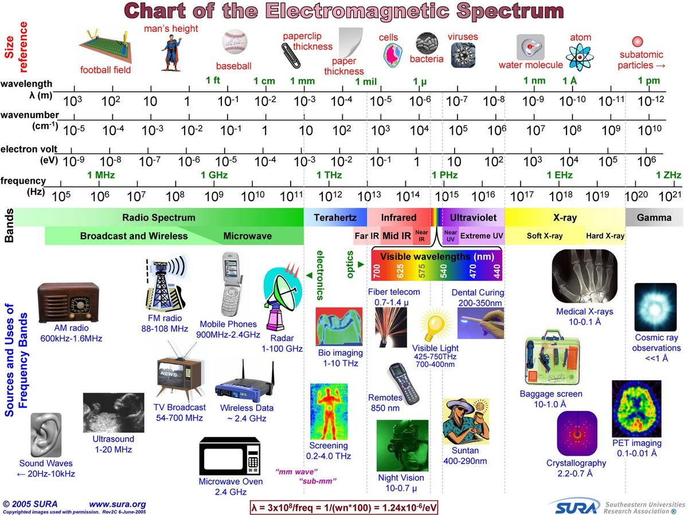
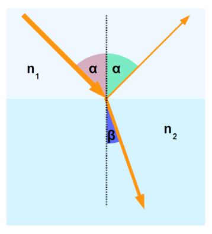
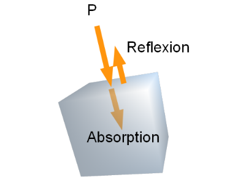
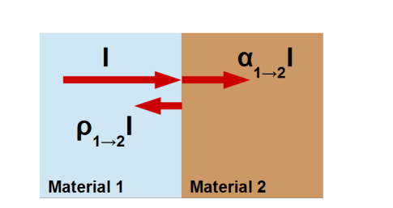
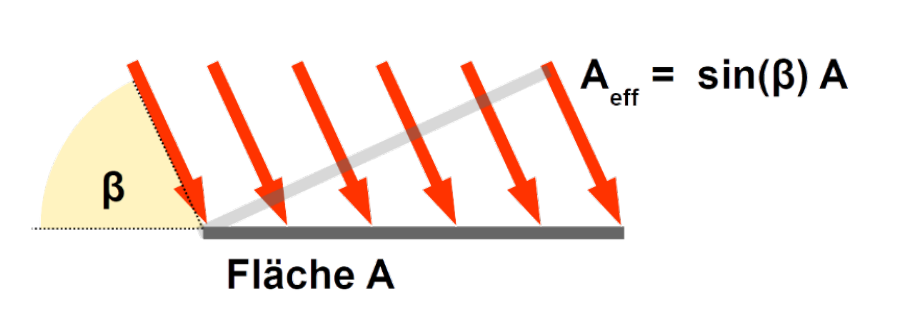

# Termische Strahlung

> **Wichtig:** Alle Temperaturen sind in Kelvin.
> 
> Um von Celsius zu Kelvin zu konvertieren: $T_{kelvin}=T_{celsius}+273.15$

## Formeln

| Formel | Erklärung |
| ------ | --------- |
|        | $E$       |
|        |           |
|        |           |

## Sichtbares Licht

Sichtbares Licht:

## Lichtbrechung

$$
\frac{\sin(\alpha)}{\sin(\beta)}=\frac {c_1} {c_2}=\frac{n_2}{n_1}
$$
Dabei stellt $c$ die Lichtgeschwindigkeit im jeweiligen Material dar und $n$ der Brechungsindex.

### Totalreflexion

Wenn ein Lichtstrahl genug Flach auf die "Bruchkanta" (z.B. die Wasseroberfläche). In diesemfall wird alles zurück reflektiert. Für die Formel heisst das, dass $\alpha\ge 90°$ oder $\beta \ge 90°$ 

## Photonen

Jedem Photon wird eine Wellenlänge, bzw eine Frequenz zu geordnet: $E=h\nu$ , dabei ist die Planck'sche Konstante $h=6.626\cdot 10^{-34} [Js]$ und $E$ die Energie des Photons.

## Elektromagnitische Strahlung

Eine Elektromagnetische Strahlung besteht aus einer Welle mit einer Wellenlänge $\lambda$ und einer Frequenz $\nu$.

Die Formel $c=\lambda\cdot \nu$ zeigt den Zusammenhang zwischen $\lambda$ und $\nu$. $c$ ist dabei die Lichtgeschwindigkeit ($c=3\cdot10^8 m/s$)

Die Energie einer Strahlung kann mit $E=h\nu$ errechnet werden. $h$ ist dabei die Planck'sche Konstante ($h=6.626\cdot10^b{-34}$)

Der Absorptionskoeffizent beschreibt, wie viel der Frequenzen ein Körper absorbiert. `1` heisst, dass alles absorbiert wird, `0`, dass nichts absorbiert wird. 

Der Gegenpol, der Reflexionskoeffizent, beschreibt, wie viel der Frequenzen reflektiert werden und kann mit der folgenden Formel umgerechnet werden: $\rho=1-\alpha$

Oft sind diese Koeffizenten abhähngig von der Frequenz (also $\alpha(\nu)$ und $\rho(\nu)$). Ein blaues T-Shirt würde die "blauen Frequenzen" reflektieren und die anderen absorbieren.

Bei einem **schwarzen Strahler** kann bewiessen werden, dass es keinen Unterschied gibt, ob die Strahlung vom Material 1 ins Material 2 oder umgekehrt geht.

$$
\alpha_{1\rightarrow 2}=\alpha_{2\rightarrow 1}\\
\sigma_{1\rightarrow 2}=\sigma_{2\rightarrow 1}
$$

### Emission

Wenn eine Strahle von einem "dünnem" Material, wie Luft, aufgenommen wird, wird von Emission von Strahlung gesprochen und anstatt dem Absorptionskoeffizent, wird der Emissionskoeffizenten $\varepsilon$ verwendet (es gilt also: $\alpha_{2\rightarrow1}=\varepsilon_{2\rightarrow 1}$)

### Schwarzer Strahler

Ein Körper mit dem Reflexionskoeffizent $\rho=0$ und Absorptionskoeffizenten von $\alpha=1$ wird `schwarzer Strahler` genannt. Ein schwarzer Block kann als Schwarzerstrahler angenähert werden (er reflektiert trotzdem noch ein wenig Licht), aber auch die **Sonne**, da diese **keine Frequenzen und somit auch Licht reflektiert**.

### Grauer Strahler

Ein grauer Strahler ist ein Körper,  welcher in gewissen Wellenbereichen nicht so stark strahlen, wie ein schwarzer Strahler. Dass heisst, dass der Emmisionskoeffizent $\varepsilon$ nicht umbedingt `1` muss sein.

## Wien'sches Verschiebungsgesetzt

Mit $\lambda_{max}=\frac b T$ kann man die Temperatur **in Kelvin** zu der maximalen Wellenlänge umrechnen.

Mit dieser Formel kann man auch die Lichtfarbe, welche in Kelvin angegeben wird, erklären.

## Stefan-Boltzmann Gesetzt (Gesammtleistung)

Um die Gesamtleistung eines Strahlendenkörpers zu berechnen kann man die folgende Formel benützten: $P_{rad}=\sigma AT^4$ Dabei ist $\sigma=5.67\cdot10^{-8} [Wm^{-2}K^{-4}]$ , $A$ die Oberfläche des Körpers und $T$ die Temperatur des Körpers.

### Energetische Bilanz eines Strahlers

Die Energiebilanz sagt aus, ob Energie vom Körper aufgenommen wird und er daher wärmer wird oder ob mehr Energie abgegeben wird und er daher kälter wird. Dies kann mit der folgenden Formel berechnet werden: 
$$
I=-\frac{dE}{dt}=\sigma\varepsilon A(T^4-T_{env}^4)
$$
Dabei ist $\sigma=5.67\cdot10^{-8}$, $\varepsilon$ den Emmisionskoeffizenten, $A$ die Oberfläche des Körpers, $T$ die Temperator des Körpers und $T_{env}$ die Umgebungstemperatur.

Bei einem grauen Strahler kann $\varepsilon \neq1$ sein.

Wie man an der Formeln mit den Temperaturen erkennen kann, wird die Temperatur hoch 4 gerechnet. Dies führt bei einer 16-facher vergrösserung, wenn die Temperatur verdoppelt wird.

Ein ähliches Phänomen gibt es, wenn die Länge eines Körpers veroppelt werden, wird die Fläche vervierfacht und das Volumen verachtfacht.

### Sonneneinstrahlung

Um zu berechnen, wie viel Energie die Sonne auf die Erde strahlt, kann folgende Formel gebraucht werden:
$$
I=\sin(\beta)Aj
$$
Dabei ist $\beta$ den Einstrahls-Winkel der Sonne, $A$ die Fläche, wo für man die Energie $I$ berechnen möchte und $j$ der Faktor der Sonneneinstrahlung.

### Wärmeleitung

$$
I=-Ah_{X,Y}(T_X-T_Y)
$$

Mit dieser Formel kann der Wärmestrom (Energie pro Zeit) berechnet werden, welcher von einem Objekt $X$ mit der Temperatur $T_X$ zu einem Objekt $Y$ mit der Temperatur $T_Y$ fliesst. $A$ ist dabei die Berührungsfläche der zwei Objekte und $h_{X,Y}$ ist der Wärmeübertragunskoeffizent.
