# Signale

## Signalarten

| Name           | Bild                                                         |
| -------------- | ------------------------------------------------------------ |
| Sinussignal    | 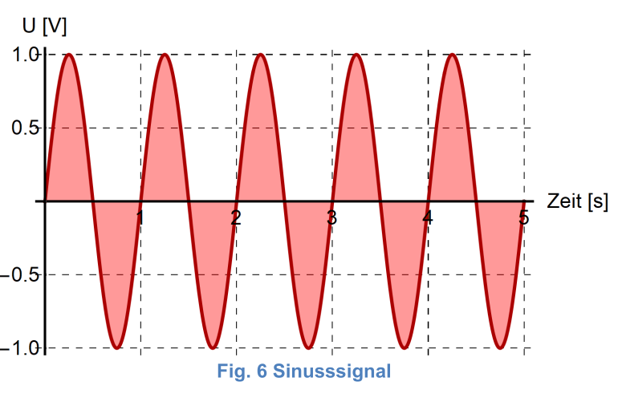 |
| Rechtecksignal | 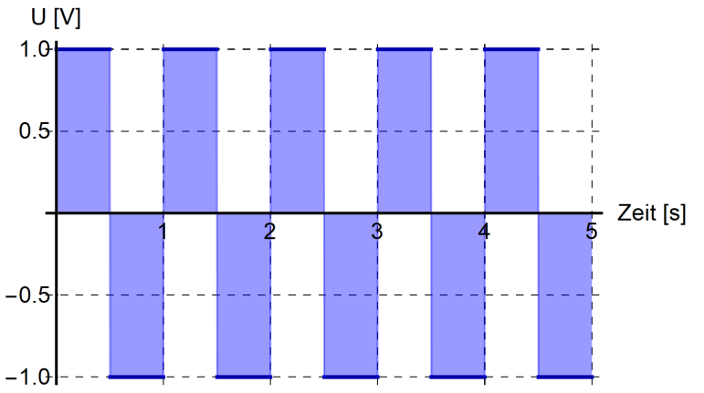 |
| Sägezahnsignal | 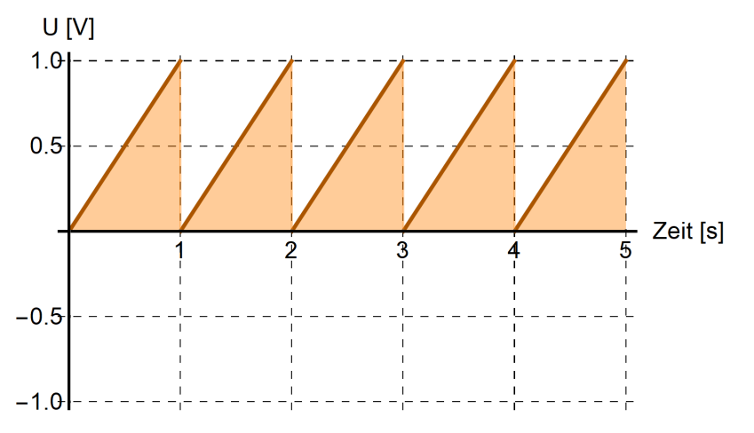 |
| Dreieckssignal | 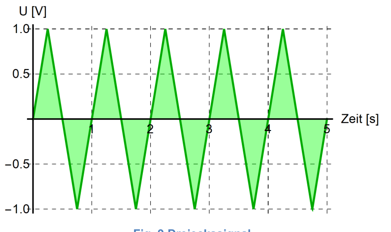 |

Eine Welle wird hauptsächlich durch ihre Amplitude $A$, Periode $T$, Frequenz $\nu$ und Phasenverschiebung $\varphi$ definiert. Mit $T=\frac 1 \nu$ kann man von der Frequenz $\nu$ zur Periode $T$ umwandeln.

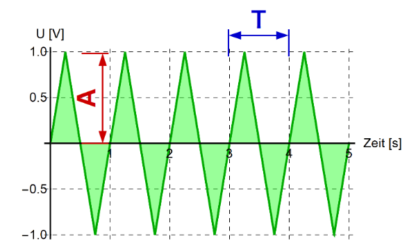

Ein Sinussignal kann in ein Cosinussignal und umgekehrt folgendermassen umgewandelt werden:
$$
sin(a-\frac \pi 2)=cos(a)\\
cos(a+\frac \pi 2)=sin(a)
$$

## Fourierzerlegung

Man kann jede Funktion in eine Summe von Cosinusen oder Sinusen zerlegen

## Töne und Klangfarbe

Neben eines Grundtones produziert ein Instrument auch noch Obertöne. Als Daumenregeln: **Je mehr Obertöne, desto schärfer tönt ein Instrument.**

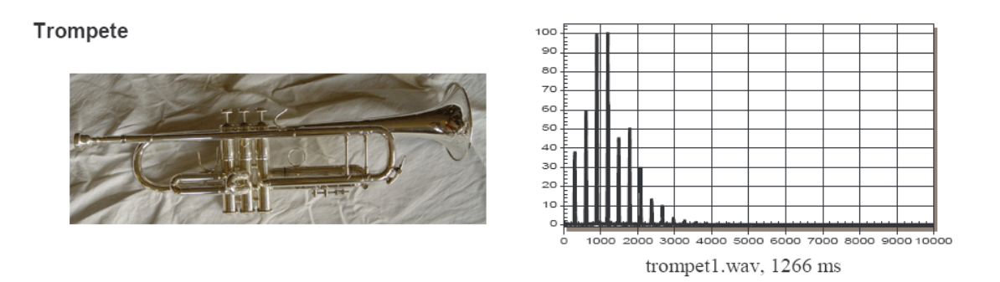

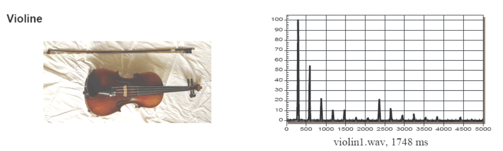

## Nyquist - Shannon Theorem

Es müssen doppelt so viele Messpunkte existieren, wie die maximale Frequenz: $f_{measure}>2\cdot f_{max}$. Wenn dies nicht gegeben ist, tritt **Aliasing** auf und es werden falsche Frequenzen gespeichert.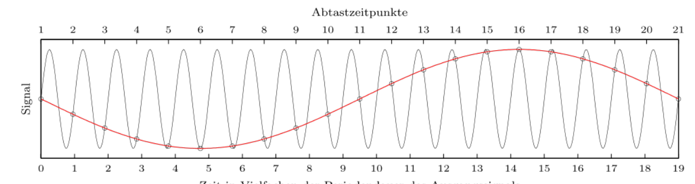

Für die tiefste Frequenz gilt, dass das Intervall $T$ zwischen den Messpunkten : $T > \frac 1 {f_{min}}$

## Blip

Ein Blip ist ein kurzes Signal. Dabei gilt, je kürzer der Blip, desto mehr Frequenzen gibt es um die Hauptfrequenz $\nu_0$

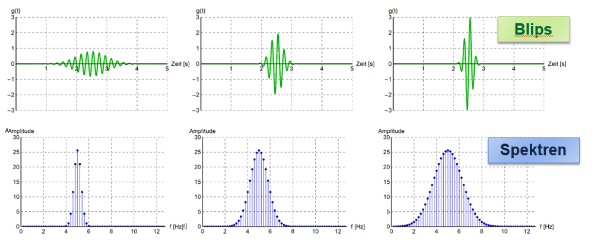

Ein zweites Prinzip, das ählich funktioniert: Je steiler eine Flanke eines Signales, desto mehr Frequenzen werden benötigt, um die Flanke darzustellen.

### Schnelle Orgeln

Damit ein Ton als harmonisch empfunden wird, muss eine Frequenz domonieren. Bei einem Blip ist dies allerdings nicht umbedingt gegeben. Ebenfalls gilt, je höher ein Ton, desto kürzer kann er sein, dass trotzdem noch eine Frequenz dominiert und der Ton harmonisch klingt. 

Aus diesem Grund kann eine Picolo schnell spielen und eine tiefe Orgel nicht.

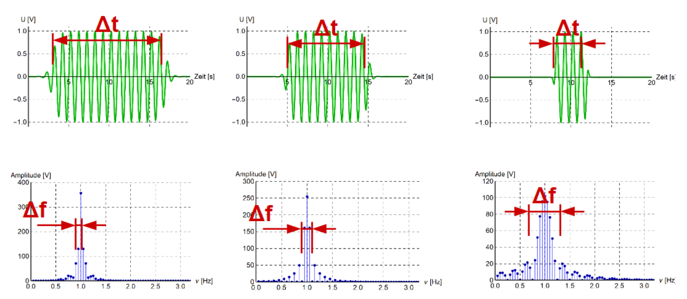

Mathematisch kann diese Relation folgendermassen ausgedrückt werden: 
$$
\frac{\Delta f\cdot \Delta t}{2}\sim 1
$$

## Signal-to-Noise Ratio

$A_{noise}=?$
$$
SNR=\frac{P_{signal}} {P_{noise}}=\frac{I_{signal}} {I_{noise}}=\frac{A^2_{signal}}{A^2_{noise}}
$$

Dabei bezeichnet $P$ die Leistung, $I$ die Intensität und $A$ die Amplitude.

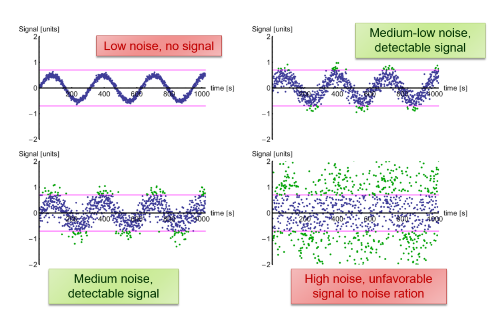