[TOC]

# Formeln

In dieser Datei werden alle Formeln und Konstanten zusammen gefasst.

| Prefix | Exponent   |
| ------ | ---------- |
| peta   | $10^{15}$  |
| tera   | $10^{12}$  |
| giga   | $10^9$     |
| mega   | $10^6$     |
| kilo   | $10^3$     |
| hecto  | $10^2$     |
| deca   | $10^1$     |
| -      | $10^0$     |
| dezi   | $10^{-1}$  |
| cento  | $10^{-2}$  |
| milli  | $10^{-3}$  |
| micro  | $10^{-6}$  |
| nano   | $10^{-9}$  |
| pico   | $10^{-12}$ |
| femto  | $10^{-15}$ |

## Elektronik

| Thema        | Formeln                                          | Erklärung                                                    |
| ------------ | ------------------------------------------------ | ------------------------------------------------------------ |
|              | $I [A]$                                          | Strom                                                        |
|              | $U [V]$                                          | Spannung                                                     |
| Wiederstände | $U=R\cdot I$                                     | Formel für Ohmnische Wiederstände                            |
| Wiederstände | $R_{12}=\frac 1 {\frac 1 {R_1} + \frac 1 {R_2}}$ | Formel zum zwei parallele Wiederstände zusammen zu fassen    |
| Kondensator  | $CU_c=Q$                                         | Der Zusammenhang zwischen der Spannung $U$ und der Ladung $Q$ |
| Kondensator  | $Q(t)=CU_0(1-e^{-\frac t{RC}})$                  | Wie sich die Ladung $Q$ beim Laden                           |
| Kondensator  | $U_C(t)=\frac{Q(t)}{C}=U_0(1-e^{-\frac t{RC}})$  | Wie sich die Spannung $U$ beim Laden verhaltet               |
| Kondensator  | $I(t)=\frac{U_0}{R}e^{-\frac t {RC}}$            | Wie sich der Strom $I$ beim Laden verhaltet                  |
| Kondensator  | $\tau=R\cdot C$                                  | Der Kondensator fällt/steigt auf ca $\frac 1 e\approx0.37$ auf/ab in der Zeit $\tau$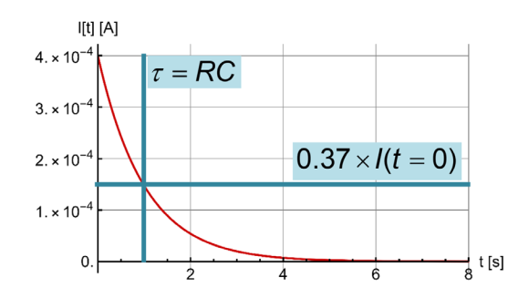 |

## Themische Strahlungen

| Konstante                 | Erklärung                     |
| ------------------------- | ----------------------------- |
| $c=3\cdot 10^8m/s$        | Lichtgeschwindigkeit im Vakum |
| $h=6.626\cdot10^{-34} Js$ | Planck'sche Konstante         |
|                           |                               |

| Formel                    | Erklärung                                                                                                              |
| ------------------------- | ---------------------------------------------------------------------------------------------------------------------- |
| $c=\lambda \cdot\nu$      | Dies ist der Zusammenhang zwischen der Wellenlänge $\lambda$ und der Frequenz $\nu$ . $c$ ist die Lichtgeschwindigkeit |
| $E=h\nu$                  | Die Energie einer Strahlung mit der Frequenz $\nu$. $h$ ist die Plank'sche Konstante                                   |
| $\rho(\nu)=1-\alpha(\nu)$ | Umrechnungs Formel zwischen Reflektionskoeffizenten ($\rho$) und Absorptionskoeffizenten ($\alpha$)                    |
|                           |                                                                                                                        |
|                           |                                                                                                                        |

## Noch zu lernen

* B-Felder induziert E-Felder
  * In welche Richtung positive E-Felder anziehen oder abstossen
# Chügeli Füsik
## Kraft

$\vec F = m \cdot \vec a$

Diese Formel nimmt einiges an:

- Bewegung in einer Dimension (keine Vektoren)
- Konstante Beschleunigung (a = const.)
- Start bei $s(0)=0$
- Anfangsgeschwindigkeit bei 

## Beschleunigung und co.

Hier sind einige gängige Formeln aufgelistet, welche hilfreich bei Beschleunigung sind. In der obersten Reihe steht, was die Formel ergeben soll. In der ersten Spalte, was sich nicht ändert und somit nicht in der Formel erwähnt wird.

|     | t                       | s                  | v                | a                  |
| --- | ----------------------- | ------------------ | ---------------- | ------------------ |
| t   | -                       | $s=\frac{v^2}{2a}$ | $v=\sqrt{2as}$   | $a=\frac{v^2}{2s}$ |
| s   | $t=\frac{v}{a}$         | -                  | $v=at$           | $a=\frac{v}{t}$    |
| v   | $t=\sqrt{\frac{2s}{a}}$ | $s=\frac{at^2}{2}$ | -                | $a=\frac{2s}{t^2}$ |
| a   | $t=\frac{2s}{v}$        | $s=\frac{vt}{2}$   | $v=\frac{2s}{t}$ | -                  |

## Energie

Energie ist $Kraft \cdot Strecke$. Es gilt also die Formel $E=F\cdot s [J]$. Die Masseinheit $J$ kann auch als $\frac{kgm^2}{s^2}$ 
# Elektrotechnik

## Strom, Spannung und Leistung

Ampere ist die Einheit des Stromes $I$ und ist Coulomb pro Sekunde $[Cs^{-1}]$. 

Die Höhe zwischen zwei Energiepotentialen nennt sich die Spannung $U$ ($U(\vec r_A,\vec r_B)=\varphi(\vec r_A)-\varphi(\vec r_B)$). 

Spannung kann aber auch über Arbeit definiert werden. Die Spannung zwischen zwei Punkten $A$ und $B$ ist die Energie pro Ladung, welche frei wird, wenn die Ladung von $A$ nach $B$ bewegt wird: $U=\int^{\vec r_B}_{\vec r_A}\vec E d\vec r$. 
Die kinetische Energie, welche eine Ladung $q$ gewinnt, wenn sie eine Spannung $U$ "herunterfällt" beträgt: $\Delta E_{kin}=\int^{\vec r_B}_{\vec r_A}\vec q\cdot E d\vec r=q\cdot U$

## Schaltung

### Knotenregel

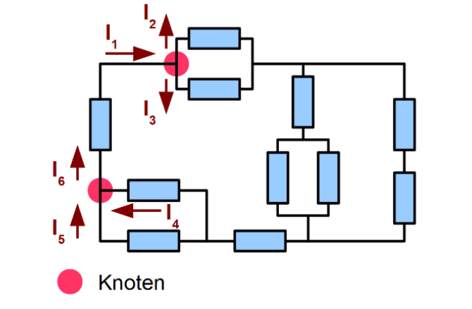

Die Knotenregel besagt, dass was in einen Knoten hinein geht, muss auch wieder aus dem Knoten hinaus.

Oder $I_1=I_2+I_3$ bzw. $I_6=i_5+I_4$

### Maschenregel

Die Maschenregel besagt, dass alle Spannungen in einer Masche zusammen $0$ ergeben müssen. Man rechnet `plus` wenn es in die Referenzrichtung eines Bauteils geht und `minus`, wenn es gegen die Referenzrichtung geht.

Ebenfalls wichtig zu erwähnt ist, dass eine Batterie in die andere Richtung zeigt, als die anderen Bauteile (Dies ist einwenig komisch im Beispiel oben). 

In der grünen Maschen sieht man, wie dies aussehen kann, für eine Masche, welche nicht über die Baterie geht: $U_4-U_5=0$

### Batterien

Reale Batterien haben einen Innenwiederstand, welcher in Serie mit der Batterie geschalten ist. Dass heisst, dass die realte Spanung einer Batterie kleiner als $U_0$ ist, da $U_{in}$ abgezogen werden muss.

### Wiederstand

Ein Wiederstand folgt dem Ohm'sche Gesetzt. Dass heisst, ein Wiederstand kann mit $U=R\cdot I$ berechnet werden.

Da für die Leistung gillt $P=U\cdot I$ , kann in diese Formel das Ohm'sche Gesetzt eingesetzt werden, um die Formel $P=\frac {U^2} R=I^2R$ zu bekommen.

Wegen der Knoten und Maschenregeln verhalten sich Wiederstände (wie auch andere Bauteile) anderst, jenach dem, ob sie Parallel oder Serial angeschlossen sind.

| Name                | Erklärung                                                                                                                                | Bild                                                        |
| ------------------- | ---------------------------------------------------------------------------------------------------------------------------------------- | ----------------------------------------------------------- |
| Parallel geschaltet | In einer Parallelschaltung müssen Wiederstände folgendermassen zusammen gefasst werden: $R_{12}=\frac 1 {\frac 1 {R_1} + \frac 1 {R_2}}$ |  |
| Seriel geschaltet   | In einer Serielschaltung müssen Wiederstände folgendermassen zusamengefasst werden: $R_{12}=R_1+R_2$                                     |  |

### Kondensator

Ein Kondensator (oder Capacitor) kann man sich als Feder vorstellen, welche aus zwei Metallplatten nahe bei einander bestehen. Es wird Strom hinein "gepumpt". Dies wird immer schwerer, je voller der Kondensator wird, bis am Ende der Kondensator voll ist. Das zweite wichtige an einem Kondensator ist, dass keine Elektronen durch ihn durch fliessen können. Anstelle dessen sammeln sich auf der einen Seite mehr Elektronen an, auf der anderen Seite werden die bereits vorhanden Elektronen abgesaugt. 

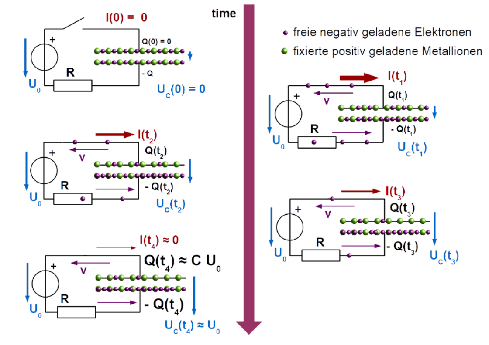

| formel                                          | Erklärung                                                                                                                                                                                                                                                          |
| ----------------------------------------------- | ------------------------------------------------------------------------------------------------------------------------------------------------------------------------------------------------------------------------------------------------------------------ |
| $\frac {dQ}{dt}=I$                              | Die Veränderungsrate der Ladung, ist der Strom $I$                                                                                                                                                                                                                 |
| $CU_c=Q$                                        | Der Zusammenhang zwischen der Spannung $U [V]$ und der Ladung $Q$ abhängig von der Kapazität $C [F]$ in Farad                                                                                                                                                      |
| $Q(t)=CU_0(1-e^{-\frac t{RC}})$                 | Wie sich die Ladung $Q$ beim Laden                                                                                                                                                                                                                                 |
| $U_C(t)=\frac{Q(t)}{C}=U_0(1-e^{-\frac t{RC}})$ | Wie sich die Spannung $U$ beim Laden verhaltet                                                                                                                                                                                                                     |
| $U_C(t)=U_0\cdot e^{-\frac t {RC}}$             | Wie sich die Spannung $U$ beim Entladen verhaltet                                                                                                                                                                                                                  |
| $I(t)=\frac{U_0}{R}e^{-\frac t {RC}}$           | Wie sich der Strom $I$ beim Laden verhaltet                                                                                                                                                                                                                        |
| $\tau=R\cdot C$                                 | Die Zeitkonstante $\tau$ . Der Strom des Kondensator fällt auf ca $\frac 1 e\approx0.37$ ab in der Zeit $\tau$ oder steigt auf $1-\frac 1 e\approx0.63$ in $\tau$ an, wenn der Kondensator geladen wird |

### Spulen

Wenn durch ein Draht Strom fliesst, entsteht ein Magnetfeld. Dies ist ebenfalls der Fall bei einer Spule. Wenn der Strom hochgefahren wird, dann wird ein Magnetfeld aufgebaut. Dies benötigt aber Energie, was wiederum einen Wiederstand erzeugt.

Wenn der Strom abgebaut wird, wir die Energie des Magnetfeldes wieder zurück in die Spannung gespiessen und über der Spule entsteht eine Spannung, welche den Strom antreibt.

Die Richtung des Magnetfeldes findet man heraus, in dem man die **Rechte**hand nimmt und mit dem Daumen in die Ricthung des `-` zeigt, bzw. die Stromrichtung auf dem Schaltungsplan (nicht die physikalische Stromrichtung, die ist in die andere Richtung). 

| Formel               | Erklärung                                                                                               |
| -------------------- | ------------------------------------------------------------------------------------------------------- |
| $U_L=L\frac{dI}{dt}$ | Die Veränderungsrate von dem Strom $I$ mit der Konstante $L [Henry]$ multipliziert, ergibt die Spannung |
|                      |                                                                                                         |

### Ungedämpfte Schwingkreise

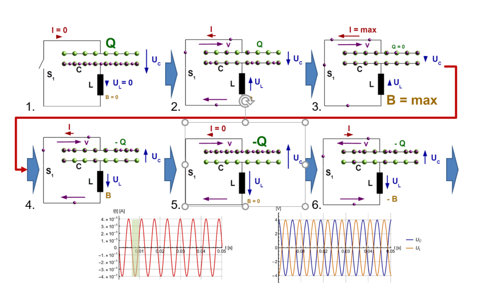

In einem Schwingungskreis, schwingen die Elektronen zwischen den zwei Platten des Kondensators hin und her. Dies kann man in die folgende Schritte unterteilen:

1. Der Kondensator ist geladen und es herrscht eine Spanung $U_0$ über dem Kondensator. Der Schalter ist aber noch offen.
2. Der Schalter $s_1$ wurde geschlossen und der Strom fliesst. Wegen dem Maschensatz muss $U_C=U_L$  sein. Da die Spannung $U_C$wächst, muss auch der Strom $I$ wachsen und somit ein Magnetfeld über L entstehen.
3. Der Strom $I$ und somit auch das Magnetfeld $B$ sind maximal. Irgendwann wird der Kondensator leer sein (Auf beiden Seiten der Platte sind gleich viele Elektronen) und $U_L$ und $UC$ sind 0. Somit gilt auch $I=0$. 
4. Da nun der Strom in der Spule freigesetzt wird, lädt sich der Kondensator wieder auf (allerdings mit einem anderen Vorzeichen) und so entsteht wieder eine Spannung $U_C$ über dem Kondensator.
5. So bald die Spule "leer" ist, wechselt die Stromrichtung wieder
6. Der Zyklus wiederholt sich nun wiede

| Formel                                                                        | Erklärung                                                                                                                             |
| ----------------------------------------------------------------------------- | ------------------------------------------------------------------------------------------------------------------------------------- |
| $Q(t)=CU_0\cdot \cos(\frac 1 {\sqrt {LC}}\cdot t)$                            | Die Ladung $Q$ eines Schwinungskreises                                                                                                |
| $I(t)=-\sqrt {\frac C L}\cdot U_0\cdot \sin(\frac 1 {\sqrt {LC}}\cdot t)$     | Der Strom $I$ eines Schwinungskreises                                                                                                 |
| $U_L(t)=-\frac 1 {\sqrt{LC}}\cdot U_0\cdot \cos(\frac 1 {\sqrt{LC}} \cdot t)$ | Die Spannun $U_L$ eines Schwinungskreises                                                                                             |
| $f=\frac 1 {2\pi\sqrt{LC}}$                                                   | Die Frequenz $f$, mit welcher der Schwingunskreis schwingt                                                                            |
| $T=2\pi\sqrt{LC}$                                                             | Die Periodendauer $T$, welche eine Schwinung des Schwingungskreis benötigt |

### Gedämpfte Schwingungskreise

Der Strom im Schwinungskreis wird schwächer, wenn $R < 2\sqrt {\frac L C}$  (oder wenn $\frac{R^2}{4L^2}>\frac 1 {LC}$ ist) Wenn dies gegeben ist, dann ist es ein gedämpfter Schwingungskreis.

| Formel                                                                  | Erklärung                                                                                                                               |
| ----------------------------------------------------------------------- | --------------------------------------------------------------------------------------------------------------------------------------- |
| $Q(t)=Q_0e^{-\frac t \tau}\cos(\omega_dt-\phi_0)$                       | Die Ladung des Schwinungskreis1                                                                                                         |
| $f=\frac 1 {2\pi}\sqrt{\frac 1 {LC} -\frac{R^2}{4L^2}}$ , $T=\frac 1 f$ | Die (Kreis-)frequenz $\omega_d$                                                                                                         |
| $\tau=\frac{2L} R$                                                      | Die Zeitkonstante $\tau$ der Dämpfung. Der Strom des Kondensator fällt/steigt auf ca $\frac 1 e\approx0.37\%$ auf/ab in der Zeit $\tau$ |

### Low-Pass und High-Pass-Filter

Bei einem Low-Pass-Filter werden die tiefen Frequenzen durchgelassen und die Hochen weggefiltert.

Bei einem High-Pass-Filter ist es umgekehrt und die hochen Frequenzen werden duch gelassen und die tiefen weggefiltert.

Über dem Wiederstand misst man ein Signal, bei welchem die tiefen Frequenzen gedämpft wurden und die hochen Frequenzen fast unverändert. Dies wäre ein High-Pass-Filter.

Hingegen über dem Kondensator misst werden die hochen Frequenzen gedämpft und die tiefen durchgelassen, was ein Low-Pass-Filter ist.

## Draht

Der Wiederstand in einem Kabel ist ungefähr: $R=\rho\frac L A$, wobei $\rho$ den `spezifischen Wiederstand` mit der Einheit $[mm^2m^{-1}\Omega]$. $L$ ist die Länge in $[m]$ und $A$ ist die Querschnittsfläche in $[mm^2]$.

## Karnaugh-Veitsch Diagramme

Ein KV-Diagram kann praktisch sein, um eine Wahrheitstabelle mit vier Inputs in eine Schaltung zu verwandeln.

Dafür wird zuerst die Wahrheitstabelle in das folgende Raster einführt. Dabei ist oben, bzw. auf der linken Seite das erste Bit und auf der unteren/rechten Seite das linke Bit. Das Feld oben rechts stellt also für den Wert aus der Wahrheitstabelle A=1, B=0, C=0, D=0. 

Wenn dies getan ist, versucht man Blöcke mit Einsen zu finden. Die Blöcke können 1, 2, 4, 8 oder 16 lang und/oder breit sein. Falls es egal ist, ob ein Input `0` oder `1` ist, kann er so betrachtet werden, dass es schönere Blöcke gibt. Ebenfalls wichtig, ein Block darf über die Kante hinausgehen.

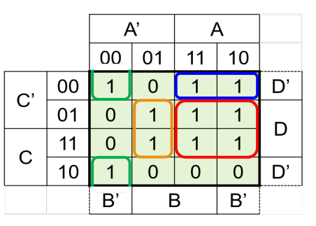

Im letzten Schritt wird nun aus den Blöcken Und-Schaltungen gebaut. Dabei müssen zwei Dinge beachtet werden:

1. Wenn ein Block über den not und "normalen" Block geht (z.B. A und not-A), dann muss das And-Gate keine Verbindung zu diesem Input haben, da es in beiden Fällen true ist.
2. Wenn ein Block nur übr ein Block geht (z.B. nur über den A oder nur den not-A Block), dann muss das And-Gate mit diesem Input verbunden sein.

Hier sieht man noch das Beispiel für die oberigen Blöcke.

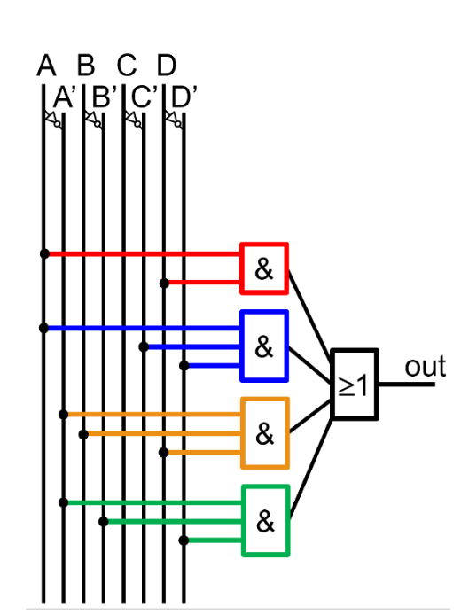

## Transformer

## Stromnetz

In unserem Stromnetzt werden mehrere Spannungen genützt. Zum einten möchte man hohe Spannungen fürs Transportieren von Strom benützten, da dies um einiges effizienter ist. Allerdings ist es zu gefährlich Hochspannung direkt im Haus zu gebrauchen. Daher hat man vier Netzebenen, welche mit Transformern gekoppelt sind.

- 1 Ebene - **Höchstspannungsebene**: 380kV, bzw. 220 kV aus dem Kraftwerk oder vom Ausland
- 3 Ebene - **Hochspannungsebene**: 36kV - 150kV: Überregionale Verteilungsnetzte
- 5 Ebene - **Mittelspannungsebene**: 1kV - 36kV: Regionale Verteilungsnetzte
- 7 Ebene - **Niederspannungsebene**: < 1kV: Lokale Verteilungsnetzte

Die Ebenen 2, 4 und 6 sind die Transformatorenebenen. Auf diesen Ebenen wird der Strom auf die nächst tiefere oder höhere Ebene transformiert.

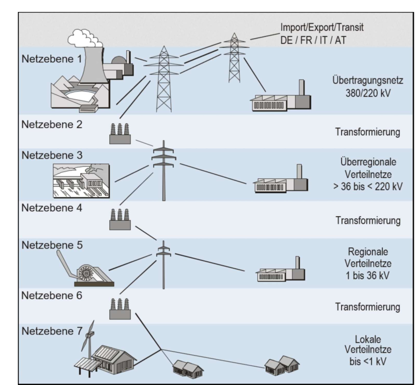

## Wechsel- vs. Gleichstrom

Man hat sich in der Vergangenheit auf Wechselstrom geeinigt, weil es relativ einfach ist, Wechselstrom zu transformieren. Heute ist dies aber auch mit Gleichstrom möglich. Gleichstrom erzeugt weniger Verlüste, wenn transportiert auf lange Streckenen, als Wechselstrom, da Wechselstrom nah an der Kabeloberflächse fliest und daher ein stärkeres Magnetfeld erzeugt.

Der $U_{Eff}$ kann mit der folgender Formel berechnet werden: $U_{Eff}=\frac{U_S}{\sqrt 2}$ . Dies berechnet den quadratischen Mittelwert einer Wechselspannung.

Der Sinus kann mit der folgenden Formel angegebene werden: $f(t)=U_{Eff}\cos(\omega\cdot t)=U_{Eff}\cos(f\cdot 2\pi\cdot t)$

## Drehstrom

(Siehe Script_GED_Lect_3_4.pdf)

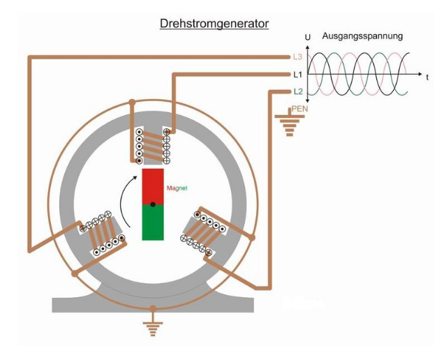

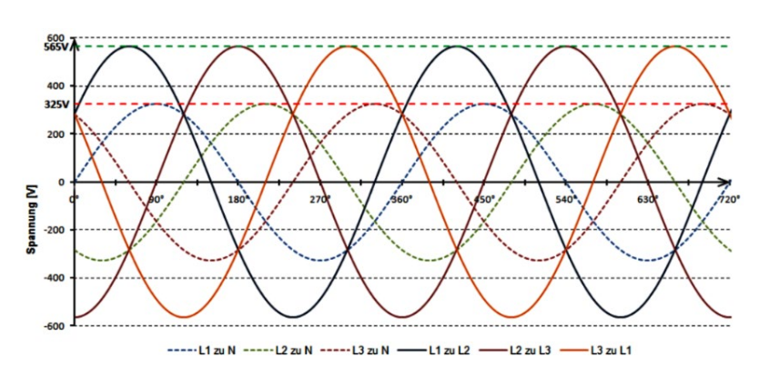

Drehstrom ist praktisch für Motoren, da es keine "Totenpünkte" gibt, an dem ein Magnet stoppen könnte. Zudem sind alle Häuser in der Schweiz an einem Drehstrom angeschlossen.

Auf den Aussenleiter wird der Strom "transportiert" und stehen gegenüber der Erde unter einer Spannung von 230V. 

Der Neutralleiter ist der "Ausgang" für die Elektronen, welche über die Aussenleiter hinein gepumpt werden.

## Gefahr durch Strom

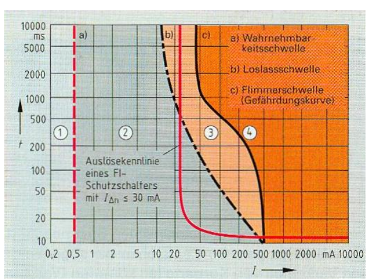

Wie gefährlich Strom ist hängt von der Stromstärke und der Dauer ab. 

Gefahrebereiche:

1. Wird nicht wahrgenommen, da der Strom zu klein ist
2. Kribbeln, Krämpfte, aber keine bleibenden Schäden
3. Stromquelle kann wegen Museklverkrampfung nicht mehr losgelassen werden (bei Gleichstrom)
4. Tödlich, wegen z.B. Herzkammerflimmern
# Elektromagnetismus

## Formeln

| Formel                                                        | Erklärung                                                                           |
| ------------------------------------------------------------- | ----------------------------------------------------------------------------------- |
| $\vec F_{12}=\frac 1 {4\pi\varepsilon_0}\cdot \frac {Q_1Q_2}{ | \vec r_{12}                                                                         | ^2}\cdot \vec n_{12}$              | Kraft zwischen den Ladungen $Q_1$ und $Q_2$.  Der Einheitsvektor $\vec n_{12}$ von Ladung $Q_2$ zu $Q_1$ $\vec n_{12}=\frac{\vec r_{12}}{                | \vec r_{12} | }$(Konstante: $\varepsilon_0=8.859\cdot 10^{-12}[\frac {C^2}{Jm}]$)                                    |
| $\vec E(\vec r)=\frac 1 {4\pi\varepsilon_0}\cdot \frac Q {    | \vec r - \vec r_Q                                                                   | ^2}\cdot\frac {\vec r - \vec r_Q}{ | \vec r - \vec r_Q                                                                                                                                        | }$          | Das Elektrische Feld $\vec E$ einer Ladung am Ort $\vec r_Q$, welches von der Ladung $Q$ erzeugt wurde |
| $\vec F =q\vec E(\vec r, t)$                                  | Die Kraft $\vec F$, mit welcher das Feld $\vec E$ die Probeladung $q$ beschleunigt  |
| $\vec F_L=q\cdot(\vec v\times\vec B)$                         | Die Kraft, eines Magnetfeldes auf eine Ladung $q$, welche sich mit $\vec v$ bewegt. |
| $m=\frac{rq                                                   | \vec B                                                                              | }{v}$                              | Spezialfall, wenn $\vec v$ senkrecht auf $\vec B$ steht und $\vec B$ konstant ist. $m$ ist die Masse von der Ladung $q$ mit der Geschwindigkeit $\vec v$ |

Auf dem TI-nspire cx gibt es den Befehl $crossP(x, y)$, um mit den Vektoren $\vec x$ und $\vec y$ ein Kreuzprodukt zu rechnen.

Das Skalarprodukt ist folgendermassen definiert: $\vec a \cdot \vec b=|\vec a| \cdot |\vec b|\cdot \cos(\alpha)$ 
Aus dem kann geschlossen werden, dass wenn $\alpha=90°$ , bzw. die Vektoren $\vec a$ und $\vec b$ senkrecht aufeinander stehen, dass das Skalarprodukt `0` is

## Linienintegrale

$W=\int_\gamma\vec F\cdot d\vec \gamma$

Arbeit wurde in der BMS als $W=F\cdot s$ definiert. Nun kann aber $F$ und $s$ auch Vektoren sein. Hier kommt das Linienintegral ins Spiel, denn mit diesem kann man die Arbeit mit Vektoren ausrechnen.

Der Vektor $\vec F$ und $\vec \gamma$ müssen nicht umbedingt in dieselbe Richtung zeigen. Wenn man z.B. einen Schlitten zieht, hat die Kraft $\vec F$ ca. eine 45° gegen oben, während $\vec \gamma$ die Strecke des Schlittens darstellt.

Spannung kann auch als Linienintegral angesehen werden: $U(\gamma)=\int_\gamma\vec E \cdot d\vec \gamma$

### Spezialfälle

| Name                                                         | Formel                                                       | Bild                                                        |
| ------------------------------------------------------------ | :----------------------------------------------------------- | ----------------------------------------------------------- |
| **Kreis** Das Vektorfeld liegt überall tangential an der Kurve und alle Vektoren haben dieselbe Länge. | $\int_\gamma\vec U\cdot d\vec\gamma =2\pi r\vert\vec U\vert$ |  |
| **Rechteck** Das Vektorfeld ist parallel zu zwei Seiten (A, C) des Rechteck. Entlang einer Seite haben die Vektoren eine konstante Grösse | $\int_\gamma\vec U \cdot d\vec \gamma=aU_1-aU_5$             |  |

## Flussintegrale

Beim Flussintegral wie viel Volumen $vdt$ fliesst durch $A$, wenn es die Geschwindigkeit $\vec U$ hat. Dies kann als Integral geschrieben werden, in GED wird allerdings nur folgende Spezialfälle behandelt.

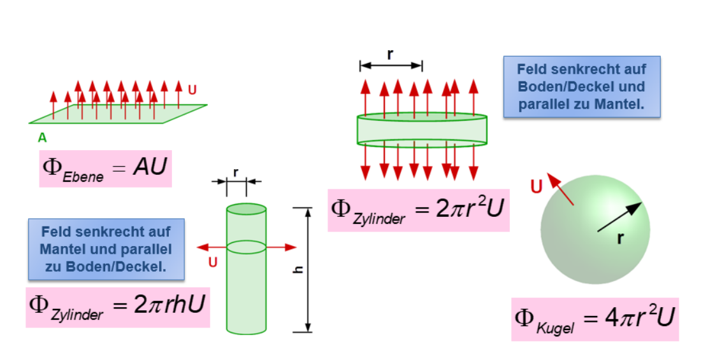

$U$ sind in diesen Formel die Länge der Pfeile.

## Maxwellgleichungen

### Geschlossene und nicht-geschlossene Flächen

Eine geschlossene Fläche hat keinen Rand (wie zB. eine Kugel) und es gibt ein klares Innen und Aussen.

Eine nicht geschlossene Fläche hat einen Rand. 

### Gauss'sche Gesetzt

#### Metalle

## Rechte-Hand Regel

## Rechte-Hand Regel 2

Wenn der Daumen in die technische Stromrichtung zeigt, dann zeigen die Finger den Umlaufsinn des $\vec B$-Feldes an.

## Vektorfelder

$$
\vec E (x, y, z, t)=\begin{bmatrix} E_x(x, y, z, t) \\ E_y(x, y, z, t) \\ E_z(x, y, z, t) \\ \end{bmatrix}
$$

Ein Vektor kann ein 2D oder 3D Koordinatensystem sein, in welchem Vektoren in eine Richtung zeigen. Diese Richtung kann zusätzlich auch noch von der Zeit abhängig sein.

## Magnetfeld

$[\vec B(\vec r, t)]=\frac {Ns}{Cm}=\frac{\text{Newton Sekunden}}{\text{Coulomb Meter}}=\frac{kg}{s C} = \text{Tesla}$

Ein Magnetfeld wird in Teslas angegeben. Dabei ist ein Tesla kg pro Coulomb Sekunde oder Newton Sekunden pro Coulomb Meter.

Um zu berechnen, mit vieviel Kraft ein Objekt mit einer Ladung beeinflusst wird, gibt es folgende Formel: $\vec F = q(\vec v \times \vec B)$

## Elektrofeld

$[\vec E (\vec r, t)]=\frac N C = \frac V M = \frac{kg}{ms^3A}$

Ein Elektrofeld wird Newton pro Coulomb, Volt pro Meter oder Kilogram pro Meter Sekunden³ Amper angegeben. Die Einheiten bedeuten dasselbe (Coulomb = Amper Sekunde)

Wenn ein Leiter positiv geladen ist, wirkt er abstossend zu Elektronen, wenn ein Leiter negative geladen ist, dann wirkt er anziehend. Zu dem sind die Pfeile im senkrecht auf dem Leiter.

Um das Elektrofeld einer einzuelne Ladung zu berechnen, kann die folgende Formel verwendet werden

## Elektrofelder und Magnetfelder zusammen

Zeitlich veränderliche B-Felder erzeugen zeitlich veränderliche E-Felder, welche wiederum zeitlich veränderliche B-Felder erzeugen. Diesen Effekt führt zu einer Welle, welche sich ausbreitet.

Initialisiert kann es z.B. von einer Antenne werden, welche nichts anderses als Ströme zeitlich verändert durch einen Draht schickt.

## Magnete

Magnete haben immer einen Nord- und Südpol. Wenn man ein Magnet trennt, entstehen zwei neue Magnete, mit jeweils einem Nord- und Südpol.  

Wie auch bei elektrischen Feldern kann man auch bei magnetischen Feldern Linien zeichnen.

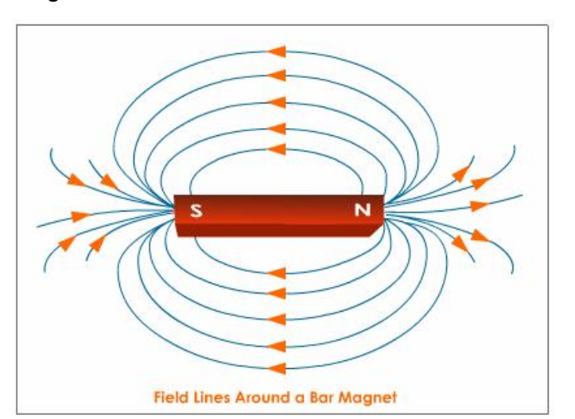

Magnete wirken eine Kraft auf **bewegte Ladung**  aus. Auf ruhende Ladung hat es keinen Effekt. Diese Kraft nennt sich Lorentz-Kraft und kann mit folgender Formel berechnet werden: $\vec F_L=q\cdot(\vec v \times \vec B)$

Wenn $\vec v$ senkrecht auf $\vec B$ steht,und $\vec B$ konstant ist, kann mit folgender Formel den Zusammenhang von der Geschwindigkeit der Ladung $\vec v$ mit dem Magnetfeld $\vec B$ und dem Radius $r$ beschrieben werden: $m=\frac{rq|\vec B|}{v}$

Bei Elementarteilchen ist die Ladung entweder $0$, $e$ oder $-e$.

## Intensität

Die Intensität einer ebenen Welle kann mit der folgenden Formeln berechnet werden:
$$
I_{em}=\frac{E_0B_0}{2 \mu _0}=\frac{E^2_0}{2c\mu_0}=\frac{cB^2_0}{2\mu_0}\\
$$
Dabei ist $\mu_0$ die magnetische Feldkonstante $1.257\cdot10^{-6}=4\pi\cdot 10^{-7}$

## Strahlendruck

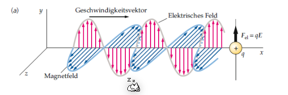
$$
p_s=\frac{I_{em}}c=\frac{E_0B_0}{2c\mu_0}=\frac{E^2}{2c^2\mu_0}=\frac{B^2_0}{2\mu_0}
$$
# Termische Strahlung

> **Wichtig:** Alle Temperaturen sind in Kelvin.
> 
> Um von Celsius zu Kelvin zu konvertieren: $T_{kelvin}=T_{celsius}+273.15$

## Formeln

| Formel | Erklärung |
| ------ | --------- |
|        | $E$       |
|        |           |
|        |           |

## Sichtbares Licht

Sichtbares Licht:

## Lichtbrechung

$$
\frac{\sin(\alpha)}{\sin(\beta)}=\frac {c_1} {c_2}=\frac{n_2}{n_1}
$$
Dabei stellt $c$ die Lichtgeschwindigkeit im jeweiligen Material dar und $n$ der Brechungsindex.

### Totalreflexion

Wenn ein Lichtstrahl genug Flach auf die "Bruchkanta" (z.B. die Wasseroberfläche). In diesemfall wird alles zurück reflektiert. Für die Formel heisst das, dass $\alpha\ge 90°$ oder $\beta \ge 90°$ 

## Photonen

Jedem Photon wird eine Wellenlänge, bzw eine Frequenz zu geordnet: $E=h\nu$ , dabei ist die Planck'sche Konstante $h=6.626\cdot 10^{-34} [Js]$ und $E$ die Energie des Photons.

## Elektromagnitische Strahlung

Eine Elektromagnetische Strahlung besteht aus einer Welle mit einer Wellenlänge $\lambda$ und einer Frequenz $\nu$.

Die Formel $c=\lambda\cdot \nu$ zeigt den Zusammenhang zwischen $\lambda$ und $\nu$. $c$ ist dabei die Lichtgeschwindigkeit ($c=3\cdot10^8 m/s$)

Die Energie einer Strahlung kann mit $E=h\nu$ errechnet werden. $h$ ist dabei die Planck'sche Konstante ($h=6.626\cdot10^b{-34}$)

Der Absorptionskoeffizent beschreibt, wie viel der Frequenzen ein Körper absorbiert. `1` heisst, dass alles absorbiert wird, `0`, dass nichts absorbiert wird. 

Der Gegenpol, der Reflexionskoeffizent, beschreibt, wie viel der Frequenzen reflektiert werden und kann mit der folgenden Formel umgerechnet werden: $\rho=1-\alpha$

Oft sind diese Koeffizenten abhähngig von der Frequenz (also $\alpha(\nu)$ und $\rho(\nu)$). Ein blaues T-Shirt würde die "blauen Frequenzen" reflektieren und die anderen absorbieren.

Bei einem **schwarzen Strahler** kann bewiessen werden, dass es keinen Unterschied gibt, ob die Strahlung vom Material 1 ins Material 2 oder umgekehrt geht.

$$
\alpha_{1\rightarrow 2}=\alpha_{2\rightarrow 1}\\
\sigma_{1\rightarrow 2}=\sigma_{2\rightarrow 1}
$$

### Emission

Wenn eine Strahle von einem "dünnem" Material, wie Luft, aufgenommen wird, wird von Emission von Strahlung gesprochen und anstatt dem Absorptionskoeffizent, wird der Emissionskoeffizenten $\varepsilon$ verwendet (es gilt also: $\alpha_{2\rightarrow1}=\varepsilon_{2\rightarrow 1}$)

### Schwarzer Strahler

Ein Körper mit dem Reflexionskoeffizent $\rho=0$ und Absorptionskoeffizenten von $\alpha=1$ wird `schwarzer Strahler` genannt. Ein schwarzer Block kann als Schwarzerstrahler angenähert werden (er reflektiert trotzdem noch ein wenig Licht), aber auch die **Sonne**, da diese **keine Frequenzen und somit auch Licht reflektiert**.

### Grauer Strahler

Ein grauer Strahler ist ein Körper,  welcher in gewissen Wellenbereichen nicht so stark strahlen, wie ein schwarzer Strahler. Dass heisst, dass der Emmisionskoeffizent $\varepsilon$ nicht umbedingt `1` muss sein.

## Wien'sches Verschiebungsgesetzt

Mit $\lambda_{max}=\frac b T$ kann man die Temperatur **in Kelvin** zu der maximalen Wellenlänge umrechnen.

Mit dieser Formel kann man auch die Lichtfarbe, welche in Kelvin angegeben wird, erklären.

## Stefan-Boltzmann Gesetzt (Gesammtleistung)

Um die Gesamtleistung eines Strahlendenkörpers zu berechnen kann man die folgende Formel benützten: $P_{rad}=\sigma AT^4$ Dabei ist $\sigma=5.67\cdot10^{-8} [Wm^{-2}K^{-4}]$ , $A$ die Oberfläche des Körpers und $T$ die Temperatur des Körpers.

### Energetische Bilanz eines Strahlers

Die Energiebilanz sagt aus, ob Energie vom Körper aufgenommen wird und er daher wärmer wird oder ob mehr Energie abgegeben wird und er daher kälter wird. Dies kann mit der folgenden Formel berechnet werden: 
$$
I=-\frac{dE}{dt}=\sigma\varepsilon A(T^4-T_{env}^4)
$$
Dabei ist $\sigma=5.67\cdot10^{-8}$, $\varepsilon$ den Emmisionskoeffizenten, $A$ die Oberfläche des Körpers, $T$ die Temperator des Körpers und $T_{env}$ die Umgebungstemperatur.

Bei einem grauen Strahler kann $\varepsilon \neq1$ sein.

Wie man an der Formeln mit den Temperaturen erkennen kann, wird die Temperatur hoch 4 gerechnet. Dies führt bei einer 16-facher vergrösserung, wenn die Temperatur verdoppelt wird.

Ein ähliches Phänomen gibt es, wenn die Länge eines Körpers veroppelt werden, wird die Fläche vervierfacht und das Volumen verachtfacht.

### Sonneneinstrahlung

Um zu berechnen, wie viel Energie die Sonne auf die Erde strahlt, kann folgende Formel gebraucht werden:
$$
I=\sin(\beta)Aj
$$
Dabei ist $\beta$ den Einstrahls-Winkel der Sonne, $A$ die Fläche, wo für man die Energie $I$ berechnen möchte und $j$ der Faktor der Sonneneinstrahlung.

### Wärmeleitung

$$
I=-Ah_{X,Y}(T_X-T_Y)
$$

Mit dieser Formel kann der Wärmestrom (Energie pro Zeit) berechnet werden, welcher von einem Objekt $X$ mit der Temperatur $T_X$ zu einem Objekt $Y$ mit der Temperatur $T_Y$ fliesst. $A$ ist dabei die Berührungsfläche der zwei Objekte und $h_{X,Y}$ ist der Wärmeübertragunskoeffizent.
# Signale

## Signalarten

| Name           | Bild                                                                                          |
| -------------- | --------------------------------------------------------------------------------------------- |
| Sinussignal    |  |
| Rechtecksignal | 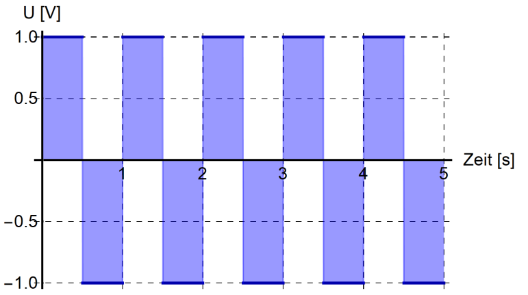 |
| Sägezahnsignal |  |
| Dreieckssignal |  |

Eine Welle wird hauptsächlich durch ihre Amplitude $A$, Periode $T$, Frequenz $\nu$ und Phasenverschiebung $\varphi$ definiert. Mit $T=\frac 1 \nu$ kann man von der Frequenz $\nu$ zur Periode $T$ umwandeln.

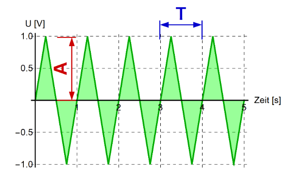

Ein Sinussignal kann in ein Cosinussignal und umgekehrt folgendermassen umgewandelt werden:
$$
sin(a-\frac \pi 2)=cos(a)\\
cos(a+\frac \pi 2)=sin(a)
$$

## Fourierzerlegung

Man kann jede Funktion in eine Summe von Cosinusen oder Sinusen zerlegen

## Töne und Klangfarbe

Neben eines Grundtones produziert ein Instrument auch noch Obertöne. Als Daumenregeln: **Je mehr Obertöne, desto schärfer tönt ein Instrument.**

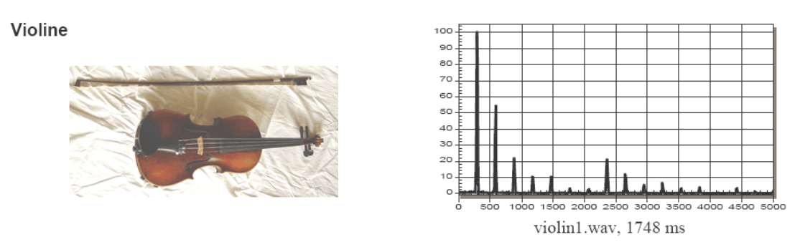

## Nyquist - Shannon Theorem

Es müssen doppelt so viele Messpunkte existieren, wie die maximale Frequenz: $f_{measure}>2\cdot f_{max}$. Wenn dies nicht gegeben ist, tritt **Aliasing** auf und es werden falsche Frequenzen gespeichert.

Für die tiefste Frequenz gilt, dass das Intervall $T$ zwischen den Messpunkten : $T > \frac 1 {f_{min}}$

## Blip

Ein Blip ist ein kurzes Signal. Dabei gilt, je kürzer der Blip, desto mehr Frequenzen gibt es um die Hauptfrequenz $\nu_0$

Ein zweites Prinzip, das ählich funktioniert: Je steiler eine Flanke eines Signales, desto mehr Frequenzen werden benötigt, um die Flanke darzustellen.

### Schnelle Orgeln

Damit ein Ton als harmonisch empfunden wird, muss eine Frequenz domonieren. Bei einem Blip ist dies allerdings nicht umbedingt gegeben. Ebenfalls gilt, je höher ein Ton, desto kürzer kann er sein, dass trotzdem noch eine Frequenz dominiert und der Ton harmonisch klingt. 

Aus diesem Grund kann eine Picolo schnell spielen und eine tiefe Orgel nicht.

Mathematisch kann diese Relation folgendermassen ausgedrückt werden: 
$$
\frac{\Delta f\cdot \Delta t}{2}\sim 1
$$

## Signal-to-Noise Ratio

$A_{noise}=\text{Die durchschnittliche Noise Amplitude}$
$$
SNR=\frac{P_{signal}} {P_{noise}}=\frac{I_{signal}} {I_{noise}}=\frac{A^2_{signal}}{A^2_{noise}}
$$

Dabei bezeichnet $P$ die Leistung, $I$ die Intensität und $A$ die Amplitude.

