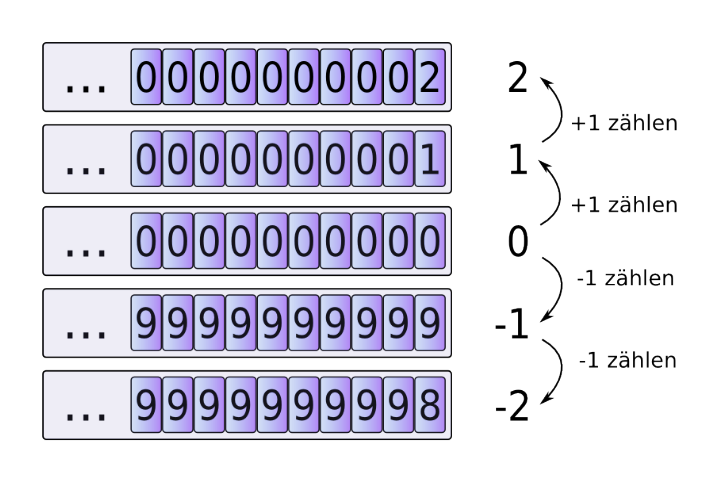
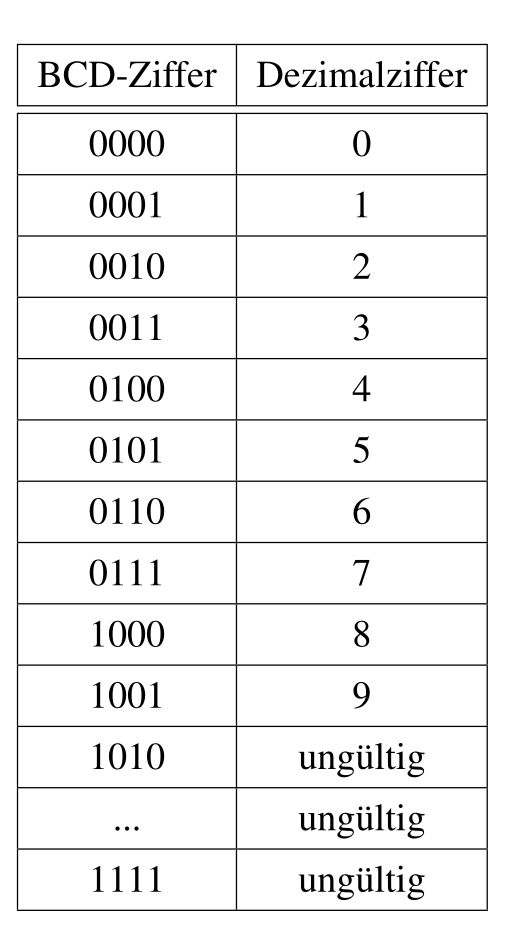
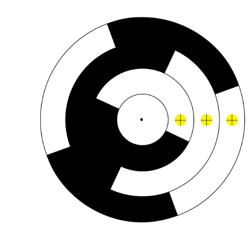
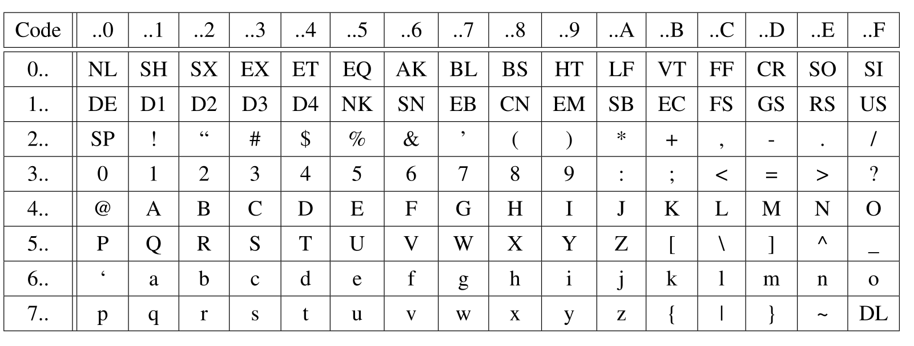

# Zahlensysteme

## Generel

- Das Zusammen-Rechnen kann auch als Summenzeichen: $\sum^{n}_{i=0}(a_i\cdot b^i)$

## Binär

- Abekürzungen:
  - 0b0010 0000
  - 0B0010 0000
  - $0010'0000_b$

## Hexadezimal

- Abkürzungen:
  - $AF3C_h$
  - AF3Ch (<- h am Ende anfügen)
  - 0xAF3C

## Umrechnen

- Achtung von welcher Richtung man den Rest liest

TODO

1. $\frac{a_n\cdot b^n + a_2\cdot b^2+a_1\cdot b^1+a_0}{b}$
2. 

Beispiel:

1. $1000_d:16_d = 62_d R8_d=8_h$
2. $62_d : 16_d = 3_d R 14_d=E_h$
3. $3_d : 16d = 0_d R 3_d=3_h$
4. $\text{Daraus gibt es von unten nach oben gelesen: } 3E8_h=1000_d$

Beispiel #2:

- $26.6875_d = binar$
- Man beginnt nur mit der ganz Zahl, also 26
1. $26_d : 2_d = 13_d R0$
2. $13_d : 2_d = 6_d R1$
3. $6_d : 2_d = 3_d R0$
4. $3_d : 2_d = 1_d R1$
5. $1_d : 2_d = 0_d R1$
- Von unten nach oben gelesen gibt dies: $11010_b$
- Nun noch $0.6875_d$
1. $0.6875_d \cdot 2 = 0.375 + 1$
2. $0.374 \cdot 2 = 0.75 + 0$
3. $0.75 * 2 = 0.5 + 1$
4. $0.5 * 2 = 0 + 2$
- Nun von oben nach unten lesen: $1011_b$
- Zusammen: $11010.1011_b$

## Addition & Subtraktion

- Wie Schriftliches-Addieren
- Bei Hexadezimal darauf denken, dass der Übertrag im Hexadezimal-System ist. Heisst eine 1 beim Übertrag von der Einerstelle ist 16

## Ziffern verschieben

Wenn man eine 0 anhänkt, rechnet man Mal die Basis. 
Als Beispiel: $12 \cdot 10 = 120$ oder $10b\cdot2_d=100_b$

## Multiplikaton

Beim Binär (oder auch andre Zahlensystem) multiplizeren, wird jede einzelne Stelle mit der ganzen anderen Zahlen multipliziert und die Ergebnisse addiert. Dies funktioniert im Zehnersystem, wie auch in Binär.

Beispiel:

<pre>
101 x 1110
  1 x 1110 =   1110
 0  x 1110 =  0000
1   x 1110 = 1110
            1000110
</pre>

## Dividieren

<pre>
 6   : 5   = 1.2
 110 : 101 = 1.0001
-         (hat 1x platz -> 1.)
 001
  010      (ein 0 wird hinzugefügt)      
  0100     (da 101 nicht in 100 hineinpasst, wird ein weiteres 0 hinzugefügt -> 1.0)
  01000    (ein weiteres 0 wird hinzugefügt -> 1.00)
   -101    (jetzt kann 101 abgezogen werden -> 1.001)
    011
</pre>

Dieses Spiel könnte man nun wiederholen bis in alle Ewigkeit, da 1.2 sich nicht als binär oder hexadezimal Zahle lässt.

## Minuszahlen

Um Minuszahlen ohne ein Minuszeichen darzustellen wird in der Informatik einen Trick verwendet. 

### 9er- & 10er-Komplement

Wenn man von 0 Eins abzieht (-1 rechnet), dann bekommt man -1. Wenn man nun dasselbe durchführt, aber ohne Minuszeichen, dann wird aus 0000 $\to$ 9999, da es einen Underflow gibt. Man halbiert die Anzahl möglichen Zahlen, da nun die Hälfte der Zahlen für positive Zahlen und die andere Hälfte für die negativen Zahlen steht. Dies nennt sich das **Komplement**.

Wenn im 10-er System gedacht wird,  ist das 9-er Komplement, wenn jede Ziffer von `9` abgezählt wird. Die negative Representation von `0001` (also -1), wäre `9998`. Dieses System hat aber den Nachteil, dass man zwei 0 hat: `9999` und `0000`. 

Da dies Platzverschwendung wäre, gibt es das 10er-Komplement, in dem noch `+1` gerechnet wird. Aus `0001` wird zuerst `9998` und dann `9999`.

### 1er- & 2er-Komplement

Dasselbe Konzept, wie beim 9er-, bzw. 10er-Komplement kann auch auf das 1er- und 2er-Komplement übertragen werden. 

Beim 1er-Komplement wird jede Ziffer von `1` abegezählt. Die negative Representation von `0001` ist also `1110`. Auch hier hat man zwei Representation für die Zahl `0`, daher wird im 10er-Komplement noch `+1` gerechnet. Aus `1110` wird also `1111` für `-1`.

Hier sieht man die verschiednenen Verfahren

| Binär | unsigned | 1er-Komplement | 2er-Komplement |
| :---: | :------: | :------------: | :------------: |
| 1111  |    15    |       -0       |       -1       |
| 1110  |    14    |       -1       |       -2       |
| 1101  |    13    |       -2       |       -3       |
| 1100  |    12    |       -3       |       -4       |
| 1011  |    11    |       -4       |       -5       |
| 1010  |    10    |       -5       |       -6       |
| 1001  |    9     |       -6       |       -7       |
| 1000  |    8     |       -7       |       -8       |
| 0111  |    7     |       7        |       7        |
| 0110  |    6     |       6        |       6        |
| 0101  |    5     |       5        |       5        |
| 0100  |    4     |       4        |       4        |
| 0011  |    3     |       3        |       3        |
| 0010  |    2     |       2        |       2        |
| 0001  |    1     |       1        |       1        |
| 0000  |    0     |       0        |       0        |

Dasselbe Verfahren funktioniert auch für Kommazahlen. In diesemfall wird die ganze Kommazahl als eine Zahl gedacht und nur einmal +1 beim 2er-Komplement gerechnet. 

Um eine Zahl in ihr Komplement um zuwandeln, muss der Umwandler wissen, wie viel Stellen die Zahl hat. Daher am besten 1, als 0001 schreiben.

### Over- & Underflows

Ein Overflow, bzw. ein Underflow passieren, wenn eine Zahl grösser ist, als der Wertebereich, in denen man sie speichert. Je nachdem ob ein Komplement verwendet wird oder nicht, ist dieser Punkt an einem anderen Ort.

Bei Zahlen ohne Vorzeichen ist der Overflow-Punkt zwischen 0 und 15: 

Bei Zahlen, welche mit dem 2er-Komplement formatiert sind, ist dieser Punkt zwischen 7 und -8:

## Verschiedene Codes

### BCD Code (Binary Code Decimal)

Ein Code, welcher verwendet wird, wenn Dezimalzahlen auf einer Anzeige dargestellt werden. Die Binärzahlen `0000` bis `1001` gelten für 0 - 9, die anderen sind ungültige Zeichen.

### Gray Code

Gray Code ist ein Code, bei welchen maximal 1 Bit von einem Codewort zum einem benachbarten Codewort (z.B. 5 zu 6 oder 5 zu 4). Dieses System wird für Schleifkontakte genutzt, da es dort problematisch sein kann, wenn sich mehrere Bits gleichzeitig ändern. Wenn sich zwei Bits ändern, kann es sein, dass ein Bit sich ein wenig später ändert und so der Computer eine Falsche Zahl liest.

| Dezimal | GrayCode |
| ------- | -------- |
| 0       | 000      |
| 1       | 001      |
| 2       | 011      |
| 3       | 010      |
| 4       | 110      |
| 5       | 111      |
| 6       | 101      |
| 7       | 100      |

Oft wird ein Graycode für Schleifkontakte auf einer Drehscheibe genutzt.

### ASCII Code

#### Unicode

Unicode ist ein Zeichensatz in dem alle Modernensprachen (und viele historische Sprachen) abgebildet werden können und hat das Ziel die inkompatibilität zwischen Encodings aufzuheben. Dabei hat Unicode Platz für rund 1 Milion Zeichen, wovon heute ca 10% genutzt sind. 

Dabei definiert der Standart 17 Ebenen. Die erste ist die Base Multilinugal Plane (BMP), in welcher die Zeichen der modernen Sprachen abgelegt sind. In der Supplementary Multilingual Plane (SMP) sind historische Zeichen, Symbole und auch Emoticons abgelegt.

#### UTF-8, UTF-16 & UTF-32

UTF-8 ist ein Code mit variabler Breite und kann 1 bis 4 Bytes pro Zeichen gross sein. 

| Unicode-Bereicht      | Utf-8 Codierung                     | Anzahl Code-Bits |
| --------------------- | ----------------------------------- | ---------------- |
| 0000'0000 - 0000'007F | 0xxxxxxx                            | 7                |
| 0000'0080-0000'07FF   | 110xxxxx 10xxxxxx                   | 11 (5 + 1*6)     |
| 0000'0800-0000'FFFF   | 1110xxxx 10xxxxxx 10xxxxxx          | 16 (4 + 2*6)     |
| 0001'0000-0010'FFFF   | 11110xxx 10xxxxxx 10xxxxxx 10xxxxxx | 21 (3 + 3*6)     |

UTF-16 ist ein Encoding, welches entweder aus 2 oder 4 Bytes besteht. Die Code Points zwischen $0000_h$ und $FFFF_h$ können mit 2 Bytes dargestellt werden. Für höhrere Code Points werden 4 Bytes benötigt. Das ein 2 bytiges und 4 bytiges Code Wort nicht verwechselt werden, wird der Bereich $D800_h$ bis $DFFF_h$ freigehalten. Wenn ein Code Wort in diesem Bereich liegt, dann ist es klar, dass die nächsten zwei Bytes auch noch dazu gehören.

### Endiannes

Wenn mehrere Bytes als eine Zahl verschickt werden, stellt sich die Frage, welches Byte zuerst kommt. Hier gibt es zwei Varianten.

| Name          | Beschreibung                                   | Darstellung      |
| ------------- | ---------------------------------------------- | ---------------- |
| Little Endian | Das niederstwertige Byte wird zuerst geschickt | FEDCBA9 87654321 |
| Big Endian    | Das höchstwertige Byte wird zuerst geschickt   | 87654321 FEDCBA9 |

