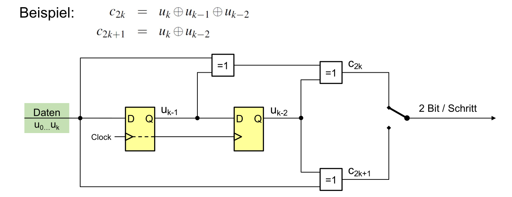
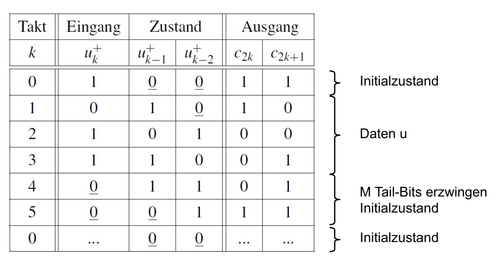
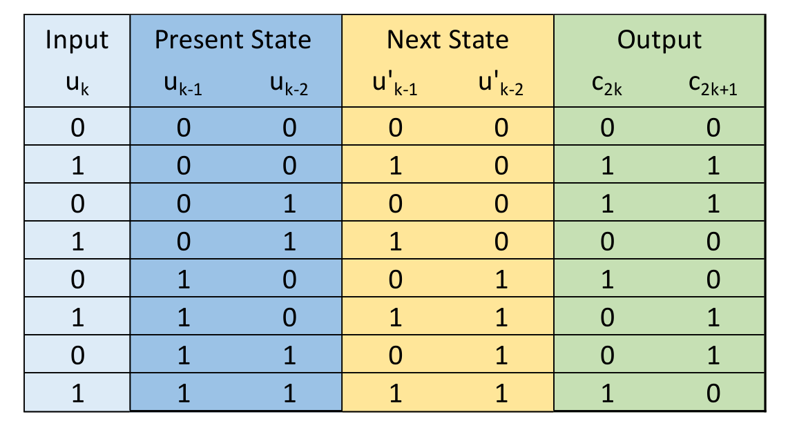
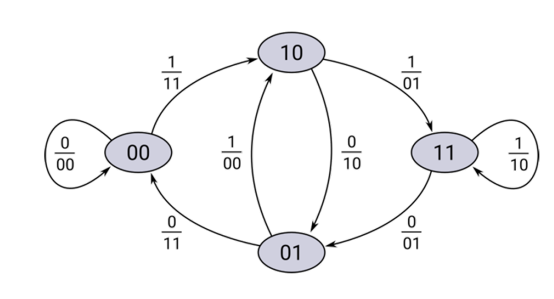
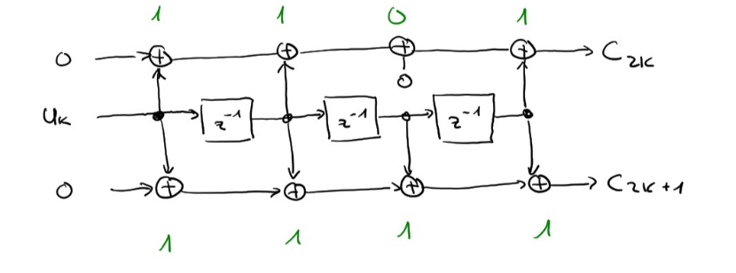
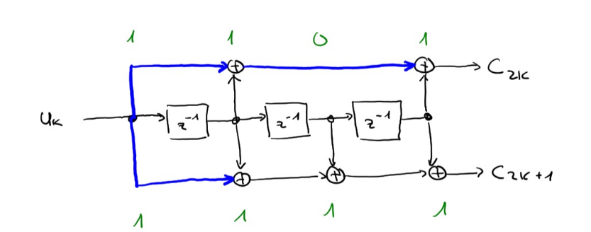
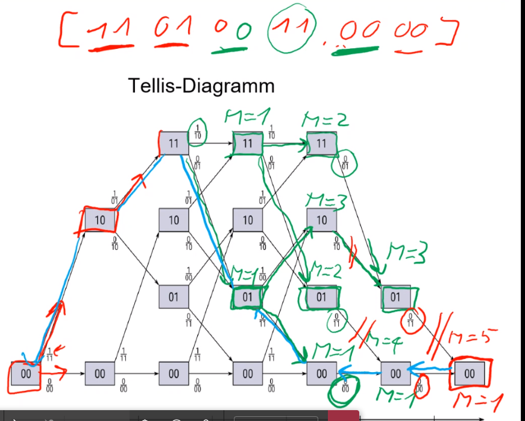

## Faltungscode

Ein Faltungscode ist ein Linearer code.

Der Input wird dabei durch Flip-Flops gesendet, welche bewirken, dass ein Bit sich auf die nächsten Outputs auswirken. So wird eine Redundantz geschaffen.

(Im Beispiel unten sind die gelben Elemente die Flip-Flops, die Plus im Kreis sind XOR-Gates)

Wichtig zu erwähnen ist, dass nach einem Codewort müssen noch so viele "0" gesendet werden, wie die Anzahl Bits des Gedächnis, da sonst das vorherige Codewort auf das nächste Codewort einfluss nehmen würde. Diese Nullen nennt man "Tail-Bits". Diese sind in der unterigen Tabelle eingezeichnet.

Ein solche Schaltung kann man auch als Statemachine anschauen. In der unteren Tabelle sieht man, wie der aktuellen Zustand der Statemachine zum mächsten Zustand wird. Die Output Spalte kann an der "Present State" Spalten abgelesen werden.

Das Zustanddiagramm unten ist eine Abbildung der Tabelle oben. Dabei kann jeder Zu

### Eigenschaften

Die Coderate kann folgendermassen ausgerechnet werden: $R=\frac N {2\cdot(N+m)}$

Dabei ist $N$ die Anzahl Inputs und $m$ die Anzahl Tailbits, bzw. wie gross das Gedächniss des Faltungscode ist.

### Freie Hamming-Distanz

Das ist der Pfad im Zustandsdiagramm mit möglichst wenig `1` (aber nicht nur `0`) beim Output des Encoders.  Im oberen Zustandsdiagram hätten wir eine Freie Hamming-Distanz von 5 (Von `00` zu `10` (dabei hat man 2 `1`); von `10` zu `01` (dabei hat man 1x`1`); von `01`  zu `00` (nochmals 2x`1`); Im gesammten kommt man auf 5). Dies funktioniert auch im Tellis-Diagramm.

Aus dies kann ausgerechnet werden, wie viel Fehler behoben werden können: $\lfloor\frac{d_{free}-1}2\rfloor$

### Generatoren

Unten sieht man die Schaltung für die Generatoren $(1101b;1111b)$

Hier können die XOR-Gates, welche zu Null verbinden, weggelassen werden und zu folgendem Diagramm optimiert werden:

In dem Beispiel von oben, waren es immer zwei Generatoren, da zwei Linien von mit XOR von $U_K$ weggingen.

$$
g_1=(111)=z^2+1\\
g_2=(101)=z^2+z+1\\
u=(1011)=z^3+z+1\\
 \\
g_2\cdot u=(z^2 + 1) \cdot (z^3 + z + 1)=z^5+z^3+z^2+z^3+z+1=z^5+z^2+z+1)\\
\rightarrow c_{2k}=(100111)
$$

**Achtung:** wir rechnen mit 1-Bit Arithmetik

## Decodieren

Beim Decodieren wird jeden möglichen Pfad durch gerechnet und dabei die Bitfehler gezählt, welche auftretten müssten. Wenn zwei Pfade sich treffen, wird der Pfad mit den kleinsten Bitfehler gewählt. Am Ende bleibt ein Pfad mit den wenigsten Bitfehler, welcher am Wahrscheinlichsten ist.

## Tail-Bits

Dies sind Bits, welche am Ende eines Inputs noch angehängt werden müssen um die Schaltung wieder in den `0`-Zustand zurück zu setzten. Dass heisst, wenn die Schaltung des Faltungscodes zwei Bits, bzw. zwei Flip-Flops enthält, dann werden zwei Tail-Bits benötigt.
