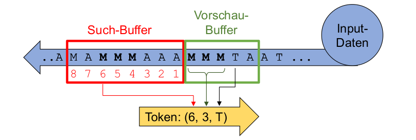
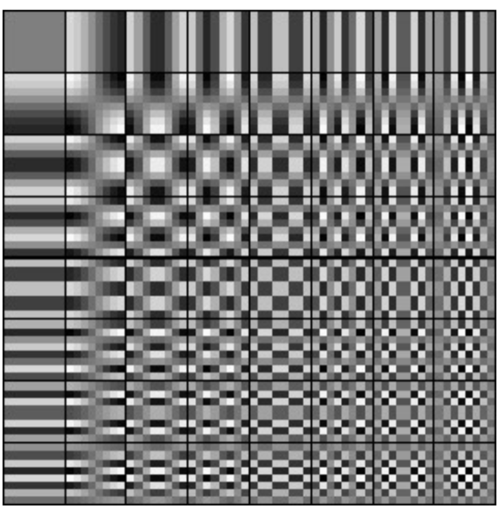

# INCO Summary - 20.01.2022

[TOC]

## Kombinatorische Logik

| Gatter                                                      | Name                   | Formel               |
| ----------------------------------------------------------- | ---------------------- | -------------------- |
|  | NOT-Gate               | $!A$                 |
|  | AND-Gate               | $A\&B=A\wedge B$     |
|  | NAND-Gate              | $!(A\&B)$            |
|  | OR-Gate                | $A\#B=A\vee B$       |
|  | NOR-Gate               | $!(A\#B)$            |
|  | XOR-Gate               | $A\$B$               |
|  | XNOR-Gate              | $!(A\$B)$            |
|                                                             | Disjunktive Normalform | $(A\&B)\#(C\&D)\#..$ |

$!(A\&B)=!A\#!B$ 
$A\&(B\#C)=(A\&B)\#(A\&C)$

Wenn man aus einer Wahrheitstabelle eine Formel bilden muss, kann man für jedes 1 im Output einen Ausdruck aus den Inputs bilden, welche in diesem Fall 1 ergeben. Diese Ausdrücken werden mit OR-Gates verbunden. 

## Digitaltechnik

### Addierer

**Halbaddierer** Ein Addierer, welcher nur mit 1Bit ohne Eingang-Carry-Bit umgehen kann. Aus einem Halbaddierer kann einen Volladdierer erstellt werden, welcher zusätzlich auch noch ein Übetrag der Vorheriger Addition benützen kann. Mehrere Volladdierer können hintereinander gesetzt werden und so beliebig viel stellen berechnet werden.

### Flip-Flops

Wenn an C eine "Rising-Edge" anliegt, dann wird D gelesen, gepseichert und auf Q ausgegeben, bis auf C die nächste "Rising-Edge" anliegt.

Mit Flip-Flops werden oft Sequentielle Logik gebaut. Dabei werden mehrere Flip-Flips in serie gehängt.

Beipiele:

| Bild                                                         | Erklärung                                        |
| ------------------------------------------------------------ | ------------------------------------------------ |
|   | Frequenzteiler                                   |
|   | Gesetuerter Frequenzteiler                       |
|  | Flankendeketor Erkennt Flanken bei einer st |

> **Synchronschaltung**: Eine Schaltung, welche sich nur bei einer positiven Clock-Flanke ändert (oder anderes Clocksignal).

## Zahlensystem

### Zahlen Umwandeln

$$
\begin{alignat} {6}
\text{Zu konvertieren:}12.6875\\
12 &: 2 &= 6 \text{ Rest } 0 && 0.6875 \cdot 2 &= 0.375 + 1\\
6 &: 2 &= 3 \text{ Rest } 0 && 0.375 \cdot 2 &= 0.750 + 0\\
3 &: 2 &= 1 \text{ Rest } 1&& 0.750 \cdot 2 &=0.500 + 1\\
1 &: 2 &= 0 \text{ Rest } 1&&0.500\cdot 2 &= 0 + 1\\
 \text{Ergebniss: } 1100_b&&&\hspace{2cm}&&\text{Ergebniss: }0.1011_b\\
 \text{Zusammen: } 1100.1011_b
\end{alignat}
$$

(Achtung **Reihenfolge**: bei Nicht-Kommastellen, von unten nach oben; bei Kommastellen: von oben nach unten)

### Negative Zahlen

| System          | Verfahren                                              | Beispiel                       |      |
| --------------- | ------------------------------------------------------ | ------------------------------ | ---- |
| 9er-Komplement  | Jede Ziffer von 9 abziehen                             | $0022\to 9977$                 |      |
| 10er-Komplement | Jede Ziffer von 9 abziehen und das Result +1 rechnen   | $0022 \to 9977 \to 9978$       |      |
| 1er-Komplement  | Jede Ziffer von 1 abziehen                             | $0011_b \to 1100_b$            |      |
| 2er-Kompelemnt  | Jede Ziffer von 1 abziehen und das Resultat +1 rechnen | $0011_b \to 1100_b \to 1101_b$ |      |

Mit und Ohne Vorzeichen:
  

### Codes

| DEZ  | HEX  | BIN  | Dez  | Hex  | Bin  | DEZ  | HEX  | BIN  |
| ---- | ---- | ---- | ---- | ---- | ---- | ---- | ---- | ---- |
| 0    | 0    | 0000 | 6    | 6    | 0110 | 12   | C    | 1100 |
| 1    | 1    | 0001 | 7    | 7    | 0111 | 13   | D    | 1101 |
| 2    | 2    | 0010 | 8    | 8    | 1000 | 14   | E    | 1110 |
| 3    | 3    | 0011 | 9    | 9    | 1001 | 15   | F    | 1111 |
| 4    | 4    | 0100 | 10   | A    | 1010 |      |      |      |
| 5    | 5    | 0101 | 11   | B    | 1011 |      |      |      |
|      |      |      |      |      |      |      |      |      |

#### Gray Code

Ein Code, welcher für Schleifkontakte beützt wird und es ändert sich maximal 1 Bit für benachbarte Codewörter. 

#### ASCII Code

#### UTF-8

| Unicode-Bereicht      | Utf-8 Codierung                     | Anzahl Code-Bits |
| --------------------- | ----------------------------------- | ---------------- |
| 0000'0000 - 0000'007F | 0xxxxxxx                            | 7                |
| 0000'0080-0000'07FF   | 110xxxxx 10xxxxxx                   | 11 (5 + 1*6)     |
| 0000'0800-0000'FFFF   | 1110xxxx 10xxxxxx 10xxxxxx          | 16 (4 + 2*6)     |
| 0001'0000-0010'FFFF   | 11110xxx 10xxxxxx 10xxxxxx 10xxxxxx | 21 (3 + 3*6)     |

### Endiannes

| Name          | Beschreibung                                   | Darstellung      |
| ------------- | ---------------------------------------------- | ---------------- |
| Little Endian | Das niederstwertige Byte wird zuerst geschickt | FEDCBA9 87654321 |
| Big Endian    | Das höchstwertige Byte wird zuerst geschickt   | 87654321 FEDCBA9 |

## Informationstheorie

Discrete Memoryless Source (DMS) gibt einzelne unabhängige Nachrichten aus. Ein Beispiel wäre einen Würfel.

| Formel                                                       | Erklärung                                              |
| ------------------------------------------------------------ | ------------------------------------------------------ |
| $I(x_n)=\log_2(\frac 1 {P(x_n)}) [Bits]$                     | $I$ ist der Informationsgehalt von der Nachricht $x_n$ |
| $H(X)=\sum^{N-1}_{n=0}P(x_n)\cdot \log_2(\frac 1 {P(x_n)}) [Bit/Symbol]$ | $H$ ist die Entropie der Quelle $X$                    |

## Quellenencoding

| Formel/Wort                                        | Erklärung                                                |
| -------------------------------------------------- | -------------------------------------------------------- |
| Codwortlänge $l_n$                                 | Die Anzahl Bits eines Codewortes                         |
| $L=\sum^{N-1}_{n=0} P(x_n)\cdot l_n [Bits/Symbol]$ | Die Codewortlänge $L$ einer Quelle                       |
| $R(X)=L(X)-H(X) [Bits/Symbol]$                     | Wie viele Bits pro Symbol in einer Quelle redundant sind |
| **Kompresionsrate!!!**                             |                                                          |

### Laufenlängen Encoding

Anstatt "AAAABDEFGG" speichert man "B04A B01B DEFGG". Hier wurde B als Token genutzt, da es am seltesten vorkommt.  Ebenfalls wurde der Zähler auf eine zweistellige Zahl festgelegt. 

Bei Schwarzweiss Bilder kann zwischen Schwarz und Weiss gewechselt weden (10, 5, 3), wären 10 schwarze Pixel, 5 weisse Pixel, gefolgt von 3 schwarzen Pixeln.

### Huffman Codes

Codes mit dem Huffmanverfahren sind automatisch präfrixfrei und optimal (es gibt keinen besseren präfixfreien Code)

Folgendes ist das Vorgehen:

1. Ordne alle Symbole nach aufsteigenen Auftretenswahrscheinlichkeiten auf einer Zeile. Dies sind die Blätter
2. Notiere unter jedes Blatt seine Wahrscheinlichkeit
3. Schliesse die beiden Blätter mit der kleinsten Wahrscheinlichekit an einer gemeinsamen Astgabel an und ordne dem Ast die Summe der Wahrscheinlichkeiten zu
4. Wiederhole Schritt 2 es nur noch ein Stamm gibt
5. Jedem Ast wird nun ein eine 0, wenn man links geht und eine 1 wenn man rechts geht, zugewiessen
6. Die Pfade zu allen Blätter aufschreiben. Das ist der Huffmancode

## LZ77 & LZW

Wenn keine Sequenz gefunden wird, wird der Token `(0, 0, T)`, wobei `T` der nächste Buchstabe ist.

**LZW**: Die längste Zeichenkette im Wörterbuch für die nächsten Zeichen finden und ein neuen Wörterbucheintrag erstellen, mit dem aktuellen Token + das nächste Zeichen.

Empfangener Token ausgeben und im Wörterbuch eintragen mit einem Blank am Ende. Beim nächsten Token wird die Blank des letzten Wörterbuch ergänzt

## JPEG

YCrCb (Y=Helligkeit, Cb=Blau Anteil, Cr=Rot Anteil)

$\begin{bmatrix} Y \\ C_B \\ C_R \end{bmatrix} = \begin{bmatrix}0.299 & 0.587 & 0.114\\ -0.1687 & -0.3313 & 0.5\\ 0.5 & -0.4187 & -0.0813\end{bmatrix} \cdot \begin{bmatrix} R\\G\\B \end{bmatrix} + \begin{bmatrix} 0 \\ 128 \\ 128 \end{bmatrix}$

$\begin{bmatrix} R \\ G \\ B \end{bmatrix} = \begin{bmatrix}1 & 0 & 1.402\\ 1 & -0.34414 & -0.71414\\ 1 & 1.772 & 0\end{bmatrix} \cdot \begin{bmatrix} Y\\C_B - 128\\C_R - 128\end{bmatrix}$

Nur die Farbkanäle werden "gedownsamplet", der Helligkeitskanal bleibt bei der vollen Auflösung.

 
$$
F_{vu}=\frac 1 4 C_u C_v \sum^7_{x=0}\sum^7_{y=0}B_{yx} \cos(\frac {(2x+1)u\pi} {16})\cos(\frac{(2y+1)v\pi} {16})\\
B_{yx}=\frac 1 4 \sum^7_{u=0}\sum^7_{v=0}C_uC_vF_{vu}\cos(\frac{(2x+1)u\pi}{16})\cos(\frac{(2y+1)v\pi}{16})
$$

## Audiocodierung

Pro Verdoppelung in Schalldruck, nimmt es 6.0206dB zu: $L=20\cdot log_{10}(\frac p {p_0})$  ($p$=Schalldruck; $p_0$=Bezugsschalldruck)

$f_{abtast} > 2\cdot f_{max}$

**Um jede erhöhung um 1 Bit nimmt das Rauschen um 6dB ab**

**PCM**: 

* Absolut: Jeder Wert wird als absoluter Wert gespeichert
* Differential-PCM (DPCM): Es werden die Differenzen gespeichert
* Adaptive Differenztial-PCM (ADPCM): Es wird die Differenz der Differenz gespeichert.

## Kanalcodierung

$\varepsilon$ (Epsilon) ist die Wahrscheinlichkeit, wie oft ein Fehlerauftritt (Bit Error Ratio = BER)
Coderate: $R=\frac{K}{N}$ $K$=Informationsbits; $N$=Totale Bits

KanalKapazität: $C_{BSC}(\varepsilon)=1-H(\varepsilon)=1-(\varepsilon \cdot log_2 \frac 1 \varepsilon + (1-\varepsilon )\cdot log_2 \frac 1 {1 - \varepsilon}) [Bits/Bits]$

$P_{F,N}=\begin{pmatrix}N \\ F\end{pmatrix} \cdot \varepsilon^F \cdot (1-\varepsilon)^{N-F}$ (N=Länge des Block-Codes, F=Anzahl Fehler, $\varepsilon$ =Bit Error Ratio des Kanales). Rechnet die Wahrscheinlichkeit aus, dass $F$ Fehler bei einem $N$ langem Block-Code auftreten

$P_{\le1,N}=\sum^1_{t=0}\begin{pmatrix}N \\ t\end{pmatrix} \cdot \varepsilon^t \cdot (1-\varepsilon)^{N-t}$ Die Wahrscheinlichkeit, dass ein Codewort korrekt übertragen wurde

## Fehlererkennung

* Backward Error Correction: Fehler kann erkennt werden und die Daten neuangefordert werden
* Forward Error Correction: Die Fehler können erkennt und zu einem gewissen Punkt korrigiert werden

**Blockcodes**:

* Systematischer Block-Code: Informationsbits und Fehlerschutsbits sind klar getrennt (N=Anzahl CodeBits, K= InformationsBits)
* Linearer Block-Code: Jedes mit Jedem geXored Codewort gibt ein Codewort (jeder Code mit einer Generatormatrix ist linear)
* Zyklischer Block-Code: Rotierbar (`110` $\rightarrow$ `011`$\rightarrow$ `101` $\rightarrow$ `110`)
* Perfekter Block-Code: gleiche Hammingdistanz zwischen allen Codewörtern
* Das Hamming-Gewicht=die kleinste Anzahl `1` auf einer Linie der Generator-Matrix
  Das Hamming-Gewicht ist gleich die Hamming Distanz $d_{min}$
* Erkennbare Fehler: $d_{min}-1$ und korrigierbare Fehler: $\frac{d_{min}-1}2$

## Fehlerkorrigierende Codes

$\frac {d_{min}-1}2$ korrigierbar

Generatormatrix Bedinungen:

1. für $d_{min}=3$ muss jeder Code (ausser dem 0-Code) min. 3x`1` haben
2. Mindestens eine `1` muss in der Einheitsmatrix sein
3. Jede Pariätsmatrix-Zeile muss 2x`1` beinhalten

## CRC

Das Datenpolynom wird um die Anzahl Stellen des Generatorpolynoms verschoben und anschliessend durch das Generatorpolynom geteilt. Das Resultat wird zum Datenpolynom hinzu addiert. Dabei werden die entstandenen `0` des Datenpolynoms gefüllt. 

Der Empfänger kann den empfangenen Wert durch das Generatorpolynom teilen und muss `0` erhalten.

## Faltunscode

Die Freie Distanz $d_{free}=w_{min}$ und kann bestimmt werden, in dem der Pfad mit den wenigsten Ausgang `1` stehen (aber nicht nur `0`). Die Anzahl `1` beim Ausgang ist die minimale freie Distanz. Die Coderate $R=\frac K N = \frac{K}{2\cdot(K+m)}$, wobei $m$ die Anzahl Tail-Bits sind.

