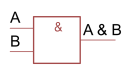

# INCO Summary - 20.01.2022

[TOC]

## Kombinatorische Logik

| Gatter                                                      | Name                   | Formel               |
| ----------------------------------------------------------- | ---------------------- | -------------------- |
|  | NOT-Gate               | $!A$                 |
|  | AND-Gate               | $A\&B=A\wedge B$     |
|  | NAND-Gate              | $!(A\&B)$            |
|  | OR-Gate                | $A\#B=A\vee B$       |
|  | NOR-Gate               | $!(A\#B)$            |
|  | XOR-Gate               | $A\$B$               |
|  | XNOR-Gate              | $!(A\$B)$            |
|                                                             | Disjunktive Normalform | $(A\&B)\#(C\&D)\#..$ |

$!(A\&B)=!A\#!B$ 
$A\&(B\#C)=(A\&B)\#(A\&C)$

Wenn man aus einer Wahrheitstabelle eine Formel bilden muss, kann man für jedes 1 im Output einen Ausdruck aus den Inputs bilden, welche in diesem Fall 1 ergeben. Diese Ausdrücken werden mit OR-Gates verbunden. 

## Digitaltechnik

### Addierer

**Halbaddierer** Ein Addierer, welcher nur mit 1Bit ohne Eingang-Carry-Bit umgehen kann. Aus einem Halbaddierer kann einen Volladdierer erstellt werden, welcher zusätzlich auch noch ein Übetrag der Vorheriger Addition benützen kann. Mehrere Volladdierer können hintereinander gesetzt werden und so beliebig viel stellen berechnet werden.

### Flip-Flops

Wenn an C eine "Rising-Edge" anliegt, dann wird D gelesen, gepseichert und auf Q ausgegeben, bis auf C die nächste "Rising-Edge" anliegt.

Mit Flip-Flops werden oft Sequentielle Logik gebaut. Dabei werden mehrere Flip-Flips in serie gehängt.

Beipiele:

| Bild                                                         | Erklärung                                        |
| ------------------------------------------------------------ | ------------------------------------------------ |
|   | Frequenzteiler                                   |
|   | Gesetuerter Frequenzteiler                       |
|  | Flankendeketor Erkennt Flanken bei einer st |

> **Synchronschaltung**: Eine Schaltung, welche sich nur bei einer positiven Clock-Flanke ändert (oder anderes Clocksignal).

## Zahlensystem

### Zahlen Umwandeln

$$
\begin{alignat} {6}
\text{Zu konvertieren:}12.6875\\
12 &: 2 &= 6 \text{ Rest } 0 && 0.6875 \cdot 2 &= 0.375 + 1\\
6 &: 2 &= 3 \text{ Rest } 0 && 0.375 \cdot 2 &= 0.750 + 0\\
3 &: 2 &= 1 \text{ Rest } 1&& 0.750 \cdot 2 &=0.500 + 1\\
1 &: 2 &= 0 \text{ Rest } 1&&0.500\cdot 2 &= 0 + 1\\
 \text{Ergebniss: } 1100_b&&&\hspace{2cm}&&\text{Ergebniss: }0.1011_b\\
 \text{Zusammen: } 1100.1011_b
\end{alignat}
$$

(Achtung **Reihenfolge**: bei Nicht-Kommastellen, von unten nach oben; bei Kommastellen: von oben nach unten)

### Negative Zahlen

| System          | Verfahren                                              | Beispiel                       |      |
| --------------- | ------------------------------------------------------ | ------------------------------ | ---- |
| 9er-Komplement  | Jede Ziffer von 9 abziehen                             | $0022\to 9977$                 |      |
| 10er-Komplement | Jede Ziffer von 9 abziehen und das Result +1 rechnen   | $0022 \to 9977 \to 9978$       |      |
| 1er-Komplement  | Jede Ziffer von 1 abziehen                             | $0011_b \to 1100_b$            |      |
| 2er-Kompelemnt  | Jede Ziffer von 1 abziehen und das Resultat +1 rechnen | $0011_b \to 1100_b \to 1101_b$ |      |

Ohne Vorzeichen: Mit Vorzeichen 

### Codes

#### Gray Code

Ein Code, welcher für Schleifkontakte beützt wird und es ändert sich maximal 1 Bit für benachbarte Codewörter. 

#### ASCII Code

#### UTF-8

| Unicode-Bereicht      | Utf-8 Codierung                     | Anzahl Code-Bits |
| --------------------- | ----------------------------------- | ---------------- |
| 0000'0000 - 0000'007F | 0xxxxxxx                            | 7                |
| 0000'0080-0000'07FF   | 110xxxxx 10xxxxxx                   | 11 (5 + 1*6)     |
| 0000'0800-0000'FFFF   | 1110xxxx 10xxxxxx 10xxxxxx          | 16 (4 + 2*6)     |
| 0001'0000-0010'FFFF   | 11110xxx 10xxxxxx 10xxxxxx 10xxxxxx | 21 (3 + 3*6)     |

### Endiannes

| Name          | Beschreibung                                   | Darstellung      |
| ------------- | ---------------------------------------------- | ---------------- |
| Little Endian | Das niederstwertige Byte wird zuerst geschickt | FEDCBA9 87654321 |
| Big Endian    | Das höchstwertige Byte wird zuerst geschickt   | 87654321 FEDCBA9 |

## Informationstheorie

Discrete Memoryless Source (DMS) gibt einzelne unabhängige Nachrichten aus. Ein Beispiel wäre einen Würfel.

| Formel                                                       | Erklärung                                              |
| ------------------------------------------------------------ | ------------------------------------------------------ |
| $I(x_n)=\log_2(\frac 1 {P(x_n)}) [Bits]$                     | $I$ ist der Informationsgehalt von der Nachricht $x_n$ |
| $H(X)=\sum^{N-1}_{n=0}P(x_n)\cdot \log_2(\frac 1 {P(x_n)}) [Bit/Symbol]$ | $H$ ist die Entropie der Quelle $X$                    |

## Quellenencoding

| Formel/Wort                                        | Erklärung                                                |
| -------------------------------------------------- | -------------------------------------------------------- |
| Codwortlänge $l_n$                                 | Die Anzahl Bits eines Codewortes                         |
| $L=\sum^{N-1}_{n=0} P(x_n)\cdot l_n [Bits/Symbol]$ | Die Codewortlänge $L$ einer Quelle                       |
| $R(X)=L(X)-H(X) [Bits/Symbol]$                     | Wie viele Bits pro Symbol in einer Quelle redundant sind |

### Laufenlängen Encoding

Anstatt "AAAABDEFGG" speichert man "B04A B01B DEFGG". Hier wurde B als Token genutzt, da es am seltesten vorkommt.  Ebenfalls wurde der Zähler auf eine zweistellige Zahl festgelegt. 

Bei Schwarzweiss Bilder kann zwischen Schwarz und Weiss gewechselt weden (10, 5, 3), wären 10 schwarze Pixel, 5 weisse Pixel, gefolgt von 3 schwarzen Pixeln.

### Huffman Codes

Codes mit dem Huffmanverfahren sind automatisch präfrixfrei und optimal (es gibt keinen besseren präfixfreien Code)

Folgendes ist das Vorgehen:

1. Ordne alle Symbole nach aufsteigenen Auftretenswahrscheinlichkeiten auf einer Zeile. Dies sind die Blätter
2. Notiere unter jedes Blatt seine Wahrscheinlichkeit
3. Schliesse die beiden Blätter mit der kleinsten Wahrscheinlichekit an einer gemeinsamen Astgabel an und ordne dem Ast die Summe der Wahrscheinlichkeiten zu
4. Wiederhole Schritt 2 es nur noch ein Stamm gibt
5. Jedem Ast wird nun ein eine 0, wenn man links geht und eine 1 wenn man rechts geht, zugewiessen
6. Die Pfade zu allen Blätter aufschreiben. Das ist der Huffmancode

## LZ77 & LZW

## JPEG

## Audiocodierung

## Kanalcodierung

## Fehlererkennung

## Fehlerkorrigierende Codes

## Faltunscode