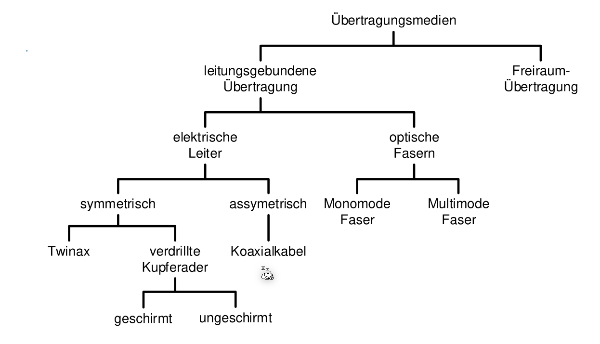
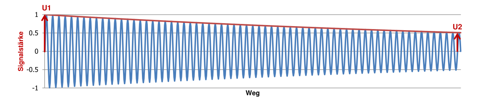
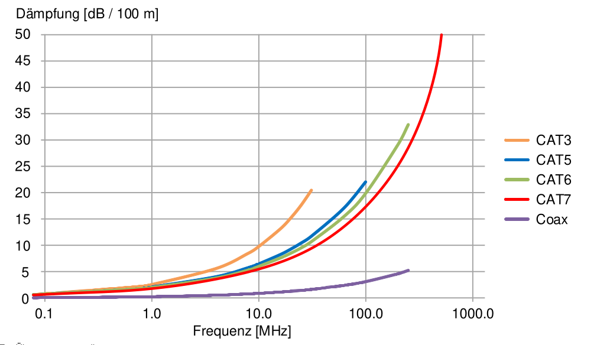
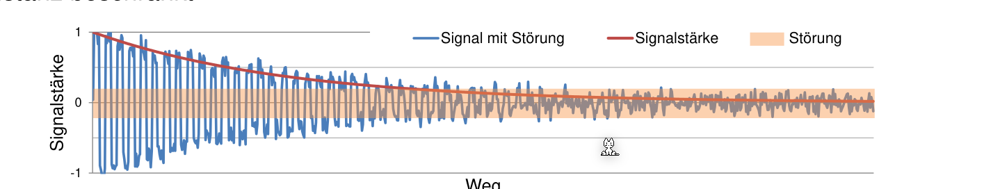
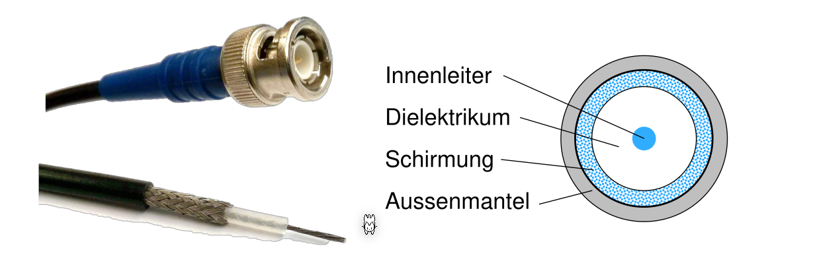
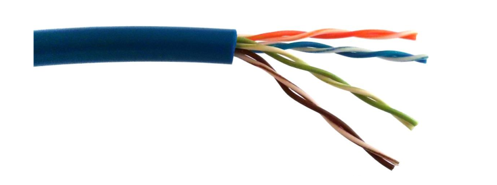

# Übertragungsmedien (Layer 1)

| Begriff               | Erklärung                                          |
| --------------------- | -------------------------------------------------- |
| Freiraum Übertragung  | Medien, wie WLAN, 5G, welche ohne Kabel übertragen |
| symmetrische Leiter   |                                                    |
| Twinax                |                                                    |
| verdrillte Kupferader |                                                    |
| assymetrisch          |                                                    |

## Physik - Ausbreitungsgeswindigkeit

Die Lichtgeschwindigkeit im Glas mit dem Brechungsindex $n=1.5$ ist: $c_{Glass}=\frac{c_0}{n}=\frac{299'792'458}{1.5}\approx200'000\frac{km} s$

In einem elektrischen Leiter ist es ebenfalls $200'000\frac{km}s$

## Signaldämpfung

Wie viel Leistung (in Dezibel) geht auf dem Weg zwischen $U_1$ und $U_2$ verloren.

Die Dämpfung ist $10\cdot ...$

### CAT-Kabel

## Signal-Noise

Nach einer gewissen Zeit nimmt die Signalstärke ab

## Störungen

Kapazitiven Effekt: Abschirmung

Induktiver Effekt: verdrillt (twisted pairs)

## Kabel-Arten

### Koaxialkabel

Ein Koaxialkabel besteht aus einem Leiter. 

### Paarsymmetrische Kabel (Twisted Pair)

Shielded Twisted Pair Kabel

#### Twisted pair und Störungen

NEXT=Near End Cross Talk

### Glassfaser

### Stufenfaser

Kann mit einfachen Leuchtdioten angesprochen werden, hat aber viel Dispersion und Delay Skew (siehe Folien wegen Delay Skew)

### Gradientenfasern

Der Übergang zwischen Glaskern und Schirmung ist ein Verlauf. 

### Monomode-Faser

Es werden Laser-Dioden benötigt, da die Faser zu dünn ist für eine Lichtdiode. Teuerer