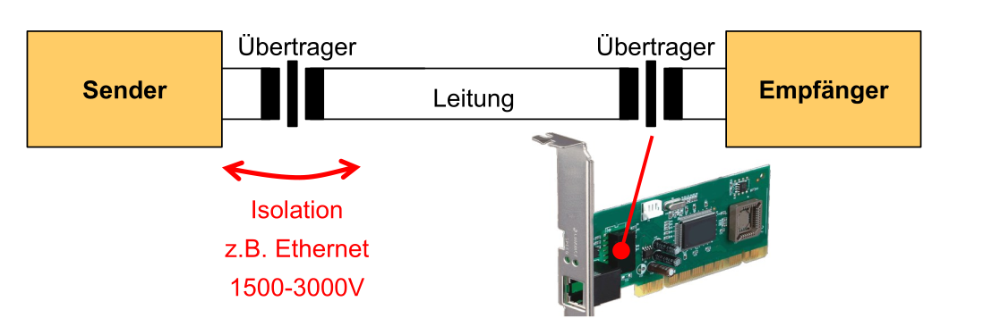
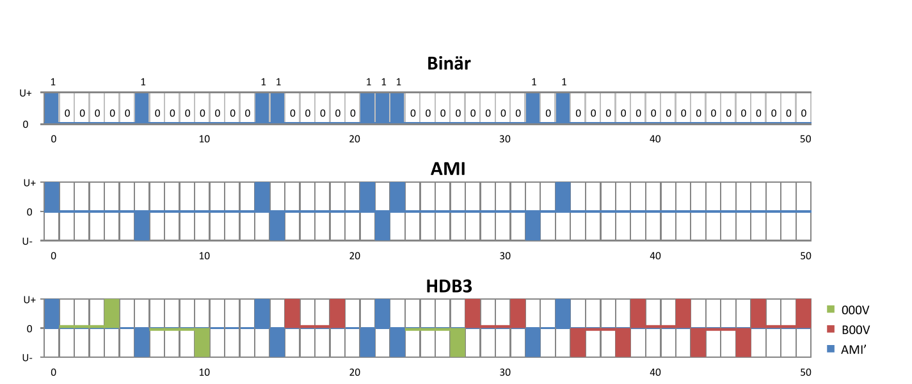
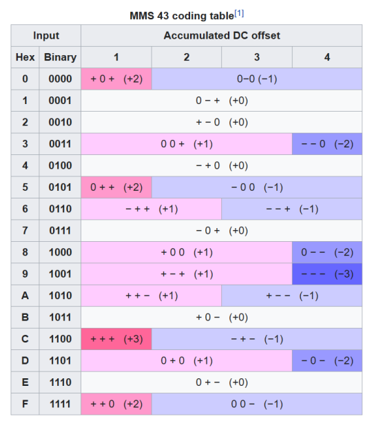
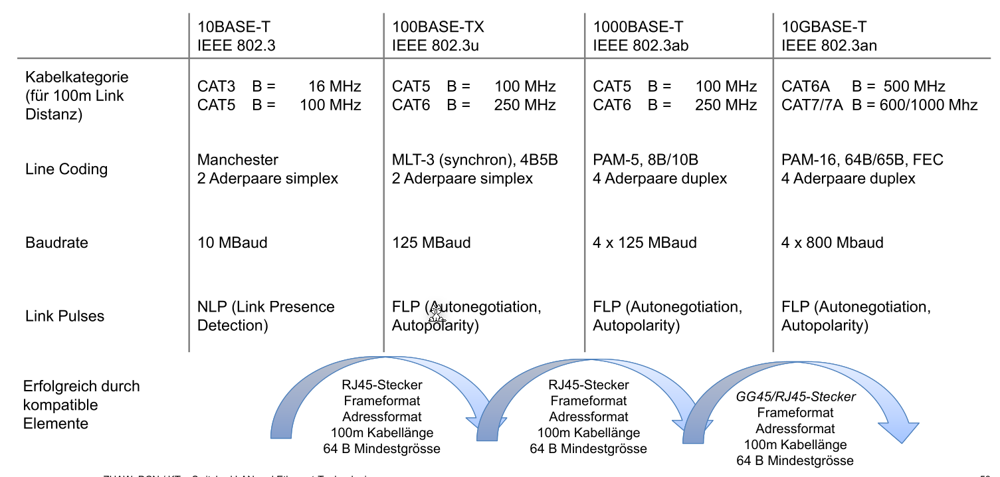
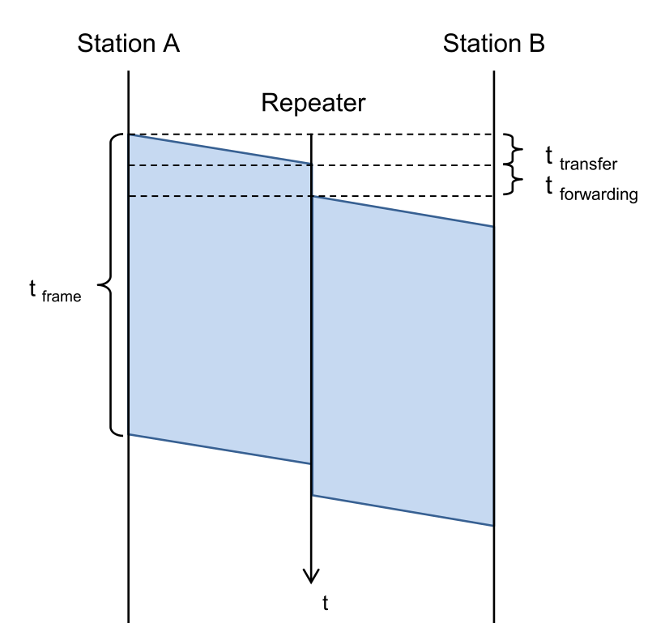
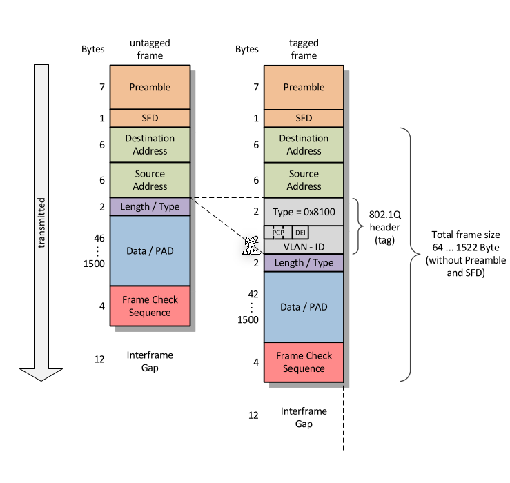
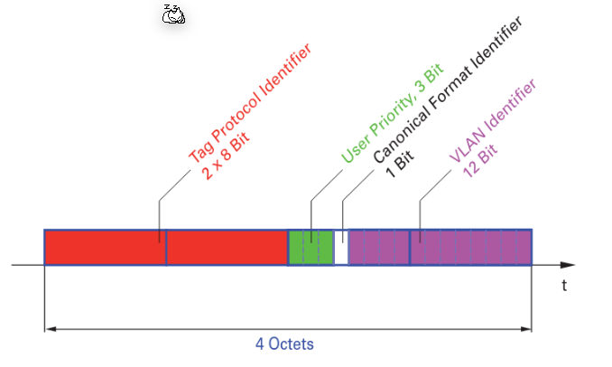

# Data Link Layer (Layer 2)

## Layer 2 Protokolle

* HDLC
* PPP
* X.25 / Frame Relay
* MPLS
* ATM

## Übertragungsverfahren

Daten könen seriell oder parallel übertragen werden. Bei der parallelen übertragungen werden mehrere Bits gleichzeitig übertragen. Dies funktioniert nur auf kurze Distanze, da sonst die Toleranzen zu gross wären.

Bei der seriellen Übertragen werden die Bits nacheinander übertragen. Hier sind sehr viel höhrere Datenraten auf längere Distanzen möglich, da nicht mehrere Leitungen synchronisiert werden müssen.

Die serielle Übertragung kann noch weiter in synchrone und asynchrone serielle Übertragung unterteilt werden. Bei der asynchronen Verbindung wird kein Clock Signal übertragen. Die Clock des Empfänger und Senders sind daher nicht zusammen. Damit es trotzdem funktioniert, wird die Bitrate, die Start- und Stop-Bits abemacht. Für jedes Zeichen wird ein Startbit gesendet und zum Abschluss ein Stopbit. Zu erst wird das niederwertigste (LSB = Least Significant Bit) übertragen und zu letzt das höchstwertige (MSB Most Significant Bit). **(wirklich?)**

Der Emfpänger tastet sehr schnell ab, bis das Startbit findet. Danach wird in der abgemachten Bitrate abgetastet. Der Takt darf nicht mehr als die halbe Bitzeit T abweichen, da sonst das falsche Bit gelesen würde werden.

Dagegen steht die synchrone Übertragung. Bei dieser sendet der Sender ein Takt mit den Daten mit. Daher werden auch keine Start und Stop-Bits benötigt.

## Gleichspannungsfreiheit

Der Sender und Empfänger sind galvanisch (elektrisch nicht direkt verbunden) getrennt. Dies schützt die Geräte davon, dass Falls beim anderen Gerät ein Blitz einschlägt oder es anderweitig eine Überspannung gibt.

Da dies mit Capacitor gearbeitet wird, möchte man, dass das Signal nicht immer bei 1 oder bei 0 ist, sondern möglichst oft wechselt. Dies nennt sich gleichspannungsfrei. Dafür kann z.B. eine Codierung, wie AMI, HDB3 oder PAM3 verwendet werden.

## Taktrückgewinnung

Das Ziel der Taktrückgewinnung ist, ein Taktsignal aus dem normalen Datenstrom zu lesen. Dafür darf der Datenstrom aber nicht zu lange nur `1` oder nur `0` senden, da sonst der Empfänger kein Takt daraus lesen kann.

## AMI-Codierung

Ein `0` wird in Ami als `0` encodiert. Ein `1` wird alternativ als `U+` und `U-` gesendet. D

Daher ist die Taktrückgewinnung schwierig, wenn länger `0` gesendet werden. Daher ist AMI nicht für die Taktrückgewinnung geignet. Es wird anstatt HDB3 benützt.

Bei der HDB3-Encoding wird zusätzlich nach `000` eine `1` gesendet. Diese `1` hat den selben Pegel, wie die letzte `1`, also entweder `U+` oder `U-`. Da normalerweise immer zwischen `U+` und `U-` gewechselt wird, kann der Empfänger dieses Bit korrekt interpretieren. Bei langen Sequenzen von `0` würde dabei die Gleichspannungsfreiheit verletzt werden, daher wird wenn wenn weniger als zwei `1` seit dem letzten `000V` gesendet wurden, anstatt `000V` ein `B00V` gesendet. Dabei verhaltet sich das `B` wie ein normales Datenbit und wechselt zwischen `U+` und `U-` hin und her.

## PAM3 (4B3T-Codierung)

In dieser werden 4Bit Daten zu 3 tenäre Symbolen (Ein Symbol mit 3 Werten) übersetzt

### Datenübertragung

Zehnerpotenzen:
kBit = 103 Bit
kbps = 103 bps
MBit = 106 Bit
Mbps = 106 bps
GBit = 109 Bit
Gbps = 109 bps

### Baud-Rate

Die Anzahl Symbole pro Sekunde. Ein Symbol ist dabei ein Zustand im Datenstrom

### Bitrate (Nyquist)

$f_s\le2B$, dabei ist $f_s$ die Symbolrate/Baudrate und $B$ die Bandbreite des Kanals in Hz.

Diese Formel besagt, dass die Symbolrate in Baud (oder Nyquist Rate) doppelt so gross, wie die Frequenz des Übertragungskanal ist.

### Maximale Bitrate (Hartley's Gesetzt)

Die Bitrate $R [bit/s] \le 2B [Hz] \cdot \log_2(M)$ 

wobei $M$ folgendermassen definiert ist: $M=1+\frac A {\Delta V}$

**TODO**

### Kanalkapazität (Theorem von Shanon)

$C_s=B\cdot \log_2(1+\frac S N)$, wo bei $C_s$ die Kanalkapazität, $B$ die Baudrate, $S$ die Signal-Aplitude und $N$ die Noise-Aplitude ist. $\frac S N$ ist die Signal-to-Noise Ratio

## Synchrone Übertragung

Bei der synchronen Übertragung wird immer gesendet, auch wenn keine Daten übertragen werden. In diesem Fall werden konstant Flags übertragen. Folgeadermassen wird eine Möglichkeit aufgezeichnet, wie dies gestaltet werden könnte.

 

Ein Flag ist der Start bzw. Ende eines Datenrahmens. Da ein Flag `01111110` ist, kann dies nicht im Datenblock vorkommen. Daher wird nach fünf `1` eine `0` eingesetzt. Diese `0` wird vom Empfänger verworfen. Dies wird auch Bit-Stopfen (engl. "Bit-Stuffing")

## Asynchrone Übertrage/Ethernet

## Wieso immer noch Ethernet?

Alle Ethernet-Standard benützten den RJ45 Stecker von 10MBit/s bis zu 10Gbit/s. Diese Rückwarts-Kompatibilität ist enorm wertvoll.

## Ethernet-Standard

Das prominentiste Beispiel der asynchronen Übertragung ist Ethernet, daher wird die asynchrone Übertragung an Ethernet vorgestellt.

### Preamble

Die PreaWiesmble werden 7 Bytes, welche aus Abwechslungsweise `0` und `1` bestehen. Das 8 Byte hat die Form `10101011`.

### Bytes korrekt lesen

Daten werden Umgekehrt gesendet (Zuerst das LSB und dann das MSB). Wenn man es von Hand lesen möchte, müssen die Bits umgedreht werden.

### Frame-Grösse

Da der Overhead fix ist, wird der Overhead eine kleinere Prozentanteil, je mehr Daten gesendet werden.

Auf der anderen Seite, je grösser der Frame, desto höher die Wahrscheinlichkeit, dass ein Fehler bei der Übertragung auftritt. Wenn ein Medium von mehreren Nutzer genutzt wird, müssen die anderen Nutzer lange warten, wenn grosse Frames übertragen werden.

### Sende Zeit

Es braucht die Zeit $t_{frame}>2\cdot(n\cdot t_{transfer}+ n\cdot t_{forwarding})$ und $t_{frame}>2\cdot t_{transfer}$

Dabei ist $t_{frame}=\frac{Framesize_{min}}{Bitrate}$ und $t_{transfer}=\frac{d_{max}}{c_{line}}$

Aus dem allen geht herfor: $\frac{Framesize_{min}}{Bitrate}>2\cdot \frac{d_{max}}{c_{line}}$

Für die Framerate gilt: $Framerate = \frac{Preabmle + SFD+DestinationAddress + SourceAddress+LT+Data+FCS+InterFrameGap}{Bitrate}$ 

Die Interfrace Gap muss nur dazu gerechnet werden, wenn die Framerate berechet wird.

### Collission Domain und Broadcasat Domain

## Repeater vs L2-Switch/Bridge

- wegen kollision, können nicht beliebig Repeater hintereinander gehänkt werden. Es verkürzt die Collision 
- Der Switch verkürzt die Collision Domain

## Bit-/Rahmenfehlerwahrscheinlichkeit

$$
P_{Erfolg}=(1-p_e)\\
P_{Erfolg,Frame}=(1-p_e)^N\\
P_{Fehler,Frame}=1-(1-p_e)^N
$$

## Kollision bei Shared-Medium

## Autonegotiation

Dieses Protokoll wird ab 100BASE-T unterstützt und schaut, dass der Empfänger und Sender die selbe Geschwindigkeit unterstützt.

**TODO**

## VLAN

Mit einem VLAN können seperate virtuelle Gruppen in einem LAN erstellen. Die Kommunikation zwischen VLANs sind meistens eingeschränkt oder nicht möglich.

### VLAN-Tag

Damit dies auch in einem Netzwerk mit mehreren Switches möglich ist, wird in VLAN-Tag im Ethernet-Frame eingeführt.

Dieser Tag besteht aus:

* **Tag Protocol Identifier**:
* **User Priority**: (3 Bit),
* **Cannonical Format Identifier**
* **VLAN-Identifier**: (12-Bit)

