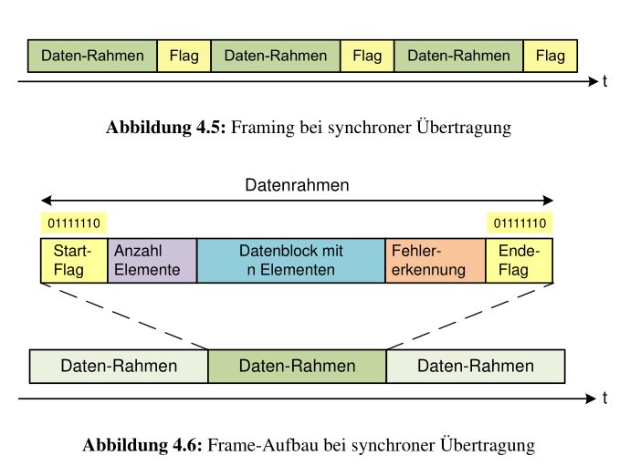
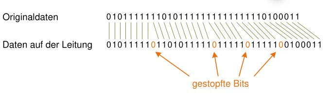
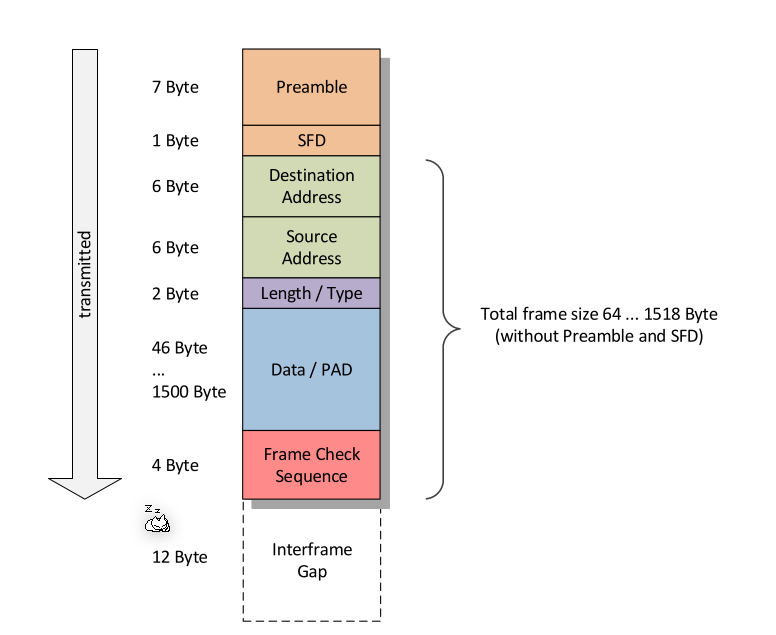
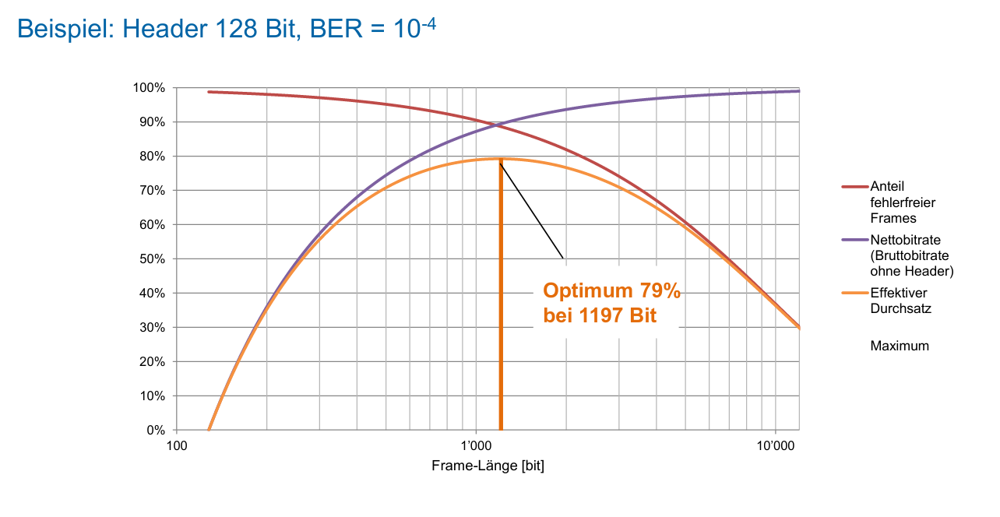

# Data Link Layer

## Layer 2 Protokolle

* HDLC
* PPP
* X.25 / Frame Relay
* MPLS
* ATM

## Synchrone Übertragung

Bei der synchronen Übertragung wird immer gesendet, auch wenn keine Daten übertragen werden. In diesem Fall werden konstant Flags übertragen. Folgeadermassen wird eine Möglichkeit aufgezeichnet, wie dies gestaltet werden könnte.

 

Ein Flag ist der Start bzw. Ende eines Datenrahmens. Da ein Flag `01111110` ist, kann dies nicht im Datenblock vorkommen. Daher wird nach fünf `1` eine `0` eingesetzt. Diese `0` wird vom Empfänger verworfen. Dies wird auch Bit-Stopfen (engl. "Bit-Stuffing")

## Asynchrone Übertrage/Ethernet

Das prominentiste Beispiel der asynchronen Übertragung ist Ethernet, daher wird die asynchrone Übertragung an Ethernet vorgestellt.

### Preamble

Die Preamble werden 7 Bytes, welche aus Abwechslungsweise `0` und `1` bestehen. Das 8 Byte hat die Form `10101011`.

### Bytes korrekt lesen

Daten werden Umgekehrt gesendet (Zuerst das LSB und dann das MSB). Wenn man es von Hand lesen möchte, müssen die Bits umgedreht werden.

### Frame-Grösse

Da der Overhead fix ist, wird der Overhead eine kleinere Prozentanteil, je mehr Daten gesendet werden.

Auf der anderen Seite, je grösser der Frame, desto höher die Wahrscheinlichkeit, dass ein Fehler bei der Übertragung auftritt. Wenn ein Medium von mehreren Nutzer genutzt wird, müssen die anderen Nutzer lange warten, wenn grosse Frames übertragen werden.

### Bit-/Rahmenfehlerwahrscheinlichkeit

$$
P_{Erfolg}=(1-p_e)\\
P_{Erfolg,Frame}=(1-p_e)^N\\
P_{Fehler,Frame}=1-(1-p_e)^N
$$

### Kollision bei Shared-Medium