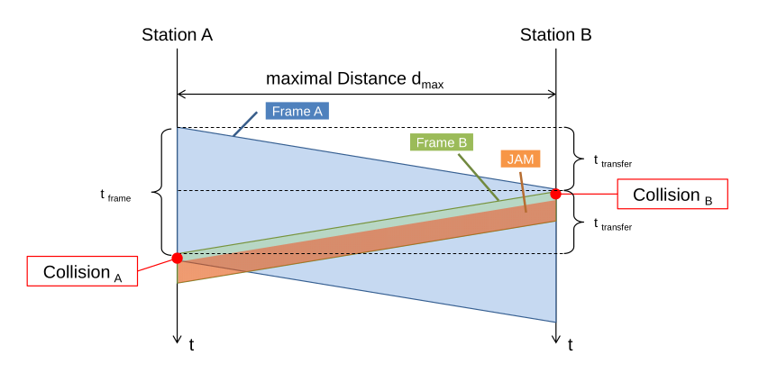

# Data Link Layer (Layer 2)

## Layer 2 Protokolle

* HDLC
* PPP
* X.25 / Frame Relay
* MPLS
* ATM

## Synchrone Übertragung

Bei der synchronen Übertragung wird immer gesendet, auch wenn keine Daten übertragen werden. In diesem Fall werden konstant Flags übertragen. Folgeadermassen wird eine Möglichkeit aufgezeichnet, wie dies gestaltet werden könnte.

 

Ein Flag ist der Start bzw. Ende eines Datenrahmens. Da ein Flag `01111110` ist, kann dies nicht im Datenblock vorkommen. Daher wird nach fünf `1` eine `0` eingesetzt. Diese `0` wird vom Empfänger verworfen. Dies wird auch Bit-Stopfen (engl. "Bit-Stuffing")

## Asynchrone Übertrage/Ethernet

### Wieso immer noch Ethernet?

Alle Ethernet-Standard benützten den RJ45 Stecker von 10MBit/s bis zu 10Gbit/s. Diese Rückwarts-Kompatibilität ist enorm wertvoll.

### Ethernet-Standard

Das prominentiste Beispiel der asynchronen Übertragung ist Ethernet, daher wird die asynchrone Übertragung an Ethernet vorgestellt.

### Preamble

Die PreaWiesmble werden 7 Bytes, welche aus Abwechslungsweise `0` und `1` bestehen. Das 8 Byte hat die Form `10101011`.

### Bytes korrekt lesen

Daten werden Umgekehrt gesendet (Zuerst das LSB und dann das MSB). Wenn man es von Hand lesen möchte, müssen die Bits umgedreht werden.

### Frame-Grösse

Da der Overhead fix ist, wird der Overhead eine kleinere Prozentanteil, je mehr Daten gesendet werden.

Auf der anderen Seite, je grösser der Frame, desto höher die Wahrscheinlichkeit, dass ein Fehler bei der Übertragung auftritt. Wenn ein Medium von mehreren Nutzer genutzt wird, müssen die anderen Nutzer lange warten, wenn grosse Frames übertragen werden.

### Sende Zeit

Es braucht die Zeit $t_{frame}>2\cdot(n\cdot t_{transfer}+ n\cdot t_{forwarding})$ und $t_{frame}>2\cdot t_{transfer}$

Dabei ist $t_{frame}=\frac{Framesize_{min}}{Bitrate}$ und $t_{transfer}=\frac{d_{max}}{c_{line}}$

Aus dem allen geht herfor: $\frac{Framesize_{min}}{Bitrate}>2\cdot \frac{d_{max}}{c_{line}}$

Für die Framerate gilt: $Framerate = \frac{Preabmle + SFD+DestinationAddress + SourceAddress+LT+Data+FCS+InterFrameGap}{Bitrate}$ 

Die Interfrace Gap muss nur dazu gerechnet werden, wenn die Framerate berechet wird.

### Collission Domain und Broadcasat Domain

### Repeater vs L2-Switch/Bridge

- wegen kollision, können nicht beliebig Repeater hintereinander gehänkt werden. Es verkürzt die Collision 
- Der Switch verkürzt die Collision Domain

### Bit-/Rahmenfehlerwahrscheinlichkeit

$$
P_{Erfolg}=(1-p_e)\\
P_{Erfolg,Frame}=(1-p_e)^N\\
P_{Fehler,Frame}=1-(1-p_e)^N
$$

### Kollision bei Shared-Medium

### Autonegotiation

Dieses Protokoll wird ab 100BASE-T unterstützt und schaut, dass der Empfänger und Sender die selbe Geschwindigkeit unterstützt.

**TODO**

## VLAN

Mit einem VLAN können seperate virtuelle Gruppen in einem LAN erstellen. Die Kommunikation zwischen VLANs sind meistens eingeschränkt oder nicht möglich.

### VLAN-Tag

Damit dies auch in einem Netzwerk mit mehreren Switches möglich ist, wird in VLAN-Tag im Ethernet-Frame eingeführt.

Dieser Tag besteht aus:

* **Tag Protocol Identifier**:
* **User Priority**: (3 Bit),
* **Cannonical Format Identifier**
* **VLAN-Identifier**: (12-Bit)

