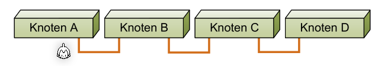
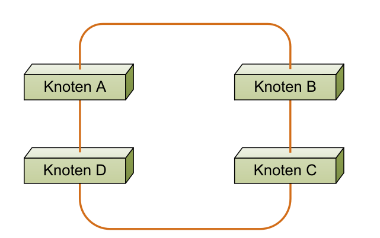
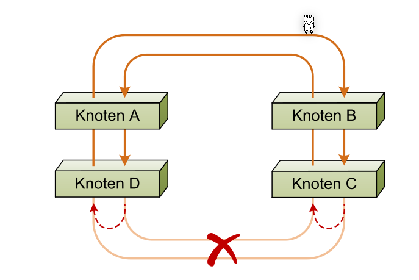
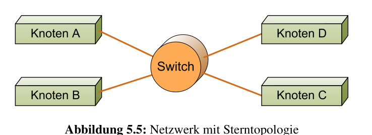
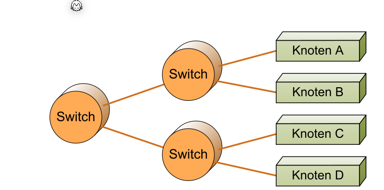
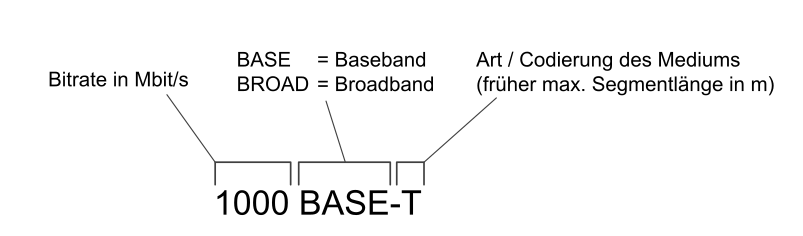
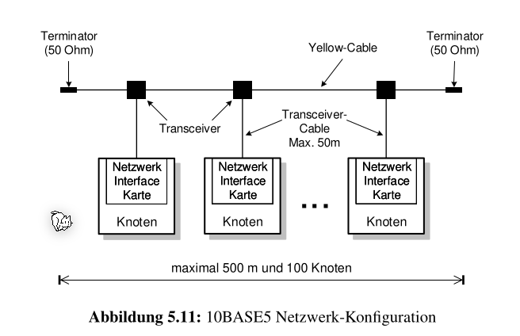

# LAN

LAN steht für Local Area Network ist ein räumliches begrenztes Netzwer.

## Topologien

### Bus-Topologie

Alle Geräte sind direkt am Übertragungsmedium angeschlossen und werden nur aktiv, wenn sie senden.

### Linien-Topologie

Bei der Linien-Topologie sind die jeweils benachbarten Knoten miteinander verbunden. Wenn eine Nachricht von A zu D  geschickt wird, muss sie von B und C weiter geleitet werden. 

Diese Topologie ist zudem recht anfällig, da wenn ein Knoten aussteigt, die Verbindung unterbrochen ist.

### Ring-Topologie

Eine Ring-Topologie wurde eine Linien-Topologie an den Enden verbunden. Dies verbessert die Redundanz, da bei einem Ausfall, jeder Knoten von der anderen Seite erreichbar ist. Um die Redundanz noch weiter zu erhöhen, wird manchmal auch eine doppelte Ring-Topologie verwendet.

Bei der Ring-Topologie muss sichergestellt werden, dass sich eine Nachricht nicht im Kreis dreht.

### Stern-Topologie

Bei der Stern-Topologie geht alles über einen Switch oder Hub. Dies hat zur folge, dass ein Knoten aussteigen kann ohne, dass das ganze Netzwerk lahm gelegt wird. Allerdings wenn der Switch oder Hub aussteigt, kann nicht mehr kommuniziert werden.

### Baum-Topologie

Die Baum-Topologie kann aus mehreren Stern-Topologien hergestellt werden.

## Übertragungsarten

| Art       | Erklärung                                                    |
| --------- | ------------------------------------------------------------ |
| Unicast   | Ein Paket hat wird genau an ein Ziel gesendet. Das Paket wird mit einer Adresse ausgestattet, so dass es am Ziel sicher ankommt. |
| Broadcast | Das Paket wird an alle Knoten im Netzwerk gesendet. Das Paket wird mit einer Broadcast-Adresse ausgestattet |
| Multicast | Das Paket wird an eine Gruppen von Knoten gesendet.          |

## IEEE Namensgebung

* 1000BASE-T = Ethernet mit Basisband-Kanalcodierung mit einer Bitrate von 1Gbit/s mit Twisted-Pairs
* 10BASE5= 10Mbit/s Basisband-Ethernet mit max 500m Segmentenlänge

## Manchester-Codierung

## Manchester-CodierungShared-Ethernet

Das ursprüngliche Ethernet wurde für eine Bus-Topologie entwickelt. Dabei wurden Koaxial-Kabel verwendet, welche angebohrt wurden (Daher auch der Name Tick-Wire-Ethernet)

## 