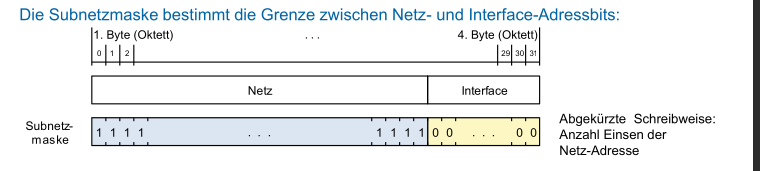
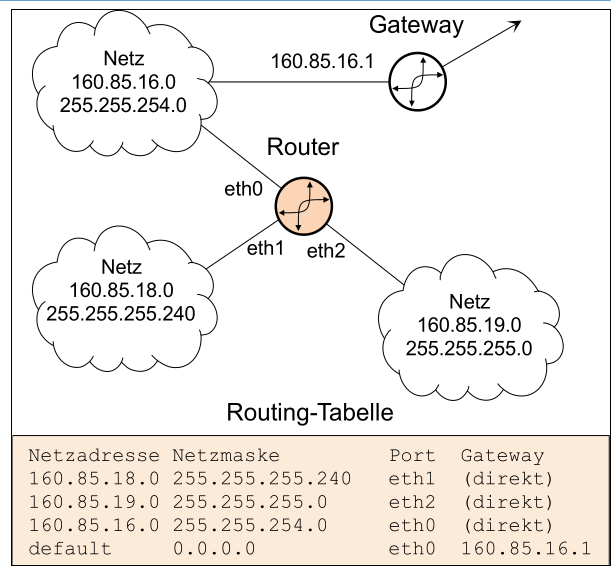
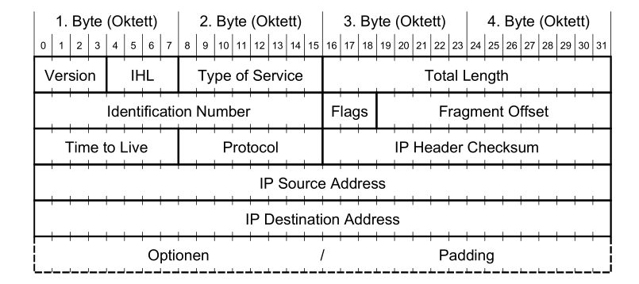

# Network Layer (Layer 3)

## IP-Adressen

Mit hilfe von IP-Adressen routen Router die Pakete umher. IP-Adressen sind hirarchisch aufgebaut.

### Classful vs Classless

| Klassen | Adressbereich               | Anzahl Netze | Interfaces pro netz |
| ------- | --------------------------- | ------------ | ------------------- |
| A       | 1.0.0.0 - 127.255.255.255   | 127          | 16'777'214          |
| B       | 128.0.0.0 - 191.255.255.255 | 16'384       | 65'534              |
| C       | 192.0.0.0-223.255.255.255   | 2'097'152    | 254                 |

Die Klasse D (224.0.0.0 - 239.255.255.255) sind für Multicast-Adressen vorgesehen. Dies ist ein separates Protokoll mit separaten Adressierung.

Die Klasse E (224.0.0.0 - 255.255.255.255) ist reserviert für zukünftige Netzwerke.

**TODO: Private Netzwerke**

### Netmask

Die IP-Adresse ist in zwei Teile aufgeteilt: Die Netzadresse und Host-Adressen. Die Netzmaske unterteilt eine IP-Adresse in die Netzadresse und Hostadresse.

Alternativ schreibweisse ist "/24" für eine Subnetzmaske mit 24 `1` und 8 `0`. Daher gibt es $(32-24)^2-2=255-2=253$ addressierbare Hosts. Es werden noch zwei Adressen abgezogen, da zwei Adressen für die Broadcast- und Netzwerk-Adresse benötigt werden.

## Routing

Dank routing weiss ein Router wohin ein Paket gesendet werden muss. Dies wird anhand der IP-Adresse gemacht.

### Routing-Tabelle

In der Routing-Tabelle steht, über welcher Port welches Netzwerk ansprechbar ist. Darin steht der Port, an dem das Netzwerk erreichbar ist, die Netzwerkadresse und Netzmaske. Zusätzlich gibt es ein Default-Gateway. Über diesen werden alle Pakete weitergeleitet, welche zu keinem anderen Netzwerk passt. Es kann für ein Netzwerk mehrere Einträge geben. **TODO**

Die Routing-Tabelle ist geordnet nach der Netzmaske. Dabei ist das kleinste Netzwerk zu oberst (die höchste Subnetz). Die Routing-Tabelle wird von oben nach unten durch geschafft. Zum ersten Hit wird das Paket gesendet.

## Flaches- vs Hirarchisches- Routing

## Internet Protokoll (IP) Format

Das folgende Diagramm zeigt der Header des IP-Protokolles:

**TODO**

## Addressauflösung

**TODO**

### Address Resolution Protocoll (ARP)

## Fragmentieren und Reassembly

Fragmentieren wird gebraucht, wenn ein Paket über eine Leitung geschickt werden soll, welches weniger **TODO**
