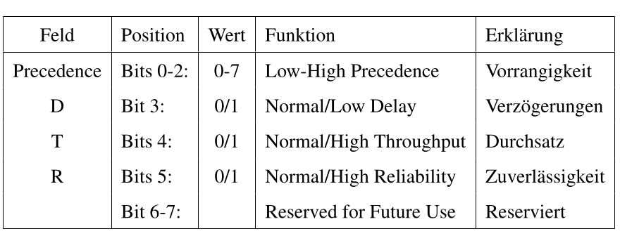
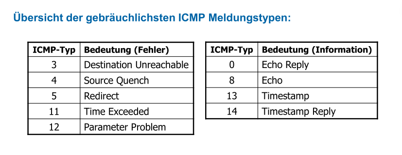
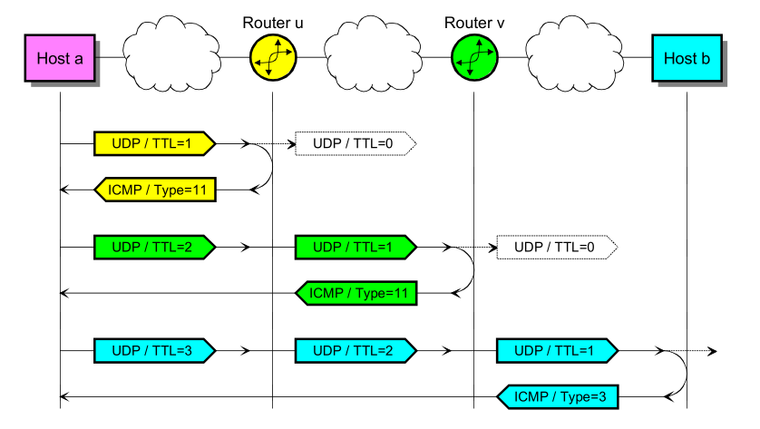
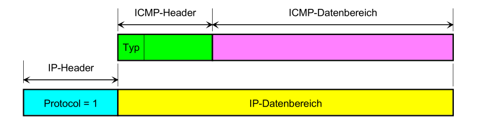
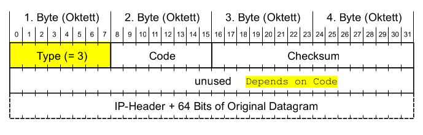

# Network Layer (Layer 3)

## IP-Adressen

Mit hilfe von IP-Adressen routen Router die Pakete umher. IP-Adressen sind hirarchisch aufgebaut.

### Classful vs Classless

| Klassen | Adressbereich               | Anzahl Netze | Interfaces pro netz |
| ------- | --------------------------- | ------------ | ------------------- |
| A       | 1.0.0.0 - 127.255.255.255   | 127          | 16'777'214          |
| B       | 128.0.0.0 - 191.255.255.255 | 16'384       | 65'534              |
| C       | 192.0.0.0-223.255.255.255   | 2'097'152    | 254                 |

Die Klasse D (224.0.0.0 - 239.255.255.255) sind für Multicast-Adressen vorgesehen. Dies ist ein separates Protokoll mit separaten Adressierung.

Die Klasse E (224.0.0.0 - 255.255.255.255) ist reserviert für zukünftige Netzwerke.

Die folgenden privaten Netzwerke gibt es:

| Klasse | Netzadresse                 | Subnetmaske   |
| ------ | --------------------------- | ------------- |
| A      | 10.0.0.0                    | 255.0.0.0     |
| B      | 172.16.0.0 - 172.31.0.0     | 255.255.0.0   |
| C      | 192.168.0.0 - 192.168.255.0 | 255.255.255.0 |

### Netmask

Die IP-Adresse ist in zwei Teile aufgeteilt: Die Netzadresse und Host-Adressen. Die Netzmaske unterteilt eine IP-Adresse in die Netzadresse und Hostadresse.

Alternativ schreibweisse ist "/24" für eine Subnetzmaske mit 24 `1` und 8 `0`. Daher gibt es $(32-24)^2-2=255-2=253$ addressierbare Hosts. Es werden noch zwei Adressen abgezogen, da zwei Adressen für die Broadcast- und Netzwerk-Adresse benötigt werden.

## Routing

Dank routing weiss ein Router wohin ein Paket gesendet werden muss. Dies wird anhand der IP-Adresse gemacht.

### Routing-Tabelle

In der Routing-Tabelle steht, über welcher Port welches Netzwerk ansprechbar ist. Darin steht der Port, an dem das Netzwerk erreichbar ist, die Netzwerkadresse und Netzmaske. Zusätzlich gibt es ein Default-Gateway. Über diesen werden alle Pakete weitergeleitet, welche zu keinem anderen Netzwerk passt. Es kann für ein Netzwerk mehrere Einträge geben.

Die Routing-Tabelle ist geordnet nach der Netzmaske. Dabei ist das kleinste Netzwerk zu oberst (die höchste Subnetz). Die Routing-Tabelle wird von oben nach unten durch geschafft. Zum ersten Hit wird das Paket gesendet.

## Flaches- vs Hirarchisches- Routing

## Internet Protokoll (IP) Format

Das folgende Diagramm zeigt der Header des IP-Protokolles:

* **Version** (4 Bit)
  Gibt die Version des IP-Headers an. Es ist somit möglich mehrere IP-Version (IPv4 oder IPv6) zu betreiben.

* **Internet Header Length (IHL)** (4 Bit) 
  Gibt die Länge allen Headers an. Der gelesene Wert wird mit dem Faktor 4 multipliziert. Wenn also 5 gelesen wird, sind die Headers 20 Bytes lang. IHL muss zwiscehn 5 (20 Bytes) und 15 (60 Bytes) sein. Der fixe Teil eines IP-Headers sind 20 Bytes, also bleiben 40 Bytes für Optionale Felder.

* **Type of Service** (8 Bit)
  Gibt an, was für eine Art von Leitung es ist. Ein Sender kann danach entscheiden, ob er eine Leitung, welche eine hoche Bandbreite hat, dafür ein schlechten Ping (wie eine Satelitenverbindung) oder lieber eine "normale" Glassfasserleitung benützt. Dies wurde nie von allen Service-Providern unterstützt.

* **Total Length** (16 Bit)
  Die totale Länget des IP-Paketes mit Headers  und Daten. 

* **Identifiaction** (16 Bit)
  Ein Wert, welches ein Paket eindeutig identifiziert. Dieser Wert wird benützt, um fragmentierte Pakete wieder zu einem Paket zusammen zusetzen.

* **Flags** (3 Bit)
  Beinhaltet Kontrollflags für die Fragmentierung

  | Feld | Position | Wert | Funktion               | Erklärung                  |
  | ---- | -------- | ---- | ---------------------- | -------------------------- |
  |      | Bit 0    |      | reserved, must be zero | Reserviert, immer Null     |
  | DF   | Bit 1    | 0/1  | May / Don't Fragment   | keine Fragmentierung       |
  | MF   | Bit 2    | 0/1  | Last / More Fragments  | Ob ein Folgefragment kommt |

* **Fragment Offset** (13 Bit)
  An welcher stelle ein fragmentiertes Paket in das ganze Paket gesetzt werden soll. Der gelesen Wert wird mit dem Faktor 8 multipliziert. (Aus 90 wird 720 Bytes)

* **Time to Live (TTL)** (8 Bit)
  Gibt die Anzahl Sekunden an, welche das Paket noch im Netz sein darf. Wenn der Wert 0 wird, wird das Paket verworfen. In der Praxis ist es schwierig zu messen, wie lange ein Paket unterwegs ist und daher dekrementiert der Router der Wert um `1` wenn er es weiter sendet. 
  Wenn ein Router ein Paket mit TTL=1 erhaltet, dekrementiert er es zu `0` und verwirft es.

* **Protocol** (8Bit)
  Das Protokol, welches im Datenteil übertragen wird. Folgendes sind die wichtigsten Beispiele:

  | Protocol | Keyword | Protokollbezeichnung           |
  | -------- | ------- | ------------------------------ |
  | 1        | ICMP    | Internet Control Message       |
  | 6        | TCP     | Transmission Controll Protocol |
  | 17       | UDP     | User Datagram Protocol         |

* **Header Checksum** (16 Bit)
  Eine Prüfsumme, welche nur über den IP-Header gebildet wird. Diese muss von jedem Router neu berechnet werden, da gewisse Felder vom Router modifiziert werden.

* **Source Address** (32 Bit)
  Die IP-Adresse des Senders

* **Destination Address** (32 Bit)
  Die IP-Adresse des Empfängers

* **Options und Padding** (max. 40 Bytes)
  Optionale Felder

## Maximum Transfer Unit (MTU)

Die MTU gibt an, wie viel Bytes über eine Leitung geschickt werden können. Dabei werden aber nur die Daten-Bytes des Ethernet-Frames gezählt. Die Bytes des Ethernet-Headers gelten nicht. 

Headers von gekapselten Protokollen, wie IP oder ICMP, müssen natürlich mit gezählt werden, da sie teil der Daten-Bytes des Ethernet-Frames sind.

## Addressauflösung

**TODO**

### Address Resolution Protocoll (ARP)

ARP ist ein Layer 2 Protokoll, da es die Namensauflösung von IP-Adressen zu MAC-Adressen zulässt.

Geräte haben typischerweisse eine ARP-Tabelle, in welcher ARP-Responses gecachet weden.

**TODO: Beispiel**

#### Gratuitous ARP

Gratuitous heisst unnötigt/unbegründet.

**TODO**

## Fragmentieren und Reassembly

Fragmentieren wird gebraucht, wenn ein Paket über eine Leitung geschickt werden soll, welche eine kleinere Maximum Transfer Unit (MTU) hat, als die Grösse des Paketes. In diesem Fall wird das Paket aufgeteilt/fragmentiert.

**TODO**

## Internet Control Message Protocol (ICMP)

ICMP Pakete werden der Schicht 3 zugeordnet, obwohl sie in einem IP-Paket gekapselt werden.

Es gibt einige Typen von ICMP Paketen:
(4 - *Source Quench* ist depricated - hiess, dass der Sender langsämer soll senden. Hat sich erübrigt, da es in TCP eingebaut w) ()

| ICMP-Type | Bedeutung               | Beispiel                                                     |
| --------- | ----------------------- | ------------------------------------------------------------ |
| 3         | Destination Unreachable | Wenn der Router ein Node nicht erreiche kann, weil z.B. die MTU zu klein ist oder der Note ausgesteckt wurde: **TODO Code** Protocol Unreachable=Node kommuniziert nicht über das Protokol;  Port Unreachable = Kein Program hört auf diesen Port; 13 Communication adminstrativvely prohibited = Die Firewall blockiert etwas. Destination Unreachable kann auch genutzt werden, um die MTU einer Leitung zu finden |
| 4         |                         |                                                              |
| 5         |                         |                                                              |
| 11        | Time Exceeded           | Wenn das TTL-Feld =0 ist, wird es vom Router nicht mehr weitergesendet. Dies kann für Trace-Rout genutzt weden. Jeder Router reduziert das TTL-Feld um 1. Wenn der Router ein Paket mit TTL=1 bekommt wird dies um `1` reduziert und danach verworfen. |

### Struktur von ICMP-Pakete

Das ICMP Paket wird in einem IP-Paket verschachtelt (`Protocol=1` steht für den IP-Header).

### Anwendungen

* MTU einer Leitung finden
  Dafür kann das Don't Fragment auf `1` gesetzt werden und versucht werden, wie hoch 
* Traceroute
* ping
