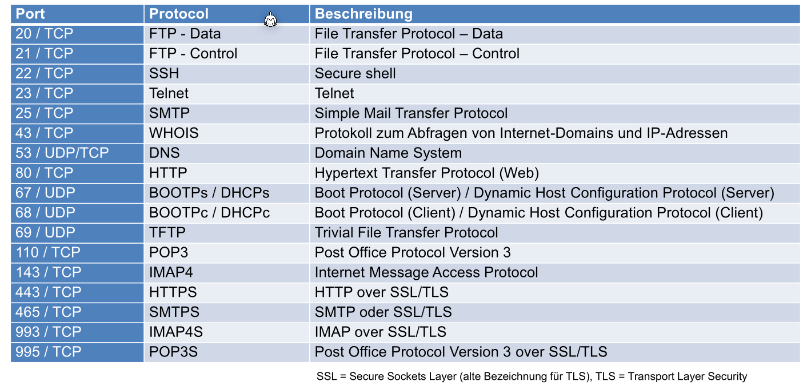
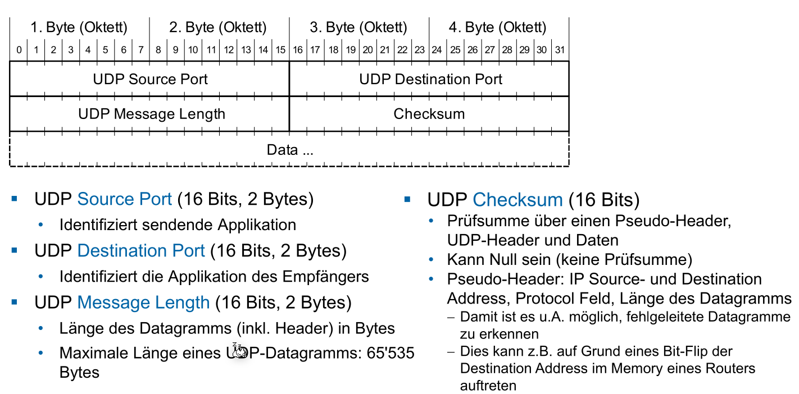

# Transport Layer (Layer 4)

[toc]

## Adressierung

Im Layer 4 werden "Teilnehmer" bzw. Applikationen mit Ports adressiert. Es gibt dabei ein Source und ein Destination-Port.

Ein Port ist eine Zahl zwischen 1 und 65'536 und sind folgendermassen unterteilt:

* **1-1023**: Well-Known Port Nummern, wie z.B. 80 für HTTP
* **1024-49'151**: Reservierte Bereiche für herstellerspezifischen Applikationen
* **49'152-65'536**: Dynamische/Private Ports, welche beliebig verwendet werden können

Die folgende Tabelle enthält die wichtigsten Well-Known Ports:

*(465/TCP - SMTPS sollte heissen "SMTP **over** SSL/TLS")*

Um eine Kommunikationsbeziehung eindeutig zu bestimmen braucht es folgende 5 Parameter:

1. Source Port
2. Destination Port
3. Source IP-Adresse
4. Destination IP-Adresse
5. Das Protokol (UDP oder TCP)

## TCP (Transmission Control Protocol)

## UDP (User Datagram Protocol)

UDP, wie auch TCP, ist ein Layer 4 Protokol und benützt Ports zur adressierung. Es ist aber nicht zuverlässig und erledigt nichts gegen Paket Verluste oder vertauschte Pakete.

### Header

Der UDP Header besteht aus 8 Bytes und beinhaltet folgendes:

