# Transport Layer (Layer 4)

[toc]

## Adressierung

Im Layer 4 werden "Teilnehmer" bzw. Applikationen mit Ports adressiert. Es gibt dabei ein Source- und ein Destination-Port. E

Ein Port ist eine Zahl zwischen 1 und 65'536 und sind folgendermassen unterteilt:

* **1-1023**: Well-Known Port Nummern, wie z.B. 80 für HTTP
* **1024-49'151**: Reservierte Bereiche für herstellerspezifischen Applikationen
* **49'152-65'536**: Dynamische/Private Ports, welche beliebig verwendet werden können

Die folgende Tabelle enthält die wichtigsten Well-Known Ports:

*(465/TCP - SMTPS sollte heissen "SMTP **over** SSL/TLS")*

Um eine Kommunikationsbeziehung eindeutig zu bestimmen braucht es folgende 5 Parameter:

1. Source Port
2. Destination Port
3. Source IP-Adresse
4. Destination IP-Adresse
5. Das Protokol (UDP oder TCP)

## TCP (Transmission Control Protocol)

TCP bietet folgendes für eine Applikation:

1. **Verbindungsorientierte Übetragung**: Eine Verbindung muss zuerst aufgebaut werden und eine TCP-Verbindung hat genau 2 Endpunkte (Multicast wird nicht unterstützt)
2. **Hohe Zuverlässigkeit:** TCP garantiert die Datenübertragung ohne Verluste in der richtigen Reihenfolge
3. **Vollduplexübertragung: ** In einer TCP Verbindung können Daten in beide Richtungen fliessen
4. **Stream-Schnittstelle: ** Eine Andwenung kann ein Stream von Bytes senden, welche vom Empfänger in derselben Reihenfolge wieder empfangen werden.
5. **Zuverlässiger Verbindungsaufbau**: Es muss zuerst eine Verbindung aufgebaut werden. Pakete von einer vorherigen Verbindungen sind danach nicht mehr gültig
6. **Eleganter Verbindungsabbau**: Beide Seiten können die Verbindung trennen und sie wird sauber abgebaut
7. **Siebes Merkmal: ?**

Im folgenden Diagramm wird aufgezeichnet, wie ein Verbindungsaufbau, das Senden/Empfangen von Nachrichten und der Verbindungsabbau beschreiben.

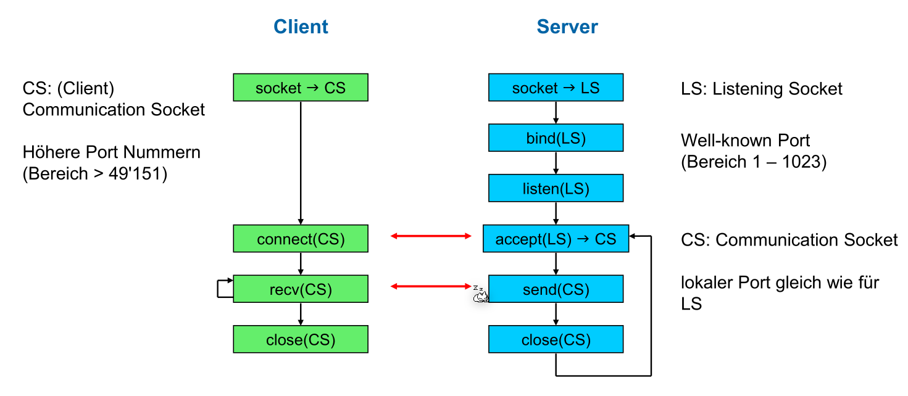

Im folgenden Diagramm sind die feinen Zustände eines Clients oder Server aufgezeichnet:

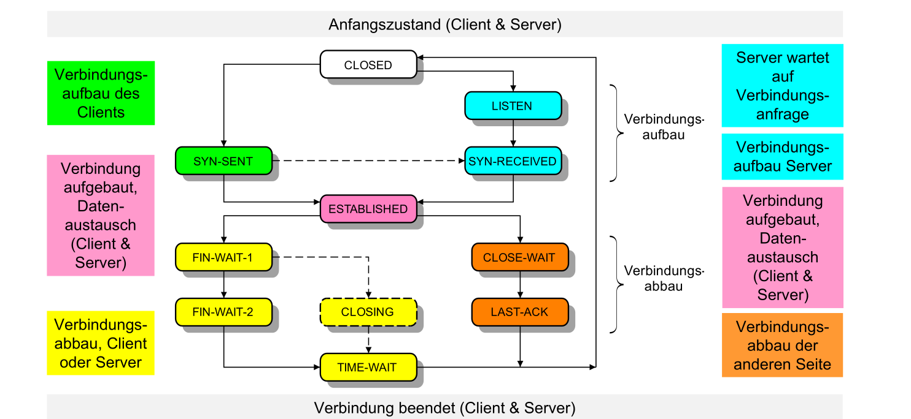

### Probleme

Die folgenden Probleme müssen von TCP gelöst werden:

* Eine Verbindung soll zuverlässig auf- und abgebaut werden können
* Eine TCP-Nachricht können **verloren, verfälscht, dupliziert oder verstauscht** werden. TCP muss diese Nachrichten trotzdem wieder korrekt zusammen setzen und der Applikationsschicht übergeben. Hierfür werden Techniken, wie Sequenznummern, Adaptiver Timeout, Sliding Window Protokoll benützt.
* Der Empfänger soll nicht überschwemmt werden. Hier für wird Flow Control mit Advertized Window Size genützt.
* Das Netzwerk dazwischen soll nicht überlastet werden. Hier für gibt es Congestion Control mit Slow Start Algorithmus.

### TCP-Header

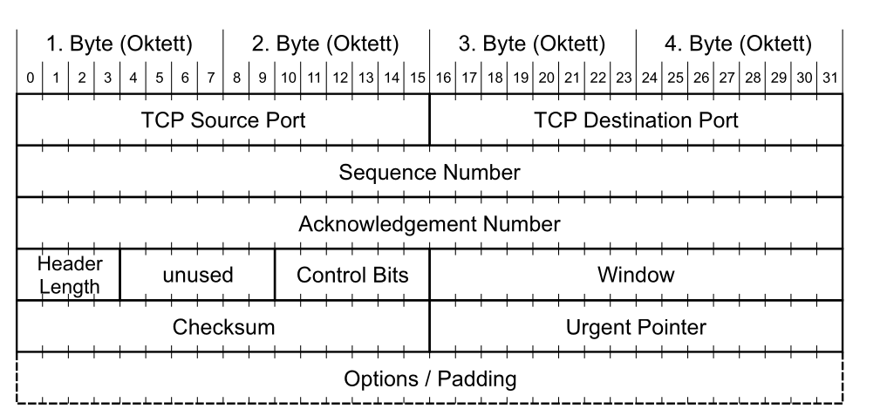

* **TCP Source Port und Destination Port**: Der genutzte Port auf dem Sender und Empfänger
* **Sequence Number**: (Bezieht sich auf die Ausgangsdaten) Anhand dieser Zahl können Daten in der richtigen Reihenfolge der Applikation übergeben werden und es wird die Acknowledgement Number damit berechnet
* **Acknowledgment Number**: (Bezieht sich auf die Eingangsdaten) 
* **Header Length/Data Offset**: Gibt an, wo der TCP-Header mit optionalen Headers aufhört und die Daten beginnen
* **Control Bits**: Flags, welche z.B. den Verbindungsaufbau und -abbau einleiten
  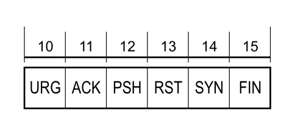
  Diese Flags haben die folgende bedeutung:
  * **URG**: Urgent-Pointer-Feld enhält einen gültigen Wert
  * **ACK**: Acknowledgment Feld enhält einen gültigen Wert
  * **PSH**: (= Push) Empfänger soll Daten sofort an die Applikation weiterleiten
  * **RST** (=Reset) Verbindung zurücksetzen
  * **SYN** (=Synchronize) Verbindung aufbauen
  * **FIN**: Der Sender hat keine Daten mehr zu übertragen. Verbindung abbauen

* **Window**: Gibt die noch verfügbare Buffer-Grösse des Senders an. Wenn ein Empfänger `0` im Window-Feld erhält, stoppt er zu senden, bis eine Retransmission mit einem grösseren Window-Feld ankommt.
* **Checksum**: Die Checksume des TCP-Pakets
* **Urgent Pointer**: Falls `URG` gesetzt ist, zeigt dieses Feld an, wo die "Urgent-Daten" im Datenblock gefunden werden können
* **Options**: Optionen, wie "SACK" oder die maximale Segmentlänge (MSS) können als optionale Option übertragen werden

### Verbindungsaufbau

Im folgenden Sequenz-Diagramm ist der 3-Way-Handshake eines TCP-Verbindungsaufbaus. Ein 3-Way-Handshake ist nötig, da der Client, wie auch der Server sicher sein müssen, dass sie eine Verbindung hat. Bei einem 2-Way-Handshake (mit nur 2 Nachrichten), weiss nur der Client sicher, dass eine Verbindung steht.

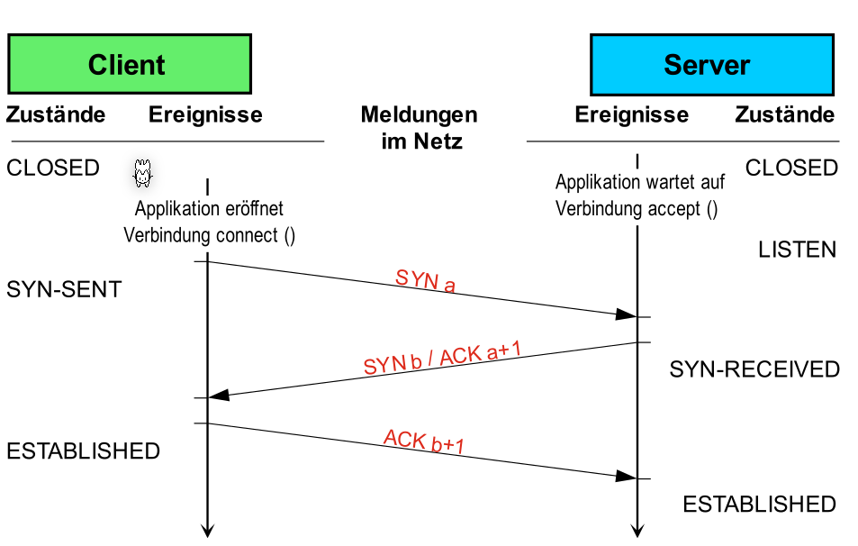

Das Sequenzdiagram von oben ist auch noch  in folgendem Zustandsdiagram abgebildet.

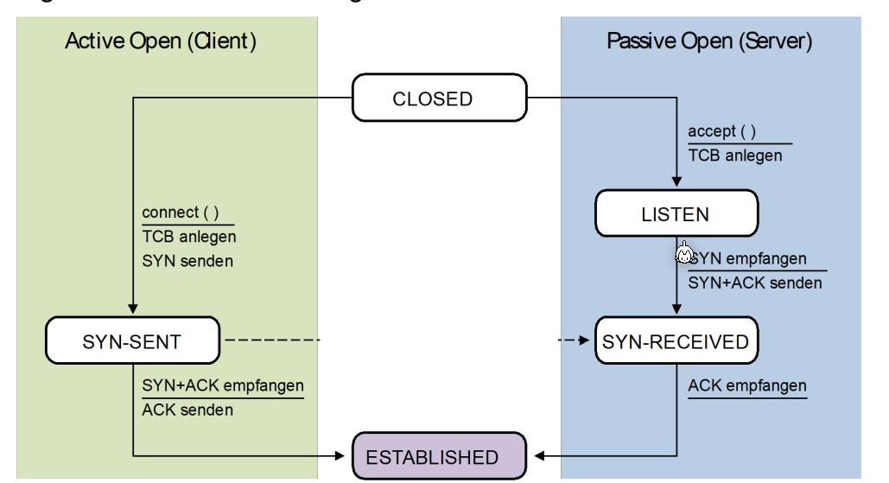

### Datenaustausch

Im folgenden Diagram sieht man ein Austausch von Datenpaketen, nach dem letzten `ACK` Paket.

Eine Nachricht vom Sender müssen vom Client immer mit einem Paket, welches das `ACK`-Flag Gesetzt hat, bestätigen werden. Vor dem senden startet der Sender ein Timer. Falls dieser abläuft, bevor der Empfänger das Paket bestätigt hat, wird das Paket erneut versendet. Es gibt eine **Retransmission**.

Die `Seq` Zahl der Antwort des Servers ist die `Ack` Zahl des Requests. Die `Ack` Zahl der Antwort des Servers ist die `Seq`-Zahl + die Anzahl empfangenen Bytes.

Der Server kann zur Bestätigung ein leeres Datenpaket zurück senden oder selber Daten senden, welche vom Client bestätigt werden müssen.

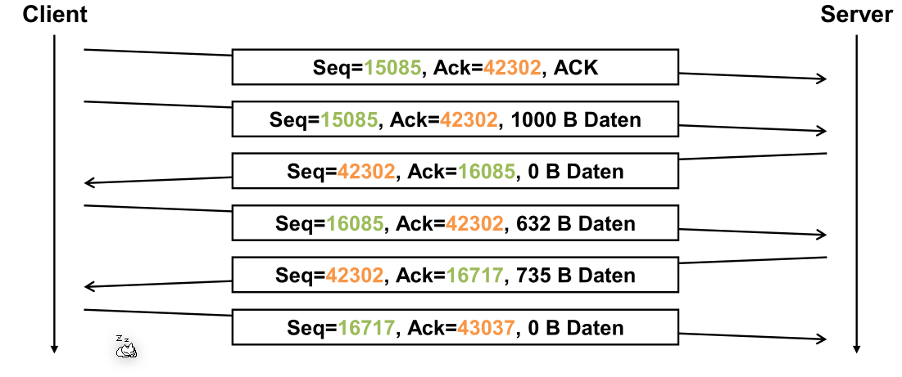

### Verbindungsabbau

Im folgenden Sequenzdiagram ist ein Verbinungsabbau aufgezeichnet. Dies ist nur noch ein "2-Way-Hanshake" und kann vom Client, wie auch vom Server initialisiert werden.

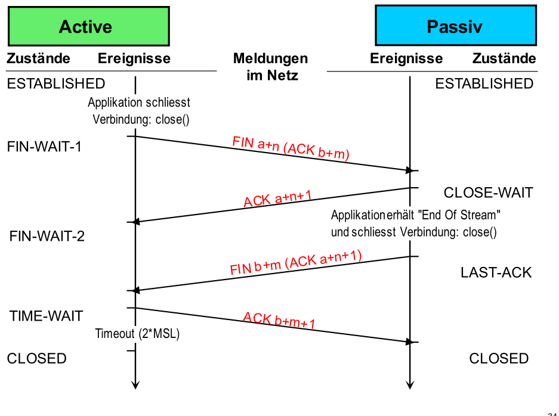

MSL=Maximum Segment Length

Das Timeout am Ende ist nötig, falls das letzte `ACK b+m+1` nicht ankommt. In diesem Fall würde die Passive-Seite noch mals ein `FIN b+m` Paket senden.

Das folgende Zustandsdiagram zeigt der Verbindungsabbau.

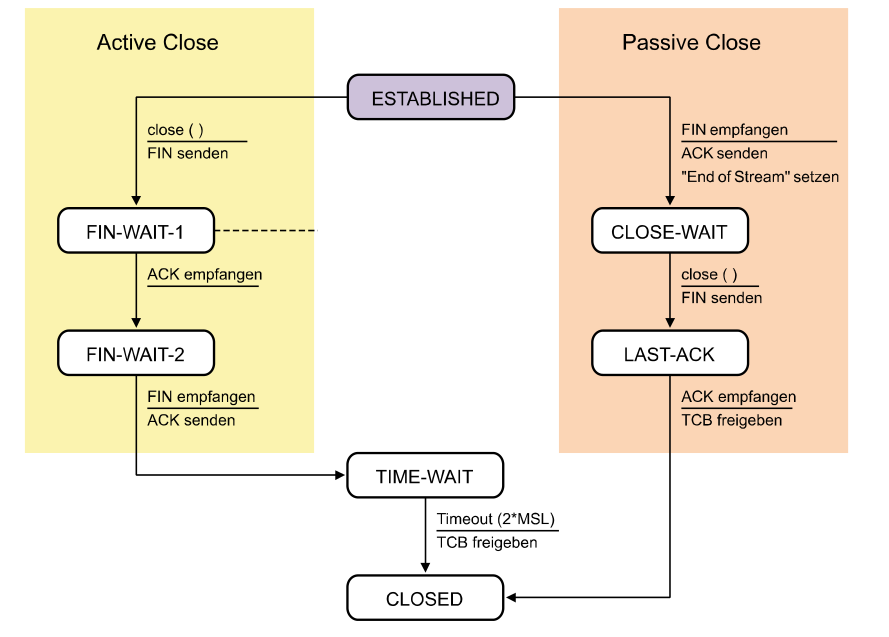

### Adaptive Elemente von TCP

#### Adaptives Timeout

Das Timeout von TCP wird adaptiv bestimmt und ändert sich über die Lebenszeit der Verbindung.

Dafür werden folgende Formeln benützt:
$$
RTO_n=SRTT_n + 4\cdot RTTVAR_n\\
SRTT_n = (1 - \alpha )\cdot SRTT_{n-1}+\alpha\cdot RTT_n\\
RTTVAR_n=(1 - \beta)\cdot RTTVAR_{n - 1}+\beta \cdot \vert SRTT_n - RTT_n \vert
$$

 Dabei steht $RTO$ für `Retransmission Time-Out`, $SRTT$ für `Smoothed Round-Trip-Time` und ist ein gewichteter Mittelwert, $RTT$ für `Round-Trip-Time` und $RTTAV$ für `Round-Trip-Time Variance` und ist der gewichteter Mittelwert der Abweichung, bzw. die Streuung.

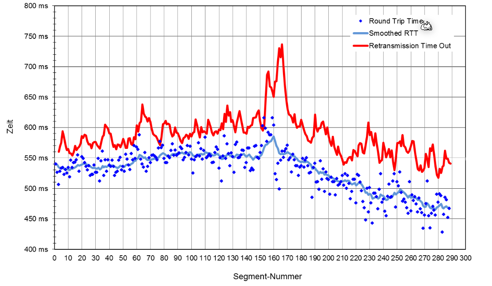

Wenn die Roud-Trip-Time überschritten wird, wird der Sender das Paket erneut senden.

#### Bestätigung von Paketen

In TCP wird das Sliding-Window Verfahren für die Bestätigung von Paketen genützt. Der Sender sendet alle Pakete im Fenster und schiebt das Fenster weiter, wenn die älteste Nachricht bestätigt wurde.

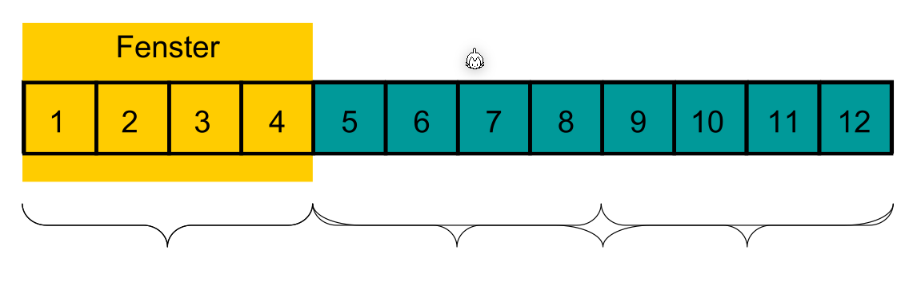

Im folgenden Bild sieht man auf der linken Seite ein Verfahren, bei dem auf die Bestätigung des Empfängers gewartet wird. Auf der rechten Seite wird das Sliding-Window Verfahren bentüzt.

Sliding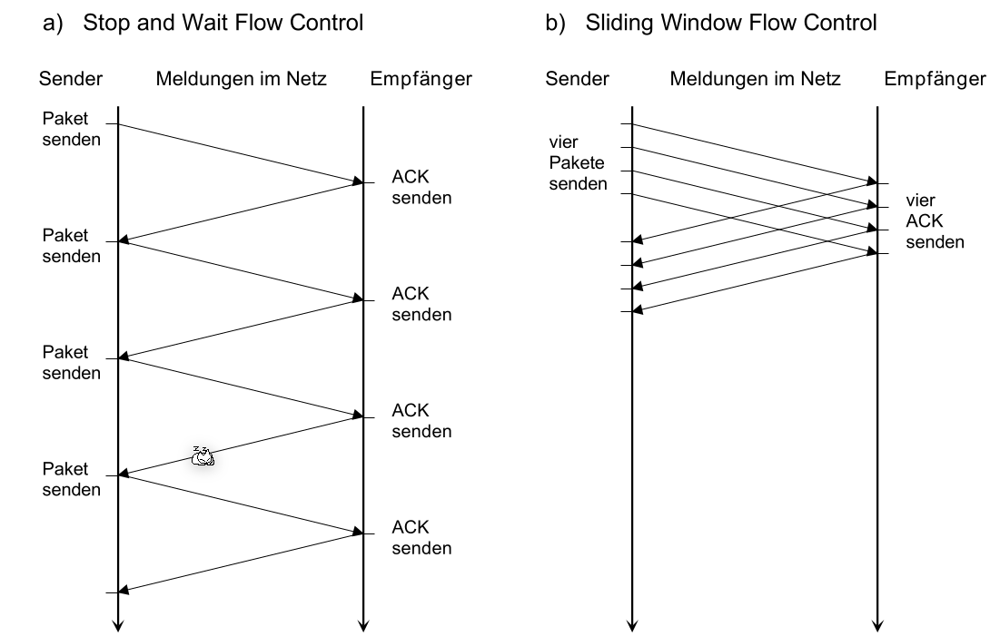

#### Fluss-Steuerung

Im folgenden Paket wird angenommen, dass der Empfänger mit einer Buffergrösse von 2'500 Bytes hat. Der Empfänger sendet die verbleibende Buffergrösse im `Window` Feld zurück. Wenn der Sender eine Bestätigung mit `Window=0` empfängt, wartet er, bis er dieselbe Bestätigung mit einer höheren `Window` Feld empfängt.

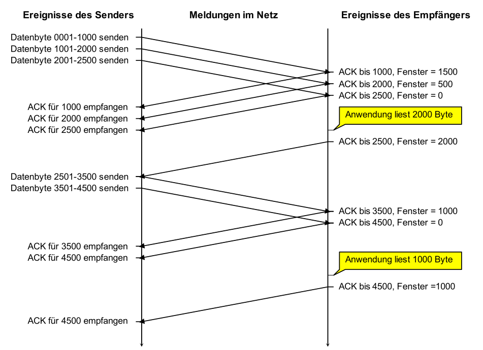

#### Überlastung des Netzwerks vermeiden

Beim Slow-Start Algorithmus beginnt der Sender mit einer kleinen vordefinierten Grösse und verdoppelt dies mit jedem gesendetem Paket bis er die erste Schwelle erreicht. Danach wird die Paketgrösse linear vergrössert bis ein Timeout entsteht. 

Bei einem Timeout wird die nächste Schwelle auf die Hälfte des Paketes, bei welchem das Timeout entstand. Danach wird wieder ein Slow-Start ausgeführt.

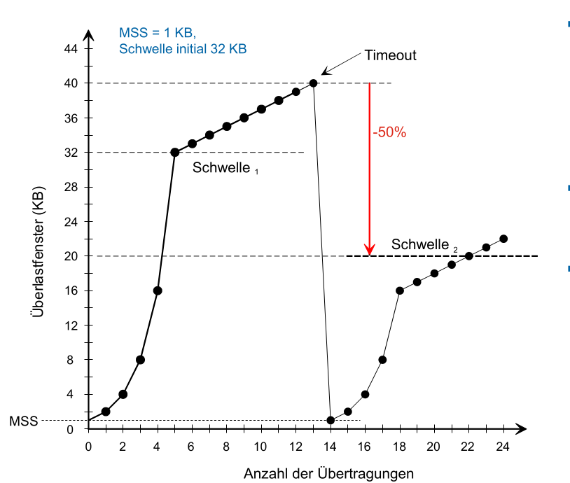

Es gibt für den Slow-Start Algorithmus folgende Kritikpunkte

* Die "Sägezahnkurven" verschiedener TCP-Sessions tendieren dazu, sich zu synchronisieren
*  Die Annahme gilt für Wireless-Netze nicht mehr unbedingt, wo relativ viel Paketverlust durch Bitfehler
  während der Übertragung vorkommt
* Slow-Start bei kurzen Transfers immer slow (www)
* Abhängig von Round Trip Time

## UDP (User Datagram Protocol)

UDP, wie auch TCP, ist ein Layer 4 Protokol und benützt Ports zur adressierung. Es ist aber nicht zuverlässig und erledigt nichts gegen Paket Verluste oder vertauschte Pakete.

### Header

Der UDP Header besteht aus 8 Bytes und beinhaltet folgendes:

