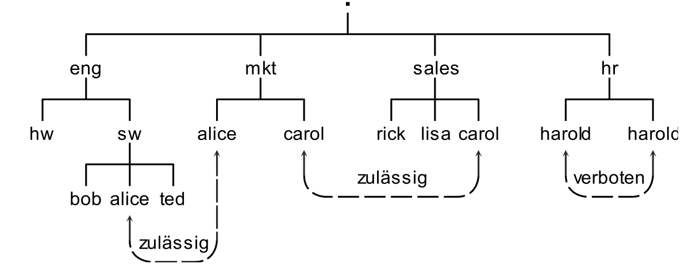
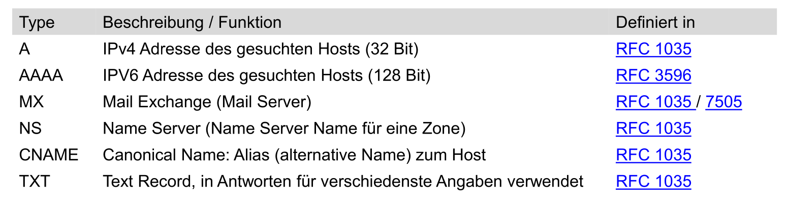
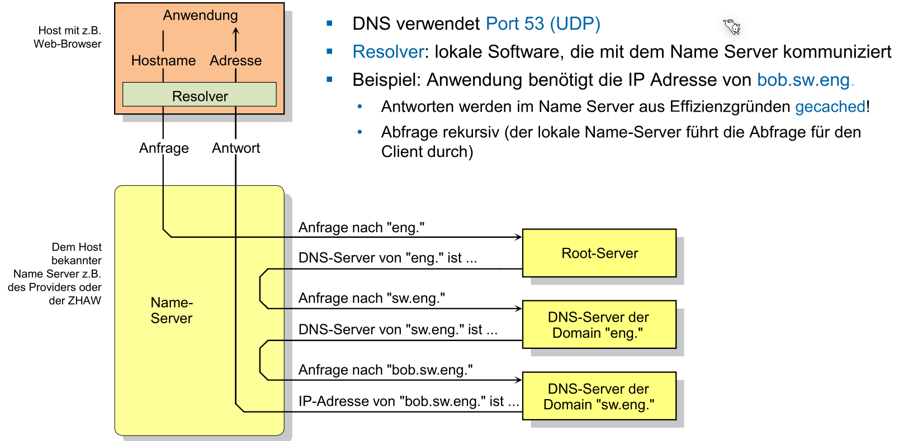
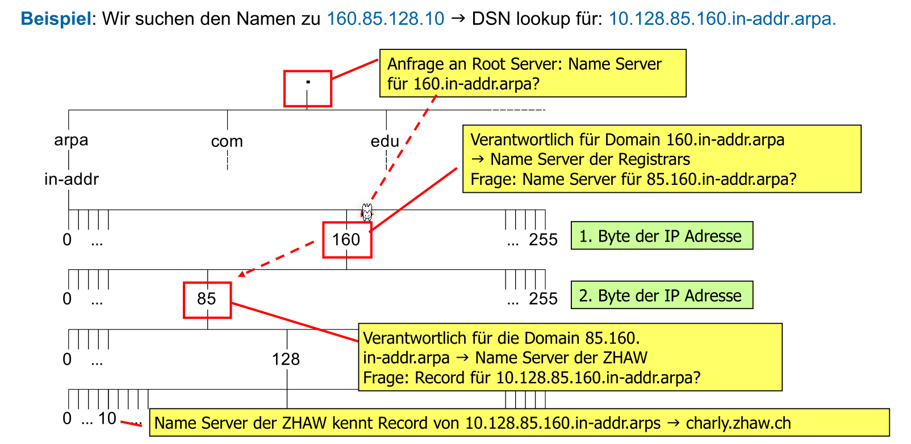
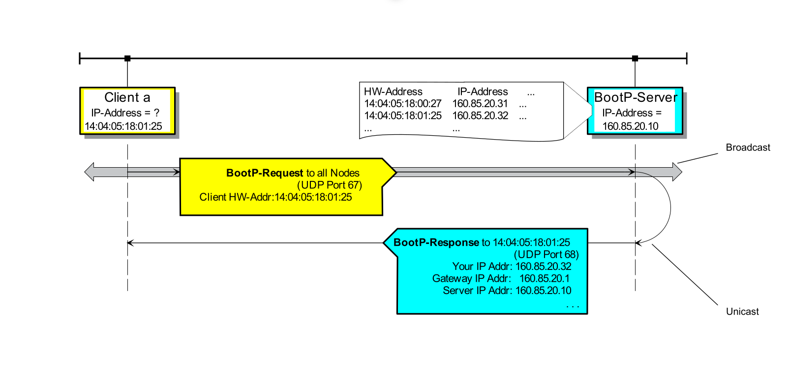
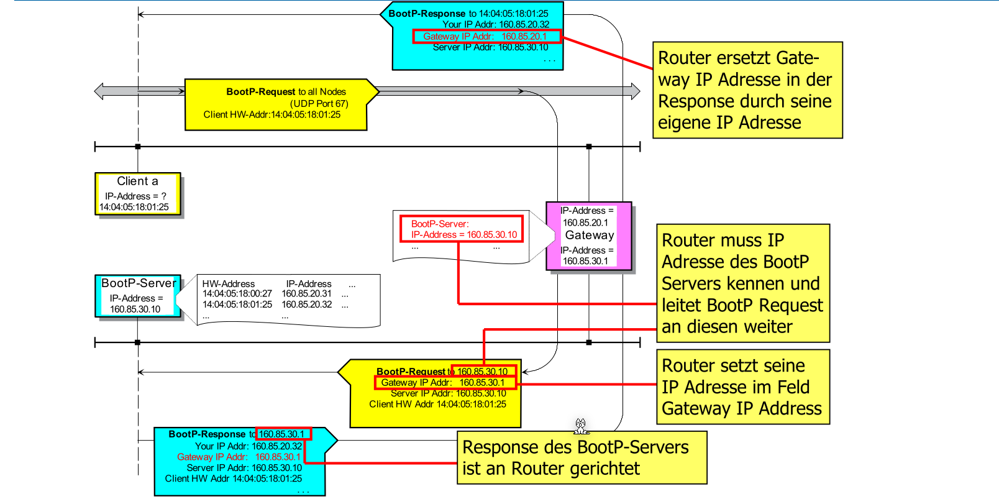
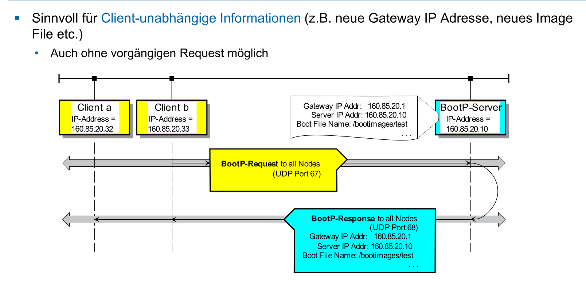
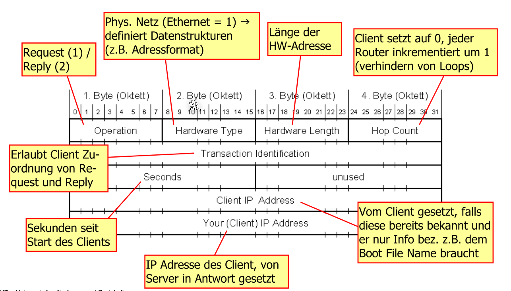
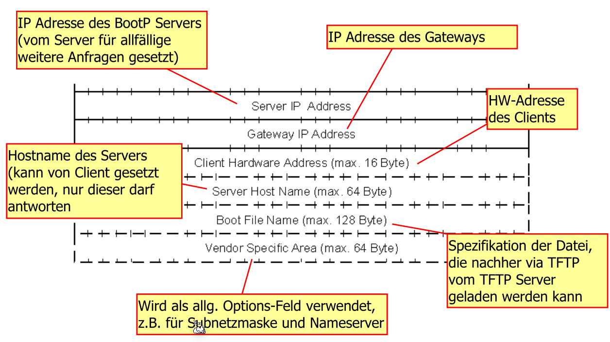
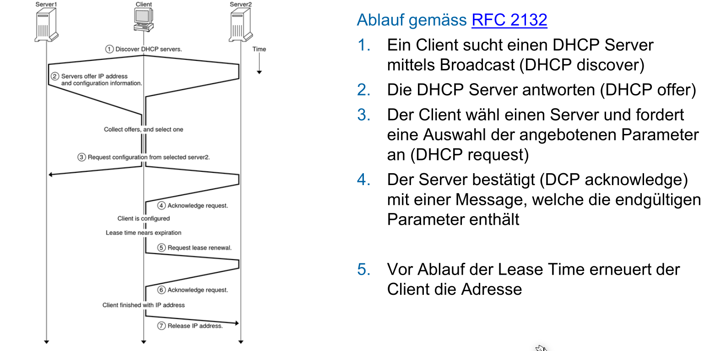

# Application Layer

## DNS

Jeder Full Qualified Domain Name (FQDN) muss eindeutig sein. Dass heisst, Geschwister-Knoten dürfen nicht den selben Namen haben.

### Record Arten

Es gibt mehrere Typen von Records, welche verschiedene Informationen enthalten.

### Root Servers

Ein Root Server ist ein DNS-Server, welcher weiss wo z.B. der `ch` DNS-Server ist. Er ist auf der obersten Stufe. Weltweit gibt es fast 4000 Root Servers.

### Ablauf eines Namensauflösung

### Reverse DNS

## BOOTP / DHCP

BOOTP läuft auf dem UDP Port 67 für den Server und 68 für den Client.

Zu begin kenn ein BOOTP-Client nur seine eigene Mac-Adresse (nicht aber seine IP-Adresse). Daher sendet er ein Broadcast-Adresse mit seiner Mac-Addresse. Der BootP-Server empfängt dieser und sendet die nötigen Netzwerk-Daten zurück und wo das Image-File liegt, dass der Client dies herunter laden kann.

Wenn dies über Netzwerkgrenzen funktionieren soll, muss der Router wissen, dass Pakete an den Port 67 und 68 weiter geleitet werden soll.

Ein BootP-Server kann ein Broadcast an alle Clients senden, wenn ein Update des Boot-Image gibt und so die Client benachrichtigen. Dies kann auch vom Server kommen ohne das ein Client anfragt.

Folgenden Screenshot ist das Paket Format gezeigt:

(fortsetzung des oberen Screenshots)

### Nachteile

* Nachteile:
  * Alles Statisch: Eine gesetzte IP-Adresse ist besetzt, auch wenn das Gerät nicht online ist
  * Manuelle Verwaltung: Alles muss manuell eingetragen werden

## DHCP

DHCP ist rückwärtskompatibel mit BOOTP und benutzt dasselbe Paketformat und dieselben Ports. Damit der DHCP-Server noch weiss, ob ein Client noch gibt, müssen Clients ein DHCP-Response senden, bevor die Lease-Time ablauft. Sonst würde die Adresse wieder freigegeben werden.

Ablauf eines DHCP-Reuqests.

## TFTP

**TODO**