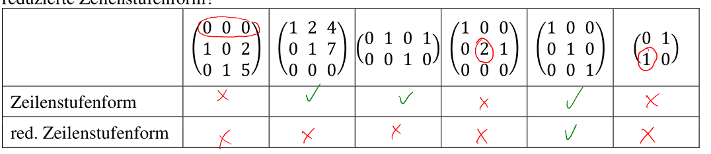
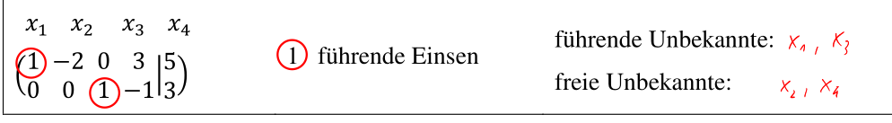

# Lineare Gleichungssystem

Eine Gleichung ist lineare, wenn sie die folgende Form entspricht: $ax+by+cz=d$

## Koeffizienten Matrix

Ein lineares Gleichungssystem kann als eine Matrize Multiplikation geschrieben werden.
$$
\text{}
\begin{cases}
i_1x+i_2y=c_1\\
i_3x+i_4y=c_2\\
i_5x+i_6y=c_2
\end{cases} 
\\
\begin{pmatrix}
i_1 & i_2 \\
i_3 & i_4\\
i_5 & i_6
\end{pmatrix} \cdot 
\begin{pmatrix}
x \\
y
\end{pmatrix} =
\begin{pmatrix}
i_1x+i_2y\\
i_3x+i_4y\\
i_5x+i_5y
\end{pmatrix} =
\begin{pmatrix}
c_1\\
c_2\\
c_3
\end{pmatrix}
$$
Dies kann vereinfacht als eine erweiterte Koeffizienten Matrix geschreiben werden:
$$
\left( \begin{array}{cc|cr}
i_1 & i_2 & c_1\\
i_3 & i_4 & c_2\\
i_5 & i_6 & c_3
\end{array} \right)
$$

## Zeilenstufenform

Die Zeilenstufenform ist definiert durch die folgenden Regeln:

* Alle Zeilen mit nur `0` stehen zu unterst
* Wenn eine Zeile nicht nur aus `0` besteht, ist die erste Zahl, welche keine `0` ist, eine `1`. Diese `1` wird als *führende Eins* bezeichnet
* Eine führende Eins, welche weiter unten steht, muss auch weiter rechts stehen, als die anderen führenden Einsen

Zusätzlich gibt es noch die *reduzierte Zeilenstufenform*, bei welcher noch die Regel gilt, dass nur eine `1` pro **Spalte** stehen darf. Die restlichen Elemente müssen `0` sein.

Bei der erweiterten Koeffizientenmatrix sind die Resultat-Werte (die $c_i$ Werte) von den Regel ausgenommen werden.

## Lösung aus der Zeilenstufenform

Um aus einer Zeilenstufenform die Lösung zu lesen, werden die Variablen in führende Unbekannte und freie Unbekannte unterteilt. Führende Unbekannte sind all diese Variable, welche in ihrer Spalte eine führende `1` haben, die anderen Variablen sind freie Unbekannte.

Für die freien Unbekannte werden nun eine beliebige Variable gleichgesetzt. Oft werden grichische Buchstaben verwendet, um die Verwechslungsgefahr gering zu halten.

Im oberen Beispiel:
$$
x_2=\lambda\\
x_4=\mu
$$
Jede führende Unbekannte wird nun

 in eine Gleichung übersetzt. Wieder für das Beispiel oben:
$$
x_1-2x_2+3x_4=5 \rightarrow x_1=5+2x_2-3x_4\\
x3-x4=3\rightarrow  x_3=3+x_4
$$
Nun kann das Gleichungssystem von unten (also $x_4$ in diesem Fall) gelöst werden:
$$
\begin{align}
x_4&=\mu\\
x_3&=3+\mu\\
x_2&=\lambda\\
x_1&=5+2\lambda-3\mu
\end{align}
$$
In diesem Fall gibt es zwei Unbekannte $\lambda$ und $\mu$. Dank diesen gibt es unendlich viele Lösungen. Es kann auch eine spezifische Lösung oder gar keine Lösung geben.

### Parameterdarstellung

Die Parameterdarstellung ist eine alternative Darstellungsmöglichkeit von des Resultats. Das untere Beispiel zeigt das Beispiels-Gleichungssystem von oben:
$$
\vec x=\begin{pmatrix}x_1\\x_2\\x_3\\_x4\end{pmatrix}=
\begin{pmatrix}5 \\0\\3\\0\end{pmatrix} +\lambda \begin{pmatrix}2\\1\\0\\0\end{pmatrix}+
\mu\begin{pmatrix}-3\\0\\1\\1\end{pmatrix}
$$
Anzumerken ist, dass $x_2$ bei der $\lambda$ Matrix ein `1` hat. Dies liegt daran, dass $x_2=\lambda$ ist. Dasselbe gilt auch mit $x_4=\mu$ und der $\mu$ Spalte bei $x_4$

## Zeilenstufenform herleiten (Jordan-Gauss-Verfahren)

Ein Gleichungssystem, welches bereits in der Zeilenstufenform ist zu lösen, ist einfach. Die Frage ist nun, wie jemand ein solches Form herleiten kann.

1. Wir nennen die am weitesten links stehende Spalte mit Element $\neq0$ *Pivot-Spalte*
2. Wenn die Zeile mit dem führenden Eins nicht zu oberst ist, wird sie mit der obersten Zeile getauscht
3. Die oberste Zeile wird durch die erste Element $\neq 0$ in der Spalte geteilt. So wird eine führende Eins erzeugt
4. Um `0` in der Pivot-Spalte unter der obersten Zeile zu erzeugen, wird jede Zeile unter der obersten Zeile mit einem Vielfachen der obersten Zeile addiert um `0` zu forderst zu erzeugen
5. Schritte 1-5 wiederholen, bis eine Zeilenstufenform vorhanden ist

Wenn eine reduzierte Zeilenstufenform verlangt wird, muss danach ein Vielfaches der unterste Zeile auf die oberen Zeile addiert werden, so dass diese `0` ergeben.