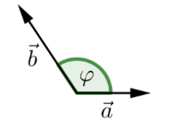

# Vektoren

> **Vektor**
> Ein Vektor wird durch seine Richtung und Betrag definiert (**Nicht aber der Ort**)
>
> **Nullvektor**
> Ein Nullvektor $\vec 0$ hat den Betrag `0` und hat keine Richtung
>
> **Einheitsvektor/normierter Vektor**
> Ein Vektor $\vec e$ oder $\vec e_a$, welchen der Betrag `1` hat und kann folgendermassen berechnet werden: $\vec e_a=\frac{\vec a}{\vert a \vert}$
>
> **Gegenvektor**
> Der Gegenvektor zum Vektor $\vec a$ ist $-\vec a$. Es ist also ein Vektor welcher parallel zu $\vec a$ ist, denselben Betrag hat, aber in die entgegengesetzte Richtung zeigt.

## Addition

Wenn zwei Vektoren addiert werden, werden sie graphisch aneinander gehängt.

Diese Operation ist kommutativ und assoziativ:

## Skalare Multiplikation

Wenn ein Vektor mit einer Zahl multipliziert wird, wird der Vektor gestreckt, bzw. geschrumpft. Oft wird der Faktor als griechischen Buchstaben ausgedrückt, um Verwechslung zwischen Vektoren und Faktoren zu vermeiden.

## Linearkombination

Eine Linearkombination ist das kombinieren von mehreren skallierten Vektoren:
$$
\lambda_1\cdot\vec a_1+\lambda_2\cdot\vec a_2+...+\lambda_n\cdot\vec a_n
$$

## Betrag

Der Betrag eines Vektores ist seine Länge. 
$$
\begin{align}
\left\vert\begin{pmatrix}x\\y\end{pmatrix}\right\vert&=\sqrt{x^2 + y^2}\\ 
\left\vert\begin{pmatrix}x\\y\\z\end{pmatrix}\right\vert&=\sqrt{x^2 + y^2+z^2}\\
\end{align}
$$

## Kollinear

Zwei Vektoren sind kollinear, wenn es eine Gerade gibt, zu der beide parallel sind. Mathematisch kann dies als $\vec a = \lambda\cdot\vec b$ ausgedrückt werden

## Komplanar

Drei Vektoren heissen komplanar, wenn es eine Ebene gibt, zu der alle drei parallel sind.

## Satz 1

Es lässt sich der Vektor $\vec c$ als Linearkombination der Vektoren $\vec a$ und $\vec b$ im 2D-Raum darstellen, wenn

* $\vec a$, $\vec b$ und $\vec c$ komplanar zueinander sind
* $\vec a$ und $\vec b$ nicht kollinear sind

## Satz 2

Wen drei Vektoren $\vec a$, $\vec b$ und $\vec c$ nicht komplanar sind, lässt sich jeder Vektor $\vec d$ in $\R^3$ als eine Linearkombination von $\vec a$, $\vec b$ und $\vec c$ darstellen

## Kordinaten-System

Ein Kordinaten-System im Raum $\R^2=R\times R$ hat folgendes:

- Ein Punkt $O$ als Ursprung
- Ein Einheitsvektor $\vec e_1$
- Ein zweiten Einheitsvektor $\vec e_2$, welcher 90° im Gegenurzeigersinn zu $\vec e_1$ ist

Jeder Vektor in diesem Kordinatensystem kann als Linearkombination von $\vec e_1$ und $\vec e_2$ gebildet werden.

Ein Kordinaten-System im Raum $R^3$ hat folgenedes:

- Einen Punkt $O$ als Ursprung
- Einen Einheitsvektor $\vec e_1$ (typischerweisse kommt dieser aus dem Display)
- Einen zweiten Einheitsvektor $\vec e_2$, welcher druch eine 90° Drehung gegen den Urzeigensinn von $\vec e_1$
- Einen dritten Einheitsvektor $\vec e_3$, welcher ortogonal (Rechtwinlig) zu $\vec e_1$ und $\vec e_2$ ist

## Ortsvektor

Ein Ortsvektor ist ein Vektor, welcher im Ursprung festgeheftet wurde.
$$
\vec r(P)=x\cdot \vec e_1+y\cdot \vec e_2=\begin{pmatrix}x\\y\end{pmatrix}
$$
Der Ortsvektor $\vec r(P)$ ist der Vektor vom Ursprung zum Punkt $P$. Dies wird zum Teil auch als $\vec{OP}$ dargestellt

## Vektor zwischen zwei Punkten

$$
\vec{PQ}=\begin{pmatrix}x_Q-x_P\\y_Q-y_P\end{pmatrix}=\vec r(Q)-\vec r(P)
$$

## Skalar Produkt

$$
\vec a \cdot \vec b = \vert \vec a \vert \cdot \vert \vec b\vert \cdot \cos(\varphi)\\
\vec a \cdot \vec b=a_1b_1+a_2b_2+a_3b_3
$$
Ein Speziallfal ist, wenn $\vec a$ oder $\vec b$ den Nullvektor $\vec 0$ ist. In diesem Fall ist das Skalarprodukt $0$.

Da es zwei 