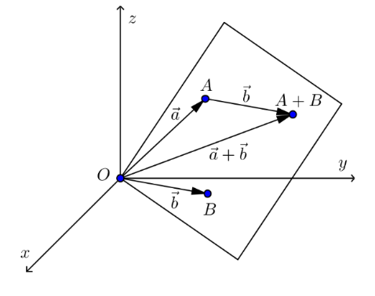
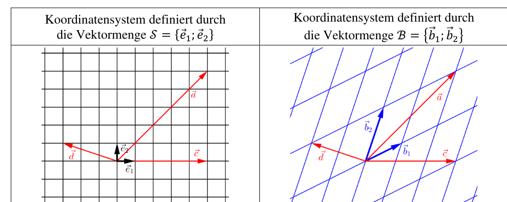

# Vektorräume

[TOC]

Ein Vektorraum ist eine Menge $V$ mit den Funktionen Addition und Skalar-Multiplikation: 
$$
+:V \times V \rightarrow V\\
\cdot : \R \times V \rightarrow V
$$
Dabei müssen folgende Gesetze existieren:

* Kommutativgesetz: $a + b = b + a$
* Assoziativgesetzt: $a + (b + c)=(a + b) + c$
* Es gibt ein neutrales Element $\vec 0$, für welches gilt $a + 0v = \vec a$ und $0v \in V$
* Für jedes Element $a \in V$ muss es ein inverses Element $-a \in V$ geben, so dass $a + (-a) = 0v$ ergibt.
* Assoziativgesetzt: $\lambda \cdot (\mu \cdot a) = (\lambda \cdot \mu) \cdot a$
* Distributivgesetzt: $\lambda \cdot(a + b) = \lambda \cdot a + \lambda \cdot b$
* Distirbutgesetzt: $(\lambda + \mu)\cdot a = \lambda \cdot a + \mu \cdot a$
* Für jedes Element $a \in V$ gibt es ein neutrales Element $1\cdot a = a$,

**Frage:** muss das Skalar über $\R$ erstellt werden oder könnte auch eine andere Menge genommen werden.

## Reeler Vektoraum

$$
+:V \times V \to V: (\vec a; \vec b) \mapsto \vec a + \vec b\\
\cdot : \R \times V \to V : (\lambda; \vec a) \mapsto \lambda \cdot \vec a
$$

Das neutrale Element bei der Addition ist der Nullvektor $\vec 0$ und das neutrale Element bei der Skalarmultiplikation ist $1$.

## Unterräume

Eine Teilmenge $U$ eines Vektorraums $V$ heisst Unterraum von $V$, wenn $U$ selbst auch ein Vektorraum ist. Dafür müssen folgende Kriterien erfüllt sein:

* Für beliebige Element $a, b \in U$ ist auch $a+b\in U$
* Für jeden Skalar $\lambda \in \R$ und jedes Element $a\in U$ ist auch $\lambda \cdot a\in U$
* Die neutralen Elemente der Addition und Skalarmultiplikation müssen ebenfalls in $U$ sein.

## Linearer Spann

$spann(\vec a_1, \vec a_2, ..., \vec a_n)$ ist definiert als alle möglichen Vektoren von der Linearkombination $\lambda_1\cdot \vec a_1 + \lambda_2\cdot \vec a_2 +...+\lambda_n\cdot \vec a_n$§

Die Vektoren $\vec a_1, \vec a_2, ...\vec a_n$ *spannen* den linearen Spann auf und formen eine geometrische Form.

## Erzeugendensystem

Eine Menge von Vektoren $\{\vec b_1, \vec b_2, ..., \vec b_N\}$ bildet ein Erzeugendensystsem von $V$, falls $V=span(\vec b_1, \vec b_2, ..., \vec b_n)$. Dies ist nur der Fall, wenn die $\vec b_i$ Vektoren linear unabhängig sind.

Aus dem gehen die folgenden folgende Bedingungen:
$$
\begin{align}
& V=span(\vec b_1, \vec b_2, ..., \vec b_n)\\
\Leftrightarrow \text{ } & B\cdot \vec x = \vec a \text { für jedes } \vec a \in \R^m\\
\Leftrightarrow \text{ } & rg(B)=m
\end{align}
$$

## Basis und Dimensionen

Ein Vektor $\vec a = \pmatrix{a_1 \\ a_2}$ kann auch als $\vec a = a_1\cdot \vec e_1 + a_2 \cdot \vec e_2$ geschrieben werden. Anstatt der Vektormenge $\mathcal S=\{\vec e_1; \vec e_2\}$ kann auch eine andere Menge $\mathcal B=\{\vec b_1; \vec b_2\}$ benützt werden. Der Vektor $\vec a = \pmatrix{\alpha_1\\ \alpha_2}_\mathcal{B}$ ist nun equivalent zu $\vec a=\alpha_1 \cdot \vec b_1 + \alpha_2 \cdot \vec b_2$.

In diesem Beispiel sind die Vektoren $\vec a$, $\vec c$ und $\vec d$ die selben, nur die Vektormenge, durche welche das Koordinatensystem definiert wird, ändert sich.

Damit dies möglich ist, muss die Vektormenge folgende Eigenschaften erfüllen:

* $\mathcal B=\{\vec b_1, \vec b_2, ...,\vec b_n\}$ muss ein Erzeugendensystem sein
* $\vec b_1$, $\vec b_2$, ..., $\vec b$ müssen linear unabhängig sein

Oder in Deutsch: Es darf nur genau eine mögliche Linearkombination für jeden Vektor  geben

Aus diesen zwei Regeln gehen folgende Sätze hervor:

* Eine Basis $\R^n$ besteht genau aus $n$ Vektoren
* $\rm rg(B)=n$ (wobei $B$ alle Vektoren in eine Matrix gesteckt werden)
* $\rm det(B)\neq 0$
* $B$ ist invertierbar
* Das lineare Gleichungssystem $B\cdot \vec x=\vec c$ hat genau eine eindeutige Lösung
