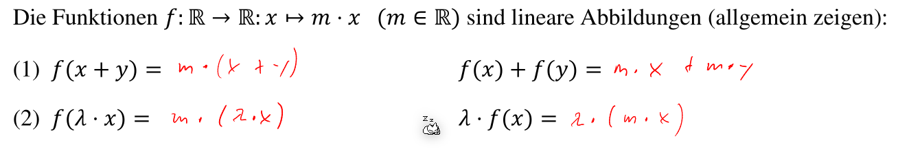
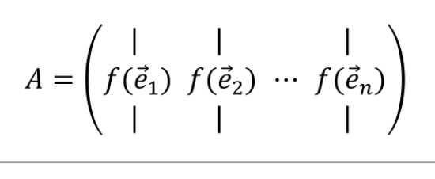
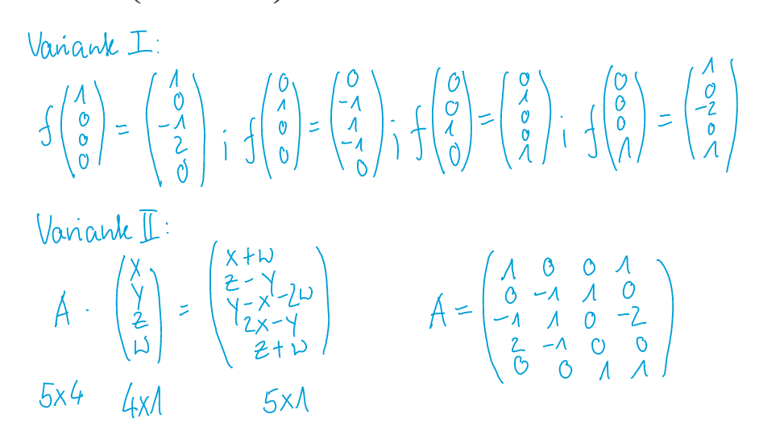
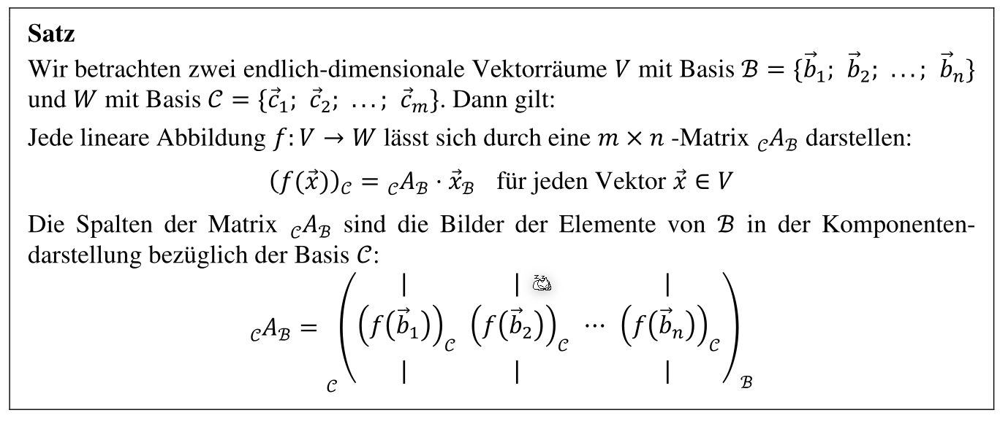

# Lineare Abbildung

Eine Lineare Abbildung wird mit Hilfe einer Funktion $f: V \to W$ , welche ein Parameter vom Typ $V$ nimt und als Rückgabetyp $W$ zurück gibt. Wichtig ist, dass die Funktion folgende zwei Rechungsregeln einhält:

* $f(x+y)=f(x)+f(y)$
* $f(\lambda\cdot x)=\lambda\cdot f(x)$

Wenn bewiesen werden soll, dass eine Funktion eine Abbildungsfunktion ist, dann müssen diese zwei Gesetze allgemein gezeigt werden. Um es zu widerlegen, reicht ein Gegenbeispiel.

## Lineare Abbildung eines Vektorraumes

Wenn die Abbildungsfunktion $f$ komplett definiert ist, für die Einheitsvektoren $\vec e_1$, $\vec e_2$, ..., $\vec e_n$, dann gilt follgendes:
$$
\vec x=x_1 \cdot \vec e_1 + x_2 \cdot \vec e_2\\
f(\vec x)=f(x_1 \cdot \vec e_1 + x_2 \cdot \vec e_2)=f(x_1\cdot \vec e_1)+ f(x_2\cdot \vec e_2)=x_1\cdot f(\vec e_1)+x_2\cdot f(\vec e_2)\\
$$
Da das letzte Resultat eine Linearkombination ist, kann diese auch als Matrix geschrieben werden.

Um diese Matrix zu finden, gibt es zwei Möglichkeiten:

1. Die Einheitsvektoren in $f(x)$ ein setzten und aus den Resultaten eine Matrix bauen
2. Zeile für Zeile durchgehen und die Matrixzeilen davon ableiten

Zusätzlich können Matrixen (und auch Abbildngsfunktionen) auch zwischen Basen konvertieren:

