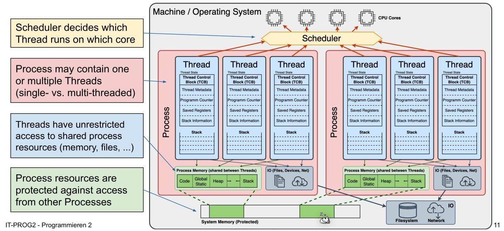
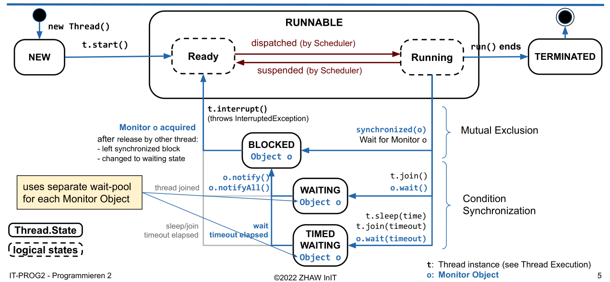
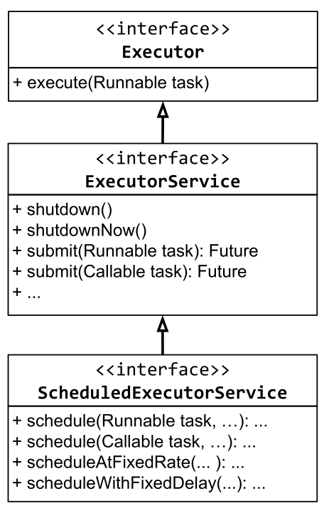

# Concurrency

## Types of Concurrencies

There are multiple types of concurrencies:

* True concurrency
  On a computer with more multiple cores, each core can run a flow independently
* Interleaving concurrency
  Each flow gets a slice of time. After that time the flow will be paused and the core will work on another flow.
  The scheduler controls which core works on which flow

### Strategies for Interlaving Concurrency

* Non-Preemptive (cooperative)

  The process releases the core voluntarily 
  Tyes: FCFS(First comes, first served), SNP(shortest process next). This was how it was in the olden days 

* Preemtive 
  A scheduler can interrupt a process

## Program vs Process vs Thread

A program is a sequence of instructions and can consists of multiple processes.

A **process** executes a program or part of it and can consists of multiple threads. Each process has its own memory, uses IPC (Inter-Process-Communication) to communicate to other processes and switching between processes is expensive.

A **thread** is part of a process and runs one flow. It shares its memory with the other threads in the same process and switching between thread is cheap.

## Java-Concurrency

### Thread

* `Thread.sleep()` doesn't gurantee that sleep doesn't wake up early or late
* `Object.yield()` will advice the scheduler to release the thread, but there is guarantee that the thread will be suspened
* With `Thread.currentThread` one can get the thread which runs the current thread
* `Thread.stop()`, `Thread.suspend()` and `Thread.resume()` are depricated and potentialy unsafe

#### Lifecycle of a Thread

A Thread is considered "alive" and `Thread.isAlive()` will return true, when the Thread is either ready, running oder suspended (the blocks with the dotted outline)

## Executor Framework

### Executor Service

An `Executor` just promises to execute a given task.

An `ExecutorService` extends `Executor` to allow to shutdown the Executor and to track the progress and the state of a task. The `shutdownNow()` method uses `Thread.interrupt()` under the hood and is thus not deprecated.

The `ScheduledExecutorService` extends the `ExecutorService` to allow a task to be scheduled. The method signitures of the new methods are: 

* `schedule(Runnable task, long delay, TimeUnit unit)`,
* `scheduleAtFixedRate(Runnable task, long initialDelay, long period, TimeUnit unit)`
*  `scheduleWithFixedDelay(Runnable task, long initialDelay, long delay, TimeUnit unit)`

### Thread Pools

A thread pool uses multiple threads which are reused for multiple tasks. Thread pools usually use a queue to hold the tasks to be executed.

A special kind of thread pool is a **Blocking Queue**, which when it's full, will reject newly submitted tasks.

Most `Executor Services` use thread pools underneath.

### Different Executors

| Executor Name                                         | Description                                                  |
| ----------------------------------------------------- | ------------------------------------------------------------ |
| `Executors.newSingleThreadExecutor()`                 | Creates an Executor which only uses one thread               |
| `Executors.newFixedThreadPool(int numOfThreads)`      | Creates an Executor which has the given number of threads. Those thread will be reused |
| `Executors.newCachedThreadPool()`                     | Creates new threads as needed. It will retain Threads for an amount of time (approx. up to 60s) and will stop it after. |
| `Executors.newScheduledThreadPoool(int numOfThreads)` | Creates a new scheduled thread pool with the given number of threads. |
| `Executors.newSingleThreadExecutor()`                 | Creates a new scheduled executor with a single thread        |

