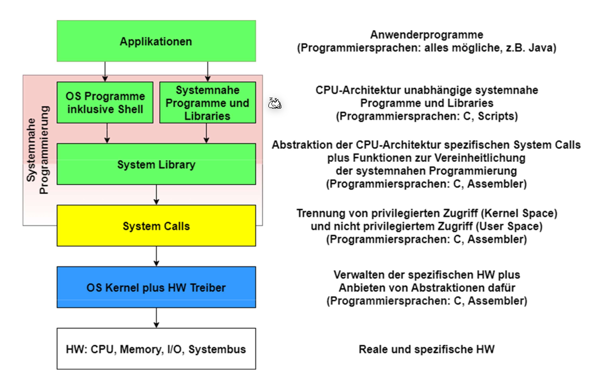

# OS

## Hardware

### CPU

Die CPU führt die Befehle aus und ist Chef des System-Bus. Über den Bus kann die CPU auf den Speicher oder IO zugreifen.

Im `PC` Register (Program Counter) steht, wo in Memory die nächste Maschineninstruktion steht. In `IR`-Register ( Instruction Register) steht die aktuell ausgeführte Instruktion.

`ALU` steht für Arithmentic-Logic-Unit, welches mit Integers rechnet. 

### Memory

Die Memory wird über den System-Bus angesprochen.

### CPU-Entlastung

- Ablaufbeschleunigung in der CPU
  - Cache:beschleunigter Zugriff auf zwischengespeicherte Daten
  - Pipeline:beschleunigte Ausführung durch gestaffelte Verarbeitung

- Arbeitsentlastung der CPU
  - IC: Interrupt Controller vermitteln von Interrupts
  - DMA: Direct Memory AccessDaten kopieren ohne CPU Interaktion
  - FPU: Floating-Point UnitRecheneinheit für Gleitkommazahlen
  - DSP: Digital Signal Processorspezielle Daten-Recheneinheit
  - GPU: Graphics Processing Unit spezielle Graphik-Recheneinheit
  - MPU: Memory Protection Unit
    Überwachung von Adresszugriffen

### Modi

Im Supervisor/Kernel-Mode läuft der Kernel. So bald ein Program auf Funktionalität des Kernels zu greifen möchte, muss ein Sys-Call aufgerufen werden, welcher der Modi wechselt.

## Schichten

## Linux Startup

