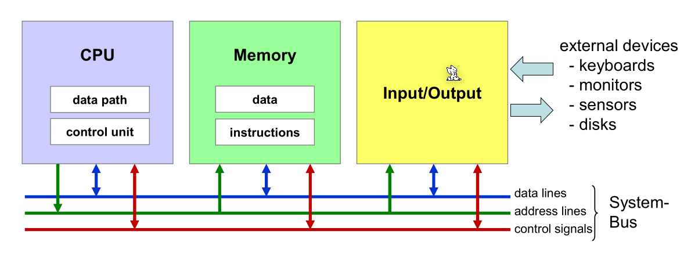

# OS

## Hardware



### CPU

Die CPU führt die Befehle aus und ist Chef des System-Bus. Über den Bus kann die CPU auf den Speicher oder IO zugreifen.

Im `PC` Register (Program Counter) steht, wo in Memory die nächste Maschineninstruktion steht. In `IR`-Register ( Instruction Register) steht die aktuell ausgeführte Instruktion.

`ALU` steht für Arithmentic-Logic-Unit, welches mit Integers rechnet. 

### Memory

Die Memory wird über den System-Bus angesprochen.

### CPU-Entlastung

- Ablaufbeschleunigung in der CPU
  - Cache:beschleunigter Zugriff auf zwischengespeicherte Daten
  - Pipeline:beschleunigte Ausführung durch gestaffelte Verarbeitung

- Arbeitsentlastung der CPU
  - IC: Interrupt Controller vermitteln von Interrupts
  - DMA: Direct Memory AccessDaten kopieren ohne CPU Interaktion
  - FPU: Floating-Point UnitRecheneinheit für Gleitkommazahlen
  - DSP: Digital Signal Processorspezielle Daten-Recheneinheit
  - GPU: Graphics Processing Unit spezielle Graphik-Recheneinheit
  - MPU: Memory Protection Unit
    Überwachung von Adresszugriffen


### Modi

Im Supervisor/Kernel-Mode läuft der Kernel. So bald ein Program auf Funktionalität des Kernels zu greifen möchte, muss ein Sys-Call aufgerufen werden, welcher der Modi wechselt.


## Schichten


## Linux Startup


## Prozess

### Prozess erstellen (`fork()`)

Mit `pid_t fork()` kann ein neuen Prozess erstellt werden, welche eine **Kopie** des aktuellen Prozess ist.. Von diesem Punkt ab laufen zwei Threads den gleichen Code. Im aktuellen Prozess gibt `fork()` die PID des neuen Prozess zurück, im neuen Prozess wird `0` zurück gegeben.

Falls der Return Value kleiner als `0` ist, trat ein Fehler auf.

### `exec()` in neuen Prozessen

`execX()` Funktionen ersetzt den Code in einem Thread. Dies kann zusammen mit `fork()` benützt werden, um ein Programm in einem neuen Thread zu starten.

* `int execv(char *pathname, char *argv[])`
  Führt das Programm bei `pathname` mit den angegebenen Argumenten aus. Der aktuelle Code wird ersetzt
* `int system( char *command)`
  Ist eine Helper-Method, welche mit `fork()` und `execv()` ein neues Programm ausführt und wartet bis das Programm fertig ist. Der Return Value des Programmes wird zurückgegeben. Der angegebene Befehl wird mit `/bin/sh` ausgeführt.
* `FILE *popen(char *command, char *type)` und `int pclose(FILE *stream )`
  Funktioniert wie `system()`. Es wird der Befehl `command` in `/bin/sh` ausgeführt und ein File-Stream zurück gegeben, von welchem mit `fgets(char *s, int size, FILE *stream)` zugegriffen werden kann.
  Der `type` muss `r` für zum Lesen und `w` für zum Schreiben enthalten

### `wait()`

Nach dem ein Prozess beendet wurde, gibt es ihn noch als Zombie-Prozess bis der Parent-Prozess `wait()` oder `waitpid()` aufgerufen hat und den Status so abgeholt hat.

## Threading

### `pthread_create(...)`

Mit `int pthread_create(pthread_t *thread, pthread_attr_t *attr, void *(*start_routine)(void *), void *arg)` kann einen neuen Thread gestartet werden.

Wenn ein neuen Thread erstellt wird, muss entweder `pthread_detach()` oder `pthread_join()`

```c
void *worker(void *arg) {
    printf("worker: hi\n");
}

void main() {
	pthread_t thread;
	pthread_create(&thread, NULL, worker, NULL);
}
```

### `pthread_detach(...)`

`pthread_detach(pthread_t thread)` markiert ein Thread als detached und wenn ein solchen Thread sich beendet, werden die System-Resourcen automatisch freigegeben.

### `pthread_exit(...)`

`pthread_exit(void *retval)` beendet den akutellen Thread mit dem mit gegebenen Wert. Dieser kann mit `pthread_join(...)` abgerufen werden. Processor-Shared-Resources, wie File-Deskriptoren, werden nicht freigegeben.

### `pthread_join(...)`

`pthread_join(pthread_t thread, void** retval)` wartet bis der angegebene Thread sich beendet. Der "Exit-Status" wird in den `retval` Pointer gespeichert. Die System-Resourcen des Threads werden nach dem `pthread_join(...)` zurückkehrt, frei gegeben.

## IO

### INode

Die Repräsentation von einem File.

### Hardlinks vs Softlink

Ein Softlink funktioniert auf dem Filesystem und sagt dem Kernel, das dieses File bei diesem Pfad gefunden wird.

Ein Hardlink ist ein "Link" auf ein INode. Es kann mehrere Namen für ein INode geben. Der INode ist erst gelöscht, wenn es keinen Namen dafür mehr gibt.

### Spezielle Files

* Character Devices
* Block Devices
* Named Pipes
* Sockets

### `FILE*`

Ein File Deskriptor, welcher afu ein File Zeigt.

Folgende Funktionen sind relevant zu `FILE*`


Nach jedem IO Aufruf sollte überprüft werden, ob die Operation erfolgreich war: 


### Buffereing in Streams

* **unbuffered**: Die daten werden sofort weiter geleitet.
* **fully-buffered**: Wenn der Buffer voll ist, wird der Buffer geleert
* **line-buffered**:
  Wenn das Ende der Zeile erreicht wird oder der Buffer voll ist, wird der Buffer geleert

`stdin` und `stdout` sind normallerweisse fully-buffered, **wenn sie nicht mit einem interaktiven Device verbunden sind**. `stderr` ist unbuffere
