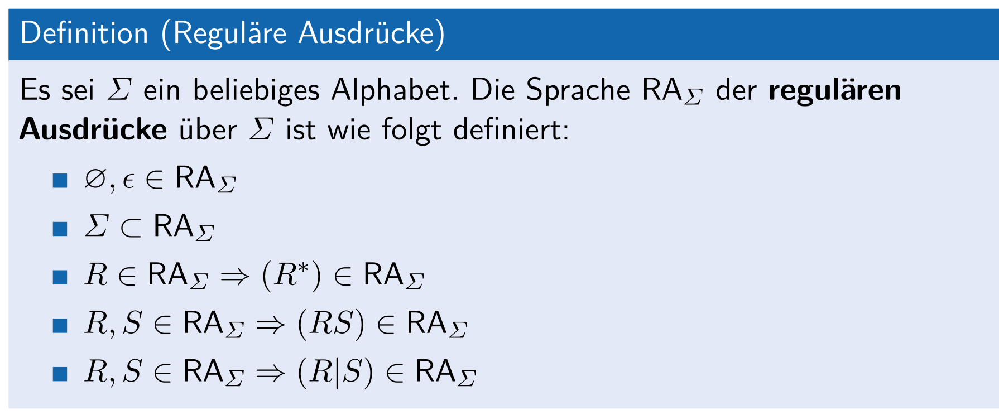

# RegEx

## Syntax vs Semantik

Der Syntax sagt aus, wie die Symbole des Alphabetes zu Wörter angeordnet werden.

Die Semantik sagt aus, was die Symbole bedeuten (z.B. dass die Zahl 101 im Zehnersystem die Zahl 5 ist.)

## Syntax

* $(0|1)$ - entweder 0 oder 1
* $x^*$ - beliebig oft $x$, auch null mal
* $x^+=xx^*$ - mindestens 1-mal $x$
* $x?=(x|\epsilon)$ - $x$ ist optional
* $\epsilon$ - eine leere Regular-Expression. Diese matcht nichts
* $[x_1, x_2, ...,x_k]=x_1|x_2|...|x_k$ 
* $\oslash$ - eine leere Menge von Regular-Expressions
* $\O$ - eine leere Sprache

### Regular-Expression-Sprache

> Die Sprache $RA_\Sigma$ i
>
> Eine Menge von Regexe für das Alphabet $\Sigma$ ist eine Sprache über dem Alphabet $\{\O, \epsilon, ^*, (, ), \vert\} \cup \Sigma$
>
> "Punkt vor Strich"-Regeln für Regex:
>
> * $^*$ vor Konkatenation
> * Konkatenanation vor $\vert$

#### Definitionen

* $L(\emptyset)=\emptyset$
* $L(\epsilon)=\{\varepsilon\}$
* $L(a)=\{a\}$
* $L(R^*)=L(R)^*$
* $L(R|S)=L(R) \cup L(S)$
* $L(RS)=L(R)L(S)$

# Fragen

1. Kommt es nicht auf den Regex darauf an, ob das Alphabet eine Teilmenge der Sprache ist?
2. Wenn $R$ ein Wort ist, wäre die Kleenische Hülle nicht eine Sprache? Wenn ja, wieso ist eine Sprache ein Element einer anderen Sprache?
3. Was bedeutet $\O$?
4. Was ist die Kleenische Hülle eines Regex? (Folie 7)