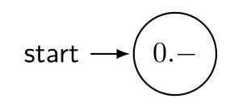
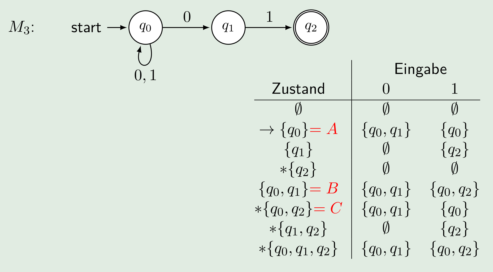
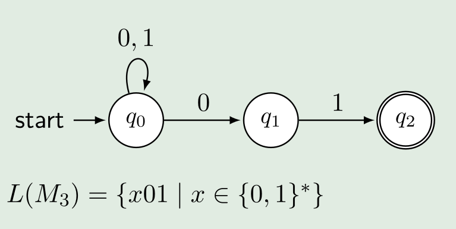

# Endliche Automaten

* Endliche Automaten haben keine Variabeln oder Speicher; Das einzige gespeicherte, ist der aktuelle Zustand
* Endliche Automaten arbeiten in Echtzeit
* Das "Resultat" ist der Endzustand und ob der Endzustand akkzeptiert/valid ist

## Definition eines Endlichen Autommaten

> **Eindlichen Automat**: $M=(Q, \Sigma, \delta, q_0, F)$
>
> * $Q$ : Alle Zustände des Automaten $Q=\{q_0, q_1, ...,q_n\}$
> * $\Sigma$: Eingabealpabet
> * $\delta: Q\times \Sigma \rightarrow Q$: Übergangsfunktionen, welche von einem Zustand und einem Eingabe Symbol zum nächsten Zustand führt
> * $q_0$: Startzustand
> * $F\subseteq Q$: Menge der akzeptierten Zuständen. Mindestens ein Zustand muss akzeptiert sein

### Konfiguration

Eine Konfiguration ist: $(q, w) \in Q\times\Sigma^*$ oder in Worten ist eine Konfiguration ein Zustand mit zusätzlich das noch zu verarbeitende Wort

Eine Startkonfiguration ist ein Element aus $\{q_0\}\times \Sigma^*$ . Als Beispiel: $(q_0, w_1)$

Eine Endkonfiguration ist: $(q, w)\in Q\times\{\epsilon\}$. Als Beispiel: $(q2, \epsilon)$

Das Wort $w$ in einer Konfiguration $(q, w)$ ist der noch zu verarbeitende Teil des Inputwortes. Es ist daher ein Sufix des Inputwortes.

### Berechnungsschritte

Der Berechnungsschritt $\vdash_M$ der Endlichen Maschine $M$ ist definiert als $(q, w)\vdash_M(p,x)$, wenn $w=ax, a\in\Sigma$ und $\delta(q, a)=p$ ergibt. 

Oder in Deutsch $\vdash_M$ der Endlichen Maschine M ist der Berechnungschritt zwischen einem und dem nächsten Zustand.

#### Beispiel

Bei dieser Maschine würde folgendes Beispiel gültig sein: $(q0, a_1a_2a_3)\vdash_A(q_1, a_2a_3)\vdash_A(q_2, a_3)\vdash_A(q4, \epsilon)$

### Berechnungen

Eine endliche Folge von Berechnungsschritten, nennt man **Berechnung**. Es wird die folgende Notation benützt: $(q_a, w_1,w_2...w_n)\vdash_M(q_b, w_2...w_n)\vdash_M...\vdash_M(q_e,w_j...w_n)\vdash_M=(q_a, w_1,w_2...w_n)\vdash^*_M(q_e, w_j...w_n)$

Der $\vdash^*$ Operator stellt alle Berechnungschritten zwischen den zwei angegebenen Schritten dar.

### Ausführung von Automaten (akzeptieren, verwerfen, stranden, Abfallzustand)

Eine Berechnung wird **akzeptiert**, wenn der Endzustand $q_e\in F$ ist, also ein Endzustand ist. Falls dies nicht der Fall ist, wird die Berechnung **verworfen**. Die Maschine wird dann auch gestrantet genannt.

Wenn ein Eingabewort nicht verarbeitet werden kann, weil es für ein Input-Symbol keinen Übergang gibt, geht die Maschine zum **Abfallzustand**. Das Eingabewort wird verworfen.

### Sprache eins endlichen Automaten

Die Sprache eines endlichen Automaten $M$ besteht aus allen Wörtern, welche bei $M$ auf einem akzeptierenden Zustand fallen.

$L(M)=\{w\in\Sigma^*|\text{Berechnung von } M \text{ auf } w \text{ ist akzeptiert}\}$

Jeder endlichen Automat kann als Regex geschrieben werden und umgekehrt.

## Elemente

| Was                                                          | Beschreibung                                                 |
| ------------------------------------------------------------ | ------------------------------------------------------------ |
|  | Der Startzustand                                             |
|  | Normaler Zustand                                             |
|  | Akzeptierter Endzustand                                      |
|  | Übergangsfunktionen: Vom Zustand "0.50" kann zu "1.50" gelaufen werden |

Zusätzlich wird das **Eingabealphabet** definiert. Dies sind die Symbole, welche dem Automaten als Input gegeben weden kann.

## Moore Automaten vs Mealy Automaten

Bei einem Mealy Automaten hängt der nächste Zustand vom aktuellen Zustand und dem Input ab. Beim Moore Automaten hingegen hängt der nächste Zustand nur vom aktuellen Zustand ab.

Für jeder Mealy Automat gibt es einen Moore Automat und umgekehrt.

## Berechnungsmodell

Das Berechnungsmodel beschriebt, wie ein Automat berechnet wird.

1. Definiere die Struktur des Automaten. Für einen endlichen Automaten ist es: $M=(Q, \Sigma, \delta, q_0, F)$. 
2. Beschreibung der Bedeutung (Semantik) der Struktur
   1. **Konfiguration**: Die vollständige Beschreibung eines Zustandes des Automats
   2. **Berechnungsschritt**: Der Übergang von einer Konfiguration zur nächsten

3. **Berechnung:** Die Berechnungsschritte werden gefolgt
4. Jedem Zustand des Automaten können eine Bedeutung zu gewissen werden.

## (Nicht-)Deterministische endlichen Automaten

Bei einem determinisctischen endlichen Automaten ist jede Konfiguration einzigartig. Also bei einem Zustand gibt es für jedes Inputwort ein möglichen nächsten Zustand.

Bei einem **nicht-deterministischen endlichen Automaten** (NEA) ist dies nicht gegeben. Bei der folgenden NEA kann man von $q_0$ mit $0$ zu $q_1$ oder bei $q_0$ bleiben. Daher ist die Berechnungsfunktion $\delta$ anderst definiert: $\delta: Q\times \Sigma\rightarrow \mathcal P(Q)$. Als $\delta$ gibt eine Menge von Zustände zurück ($\mathcal P(Q)$ ist die Potenzmenge von $Q$, also alle Möglichen Teilmengen von $Q$)

Bei solchen Automaten wird jede Möglichkeit ausprobiert. Gewisse Möglichkeiten werden in Sackgassen geraten und gewisse auf einem nicht akzeptierten Feld.

Damit eine NEA ein Wort akzeptiert reicht wenn eine Möglichkeit gefunden wird, bei welchem den Endzustand akzeptiert wird.

 DEA und NEA sind gleichwertig. Eine Sprache kann in beiden Automaten abgebildet werden.

### NEA mit $\epsilon$-Übergänge

Eine Zusätzliche Eigenheit von NEAs sind die die $\epsilon$-Übergänge. Mit diesen kann die NEA den Zustand wechseln, ohne ein Inputwort zu konsumieren.

Die Übergangsfunktion muss mit $\epsilon$-Übergänge noch mals modifiziert werden, da nun das leere Symbol noch hinzugefügt werden muss: $\delta: Q\times \Sigma \cup \{\epsilon\}\rightarrow \mathcal P(Q)$

Unten folgt noch ein Beispiel mit $\epsilon$-Übergänge:

DEAs sind ebenfalls equivalent zu $\epsilon$-NEAs und umgekehrt. Also jede DEA kann in eine $\epsilon$-NEA umgewandelt werden und umgekehrt. 

Um von einer $\epsilon$-NEA zu einer DEA umwandeln, müssen zuerst die $\epsilon$-Übergänge aufgelöst werden. Dafür kann man sich überlegen, was für Zeichen konsumiert werden könnten, wenn man den $\epsilon$-Übergang nimmt. Diese Übergange in den ursprünglichen Zustand aufnehmen. Es kann helfen, dies grafisch zu erledigen. Nach dem auflösen der $\epsilon$-Übergänge wird eine Teilmengenkonstruktion durchgeführt.

## Teilmengenkonstruktion

Mit einer Teilmengenkonstruktion kann aus einer NEA eine DEA erstellt werden.

Die DEA $D=(Q_D, \Sigma, \delta_D, q_0, F_D)$ wird aus der NEA $N=(Q_N, \Sigma, \delta_N, q_0, F_N)$

* $Q_d=\mathcal P(Q_N)$ : Alle Teilmengen von $Q_N$ sind Zustände im DEA
* $F_D=\{S\in Q_D \vert S \cap F_N\neq \O\}$: Alle Zuständ-Teilmengen, welche ein Element mit den akzeptierten Zuständen $F_N$  teilen
* $\delta_D(S, a)=\cup_{p \in S}\delta_N(p, a)$:  Alle Zustände, welche von einem Zustand in der Menge $S \in Q_D$, erreichbar sind

Oder in Worten ausgedrückt:

1. Die Zustände sind die Potenzmenge von $Q_N$
2. Die potentielle Startzustand Kandidaten sind alle diese Teilmengen von $Q_N$, welche $q_0$ enthalten
3. Akzeptierte Zustände sind alle Teilmengen, welche ein Element aus $F_N$ besitzen
4. Aus den Zuständen und eingaben soll nun eine Tabelle gezeichnet werden. Bei dieser können alle Zustände gestrichen werden, welche nicht erreichbar sind. Also nie bei einer Eingabe-Spalte auftauchen. Dies muss solange wiederholt werden, bis nichts gestrichen werden kann. 
   Wenn $\{q_1\}$ in einer Eingabe-Spalte steht, heisst das nur, dass $\{q_1\}$ vorhanden ist. $\{q_1, q_2\}$ muss immer noch gestrichen werden, wenn es nicht selbst vorkommt
   Wenn eine Verbindung das leeres Wort nimmt, werden die Zustände, welche man vom leeren Wort Zustand erreichen kann, auch vom ursprünglichen Wort als erreichbar angesehen.
5. Die noch nicht gestrichenen Resultaten können nun Namen verteilt werden (z.B A-Z)

Das resultiertende DEA aus dem NEA oben ist:

## Äquivalenz von Automaten

* eine DEA ist äquivalent zu einem Regularen Ausdruck und umgekehrt

Dabei ist eine Regularen Ausdruck ein beschreibenden Mechanismus und die DEAs, NEAs und $\epsilon$-EAS akzeptierende Mechanismen.

## Automaten in einen RegEx umwandeln

1. Für jeden Zustand eine separate Sprache definieren. Diese darf sich selbst referenzieren oder auch andere Sprachen
2. Kürzen und einsetzen. Meistens ist es am einfachsten von den Endzuständen zu kürzen zu beginnen

### Beispiel

1. Für jeden Zustand einen Ausdruck aufschreiben:
   $$
   \begin{align}
   L_{q_0}&=(0|1)L_{q_0}|0L_{q_1}\Rightarrow(0|1)^*0L_{q_1}\Rightarrow(0|1)*01\\
   L_{q_1}&=1L_{q_2} \Rightarrow1\varepsilon=1\\ 
   L_{q_2}&=\varepsilon\\
   \end{align}
   $$
   

### Arden'sches Lemma

> $L=UL|V\Rightarrow L=U^*V$, dabei ist $L$ eine Spraceh und $U$ einen andren Ausdruch

## Zustandsklassen

> $[p]=\{w \in \Sigma^*\vert M \text{ endet nach Lesen des Input-Worts } w \text{ im Zustand } p\}$, dabei ist $M$ einen Automaten, $w$ ein eingabe Wort und $p$ ein Zustand (nicht unbedingt der Endzustand)

Folgende Regeln gelten für die Zustandsklassen:

* Jedes Wort landet in einem Zustand (wenn ein Automat strandet oder ein Input nicht verwendet werden kann, wird der zuletzt erreichten Zustand genommen)
* Kein Wort landet in einer DEA in zwei Zustände (gilt nicht für NEAs)

## Untere Schranke für endliche Automaten

Die grundsätzliche Idee  ist, dass wenn die Worte $x$ und $y$ in derselben Zustandsklasse ist, dann ist $zx=zy$, wobei $z$ irgend ein Wort ist.

Es müssen nun die folgende Schritte gefolgt werden:

1. Es wird eine Annahme getroffen, wie viele Zustände eine Maschine benötigt
2. Es müssen für jeden Zustand ein Wort gefunden werden, welches in diesem Zustand endet
3. Es wird nun für jede Kombination von Wörter von Schritt 2. ein Prefix oder Postfix $z$ gefunden werden, welcher kombiniert mit dem einen Wort, ein Wort ergibt, welches in der Sprache ist und mit dem anderen Wort ein, ein Wort welches **nicht** in der Sprache ist
4. Wenn dies für jedes Wort von Schritt 2. getan werden kann, dann werden mindestens so viel Zustände benötigt.  Da wenn zwei Wörter mit demselben Wort verbunden wird und diese in unterschiedlichen Sprache sind, die zwei Wörter in unterschiedlichen Zustände endet.

Beispiel:

