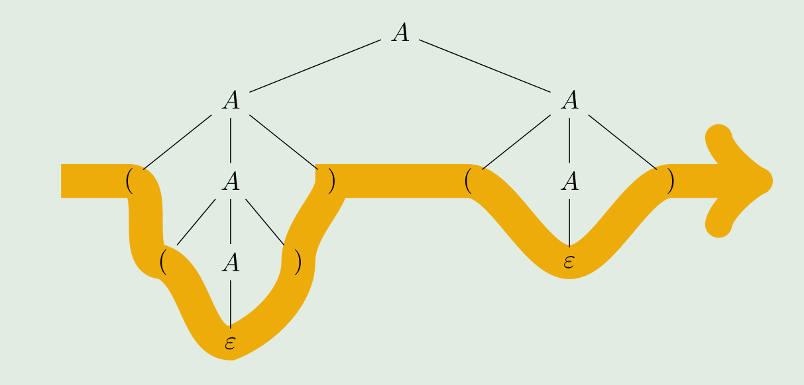

# Kontextfreie Grammatik

>Die Kontextfreie Grammatik $G$ ist durch das Tupel $(N, \Sigma, P, A)$ definiert, wobei
>
>* $N$ das Alphabet der Nichtterminale (Variabeln)ist , welche mit Produktionen in $P$ aufgelöst werden können
>* $\Sigma$ das Alphabet der Terminale ist
>* $P$ eine endliche Menge von Produktionen in der Form $X \rightarrow \beta$ ist. Dabei ist der Kopf $X\in N$ und der Rumpf $\beta \in (N\cup\Sigma)^*$)  
>* $A$ das Startsymbol ist und gilt $A\in N$
>
>Geschrieben kann es folgendermassen:
>$$
>G_1=(\{A\}, \{0, 1\}, P, A) \\\text{wobei gilt: }\\
>P=\{A\rightarrow0A1,A\rightarrow\varepsilon\}
>$$
>Die Sprache $L(G)$ aus der Grammatik $G$ beinhaltet alle Wörter, die in $G$ aus dem Startsymbol $A$ ableitbar sind.
>$$
>L(G)=\{w\in\Sigma^* \vert A\overset{*}{\Rightarrow} w\}
>$$
>Eine Kontextfreie Grammatik wird **mehrdeutig** genannt, wenn es für ein Wort mehrere Ableitungsbäume gibt.
>
>Eine Sprache ist kontextfrei, wenn ein Kellerautomaten dazu gebaut werden kann.

Das folgende Beispiel ist eine kontextfreie Grammatik, welche nur balancierte Klammern als Wort erlaubt. Also `()`, `(())()`, aber nicht `((`.
$$
A\rightarrow (A)\\
A\rightarrow AA\\
A\rightarrow \varepsilon
$$

## Ableitungsschritt

Ein Ableitungsschritt, ist wenn **eine** Variable mit einer Produktion aufgelöst wird. Dies wird notiert mit $\Rightarrow$

Mit der Grammatik von oben, wäre ein Beispiel: $A\Rightarrow AA \Rightarrow (A)A \Rightarrow (A)(A)\Rightarrow()()$

Dabei kann man **linksseitig Ableiten** und **rechtsseitig Ableiten**. Beim linksseitigen Ableiten wird immer die Variable am meisten links aufgelöst bis es keine Nichtterminale mehr hat. Beim rechtsseitigen Ableiten wird immer die Variable am meisten rechts abgeleitet bis es keine Nichtterminale mehr hat.

## Ableitung

Eine **Ableitung** ist eine Folge von Ableitungsschritten. Wenn vom Startsymbol $A$ zum Endwort $w$ abgeleitet wurde, kann dies als $A\overset{*}{\Rightarrow}w$ schreiben. Dazu wird auch gesagt, dass $A$ generiert oder erzeugt $w$.

Ein Wort ist **ableitbar**, wenn es eine Ableitung mit einer Grammatik gibt, welche das Wort ergeben.

## Ableitungsbaum

Der Ableitungsbaum/Parsebäume zeigt auf, in welcher Reihenfolge die Ableitungsschritte angewendet wurde.

## Inhärent mehrdeutig

Wenn man eine Sprache in mehrere Grammatiken unterteilen kann und es Wörter gibt, welche von beiden Grammatiken akzeptiert wird.

## DEA zu kontextfreien Sprache

Es gibt eine DEA $M=(Q, \Sigma, \delta, q_0, F)$. Aus dieser kann eine kontextfreie Sprache erstellt werden:

1. Für jeden Zustand $q_i$ gibt es ein Nichtterminal $Q_i$
2. Für jede Transition $\delta(q_i, a)=q_j$ gibt es eine Produktion $Q_i\rightarrow aQ_j$
3. Für jeden akzeptierten Zustand gibt es eine Produktion $Q_i\rightarrow \varepsilon$
4. Das Nichtterminal $Q_0$ wird das Startsymbol

## Trick zum Entwurf

1. Komplexe KFG können oft in mehrere einfachere KFG aufgeteilt werden
2. Wenn einen endlichen Automaten bereits existiert, kann dieser in eine DEA umgewandlet werden und danach zu einer kontextfreien Sprache umgewandelt werden.
3. Oft erlauben KFG zu viele 

