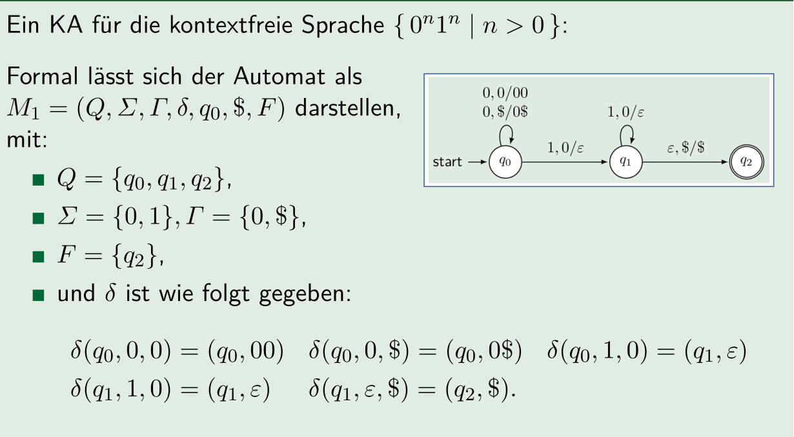
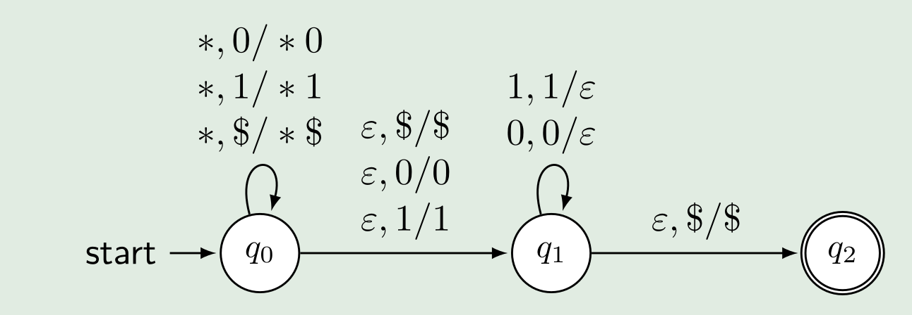
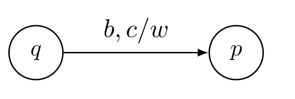

# Keller Automaten

## Deterministischen Kellerautomaten

>Ein deterministischer Keller Automaten (KA) wird als 7-Tupel dargestellt: $(Q, \Sigma, \Gamma, \delta, q_0, \$, F)$)
>
>* $Q$ ist die endliche Menge von Zuständen
>* $\Sigma$ ist das Alphabet der Eingabe
>* $\Gamma$ ist das Alphabet des Kellers (bzw. des Stacks)
>* $\delta: Q\times (\Sigma \cup \varepsilon) \times \Gamma\rightarrow Q\times\Gamma^*$ ist die (partielle) Übergangsfunktion
>* $q_0$ ist der Startzustand
>* $\$\in \Gamma$ ist ein ausgezeichnetes Symbol vom Alphabet des Stacks/Kellers
>* $F\subseteq Q$ ist die Menge der akzeptierten Zustände 
>
>Zu dem gilt für die Übergangsfunktion $\delta$, wenn $\delta(q, b, x)$ definiert ist, darf $\delta(q, \varepsilon, x)$ nicht definiert sein. Das heisst, das leere Wort darf nur benutzt werden, wenn für eine Stackposition kein anderes Symbol definiert ist. Dies stellt sicher, dass der Automat deterministisch ist.
>
>Zu begin der Ausführung ist im Strack $\$$, was ein leerer Stack darstellt.

Als ein weiteres Beispiel, in welchem $*$ als Platzhalter für ein beliebiges Zeichen steht:

## Nichtdeterministischen Kellerautomaten

> Eine NKA ist gleich wie eine KA, nur das die Übergangsfuntkion den Typ $\delta: Q\times (\Sigma \cup \varepsilon) \times \Gamma\rightarrow \mathcal P (Q\times\Gamma^*)$ hat. Der Rückgabetyp ist die Potenzmenge. Somit kann in der NKA ein Eingang mehrere Ausgänge haben.
>
> Wie auch bei einer NEA kann nun im $\varepsilon$ (das leere Wort) für $\Sigma$ in der Übergangsfunktion. 

## Möglichkeiten eines Kellerautomaten

Anders als bei NDA und NEA, welche das gleiche können, gibt es Sprachen, welche nur von nicht deterministischen Kellerautomaten verarbeitet werden können.

Ebenfalls gibt es kontextfreie Sprachen, welche nicht von einem deterministischen Kellerautomaten erkennt werden können. Falls dies aber möglich ist, ist die Sprache eindeutig.

## Berechnungsschritte

Die Berechnungssfunktion dazu wäre: $\delta(q, b, c)=(p, w)$
Dabei befindet sich der Automaten im Zustand $q$, list das Symbol $b$ von der Eingabe und wird das Kellersymbol $c$ vom Stack lesen und $w$ zurück schreiben. Der nächste Zustand wird $p$ sein.

## Berechnung

Eine Berechnung besteht aus mehreren Berechnungsschritte und eine Start- und Endkonfiguration.

Beispiel: $(q_0, 0011, \$) \vdash (q_0, 011, 0\$)\vdash (q_0, 11, 00\$)\vdash(q_1, 1, 0\$)\vdash(q_1, \varepsilon, \$)\vdash(q2, \varepsilon, \$)$ 
Dies kann auch als $(q_0, 0011, \$)\vdash^*(q2, \varepsilon, \$)$ geschrieben werden.

## Sprache eines Kellerautomaten

In einer Sprache eines Kellerautomaten sind alle Wörter, welche von diesem Kellerautomaten akzeptiert werden.

