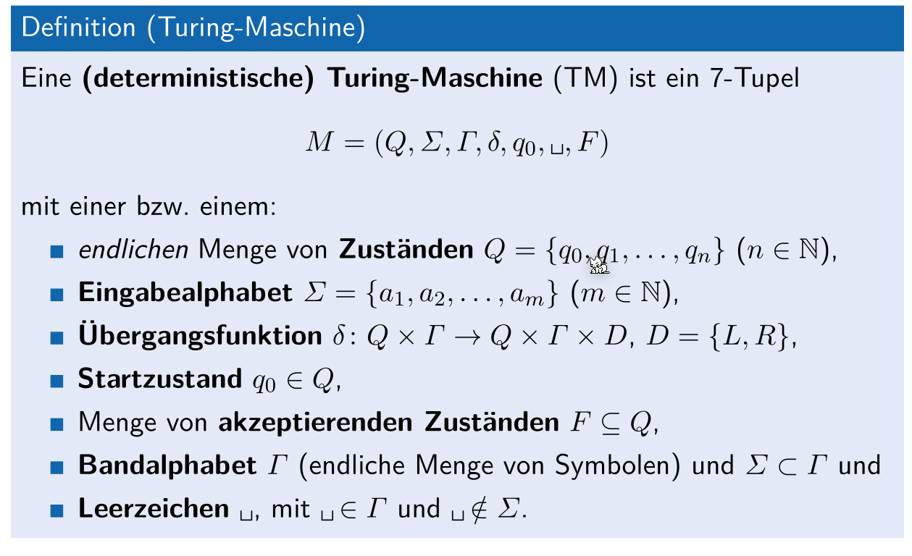
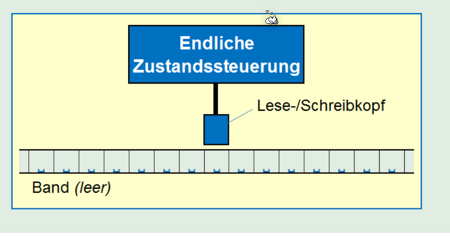
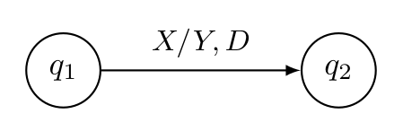
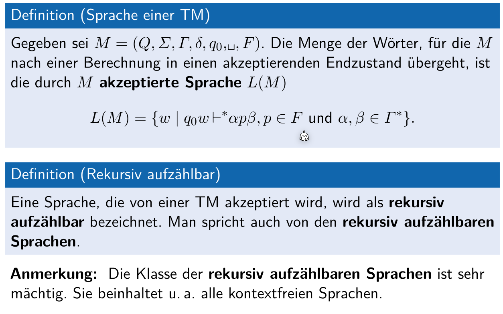

# Turing Machine

>
>
>Eine (determinischtische) Turing-Machine ist ein 7-Tupel: $M=(Q,\Sigma, \Gamma, \delta, \textvisiblespace, F)$
>
>* $Q$: die endliche Menge von Zustände
>* $\Sigma$: das Eingabe Alphabet
>* $\delta: Q\times \Gamma \rightarrow Q\times\Gamma\times D, D=\{L, R\}$: Die Übergangsfunktion, welche den nächsten Zustand, was geschrieben werden soll und ob das Band nach Links (L) oder nach rechts (R) geschoben werden soll
>* $\Gamma$: 
>
>Das Band hat einzelne Zelle, in welchen ein Zeichen von $\Gamma$ enhaltet...

Informell, ist eine Turing Maschine einen endlichen Automat, welche um ein unendliches Band und um einen Lesen-/Schreibkopf ergänzt wurde.

Im folgenden Bild wird eine Übergangsfunktion einer Turing Maschine gezeigt: $\delta(q_1, X)=(q_2, Y, D)$, wobei $D\in\{L, R\}$

## Konfiguration

Eine Konfiguration einer Turing-Maschine ist:

* der aktuelle Zustand $q \in Q$
* die Position des Lese-/Schreibekopf $i$
* der Bandinhalt $X_1,...,X_n \in \Gamma$

Ein Beispiel einer Konfiguration: $X_1,...X_{i-1}qX_iX_{i+1},...,X_n$

## Berechnungsschritten

Ein Berechungsschritt ist der Übergang von einer Konfiguration zur nächsten:

$X_1,...X_{i-1}qX_iX_{i+1},...,X_n\vdash X_1,...X_{i-1}pX_iX_{i+1},...,X_n$

## Berechnungen

Eine Berechnung ist eine **endliche** Menge von Berechungsschritte: $K_1 \vdash K_2 \vdash ... \vdash K_n$.

Dies kann auch abgekürzt als $K_1\vdash^* K_n$ geschrieben werden.

## Sprache einer Turing Maschine

## Rekursiv aufzählbare Sprachen

