# Berechnungsmodelle

## Church-Turning-These & Gandys These M

> **Intuitive berechenbare Funktion**: eine Funktion, welche algorithmisch (durch eine mechanisches Verfahren) berechnet werden kann
>
> **Turing-berechenbare Funktionen**: Funktionen, welche von einer Turing-Maschinen berechnet werden können
>
> Jede intuitive berechenbare Funktion lässt sich mit einer Turingmaschine berechnen.
>
> **Gandys These M**: Alles, was jemals mit einer (endlichen) Maschine/physikalischen Apparatur berechnet werden kann, ist bereits von einer Turing-Maschine berechenbar.
>
> Bis jetzt wurde noch kein Gegenbeispiel zu beiden Thesen gefunden worden.

## Turing-berechenbare Funktion

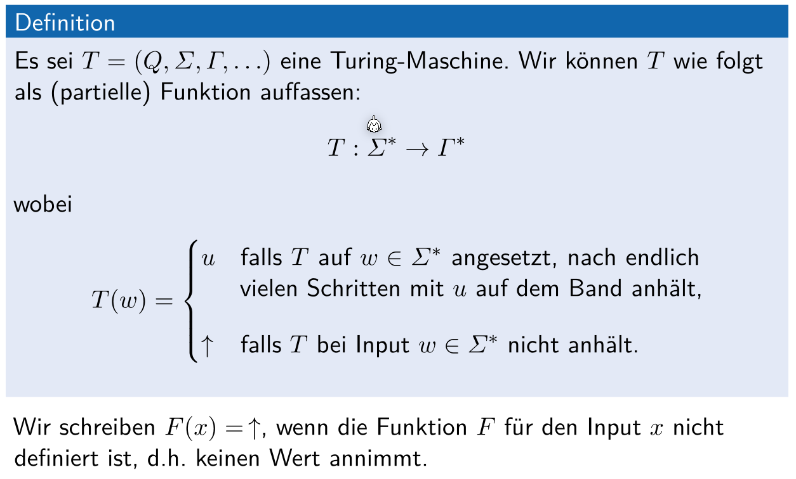

$u$ ist ein Wort. Pfeil noch oben ist nicht teil von $\Gamma$.

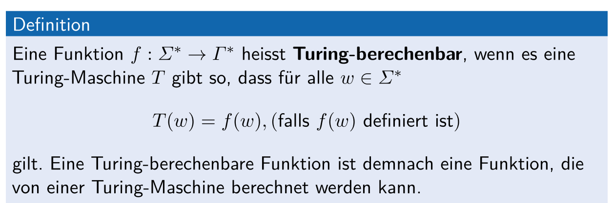

Oder: Wenn es eine Funktion gibt, welche für alle Input Wort anhält.

### Beispiel

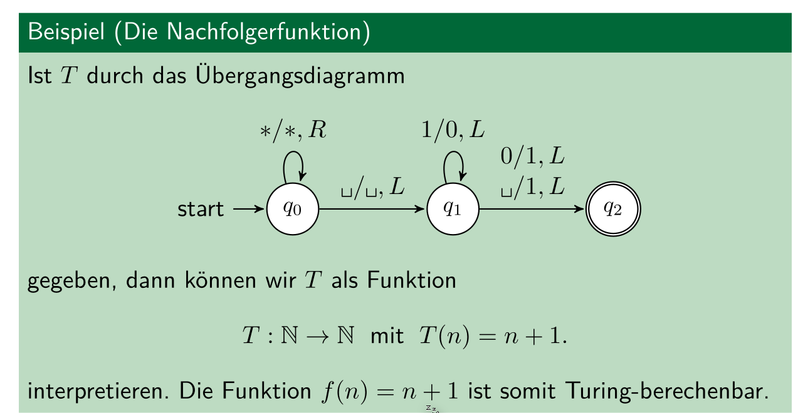

wenn zu `1011` 1 addiert werden soll, wird so lange von rechts nach links gerückt, bis eine 0 gefunden wird. Diese wird zu einem `1` gemacht. Die `1` davor werden zu `0`

## Loop-Programme

> Ein LOOP-Programm besteht aus folgendem:
>
> * Variabeln: $x_0$, $x_1$, $x_2$, ...,$x_k$
> * Konstante: 0, 1, 2, 3, ...
> * Zuweissungen: $x_k=x_j+c$ oder $x_k = x_j - c$

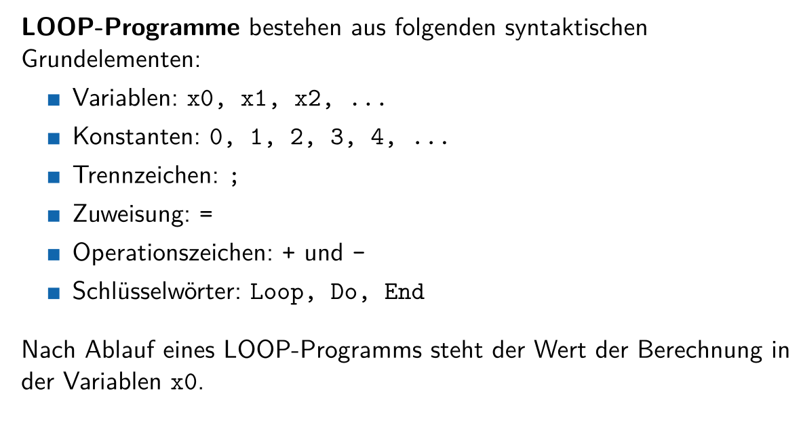

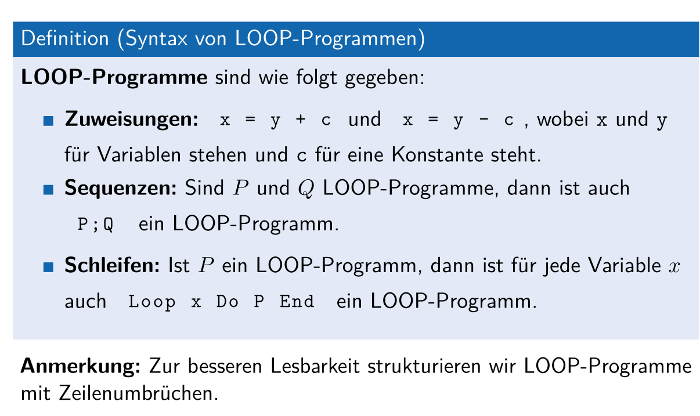

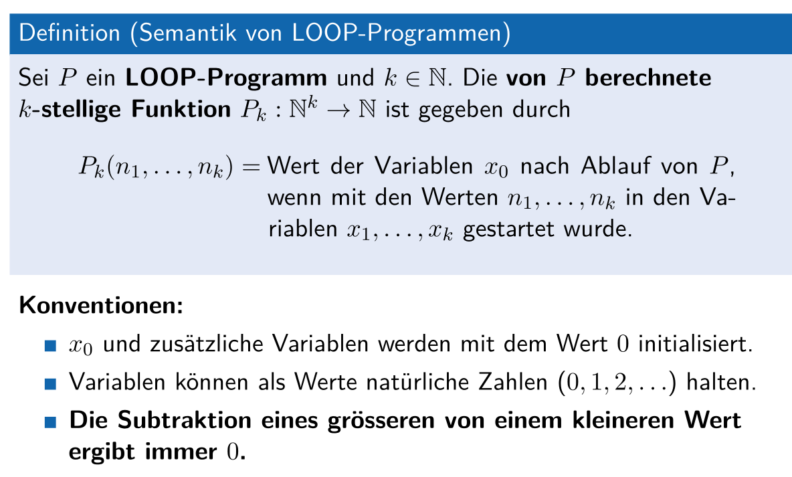

Wenn die Loop-Variable (x3 in `LOOP x3 DO ... END`) im Loop verändert wird, hat dies keinn Einfluss auf die Anzahl Durchläufe.

## While-Programme

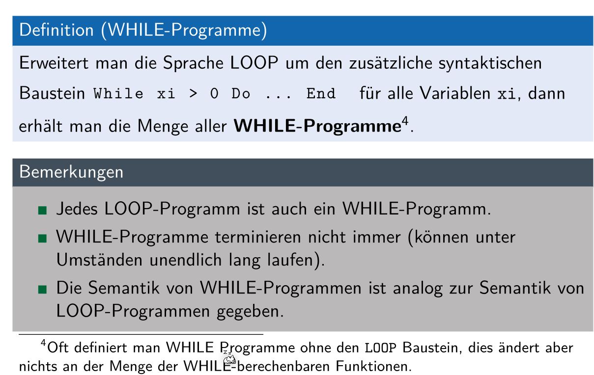

### Turing-Vollständigkeit

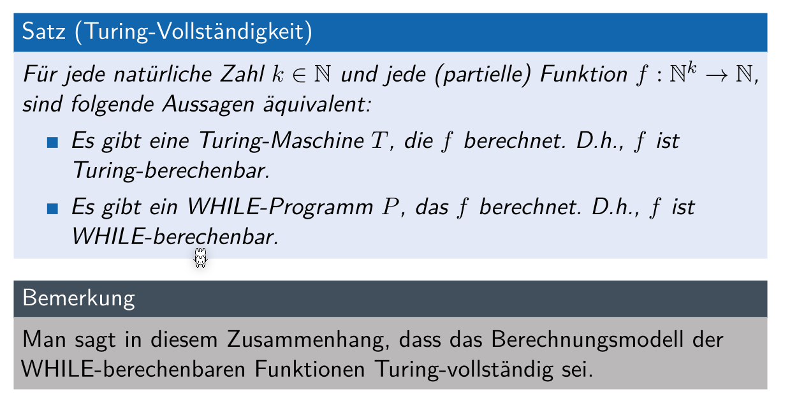

Auch jede Turing-Maschine kann mit einem While-Programm implementiert werden.

## GOTO-Programme

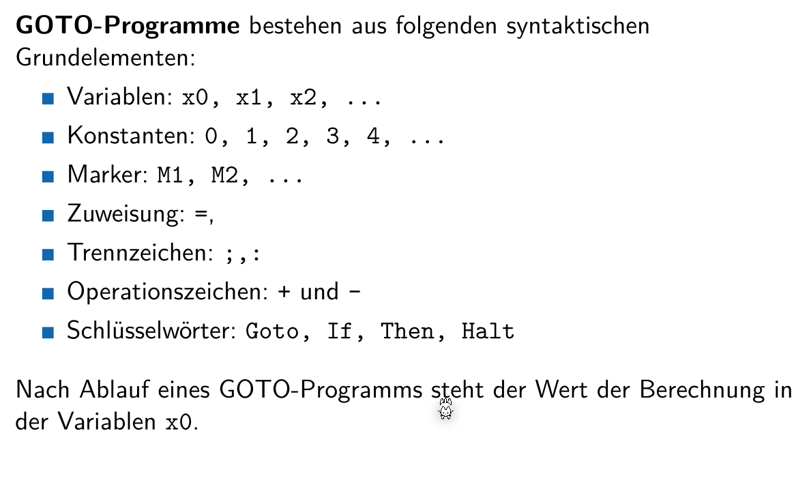

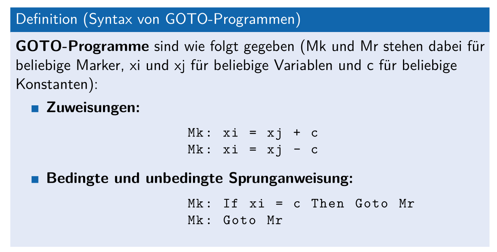

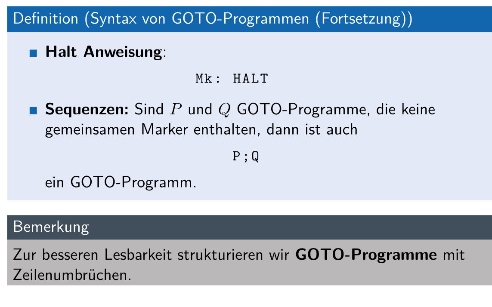

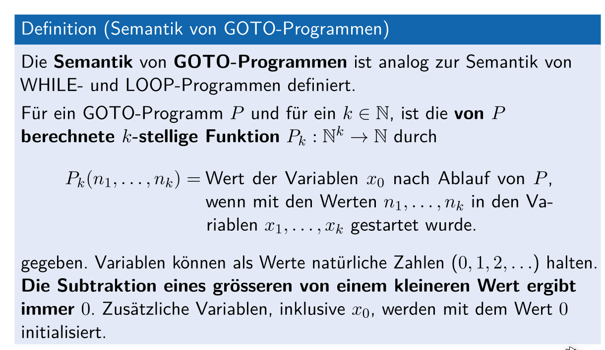

## Primitiv rekursive Funktionen

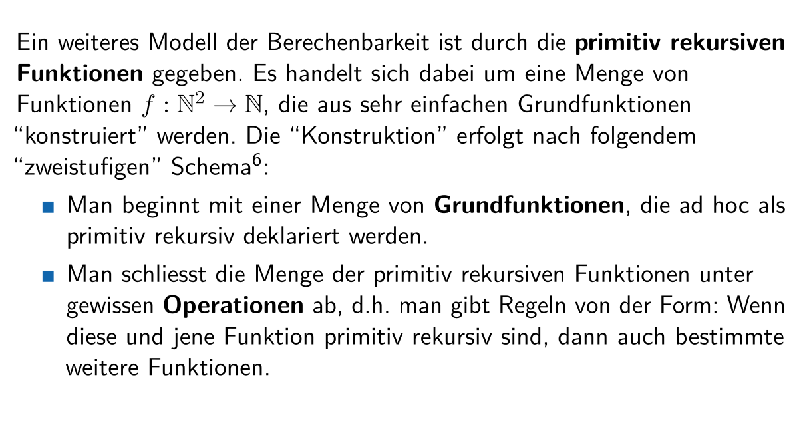

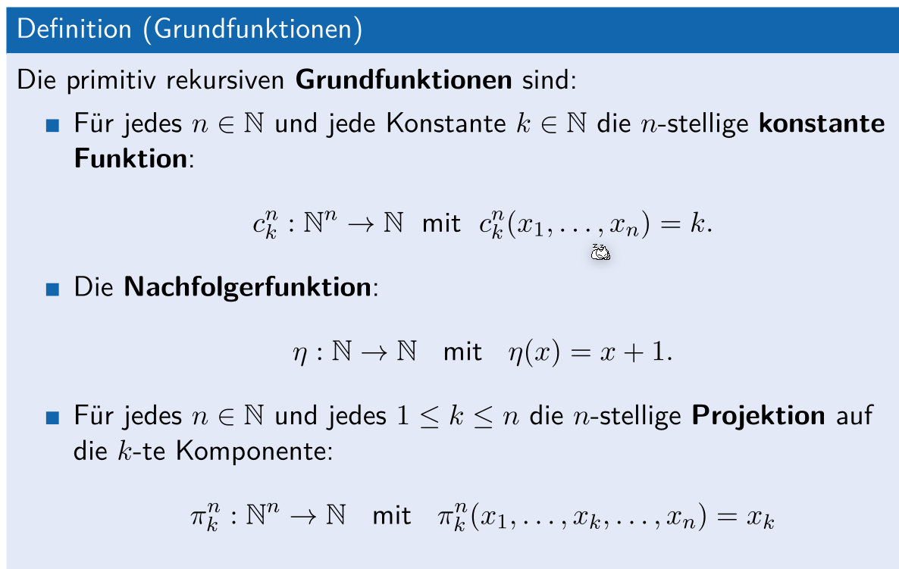

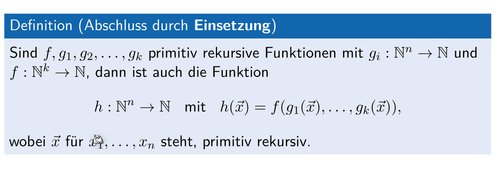

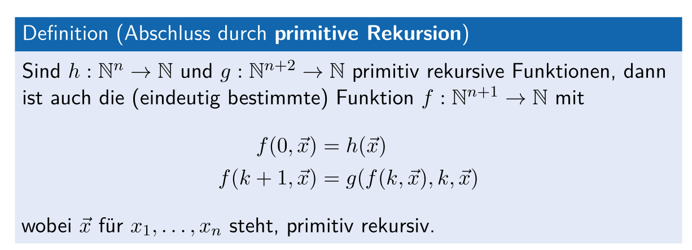

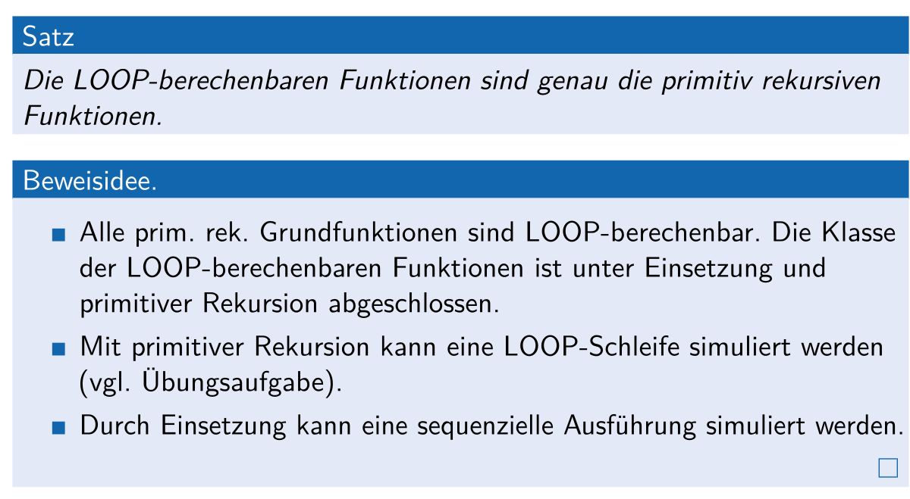

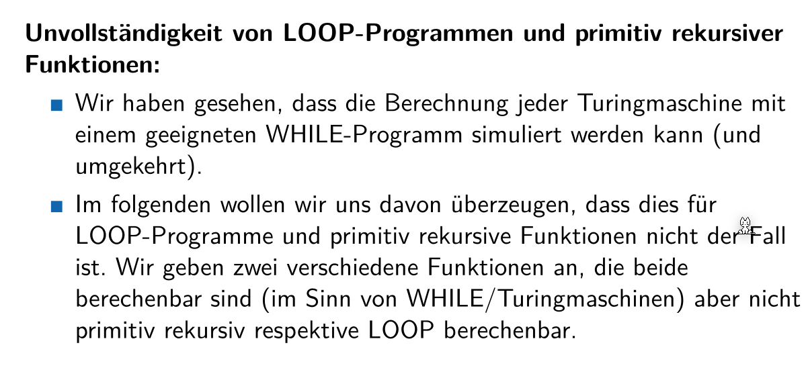

### Ackermannfunktion

Eine Ackermannfunktion $a: \N^2\rightarrow N$ ist durch die Gleichung:
$$
\begin{align}
a(0, m)&= m + 1\\
a(n + 1, 0) &= a(n, 1)\\
a(n + 1, m + 1) &= a(n, a(n + 1, m))
\end{align}
$$
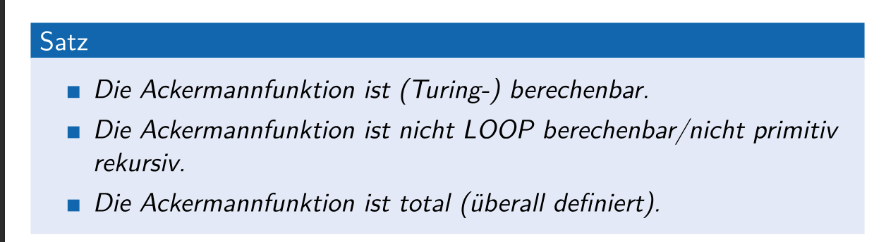

### Loop-Interpreter

