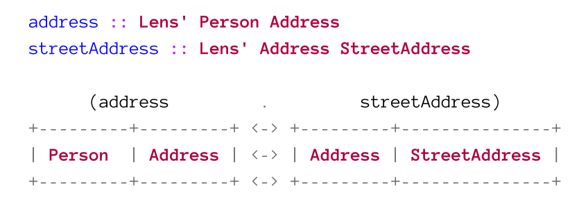
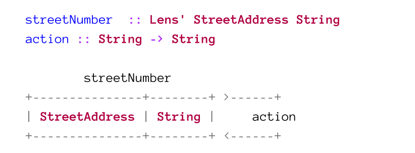

# Optics

## Lenses

A lens abstracts the getter and setter into one value. A lens can focus a single type and always returns a type (so a lens can't return `a` from `Either a b`, because the type could also be `b`).

Their are two types of lenses:

* Simple lens: `Lens' s a`, where `s` is the structure and `a` is the focus type. 
  This lens always returns the same type as it gets and it can be created with `makeLenses`
* Polymorphic Lens: `Lens s t a b`, where `s` is the input structure, `t` the output structure, `a` the input focus and `b` the output focus.
  This type of lenses can change the types of the structure and focus.

```haskell
data Settings a = Settings {
		_path :: String, 
		_object :: a
	} derving (Show)
	
path :: Lens' Settings a
path = lens getter setter
	where
		getter :: Settings a -> String
		getter = _path
		setter :: Settings a -> String -> Settings a
		setter oldSettings newPath = oldSettings{ _path = newPath }

object :: Lens (Settings a) -> (Settings b) -> a -> b
object = lens getter setter
	where
		getter :: Settings a -> a
		getter = _object
		setter :: Settings a -> b -> Settings b
		setter oldSettings newObj = oldSettings{ _object = newObj }
```

### Lens Laws

1. You get back what you set (set-get)
   When you set something, you always get the same thing back

   ```haskell
   view myLens (set myLens newValue structure) == newValue
   ```

2. Setting back what you got doesn't do anything (get-set)
   When you set what `view` returned to you, than nothing changes

   ```haskell
   set myLens (view myLens structure) structure == structure
   ```

3. Setting twice is the same as setting once (set-set)
   Setting multiple times the same value does always do the same thing

   ```haskell
   set myLens diffrentValue (set myLens diffrentValue structure) == set myLens diffrentValue structure
   ```

### Virtual Fields

Lenses can be used to provide an abstraction layer above the actual data structure. Virtual Fields can be created by writing custom lens getters and setter. The getter and setter can apply a function to convert the field. 

This can also be done later, when the underlying data structure changes but the public API shouldn't change.

### Lenses & Operators

The following operators can be used with lenses:

* `view :: Lens' s a -> s -> a`
  Returns the value which the given lens focuses on
* `set :: Lens s t a b -> b -> s -> t` or `set :: Lens' s a -> a -> s -> s`
  Sets the value of the focus of a lens
* `over :: Lens s t a b -> (a -> b) -> s -> t` or `over :: Lens' s a -> (a -> a) -> s -> s`
  Fetches the focused value, applies the given function and then uses set t set the focused value

Some common lenses are :

* `_1 :: Lens (a, other) (b, other) a b`
  Sets the focus on the first element of a tuple
* `_2 :: Lens (other, a) (other, b) a b`
  Sets the focus on the second element of a tuple

### Composing Lenses

Lenses compose very easily.  Imagin each lens being a domino which can be fitted together if the types match. From the expression below, we'll get `address :: Lens' Person StreetAddress`. The `Address` type is "hidden" in the composition. 

At the the right end of a domino line, we can use an action to do something, like modifying the focused value. 

Here an actual Example:
```haskell
wave :: Wool -> Sweater
weave Wool = Sweater

gameState :: (Player, Item Wool)
gameState = (Player Item Wool 5)

-- crafts a sweater
gameState' :: (Player, Item Sweater)
gameState' = over (_2 . material ) weave gameState
```

