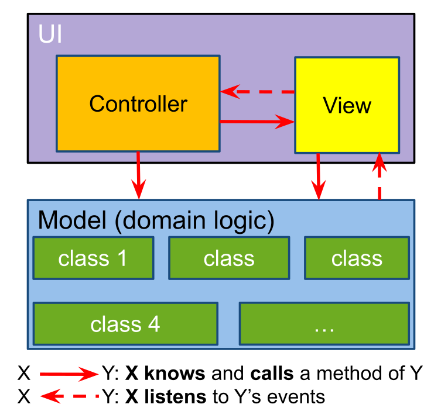

# Patterns

## Strategy Pattern

> Beim Strategy Pattern wird ein Algorithmus in eine Strategy-Klasse extrahiert. Dies erleichtert es, einen Algorithmus mit einem anderen zu wechseln.

Im folgenden Beispiel wird eine Hirachie einer Ente gezeigt. Dabei hat Ente verschiedene Methoden, welche von verschiedenen Entenarten überschrieben werden können. 

Ein Problem, dass bei einer solchen Hirarchie entstehen kann, ist dass es reduntante Implementationen von einzelnen Methoden geben kann. Als Beispiel: Die Stockente und die Reiherente können beide fliegen, während die Gummiente und Dekoente nicht fliegen können. Zwei der Klasse müssen immer `fliegen()` überschreiben.


Als Alternative kann hier das Strategy-Pattern genutzt werden. Nun hat die Ente-Klasse Referenzen zu Strategy-Implementationen, welche entscheiden, ob eine Ente fliegen oder nicht fliegen kann. So kann duplizierter Code verhindert werden


## MVC

> **Model**: Contains the data with the domain logic, but it has to be independent from the View-Classes.
>
> **View:** The UI components which render the data. The view doesn't call the model directly (usually), but it knows about the types of the model (for example via generics).
>
> **Controller:** The glue between the model and the UI. It listens to events from the UI and calls the model accordingly
>
> 

## Decorator

A problem which can occur with inheritance is that the amount of classes can explode. Imagine having a Beverage interface which defines a few methods for accessing information. Now for every different beverage type we have to create a new class and implement the methods. Is there a combination with sugar, sure, let’s make another class out of it.

[](http://www.plantuml.com/plantuml/img/Iyv9B2vMS4ejIorAJ4zLgEQgvU9opazBIqrLqDMjiOFBS8LWY70vvIGcPoChXh2HnSCpIp9yCtEoKUH10bYqEISM59Gc9sVcvMFL1J4s16GcH1p8v78lIatDWpiD9EALM9oRYIg4q8XiBBfCS6bwOX5S2W00)

The “-WithSugar” and “-WithMilk” class could be omitted by using inheritance but not every beverage has the option of milk or sugar (FruitTee or MilkCoffee comes to mind).

A solution to this problem is this:


Every type of beverage still has its own class but instead of having a “-WithMilk” and “-WithSugar” class for every type, there is now a WithSugar and a WithMilk class which extends of the Decorator. Every Decorator has a beverage and its goal is to add information to this beverage. You might also notice that the decorator itself is a beverage. 

This allows this: 

```java
Beverage tee = new WithSugar(new WithMilk(new BlackTee())); 
tee.cost(); // this returns the cost of the black tee and the WithSugar and WithMilk add their own cost
```

What happens here is that the tee object consists of a WithSugar object, which has a WithMilk object as its beverage and the WithSugar object will add the price to the returns value of the WithMilk.cost() method. The same thing happens with the WitthMilk and the BlackTee object.
