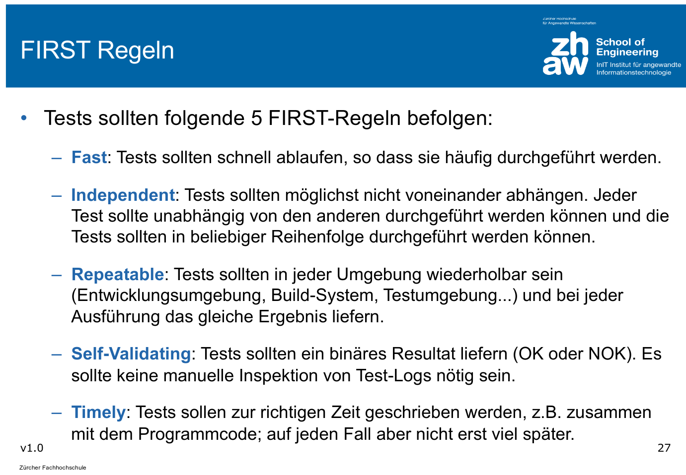

# Testing

## Äquivalenzklassen

In einer Äquivalenzklassen sind alle möglichen Eingabewerte, welche vom Programm gleich verarbeitet werden.

Dabei gibt es **gültige** Äquivalenzklassen, welche Werte beinhalten, welche vom Programm verarbeitet werden sollen und es gibt **Ungültige** Äquivalenzklassen, welche vom Programm erkannt und korrekt behandelt werden sollen (Exception, Return-Value, ...)

Regeln, wenn Äquivalenzklassen gebildet werden:

* Wenn gültige Eingabewerte ein zusammenhängender Wertebereich bilden, so muss eine gültige Äquivalenzklasse und zwei ungültige Äquivalenzklassen gebildet werden
* Wenn Eingabewerte eine Bedinung erfüllen müssen (mit dem Buchstaben ' A' starten), dann muss eine gültige und eine ungültige Äquivalenzklasse gebildet werden.

Aus diesen Äquivalenzklassen können nun Testfälle abgeileit werden. Dabei kann folgendes beachtet werden:

* Ein Testfall darf mehrere gültige Äquivalenzklassen abdecken
* Ein Testfall für ungültige Äquivalenzklassen sollte nur einen ungültigen Wert enhalten
* **Grenzwerte** sollten berücksichtigt werden

## FIRST-Regeln

