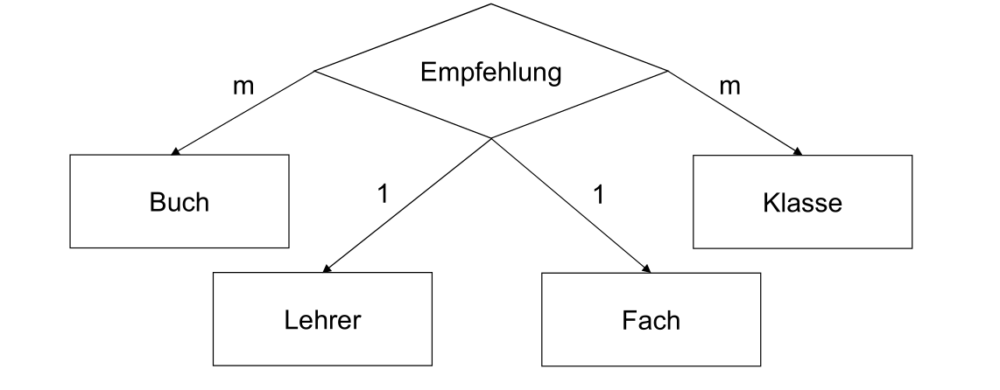

# ER-Diagram

Ein Entitäts-Typ (Tabelen-Schema) wird als Rechteck dargestellt. Die Entität davon wäre die Tabelle selbst, mit den eigentlichen Werten.

Die Attribute werden in einem Oval dargestellt und mit dem Entitäts-Typ verbunden. (Wie in einem Mindmap). Wenn ein Attribut ein Schlüssel ist, dann wird der Attributname unterstrichen.

Ein Rombus wird zu einer Zwischentabelle. 

**Es sollen umbedingt alle Null Werte vermieden werden**

## Kardinalitäten

| Zeichen | Ausgeschrieben | Erklärung       |
| ------- | -------------- | --------------- |
| m       | 0..m           | beliebig viele  |
| 1       | 0..1           | Eine oder keine |

Im unterem Beispiel kann eine Person eine Firma haben (1 -> 0-1) und eine Firma kann mehrere Personen haben (m -> 0-beliebig viele)

In der folgenden Tabelle sieht man, welche Schlüssel in die Zwischentabelle müssen, damit die Kardinalität eingehaltet wird. 
Eine Schlüsselgruppe ist eine Gruppe von Schlüssel. Diese Gruppe muss eindeutig sein, da man mit einem Schlüssel ein Tupel identifizieren können muss. 

Bei einer 1-- <> --1 Beziehung, ist der Primärschlüssel die kleinste Menge von Attribute

| Diagramm         | Schlüssel Beschreibung                              |
| ---------------- | --------------------------------------------------- |
| E 1 -- <> -- 1 F | Schlüssel von E und F in seperaten Schlüsselgruppen |
| E 1 -- <> -- m F | Schlüssel von F                                     |
| E m -- <> -- 1 F | Schlüssel von E                                     |
| E m -- <> -- m F | Schlüssel von E und F in einer Schlüsselgruppe      |

Fname (Firma.Name) müsste unterstrichen sein, da es ein  Schlüssel sein muss.

Folgende Fakten kann man über das obere Beispiel schreiben:

- Jede *Empfehlung* kommt von einem *Lehrer* und kann mehrere *Bucher* beinhalten
- Eine *Zuordung* ordnet mehreren *Empfehlungen* ein *Fach* zu
- *Nutzung* kann mehrere Klassen mit mehreren Zuordnungen verbinden

Die Rechteck-Romben sind Zwischentabellen, welche aber auch referenziert werden und daher auch noch Identitäten sind. Sie werden `Zusammengesetzte Entitätstypen` genannt.

## Terziere Beziehung

| x   | y   | z   | Schlüssel          |
| --- | --- | --- | ------------------ |
| m   | m   | m   | {A1, A2, A3}       |
| m   | m   | 1   | {A1, A2}           |
| m   | 1   | m   | {A1, A3}           |
| m   | 1   | 1   | {A1, A2}, {A1, A3} |
| 1   | m   | m   | {A2, A3}           |
| 1   | m   | 1   | {A2, A1}, {A2, A3} |
| 1   | 1   | m   | {A3, A1}, {A3, A2} |
| 1   | 1   | 1   | {A1}, {A2}, {A3}   |

Ein Beispiel, wie oben, kann interpretiert werden als, pro Klasse und Buch (da beide ein `m` haben) gibt es höchstens 1 Lehrer und Fach.

## Abhängig und Unabhängige Typen

Abhängig ist ein Identitätstyp, wenn er auf eine andere Entität zeigt. Unabhängig ist er, wenn er für sich stehen könnte.

## ISA-Abhängig

ISA = Is A = Ist ein

Im Beispiel: 

- Ein Kunde kann ein Geschäftspartner
- Ein Liferant kann ein Geschäftspartner sein

Der Schlüssel muss bei ISA Beziehungen nicht erweitert werden. Kunde kann nur G# brauchen, da es nicht mehrere Kunden gibt, welche auf denselben Geschäftspartner referenzieren.

## ID-Abhängig

Der Schlüssel von Physisches Buch muss erweitert werden und Ex# und ISBN beinhalten, da man sonst nicht auf ein einzelnes Physisches Buch referenzieren könnte, da es mehrere physische Bücher auf ein logisches Buch geben können.

## Korrektes ER-Diagramm

Mit folgenden Regeln, wird ein korrektes ER-Diagramm erstellt:

1. Definiere die unabhängige Entitäts-Typen (Tabellen, welche keine Fremdschlüssel besitzen)

2. Definiere die Beziehungs-Typen (Rhomben), wenn mehr als eine unabhängige Entitäts-Typen existiert.

3. Definiere die Attribute und Schlüssel

4. Wandle Beziehungstypen ind zusammengesetzte Entitätstypen um, wenn nötig

5. Definiere die ID-Abhänigen Entitästypen (Pfeile mit ID)

6. Definiere die ISA-Abhänigen Entitätstypen (Pfeile mit ISA)

### Relationales Modell

Entitäten werden im Format "Name(<u>Schlüssel1</u>, Attribute2)" angegeben. Wenn ein Attribut unterstrichen ist, dann ist es ein Schlüssel. Die Reihenfolge sollte dieselbe sein, in welcher die Entitäten erstellt wurden.

## BCNF (Boyce-Codd Normal-Form)

* 
