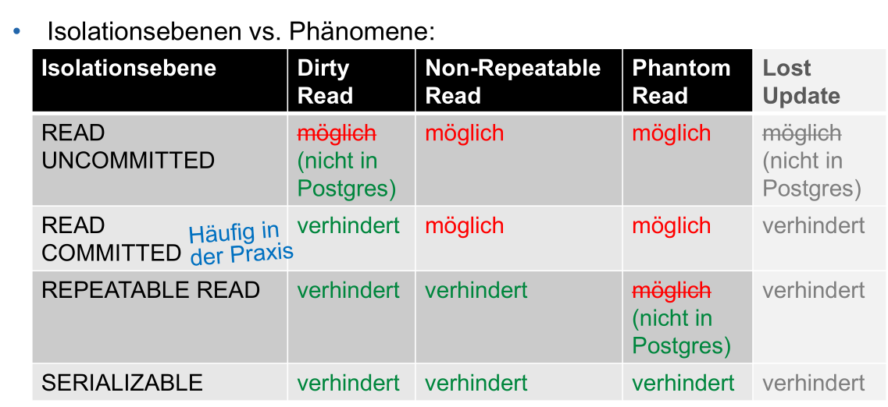

# Integritätsregeln

Wichtig anzumerken, nur weill die Datenbank konsistenz ist, heisst nicht, dass die Daten darin korrekt sind.

## Überprüfbare Regeln

* **Bereichintegrität**
  Das DB-System stellt sicher, dass der Wert eines Attributes in einem Wertebereich ist. Dafür können z.B. `NULL` und `NOT NULL`, wie auch Domänen verwendet werden

* **Entitätsintegrität**
  Der Primätschlüssel kann nicht leer sein. Also nicht `NULL`

* **Refentielle Integrität**
  Der Wert eines Fremdschlüssel muss `NULL` sein oder **genau einen** Primärschlüssel referezieren

* **Constraints**
  Zusätzlich können Constraints geschrieben werden, um weitere Bedingungen zu überprüfen. Siehe [SQL](04_SQL.md)

## ACID

ACID steht für Atomicity, Consistency, Isolation und Durability. Dies sind Eigenschaften, welche von einer Transaktion eingehalten werden soll.

### Atomicity

Entweder funktioniert alle Statements in einer Transaktion oder kein Statement. Wenn ein Fehler auftritt, müssen alle Änderungen davor rückgängig gemacht werden (Rollback).

### Consistency

Nach einer Operation **muss** die DB wieder in einem Konsistenten Zustand hinterlassen werden.

### Isolation

Zwei parallel-laufende Transaktionen dürfen sich nicht beinflussen.

### Durability

Die DB muss erfolgreiche Statements speichern, so dass selbst im Fall eines Absturz diese wieder geladen werden könnten. Falls dies nicht möglich ist, muss auf einen vorgängigen **konsistenten** Zustand zurück gesetzt werden können (Rollback).

## Probleme beim nicht-einhalten von ACID

Folgende Probleme können auftreten, wenn die ACID Eigenschaften nicht eingehalten werden. Manchmal kann man mit diesen Problemen leben, da das Einhalten der ACID-Eigeschaften Performance kostet.

Lost-Update kann fast nie toleriert werden. Die anderen Probleme können zum teil toleriert werden.

### Lost-Update

Ein bereits geschriebenes Update wird wieder überschrieben. Dies kann eintreffen, wenn keine Isolation zwischen den Transaktionen herscht und eine Transaktion den zu schreibenden Bereich nicht sperrt.

Dieses Problem wird gelöst, in dem eine Transaktion Daten, welche von einer zweiten Transaktion gelesen werden, nicht verändern darf.

Beispiel:

|      | Transaktion 1                | Transaktion 2                |
| ---- | ---------------------------- | ---------------------------- |
| 1    | `SEECT wert INTO W FROM tbl` |                              |
| 2    |                              | `SEECT wert INTO W FROM tbl` |
| 3    | `UPDATE tbl SET wert=100`    |                              |
| 4    |                              | `UPDATE tbl SET wert=200`    |
| 5    | `SEECT wert INTO W FROM tbl` |                              |
| 6    |                              | `SEECT wert INTO W FROM tbl` |

### Dirty-Read-Problem

Ein Dirty-Read passiert, wenn Daten von einer noch nicht fertigen Transaktion gelesen werden.

|      | Transaktion 1             | Transaktion 2                       |
| ---- | ------------------------- | ----------------------------------- |
| 1    | `UPDATE tbl SET Wert = 5` |                                     |
| 2    |                           | `SELECT wert INTO w FROM tbl`       |
| 3    | `ROLLBACK`                |                                     |
| 4    |                           | `UPDATE tbl SET wert=w+1`           |
| 5    |                           | `SELECT wert FROM tbl` (Resultat 6) |

Dies wird dadurch verursacht, dass die Transaktion 2 bereits Daten von der noch nicht fertigen Transaktion 1 lesen kann und somit die Isolation-Eigenschaft von ACID verletzt ist. Zusätzlich dürfte dies nicht möglich sein, da die Transaktion 1 die Tabelle `tbl` sperren müsste, um zu schreiben zu können.

### Non-Repeatable-Read

Zwei verschiedene Lese-Zugriff auf den selben Wert lieftert unterschiedliche Resultate.

|      | Transaktion 1                 | Transaktion 2           |
| ---- | ----------------------------- | ----------------------- |
| 1    | `SELECT wert INTO W FROM tbl` |                         |
| 2    |                               | `UPDATE tbl SET wert=6` |
| 3    |                               | `COMMIT`                |
| 4    | `SELECT wert INTO W FROM tbl` |                         |

Das `SELECT` bei 1 würde ein anderes Resultat zurück liefern als das bei 4. Dies kommt davon, da Transaktion 1 sieht was Transaktion 2 verändert hat. Die Transaktion 1 dürfte nur den Zustand der DB sehen, welche am Anfang der Transaktion vorhanden war.

### Phantom-Read

Ein Phatom-Read entsteht, wenn ein Tupel eingefügt oder gelöscht wird, während einer anderen Transaktion und die das sieht. Dies kann in Aggregationsfunktionen auftreten

|      | Transaktion 1                       | Transaktion 2                  |
| ---- | ----------------------------------- | ------------------------------ |
| 1    | `SELECT COUNT(*) INTO ctn FROM tbl` |                                |
| 2    |                                     | `INSERT INTO tbl VALUES (...)` |
| 3    |                                     | `COMMIT`                       |
| 4    | `SELECT COUNT(*) INTO ctn FROM tbl` |                                |

Das Problem ist dasselbe, wie beim Non-Repeatable-Read, dass die Transaktion 1 sieht, was Transaktion 2 commitet hat. Der Unterschied ist, dass sich keine Attributwerte sich verändern, sondern eines Tupel hinzugefügt oder entfernt wird.

Dies kann gelöst werden, in dem Transaktion 1 nur sieht, was zu Beginn der Transaktion sichtbar war.

## Isolationsebenen

Mit `SET TRANSACTION ISOLATION LEVEL {READ UNCOMMITED | READ COMMITTED | REPEATABLE READ | SERIALIZABLE}` kann die Isolationsebenen verändert werden.

(In Postgresql ist `READ UNCOMMITTED` das selbe, wie `READ COMMITTED`)

## Defered Constraint Checking

## Schedules

Der vollständige Schedule beinhaltet alle Schritte, inklusive `COMMIT` und `ROLLBACK` Befehle. Ebenfalls ist für jede Transaktion festgehalten, ob sie erfolgreich war oder nicht. Wenn eine neue Abfrage an den DB-Server gesendet wird, landet diese zuerst im vollständigen Schedule bevor die Befehle auf einen Schedule geplant werden konnten.

Ein Schedule (**nicht** ein vollständiger Schedule) wird von der DB geplant anhand des vollständigen Schedule. Die Planung kann während des Ausführens eines Schedules laufen, so bald dieser fertig ist, wird der nächste ausgeführt.

### Darstellung

### konfliktserialisierbar

Ein Schedule ist konfliktserialisierbar, wenn:

1. d

Anders ausgedrückt, ein Schedule ist serialisierbar, wenn dieser keine Zyklen enthält.

### Scheduler / Transaktionsmanager

Der Scheduler erstellt ein serialisierbaren Schedule für parallel auszuführende Transaktionen.

* Aggresiver Scheduler
  Lässt Konflikte zu und probiert wenn diese auftreten, die zu lösen. Dies führt zu einer höhreren Parallelität
* Konservative Scheduler
  Verscuht möglichst Konflikte zu vermeiden. Dies führt zu einer niedrigen Parallelität

## Sperrverfahre

Generell gillt, dass nach einem Unlock, darf eine Transaktion keine weiteren Locks erstellen und alle Sperren werden beim Transaktionsende (COMMIT/ROLLBACK) aufgehoben.

Wenn keine Sperre erstellt werden kann, dann muss die Transaktion warten, bis diese Sperre aufgehoben ist und der Bereich wieder frei ist. Das kann zu Livelocking, bzw. Verhunger führen, wenn eine Transaktion wiederholt nicht daran kommt, weil eine andere Transaktion immer den Bereich sperrt, wenn er wieder frei wird. Die DBMS versucht dies zu vermeiden, in dem "faire" Algorithmen eingesetzt werden.

### Lese-Sperre (Share Lock)

Bei einer Lese sperre können andere Transaktionen immer noch vom gelockten Bereich lesen, aber nicht mehr Schreiben. Diese Sperre kann nur gesetzt werden, wenn **keine** Schreib-Sperre existiert (eine Lese-Sperre ist kein Problem).

Ein Lesezugriff kann nur getätigt werden, wenn eine Lese-Sperre (oder Schreib-Sperre) auf dem zu lesenden Bereich existiert. 

### Schreib-Sperre (Exclusive Lock)

Bei einer Schreib-Sperre kann der gesperrte Breich nur von dieser Transaktion gelesen und geschrieben werden. Diese Sperre kann nur gesetzt werden, wenn keine andere Spere auf diesem Bereich aktiv ist.

Ein Schreibzugriff kan nur getätigt werden, wenn eine Schreib-Sperre auf dem zu schreibewnden Bereich aktiv ist.

### Regeln

* Bei einem Commit oder Rollback werden alle Sperren aufgehoben

### Probleme

1. **Block**: Eine gesperrte Resource zwingt einen anderen Prozess zu warten, bis die Sperre wieder entfernt wurde
2. **Verhungern**, Livelock: Eine Transaktion kommt nie daran, weil immer wieder andere Transaktionen vor der Transaktion abgearbeitet werden.
3. **Deadlock**: Dies passiert, wenn sich mehrere Transaktionen gegenseitig Sperren.
   Das RDBms erkennt solche Deadlocks. Wenn dies passiert, wird eine Transaktion ausgewählt und zurück gesetzt, um den Deadlock zu behben.
4. **Phantom-Read/Non-Repeatable-Read**: 
   Lösungen: Sperren und/oder Transaktionen isolieren

## Recovery

Wenn die DB nicht ordnungsgemäss herunter gefahren wurde (z.B. mit `pkill` im Terminal), wird eine Recovery eingeleitet, um wieder auf einen konsistenten Zustand zu kommen

1. Der Recovery-Manager kann aus den Transaktionslogs einen vorherigen Zustand wieder herstellen
2. ...

### Fehlerklassifikation

1. **Transaktionsfehler**
   Dies führt zu einem Transaktionsabbruch und einem `ROLLBACK`. Da alle Änderungen rückgängig gemacht werden, hat dies keinen Einfluss auf den Speicher
2. **Systemfehler**
   Die Daten im Arbeitsspeicher wurden (zum Teil) zerstört. Dies kann eine Folge von einem Fehler in der DBMS, vom OS oder auf der Hardware sein. Eventuell wurde das System nicht sauber neugestartet. 
   In diesem Fall wird zuerst versucht die erfolgreichabgeschlossenen Transaktionen anhand des Transaktionslogs wieder herzustellen. Wenn dies fehlschlägt wird auf den letzten konsistenten Zustand zurückgesetzt.
3. **Mediafehler**
   Die Daten auf dem Speichermedium sind korrupt. In diesem Fall kann versucht werden manuell ein Backup einzuspielen. Ev. kann die DB aus den bestehenden Daten wieder auf einen konsistenten Zustand kommen.
