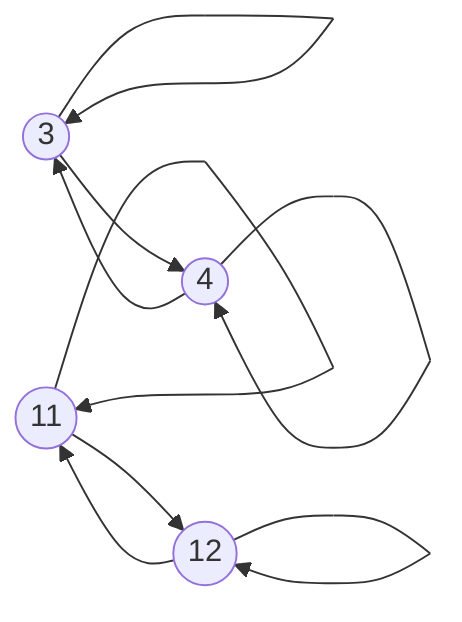
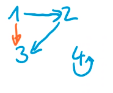

# Mengen

> Menge: Zusammenfassung wohlunterscheidbarer unsortierten Objekte (keine Duplikate sind erlaubt)

[TOC]

## Darstellung

* Explizite Darstellung (Aufzählung)
  * Beispiel: {2, 3, 4}
* Leere Menge
  * Beispiel: {} 
  * Beispiel: $\emptyset$
* Spezielle Zahlenmenge:
  * natürliche Zahlen $\mathbb N_0 =\mathbb N = [0; \infty[$
    * ganze Zahlen: $\mathbb Z = ]\infty: \infty[$
    * rationale Zahlen: $\mathbb Q$ (Alle Zahlen, welche durch einen Bruch darstellbar sind (1/3 ja, $\pi$ nein))
    * reelle zahlen: $\mathbb R$ (Alle Zahlen mit einem Komma  $\sqrt 2, \pi, e$)
    * komplexe Zahlen
* Intervallchreibweisse 
  * $[a,b] := \{x \in \mathbb R | a \leq x \leq b \}$
  * $]a,b] := \{x \in \mathbb R | a < x \leq b \}$
* Prädikatschreibweisse
  * $\{z | z < 10\}$
  * $\{n \in \mathbb N | \text{n ist gerade}\} = \{n \in \mathbb N | \exist z \in \mathbb N (n = 2\cdot z)\}$
* Ersetzungsschreibweisse
  *  $\{F(x) | x \in X\} = \{y | \exists x \in X (y = F(x))\}$
* Grafische Darstellung

## (Echte) Teilmengen

$X \subseteq Y \Leftrightarrow \forall x(x \in X \Rightarrow x \in Y)$

X ist eine Teilmenge von Y. X kann auch Y sein

$X \subsetneq Y \Leftrightarrow X \subseteq Y \wedge X \neq Y$ Dies ist die *echte Teilmenge*, was nichts anderst heisst, dass X eine Teilmenge von Y ist, aber X nicht Y ist.

## Operationen

### Gleichheit

Mengen sind gleich, wenn alle Elemente gleich sind: $X = Y \Leftrightarrow \forall z(z \in X \Leftrightarrow z \in Y)$

Für das Mengen aber gleich sind, muss die Reihenfolge **nicht** übereinstimmen, da Mengen nicht sortiert sind.

### Potenzmengen

> Menge aller Teilmengen

Beispiele:

- $\mathcal P(\emptyset)=\{\emptyset\}$

- $\mathcal P(\{0, 1\})=\{\emptyset, \{0\}, \{1\}, \{0, 1\}\}$

- $\mathcal P(\{a, \{c\}\}=\{\emptyset, \{a\}, \{\{c\}\}, \{a, \{c\}\}\})$

Die Mächtigkeit einer Potenzmenge ist zwei hoch die Mächtigkeit der ursprünglichen Menge $|P(A)|=2^{|A|}$

### Partitionen

Eine Partition von A ist eine Menge von Teilmengen von A, welche nicht leer sind und welche zusammen wieder A ergeben ($\bigcup_{i \in I}P_i = A$)

Beispiel: $A=\{1, 2, 3\}$

- $P=\{\{1\}, \{2\}, \{3\}\}$

- $P=\{\{1\}, \{2, 3\}\}$

### Kardinalität

$$
X=\{1, 2, 3\}\\
|X|=3
$$

Der Betrag von Mengen ist die Anzahl Elemente der Menge.

$|A \cup B| = |A| + |B| - |A\cap B|$

Für disjunkte mengen gillt: $|A \cup B | = |A| + |B|$

Für drei Mengen: $|A \cup B \cup C| = |A| + |B| + |C| - |A\cap B| - |B \cap C| - |A \cap C| + |A \cap B \cap C|$

### Schnittmenge

$X \cap Y$

In der Schnittmenge von zwei Meingen sind alle Elemente, welche in beiden Mengen enthalten sind.

, (a, 2), (a, 3), (b, 1), (b, 2), (b, 3), (c, 1), (c, 2), (c, 3)\}$

$A\times B=\{(a, b) | a \in A \wedge b \in B\}$

Mächtigkeit: $|A \times B| = |A| \cdot |B|$

$A\times B \neq B \times A$ 

Dies liegt daran, dass das Kartesisches Produkt Tupels ergibt und diese sortiert sind. Somit gillt $(x, 1) \neq (1, x)$

Wenn man mehr als zwei Mengen hat, kann man es auch folgendermassen schreiben: $\prod ^n_{A_i}=A\times A_2\times A_n$

### Disjunkte Mengen

X und Y heissen diskunkt, falls sie keine Elemente teilen

$X \cap Y\cap Z=\emptyset$

Paarweise Disjunkte Menge ist eine Menge, wenn sie untereinander keine Elemente Teilen.

### Faktormengen

$^X/_R=\{[x]_R | x \in X\}$

Die Faktormenge besteht aus allen Äquivalenzkalssen. Der Sytanx, wie er oben steht, bedeutet, dass alle Äquivalenzklassen von der Relation R, welche von der Menge X gebildet wurde, in der Faktormenge sind.

> Beispiel:
> 
> $$
> xRy \Leftrightarrow (x - y) \text{ durch 5 Teilbar ist} 
= x\equiv_5 y \\
\text{}^{\mathbb Z}/_{R_{\equiv_5}} = \{[0]_{\equiv_5},[1]_{\equiv_5},
[2]_{\equiv_5}, [3]_{\equiv_5}, [4]_{\equiv_5}\}
> $$

### Äquivalenzklasse

Eine Äquivalenzklasse eines Element beschreibt, welche Elemente damit in verbindng stehen in einer Relation.

> $[x]_R={y \in R | xRy}$

### 

In der oberen Relation gäbe es zwei Relationsklassen: $[3]_R = [4]_R$ und $[11]_R = [12]_R$ 

Die Relationsklasse $[11]_R$ ist dieselbe, wie $[12]_R$ , da in den Klammern ein Vertreter der Relationsklasse steht.

### Komplement (ohne)

$\bar X=\{x | x \in G \wedge x \not \in X\}$

## Rechneregeln

De Morgan: $\overline{A\cup B} = \bar A \cap \bar B$

Komplementgesetzt

## Relationen

Relationen sind das Kartesischeprodukt zweier Mengen: $R \subseteq X \times Y$

Dies ergibt eine Liste von Tupels. Daher kann folgenedes ausgesagt werden: $(x, y) \in R$ was auch als $xRy$ geschrieben werden kann.

Man kann sie folgendermassen Darstellen:

1. TODO

2. Beschreibend: $xRy\Leftrightarrow \text{"y ist doppelt so gross wie x"}$

3. Wahrheitstabelle 

4. Graph im Koordinatensystem

5. Bipartifer Graph
   

6. Gerichter Graphen
   Dieser funktioniert nur mit heterogenen Relationen. Hier ist ein Beispiel:
   

### Komposition

Mit $S\circ R$ wird R mit S gejoint (**Achtung mit der Reihenfolge!!**)

$S\circ R = {(x, z) \in A \times C | \exists y \in B (xRy \wedge y \in Z)}$

### Inverse Relationen

Ist das Pandon von Umkehrfunktionen.

Achtung: $(S\circ R)^{-1}=R^{-1} \circ S^{-1}$

### Gerichtete Graphen

Der folgende gerichtete Graph zeigt die Teilbarkeit von Zahlen in der Menge $\{1, 2, 3, 4\}$ . Ein gerichteten Graph kann man nur mit homogenen Relationen erstellen können.

Die Relation wäre folgendes: {(1, 1), (1, 2), (1, 3), (1,4), (2, 2), (2, 3), (2,4), (3, 3), (3, 4), (4, 4)}

### Relationen und Funktionen

Eine binäre Relation ist eine Funktion, falls für jedes $x \in A$ genau ein $y \in B$ mit $xRy$ existiert. In diesem Fall kann man schreiben: $f: A\rightarrow B \text{ mit } f(x)=y$

Mathematischer ausgedrückt: Eine Relation $f\subseteq A \times B$ ist eine Funktion von A nach B, falls:  $\forall x \in A\exists!y \in B((x, y) \in f)$

In anderen Worte muss die Funktion muss linkseindeutig  (alle Elemente der linken Menge müssen einen Pfeil haben) und Rechtseindeutig (Alle Werte der linken Menge müssen klar **einem** Rechten Wert zu gewissen werden können).

### Injektiv und Surjektiv

Eine Funktion ist **Injektiv** (links**eindeutig** ), wenn zu jedem y es höchstens einmal x mit  $xRy$ zutrifft 

Eine Funktion ist **surjektiv** (rechtstotal), wenn es zu jedem y mindestens ein x gibt mit $xRy$

Wenn eine Funktion injektiv und surjektiv ist, dann nennt man diese auch **Bijektiv**.

Eine Funktion kann linkstotal, rechtseindeutig, rechtstotal und linkseindeutig sein. Dies kann man auch eine bijektive Funktion nennen.

Da bei einer bijektiven Funktion in beiden Mengen alle Elemente "besetzt" sein müssen, müssen sie dieselbe Mächtigkeit haben ($|A|=|B|$)

### Homogene und heterogene Relation

Eine Relation ist homogen, wenn beide Mengen gleich sind. Mathematischer ausgedrückt: $A=B, R \subseteq A \times A$

#### Reflexiität

Es gilt $\forall x \in X (xRx)$ . In Deutsch heisst dies, dass jedes Element auf sich selbst zeigt. Es darf auch Verbindungen gehen, welche nicht auf sich selbst zeigen, aber jedes Element brauch sicher eine Verbindung mit sich selbst.

#### Symmetrisch

$\forall x,y \in X (xRy \Rightarrow yRx)$ oder in Deutsch, wenn x zu y zeigt, muss auch y zu x zeigen.

### Antisymmetrisch

$\forall x,y \in X (xRy \wedge yRx \Rightarrow x=y)$ oder in Deutsch, es darf nur Pfeile geben, welche nur in eine Richtung oder auf sich selbst zeigen.

#### Transitiv

$\forall x,y,z \in X (xRy \wedge yRz \Rightarrow xRz)$ oder in Deutsch, wenn wenn x zu y und y zu z in Verbindung steht, dann muss auch x zu z in Verbindung stehen. 

Transitiv ist eine Relation auch, wenn es nur ein Element gibt, oder auch in speziellen Fälle bei zwei Elemente. Folgende Relation wäre transitiv.

### Heterogene Relation

Heterogen ist eine Relation hingegen, wenn die Mengen ungleich sind: $A \neq B, R \subseteq A \times B$

## Unendliche Mengen

### Begriffe der Unendlichkeit

Eine Menge ist endlich, wenn es eine Darstellung für alle Elemente in der Form $M=\{x_1, x_2, x_3, ..., x_n\}$ gibt. Wenn dies nicht der Fall ist, dann nennt man eine Menge unendlich.

Eine Menge ist *abzählbar*, wenn eine surjektive Funktion $F: \mathbb N \rightarrow X$ existiert. Dass heisst, jedes Element von X muss mindestens ein Element von  $\mathbb N$ haben. Wenn dies nicht möglich ist, nennt man eine Menge *überabzählbar*.

*Abzählbar und unendliche* Mengen sind abzählbar und unendlich.

### Erste Diagonal Argument

Das erste diagonale Argument besagt, dass die Menge $\mathbb N \times \mathbb N$ abzählbar ist. Man kann also eine Funktion bilden, welche wie folgt aussieht: $F: \mathbb N \rightarrow (\mathbb N, \mathbb N)$

Dies kann erreicht wrden, in dem man die Tupels als 2D-Array darstellt und diagonal zählt

Aus dem kann man auch schliessen, dass Vereinigungen von abzählbaren Mengen, abzählbar sind.

$$
\bigcup _{i\in \mathbb N}A_i = \{F_i(j) | i, j \in \mathbb N\}
= \{F_i(j) | (i, j) \in \mathbb N \times \mathbb N\}\\
\text{Daraus kann man die folgende Funktion bilden: }\\
H(i, j)=F_i(j)
$$

Da $\mathbb N \times \mathbb N$ abzählbar ist, muss auch $\bigcup_{i \in \mathbb N}A_i$ abzählbar sein

### Zweite Diagonal Argument

> Die Menge aller unendlichen Binärsequenzen ist überabzählbar

Die Begründung dafür ist: Die Menge soll als folgende Tabelle dargestelt werden:

| Index | Sequenz      |
| ----- | ------------ |
| 1     | 011001000... |
| 2     | 100100100... |
| 3     | 110100100... |
| n     | ...          |

Damit man die Menge überabzählbar nennen kann

## Ordnungsrelationen

Ordnungsrelationen sind Relationen, mit welchen man Objekte in einer gewissen Reihenfolgen ordnen kann.

### Begriffe

Es gibt mehrere Begriffe, welche man typsicherweisse mit den Ordnungsrelationen verwendet. Das R in den folgenden Begriffen ist der Name der Relation. Folgende Begriffe beziehen sich auf einzelne Elemente

* **R-unvergleichbar** nennt man zwei Elemente, wenn weder xRy, noch yRx gilt oder in anderen Worten, wenn die Elemente nicht miteinander verbunden sind.

* **R-minimal** nennt man ein Elemente, wenn kein anderes Element darauf zeigt.

* **R-maximal** nennt man ein Element, wenn es auf kein weiteres Element zeigt.

Nun gibt es noch Begriffe, um Ordnungsrelationen zu benennen:

| Begriff                  | Erklärung                                                                                                                                  |
| ------------------------ | ------------------------------------------------------------------------------------------------------------------------------------------ |
| Präordnung               | Relation, welche reflexiv und transitiv ist                                                                                                |
| Halbordnung              | Relation, welche reflexiv, transitiv und antisymmetrisch ist                                                                               |
| totale-/ lineare Ordnung | Relation, welche eine Halbordnung ist und keine R-unvergleichbaren Elemente besitzt (jedes Element muss mit Jedem indirekt verbunden sein) |
| Wohlordnung              | Relation von M, welche eine totale Ordnung ist, bei welcher alle Teilmengen (ausser $\empty$), mindestens ein R-minimal Element enthalten  |

Es gibt **noch** mehr Begriffe!!!

* $R^+$ ist ein "transitiver Abschluss" und beinhaltet zusätzlich zu R auch noch alle indirekten Verbindungen. 
  Beispiel: Die Menge $M={(a, b), (b, c)}$ ist gegeben, für $R^+$ würde zusätzlich noch $(a, c)$ hinzu kommen.

* $R^*$ ist eine "reflexiver transitiver Abschluss" und beinhaltet zusätzlich zu $R^+$ auch noch die reflexive Werte
  Beispiel: Zusätzlich zu $M^+$ kämen noch folgende Paare hinzu: $(a, a), (b, b), (c, c)$

### Hasse Diagram

Ein Hasse Diagram kann nur für Halbordnungen verwendet werden.

### Graph

Einen Graph wird formal durch eine Menge von Punkten und Kanten zwischen den Punkten beschrieben. Matematisch schreibt man dies folgendermassen: $G=(V, E)$, dabei ist V die Menge aller Punkte und E eine homogene Relation zwischen den Punkten, welche die Kanten beschreiben.

#### DAG

Ein DAG Graph ist ein gerichteter zyklenfreier Graph. Diese kann man z.B. in einem Hasse Diagram darstellen.

$G(V, E \setminus \Delta_V)$

Dabei steht $\Delta_V$ für alle zyklischen Verbindungen. Im unteren Beispiel sieht man einen Graph. Mit den roten Pfeilen wäre es keinen DAG, da diese zyklisch sind.

##### topologische Sortierung

