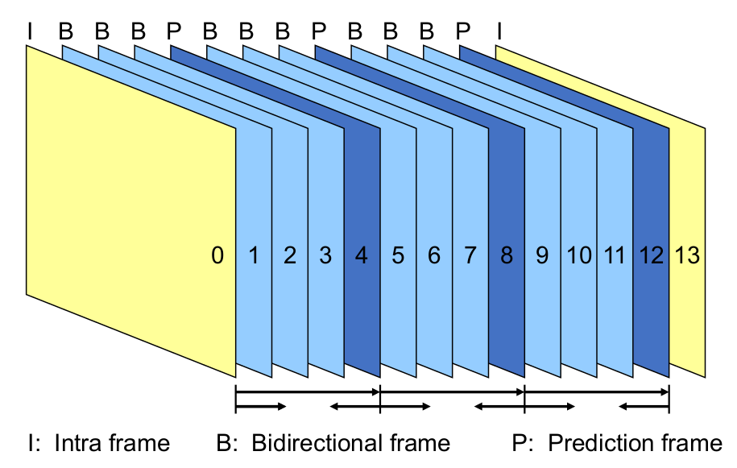

## Was ist ein digitales Bild?

Ein Bild ist ein zweidimensionales Pixel-Array

* schwarzweiss Bild: 2-wertige Pixel

* Graustufenbild: Pixel mit Wertebereich $[0..2^W-1]$, typisch W=8 bit

* natürliches Bild: (Farb-)Pixel mit 3 Komponenten (z.B. RGB). Benachbarte Pixelwerte sind oft fast gleich gross

* Grafik oder syntetisches Bild: haben oft scharfe Kanten

## JPEG Verfahren

1. Das RGB Bild wird zu einem YCrCb Bild umgewandelt

2. Das Bild in 8x8 Blöcke aufteilen

3. Eine Discrete Cosine Transform (DCT) wird auf das Bild angewendet

4. Quanitzation - Es werden gewisse Bildinformationen mehr komprimiert als andere, da sie der Mensch besser wahrnehmen kann

5. DC und AC Seperation

6. Runlength Encoding & Huffman enkodierung

7. In ein File verpacken

Man benutzt bei JPG die Luminance, da das menschliche Auge auf Helligkeit empfindlicher ist

### Schritt 1 - RGB zu YCrCb

* Y - Helligkeitinformationen (eigentlich. ein Graustufenbild)

* Cb - Blau anteil

* Cr - Rotanteil

Im Folgenden Bild sieht man die Beziehung von Cb und Cr:

Um die Luminaz von einem Pixel zu berechnen, kann man eine gewichtetes Summe der RGB Pixel errechnen: $L=0.299\cdot R + 0.587 \cdot G + 0.115\cdot B$. Die Faktoren kommen davon, dass das menschliche Auge die Farben Blau, Gelb und Rot verschieden wahrnehmen.

$\begin{bmatrix} Y \\ C_B \\ C_R \end{bmatrix} = \begin{bmatrix}0.299 & 0.587 & 0.114\\ -0.1687 & -0.3313 & 0.5\\ 0.5 & -0.4187 & -0.0813\end{bmatrix} \cdot \begin{bmatrix} R\\G\\B \end{bmatrix} + \begin{bmatrix} 0 \\ 128 \\ 128 \end{bmatrix}$

Umgekehrt kann man folgende Formel benutzen:

$\begin{bmatrix} R \\ G \\ B \end{bmatrix} = \begin{bmatrix}1 & 0 & 1.402\\ 1 & -0.34414 & -0.71414\\ 1 & 1.772 & 0\end{bmatrix} \cdot \begin{bmatrix} Y\\C_B - 128\\C_R - 128\end{bmatrix}$

## Downsampling

Man gibt mit dem folgenden Muster "Blockbreite:Reduktion Breite:Redutktion Höhe"

## Diskrete Cosinus Transformation (DCT)

Die Idee von einer DCT ist, dass anstatt in einem Pixel zu speichern, wie Schwarz dieser Pixel ist, speichert man, wie stark eine Frequenz in einem 8x8-Block vorkommt. Diese Operation ist komplet reversieble und es werden keine Informationen verloren.

Im unteren Beispiel sieht man eine 1D-DCT. In diesem Fall ist der Pixel-Block 8x1 gross. Im ersten Pixel wird gespeichert, wie hell das Bild ist. Dieser Wert wird auch DC-Wert genannt von Direct Current, da die dargestelle "Frequenz" 0Hz hat, wie man im unteren Beispiel sieht.

Der zweite Pixel stellt danach dar, wie stark die Frequenz mit 1Hz in diesem 8x1-Block verterten ist. Der dritte Pixel, wie stark 2Hz vertretten sind und so weiter.

Dieses Prinzip, wie es in 1D funktioniert, kann auch für ein 2D Bild angewendet werden. Hierbei stellen die Pixel dar, wie stark eine horizontale und vertikale Frequenz vertreten sind. Im Beispiel unten ist der Pixel 1/1 (der erste Pixel) wieder der DC, mit den Frequenzen 0Hz/0Hz. Der Pixel 2/2 hat die Frequenz 1Hz/1Hz, der Pixel 4/3 hat die Frequenzen 3Hz/2Hz. Im unteren Bild sieht man die Muster, welche erkannt werden.

Für diese Konvertierung gilt die folgende Formel:
$$
F_{vu}=\frac 1 4 C_u C_v \sum^7_{x=0}\sum^7_{y=0}B_{yx} \cos(\frac {(2x+1)u\pi} {16})\cos(\frac{(2y+1)v\pi} {16})
$$
Dies gibt für jedes $B_{yx}$ einen Wert $F_{vu}$.

Diese Konvertierung kann mit einer Inversen DCT wieder rückgängig gemacht werden:
$$
B_{yx}=\frac 1 4 \sum^7_{u=0}\sum^7_{v=0}C_uC_vF_{vu}\cos(\frac{(2x+1)u\pi}{16})\cos(\frac{(2y+1)v\pi}{16})
$$
Nach einer DCT ergibt dies ein Resultat, wie dies:

In diesem Bild gibt es einige grössere Werte im oberen linken Ecken. Die anderen Werte sind relative klein. 

## Quantisierung

Beim Quantisieren wird das Resultat der DCT gewichtet. Dafür nimmt man eine weitere  Tabelle mit Werte. Jeder Wert in der DCT Tabelle wird durch den Wert an derselben Position in der Gewichtungstabelle geteilt. Danach wird auf Ganzzahlen gerundet. Damit wirft man Daten weg, welche weniger relevant sind.

## Run-Lenght Encoding

Es gibt folgende Tokens:

* (DC Wert) - Ein Token für den DC Wert. Dies ist der Wert oben links

* (Anzahl Nullen, nächstes nicht Null-Zeichen) - Die Anzahl Nullen vor dem nächsten Zeichen

* (EOB) - End Of Block -> der Rest ist Null

Dies wird danach noch mit einem Huffmancode enkodiert. Dafür kann eine fixen Code verwendet werden oder der Encoder kann einen selbst erstellen.

Der DC Wert wird mit eine "horizontale Prädiktion" verwendet. Dabei sieht ein Token (Anzahl Bits,  $DC_n-DC_{n-1}$). Es wird also die Differenz des DC-Wertes zwischen zwei Blöcken gespeichert, da sich diese selten komplet ändert.

# MPEG

>  Ansatz: Man speichert nicht jedes Frame einzeln, sondern die Unterschiede

### Makroblöcke

Wenn man ein Video komprimiert, teilt man ein Frame in mehrere Makroblöcke auf. Danach sucht man im letzten Bild nach demselben Block. Da man nicht das ganze Bild absuchen möchte, sucht man nur in einem Suchfenster um den Block herum, da man an nimmt, dass sich das Bild nicht gross verändert. 

Wenn kein Makroblock im letzten Frame im Suchfenster gefunden wurde, wird der Block als JPG komprimiert und gespeichert.

Um Makroblöcke zu finden, werden nicht die eigentlich Pixel verglichen, da kleine Änderungen, welche von z.B. von Sensorrauschen verursacht wurde, dazuführen würde, dass man keine Blöcke finden.

MPEG schreibt nicht vor, wie man nach diesen Blöcke sucht. Meistens schränkt man aber das Fenster zwischen 7-15 Pixel ein.

### Frames

* Intra Frame (I-Frame) - Ein koplettes Frame als JPG

* Predicated Frame (P-Frame) - ein vorheriges Frame wird als Referenz benutzt

* Bidirectional Frame (B-Frame) - ein vorheriges Frame, wie auch das nächste Frame kann als Referenz benutzt werden

Da man bei den B-Frames auch voraussehen kann, ist die Reihenfolge der Frames wie man es schaut, nicht dieselbe, wie man es sendet.

### Geschichte

* MPEG-1:
  
  * Typisch für Fernseher
  
  * 318 MBit/s -> 1.5 MBit/s

* MPEG-2:
  
  * Für HD-TV 
  
  * Resultierte in ca. 80 - 100 MBit/s
