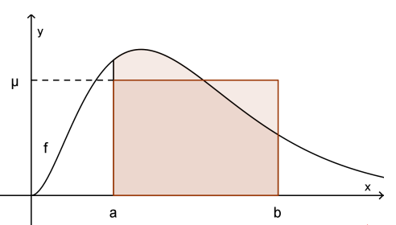
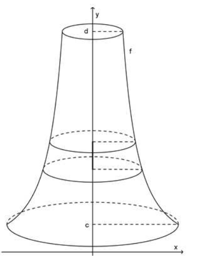
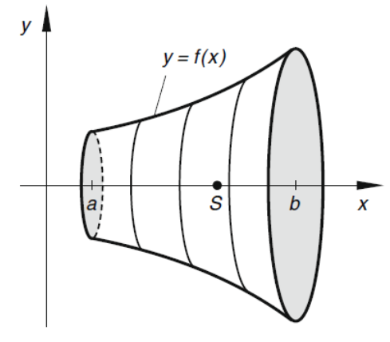

# AN2 Summary 26.01.2022

[TOC]

| Begriff               | Erklärung                                                    |
| --------------------- | ------------------------------------------------------------ |
| gerade Funktion       | Wenn der Graph achsensymmetrisch mit der y-Achse ist (wie bei $x^2$) |
| ungerade Funktion     | Wenn der Graph punktsymmetrisch mit dem Nullpunkt ist (wie bei $x^3$) |
| Komposition           | $(g\circ f)(x)=g(f(x))$                                      |
| Injektive Funktion    | Keine zwei $x$ führen zum selben $y$. Von einer injektiven Funktion gibt es eine Umkehrfunktion. |
| $\sum^5_{k=1}a_k$     | Addiert $a_k$ bis (inklusiv) $5$: $a_1+a_2+a_3+a_4+a_5$      |
| Übliche Summenformeln | $\sum^n_{k=1}k=\frac{n(n+1)}2$ $\sum^n_{k=1}k^2=\frac{n(n+1)(2n+1)}6$ |
| Polynomfunktion       | $f(x)=a_n\cdot x^n+a_{n-1}\cdot x^{n-1}+..+a_1\cdot x + a_0$ |
| Komposition           | $(g\circ f)(2)=g(f(2))$                                      |
| Funktion              | Mapt vom Definitionsbereich $D$ zum Wertebereich $W$         |
| Mitternachtsformel    | $D=b^2-4ac$ und $x=\frac{-b\pm \sqrt D}{2a}$                 |

## Reihen & Folgen 

| Name                | explizite Darstellung | implizite Darstellung               | aufzählende Darstellung                    |
| ------------------- | --------------------- | ----------------------------------- | ------------------------------------------ |
| Arithmetische Folge | $a_n=c+(n-1)\cdot d$  | $a_1=c\\a_{n+1}=a_n+d$              | $c,c+d,c+2d,c+3d,...$                      |
| Geometrische Folge  | $a_n=c\cdot q^{n-1}$  | $a_1=c\\a_{n+1}=q\cdot a_n$         | $c, c\cdot q, c\cdot q^2, c\cdot q^3, ...$ |
| Harmonische Folge   | $a_n=\frac 1 n$       | (nicht üblich)                      | $1, \frac 1 2, \frac 1 3, \frac 1 4, ...$  |
| Fibonacci-Folge     | (nicht elementar)     | $a_1=1, a_2=1\\a_{n+1}=a_n+a_{n+1}$ | $1, 1, 2, 3, 5, 8, ...$                    |

* Arithmetische Reihee
  * $a_k=a_1+(k-1)\cdot d$
  * $s_n=n\cdot a_1+\frac{n(n-1)}2 \cdot d$
  * $\sum^n_{k=0}(k^2)=\frac{n(n+1)(2n+1)}{6}$
  * $\sum^n_{k=0}k=\frac{n(n+1)}{2}$
  * Strebt immer geben $\infty$ oder $-\infty$
* Geometrische Reihe
  * $a_n=q^{(k-1)}\cdot a_1$
  * $s_n=\frac{a_1(q^n-1)}{q-1}$
  * Wenn $|q|<1$ ist, dann ist der Grenzwert $\frac {a_1}{1-q}$

## Grenzwert

- $\lim_{n\to\infty}(c\cdot a_n)=c\cdot \lim_{n\to \infty} a_n$
- $\lim_{n\to \infty}(a_n+b_n)=\lim_{n\to \infty}=\lim_{n\to \infty}a_n + \lim_{n\to \infty} b_n$
- $\lim_{n\to \infty}(a_b\cdot b_n)=\lim_{n\to \infty}a_b \cdot \lim_{n\to \infty} b_n$
- $\lim_{n\to \infty}(\frac {a_n} {b_n})=\lim_{n\to \infty} a_n : \lim_{n\to \infty}b_n$
- $\lim_{n\to\infty}(\sqrt a - \sqrt b)=\lim_{n\to\infty}(\frac{(\sqrt a-\sqrt b)(\sqrt a + \sqrt b)}{\sqrt a + \sqrt b})=\lim_{n\to\infty}(\frac{a-b}{\sqrt a + \sqrt b})$

> Wenn man einen Bruch in einem $\lim$ hat, dann kann mit dem höchsten $n^k$ mit dem höchsten $k$ gekürzt werden
>
> Beispiel: 
> $$
> \lim_{n\to \infty}=\frac{3n^2+7n-3}{n^2+4n-11}=\lim_{n\to \infty}\frac{n^2(3+\frac 7 n-\frac 3 {n^2})}{n^2(1+\frac 4 n - \frac {11} {n^2})}\rightarrow\frac {3+0+0}{1+0+0}=\frac 3 1 = 3
> $$
>

Spezialfall: $\lim_{n\to\infty}(1+\frac 1 n)^n=e=2.718$ 
$$
\text{Speziallfall: }\lim_{n\to\infty}(1+\frac 1 n)^n=e=2.718\\
\text{Beispiel: } \lim_{n\to\infty}(1+\frac{9}{4n})^{-5n}\\
(1+\frac{9}{4n})^{-5n}=(1+\frac{9}{4n}\cdot\frac{\frac 1 9}{\frac 1 9})^{-5n}=(1+\frac 1 {\frac {4n} 9})^{-5n}\\=(1+\frac 1 {\frac {4n} 9})^{-5n\cdot\frac{\frac{4n} 9}{\frac{4n} 9}}=(1+\frac 1 {\frac {4n} 9})^{\frac{4n} 9\cdot \frac{-5n}{\frac{4n} 9}}=(1+\frac 1 {\frac {4n} 9})^{\frac {4n} 9\cdot \frac{-45} 4}\\=((1+\frac 1 {\frac {4n} 9})^{\frac{4n} 9})^{\frac{-45} 4}=e^{\frac{-45} 4}
$$

| Typ                                                          | Funktionswert                        | Beispiel                                                    |
| ------------------------------------------------------------ | ------------------------------------ | ----------------------------------------------------------- |
| **Typ 1**: Hebbare Definitionslücke Das Zähler- und Nennerpolynom haben dieselbe Nullstelle. Diese kann gekürzt werden | Strebt gegen den gekürzten Bruch     |  |
| **Typ 2:** Polstelle Nur das Nennerpolynom hat die Nullstelle.  Dies kann nicht gekürzt werden | Strebt gegen $\infty$ oder $-\infty$ |  |

### Stetigkeit

Eine Funktion ist stetig, wenn man sie zeichnen kann, ohne den Stift abzusetetzen. 
Eine stetige Funktion hat keine Sprünge in der ersten Ableitung und keine Sprünge in der eigentlichen Funktion.

#### Nullstellen finden mit Stetigkeit

1. Zwei Punkte, bei denen der Y-Wert ein verschiedenes Vorzeichen hat
2. Den Mittelwert zischen den Punkten bilden
3. Zu 1. gehen, aber diesem mit dem Mittelpunkt als Punkt, so dass die zwei Pünkte ein verschiedenes Vorzeichen haben

## Hornerschema

Die Werte ($b_n$), welche unter dem Strich stehen, sind die Koeffizenten für das $q(x)$ in $f(x)=(x-x_0)\cdot q(x)$. In diesem fall also $q(x)=3x^3-8x^2+21x-49$. Dafür muss das Resultat/Rest 0 sein!

## Polynomdivision

## Extremwerte (ev. löschen)

| 1. Ableitung | 2. Ableitung | Beschreibung                                           | Bild                                                        |
| ------------ | ------------ | ------------------------------------------------------ | ----------------------------------------------------------- |
| $f'(x)>0$    | $f''(x_0)>0$ | $f$ macht eine Linkskurve nach oben bei $(x_0, y_0)$   |  |
| $f'(x)>0$    | $f''(x_0)<0$ | $f$ macht eine Rechtskurve nach oben bei $(x_0, y_0)$  |  |
| $f'(x)<0$    | $f''(x_0)>0$ | $f$ nmacht eine Linkskurve nach unten bei $(x_0, y_0)$ |  |
| $f'(x)<0$    | $f''(x_0)<0$ | $f$ macht eine Rechtskurve nach unten bei $(x_0, y_0)$ |  |
| $f'(x)=0$    | $f''(x)<0$   | $f$ hat ein lokales Maximum bei $(x_0, y_0)$           |  |
| $f'(x)=0$    | $f''(x)>0$   | $f$ hat ein lokales Minimum bei $(x_0, y_0)$           |  |

|             | $x_0$ heisst              | $f(x_0)$ heisst                   | $(x_0, y_0)$ heisst       |
| ----------- | ------------------------- | --------------------------------- | ------------------------- |
| Maxiumum    | (relative) Maximalstelle  | (relatives) Maximum/Maximalwert   | (relativer) Hochpunkt     |
| Minimum     | (relative) Minimalstelle  | (relatives) Minimum/Minimalwert   | (relativer) Tiefpunkt     |
| Oberbegriff | (relative) Extremalstelle | (relatives) Extremum/Extremalwert | (relativer) Extremalpunkt |

### Wendepunkte und Sattelpunkte (ev. löschen)

Eine Wendepunkt, ist wenn eine Rechtskurve in eine Linkskurve,  oder umgekehrt, geht. Ein Spezialfall ist es, wenn $f'(x)=0$ ist, dann spricht man von einem `Sattelpunkt`. 

> Wenn $f''(x_0)=0$ und $f'''(x_0)\neq 0$ ist, dann ist es sicherlich einen `Wendepunkt`. 
>
> Wenn zusätzlich noch $f'(x_0)=0$ gilt, dann ist es ein `Sattelpunkt`

#### Fragen für die Kurvendiskussion (ev. löschen)

1. Definitionsbereich?
2. Symmetrieeigenschaften (gerade/ungerade), Periode?
3. Schnittpunkte mit Achsen, Polstellen?
4. Randpunkte, bzw. Verhalten, wenn $x$ gegen die Grenzen des Definitionsbereichs strebt?
5. Kandidaten für Extrema bestimmen und untersuchen
6. Wendepunkte suchen
7. Tabelle von Werten aufstellen (falls noch nötig)

## Extremaufgaben (ev. löschen)

1. Zielgrösse identifizieren
2. Unabhängige Variable identifizieren
3. Definitionsbereich bestimmen
4. Zielgrösse als Funktion mit unabhängigen Variabeln als Argument ausdrücken
5. Relative Maxima/Minima bestimmen; Randpunkte auch berürcksichtigen!
6. Welche relative Extrema sind auch absolute?

## Ableiten

| Name                            | Formel                                                       |
| ------------------------------- | ------------------------------------------------------------ |
|                                 | $x^k=k\cdot x^{k-1}$                                         |
| Faktorregel                     | $(c\cdot f)'(x)=c\cdot f'(x)$                                |
| Summenregel                     | $(f+g)'(x)=f'(x)+g'(x)$                                      |
| Produktregel                    | $(u\cdot v)'(x)=u'(x)\cdot v(x)+u(x)\cdot v'(x)$             |
| Quotientenregel                 | $(\frac u v)'(x)=\frac{u'(x)\cdot v(x)-u(x)\cdot v'(x)}{v(x)^2}$ |
| Kettenregel                     | $(F\circ u)'(x)=F'(x)\cdot u'(x)$                            |
| sin                             | $sin(x)'=cos(x)$                                             |
| cos                             | $cos(x)'=-sin(x)$                                            |
| $e^x$                           | $(e^x)'=e^x$                                                 |
| $(a^x)'$                        | $(a^x)'=a^x\cdot \ln(a)$                                     |
| $\ln(x)'$                       | $\ln(x)'=\frac 1 x$                                          |
| $\log_a(x)'$                    | $\log_a(x)'=\frac 1 {x\cdot \ln(a)}$                         |
| Funktionsgleichung für Tangente | $y(x)=f'(x_0)\cdot (x-x_0)+f(x_0)$                           |

> **Achtung**: Nicht jede Funktion ist differenzierbar. Die Ableitung einer Funktion darf keine plötzliche Sprünge machen

### Newton Verfahren

$x_{n+1}=x_n-\frac{f(x_n)}{f'(x_n)}$

## Integrieren

Ableiten: $a\cdot x^n\rightarrow \frac{a}{n+1}\cdot x^{n+1}$

> Schreibweise von Integral von der Fläche zwischen $[a;b]$:  $\int^b_a f(x) \mathrm d x =F(b)-F(a)$$

- $\int a^x \mathrm d x =\frac {a^x}{\ln(a)} + C$
- $\int \ln(x)\mathrm dx=x\cdot \ln(x)-x + C$
- $\int \log_a(x)\mathrm dx=\frac 1 {\ln(a)}\cdot (x \cdot \ln(x) -x) + C$
- $\int \sin(x)\mathrm dx=-\cos(x)+C$
- $\int \cos(x)\mathrm dx=\sin(x)+C$
- $\int \tan(x)\mathrm dx = -\ln |\cos(x)|+C$
- $\int u^{-1}\mathrm dx=\ln(|u|)$

### Substition

1. Substitutionsgleichung für $x: u = g(x)$
2. Substitionsgleichung für $\mathrm dx: \frac {\mathrm du}{\mathrm dx}=g'(x) \Rightarrow \mathrm dx = \frac{\mathrm du}{g'(x)}$
3. Integralsubstition: $\mathrm dx$ und $x$ durch $\mathrm du$ und $u$ ersetzen (Es darf nach dem kürzen kein $x$ im Integral mehr haben)
4. Integration: Bei bestimmten Integralen müssen die Integralsgrenzen auch durch $u(x)$ gelassen werden
5. Rücksubstition (nur bei unbestimmten Integralen): Alle $u$s müssen durch $u(x)$ ersetzt werden

Wenn $u(x)$ linear ist, kann der Satz $\int f(ax + b)\mathrm dx =\frac 1 a\cdot F(ax + b)$ für das integrieren genutzt werden. (Dabei muss $f(x)$ nicht gleich $u(x)$ sein)

### Partielle-Integration

$\int u(x)\cdot v'(x)\mathrm dx = u(x)\cdot v(x) - \int u'(x)\cdot v(x)\mathrm dx$ oder $\int^b_a u(x)\cdot v'(x)\mathrm dx = \left[u(x)\cdot v(x)\right]^b_a - \int^b_a u'(x)\cdot v(x)\mathrm dx$

$u(x)$ muss einfach abgeleitet werden können und $v(x)$ sollte nicht komplizierter in der Stammfunktion werden.

### Partielbruchzerlergung

1. Nullstellen bestimmen: Erraten, mit [Hornerschema](#Hornerschema) oder faktorisieren
2. Jeder Nullstelle eine Summe von Brüchen zuweissen
   1. $x_1$ ist eine einfache Nullstelle $\rightarrow \frac A {x-x_1}$
   2. $x_2$ ist eine doppelte Nullstelle $\rightarrow \frac{B_1}{x-x_2}+\frac{B_2}{(x-x_2)^2}$
   3. $x_3$ ist eine r-fache Nullstelle $\rightarrow \frac {C_1}{x-x_3}+\frac{C_2}{(x-x_3)^2}+...+\frac{C_r}{(x-x_3)^r}$
3. $f(x)$ mit der Summe aller Partialbrüche gleichgesetzt
4. Konstante ($A_i$, $B_i$, $C_i$, ...) bestimmen
   1. Alle Brüche auf den selben Nenner bringen
   2. Für $x$ die Nullstellen einsetzen
   3. Lineares Gleichungssystem lösen

5. Integrieren
   1. $\int \frac 1 {x-x_0}\mathrm dx=\ln\vert x-x_0\vert + C$
   2. $\int \frac 1 {(x-x_0)^2}\mathrm dx=-\frac 1 {1(x-x_0)}+C$
   3. $\int \frac 1 {(x-x_0)^3}\mathrm dx=-\frac 1 {2(x-x_0)^{2}}+C$
   4. $\int \frac 1 {(x-x_0)^r}\mathrm dx=\frac 1 {(1 - r)(x-x_0)^{r-1}}+C$

### Uneigentliche Integrale

* $\int ^\infty_a f(x)\mathrm dx = \lim_{t\to \infty}\int ^t_a f(x) \mathrm dx=\lim_{t\to \infty}F(t)-F(a)$
  * Zuerst die Stammfunktion berechnen und danach $F(t)-F(a)$ berechnen mit $t$ nach $\infty$ gehen lassen
* $\int^b_a f(x)\mathrm dx=\lim_{t \to a} f(x)\mathrm dx=\lim_{t\to a}F(b) - F(a)$

## Differentialgleichungen

> Eine Funktion, in welcher die die gesuchte Funktion $f$ und die Ableitung dieser Funktion $f'$
> Beispiel: 
>
> * $y'=0\rightarrow y=c$ 
> * $y'=y\rightarrow y=c\cdot e^x$
> * $y'=7y\rightarrow y=e^{7x}$
>
> * Ordnung einer Ableitung ist die Ordnung der höchsten vorkommenden Ableitung
> * Die Partikuläre Lösung**?**: 
>   * Anfangsbedingungen: vorgegebene Werte für $y(x_0), y'(x_0),...,y^{(n-1)}(x_0)$
>   * Randbedinungen: vorgegebene Werte für $y(x_1), y(x_2),...,y(x_n)$

### Gewöhliche Differentialgleichung 1. Ordnung

$y'=F(x, y)$

#### Richtungsfeld

#### Euler-Schritte

$x_n=x_{n-1}+h$ und 
$y_n=y_{n-1}+h\cdot F(x_{n-1}, y_{n-1})$  

Dabei ist $h$ die Schrittgrösse. Je kleiner, desto genauer ist die Approximation

### Separierbare Differentialgleichungen

$$
y'=f(x)\cdot g(y)
$$

Die Differentialgleichung darf umgeformt werden, damit sie in diese Form passt ($x+y\cdot y'=0 \Rightarrow y\cdot y'=-x\Rightarrow y'=-x\cdot \frac 1 y$)

1. $y'=\frac{\mathrm dy}{\mathrm dx}=f(x)\cdot g(y)$
2. Trennung der Variablen: $\frac {\mathrm dy}{g(y)}=f(x)\cdot \mathrm dx$
3. Integration auf beiden Sieten($+C$ nicht vergessen): $\int \frac 1{g(y)}\mathrm dy=\int f(x)\mathrm dx$
4. Auflösen nach $y$

#### Autonome Differentialgleichung

$$
y'=f(y)
$$

Autonome Differentialgleichungen sind separierbar.

* autonom:
  * $y'=y^2 + 6$
  * $y'=y^2\cdot \sqrt{1 - \sin(y)}-\ln(y)$
* nicht autonom
  * $y' = x + y$
  * $y'=\frac y x$

### Lineare Differentialgleichungen

$$
y'+f(x)\cdot y=g(x)
$$

1. $f(x)$ und $g(x)$ bestimmen
2. Stammfunktion $F(x)$ und $G(x)$ bestimmen
3. In die Formel $y_0=C\cdot e^{-F(x)}$ einsetzen
4. $C$ durch $K(x)$ ersetzen: $y=K(x)\cdot e^{-F(x)}$
5. $K(x)$ berechnen ($+C$ nicht vergessen): $K(x)=\int g(x)\cdot e^{F(x)}\mathrm dx$ 
6. Einstezen von $K(x)$ in $y=K(x)\cdot e^{-F(x)}$

## Anwendung von Integrale

### Mittelwert

$\mu=\frac 1 {b - a}\cdot \int^b_a f(x)\mathrm dx$

### Arbeitsintegral

Die Formel für die Arbeit ist: $Arbeit=Kraft \cdot Weg$. 
Somit kann mit der Funktion $f(x)$, welche die Kraft an einer Strecke zurück gibt, integriert werden. 

### Rotationskörper

$$
\text{Horizontal: } & V=\pi \cdot \int^b_a(f(x))^2\mathrm dx\\
\text{Vertikal: } & V=\pi\cdot \int^d_c(g(y))^2 \mathrm dx\\
\text{wobei gilt: } &c \le y \le d \text{ und } g(y)=x \text{ ist die Umkehr-Funktion von } f(x)
$$

### Bogenlänge

$$
s=\int^b_a\sqrt{1+(y')^2}\mathrm dx
$$

### Mantelfläche eines Rotationskörpers

$$
M=2\pi \cdot \int^b_a y\cdot \sqrt{1 + (y')^2}\mathrm dx
$$

### Schwerpunkt einer Fläche von zwischen zwei Kurven

$$
x_s=&\frac 1 A \int^b_a x\cdot (f_o(x) - f_u(x))\mathrm dx\\
y_s=&\frac 1 {2A}\int^b_a(f^2_o(x)-f^2_u(x))\mathrm dx
$$

### Schwerpunkt eines Rotationoskörper

$$
x_s=&\frac \pi V \int^b_a x\cdot f^2(x) \mathrm dx\\
y_s=&0\\
z_s=&0
$$

## Taylor-Reihen

$$
p_n=\sum^n_{k=0}\frac{f^{(k)}(x_0)}{k!}\cdot (x-x_0)^k
$$

| Funktion           | $x_0$ | Taylor-Reihe                                                 | Radius   |
| ------------------ | ----- | ------------------------------------------------------------ | -------- |
| $e^x$              | 0     | $\sum^\infty_{k=0}\frac {x^k}{k!}=1+x+\frac {x^2} {2!} + \frac{x^3}{3!}+...$ | $\infty$ |
| $e^{-2x}$          | 0     | $\sum^\infty_{k=0}\frac{-x^{2k}}{k!}=1-x^2-\frac {x^4}{2!} - \frac{x^6}{3!}+...$ | $\infty$ |
| $\sin(x)$          | 0     | $\sum^\infty_{k=0}(-1)^k\cdot\frac{x^{2k+1}}{(2k+1)!}=x-\frac{x^3}{3!}+\frac{x^5}{5!}-\frac{x^7}{7!}$ | q        |
| $\cos(x)$          | 0     | $\sum^\infty_{k=0}(-1)^k\cdot \frac{x^{2k}}{(2k)!}=1-\frac{x^2}{2!}+\frac{x^4}{4!}-\frac{x^6}{6!}+...$ |          |
| $\ln(x)$           | 1     | $\sum^\infty_{k=0}(-1)^{k}\cdot\tfrac 1 {k+1}(x-1)^{k+1}=(x-1)-\tfrac 1 2(x-1)^2+\tfrac 1 3(x-1)^3-\tfrac 1 4 (x-1)^4+...$ |          |
| $x^{-1}=\frac 1 x$ | 1     | $\sum^\infty_{k=0}(-1)^k\cdot(x-1)^k=1-(x-1)+(x-1)^2-(x-1)^3+(x-1)^4-...$ |          |

### Komposition

$$
T_{h,x_0}\text{ bezeichnet die Taylor-Reihe von } h(x) \text{ um } x_0\\
T_{g,f(x_0)}(f(x))=T_{g\circ f),x_0}(x_0)
$$

Beispiel:
$$
f(x)=-x^2\\
g(x)=e^x\\
x_0=0\\
g(x)=e^2\approx T_{g,0}(z)=1+z+\frac {z^2}{2!}+\frac{z^3}{3!}+...\\
g(f(x))=e^{-x^2}\approx T_{(g\circ f), x_0}=T_{g, f(x_0)}=1+(-x^2)+\frac{(-x^2)^2}{2!} \frac{(-x^2)^3}{3!}+...=1-x^2+\frac{x^4}{2!}-\frac{x^6}{3!}+...
$$

### Konvergenz

$$
f(x)=\sum^\infty_{k=0}a_k(x-x_0)^k\\
r=\lim_{k\to\infty}\left\vert\frac{a_k}{a_{k+1}}\right\vert\\
x_1=\vert x - x_0\vert\\
x_2 = \vert x + x_0\vert
$$

$r$ ist der Radius um $x_0$, in welchem das Taylor-Polynom genau ist, wenn $k$ gegen Unendlich geht. $x_1$ und $x_2$ stellen die äusserst möglichsten Punkte, welche vom Taylor-Polynom genau bestimmt werden können. 

## Hopital-Regel

$$
\lim_{x\to x_0}\frac{f(x)}{g(x)}=\lim_{x\to x_0}\frac{f'(x)}{g'(x)}
$$

