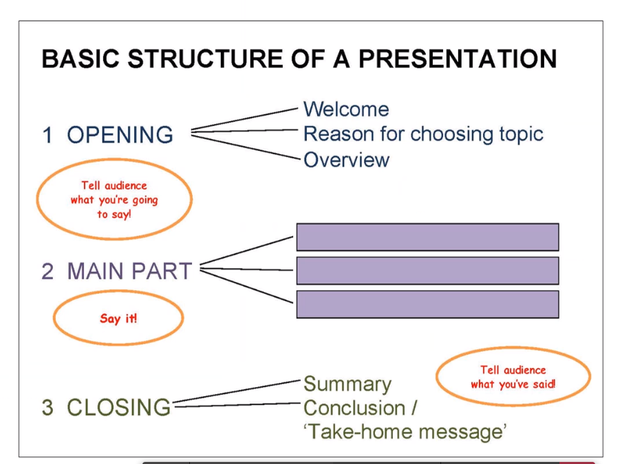

# Presentation

## Presentation

1. Too Much
   Don't present too much
2. Too Complex
   Don't present a topic too complex

## Fachtext

1. Ziel-Publikum
2. Struktur von anderen Fachtext "kopieren"
3. present findings of the research topic
4. Der Text soll informieren (nicht einen anderen Text kommentieren oder appellieren): Informieren mit Neigkeiten (nicht durch Strenge)

Form: 5-10 seitigen Bericht mit Autorenangaben, Titel, Abstract 

Fachtext:

* kein "man"
* Umformung ins Passiv
* Umformung ins Ersatzpassiv
* Nominalsierung statt Verbalisierung

## Poster

- Example?
- Coaching about Presentation?
- The poster has to contain the most important information. The presentation should add something
- Important points:
  - What is the goal/aim of the presentation?
  - What is the take-home message?
  - Call-To-Action in Presentation
  - Reader should be able to absorbe the main content in 2 min
- 50% text - 50% images ratio
- clear structure (columns, circles, rectangles, ...)

Poster Critic

* Plaza