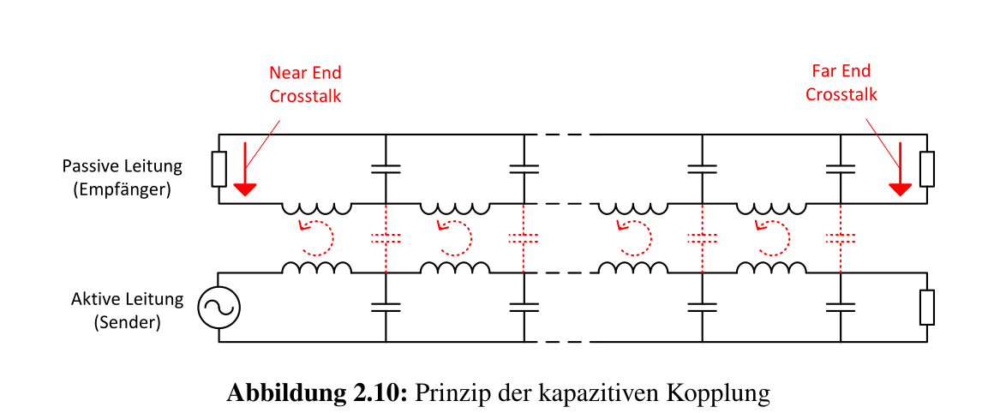

# Übertragungsmedien (Layer 1)

| Begriff               | Erklärung                                          |
| --------------------- | -------------------------------------------------- |
| Freiraum Übertragung  | Medien, wie WLAN, 5G, welche ohne Kabel übertragen |
| symmetrische Leiter   |                                                    |
| Twinax                |                                                    |
| verdrillte Kupferader |                                                    |
| assymetrisch          |                                                    |

## Physik - Ausbreitungsgeswindigkeit

Die Lichtgeschwindigkeit im Glas mit dem Brechungsindex $n=1.5$ ist: $c_{Glass}=\frac{c_0}{n}=\frac{299'792'458}{1.5}\approx200'000\frac{km} s$

In einem elektrischen Leiter ist es ebenfalls $200'000\frac{km}s$

## Signaldämpfung

Wie viel Leistung (in Dezibel) geht auf dem Weg zwischen $U_1$ und $U_2$ verloren.

Die Dämpfung ist $10\cdot \log(\frac {P1}{P2})$. Dabei ist $P1$ die Eingangsleistung und $P2$ die Ausgangsleistung. Dies kann auch als $Signaldämpfung [dB] = 20\cdot \log(\frac{U1}{U2})$, wobei $U1$ die Eingangs- und $U2$ die Ausgangsleistung ist. Ebenfalls gilt $\frac{P1}{P2}=\left(\frac{U1}{U2}\right)^2$

### CAT-Kabel

Bei Übertragungsmedien wird die Signaldämpfung meistens in $\left[\frac{dB}{100m}\right]$ oder $\left[\frac{dB}{km}\right]$ angegben. Diese Grösse wird **Dämpfungsbelag** genannt.

| Bezeichung | Frequenzberreich | Erklörung                                                    |
| ---------- | ---------------- | ------------------------------------------------------------ |
| CAT-1-4    | 0.4/4/16/20 MHz  | Für Telefone und Modemleitungen oder langsames LAN           |
| CAT-5      | 100 MHz          | Weitverbreitet. Erlaubt eine max. Bitrate von 1000Mbit/s bis zu 100m |
| CAT-6      | 250 MHz          | Wird meistens für Gigabit (1000 Mbit/s) benützt              |
| CAT-7      | 600 MHz          | Geeigent für 10 Gigabit.  Es werden aber S/FTP Kabel benötigt |
| CAT-8      | 2000 MHz         | Datenraten bis 40 Gigabit bis zu 30m                         |

## Signal-Noise

Nach einer gewissen Zeit nimmt die Signalstärke ab

## Kabel-Arten

### Koaxialkabel

Ein Koaxialkabel besteht aus einem Leiter. Sie sind geeignet für hochfrequente Signale und haben im Vergleich mit paarsymmetrischen Kabel einen kleinen Dämpfungsbelag und sind unempfindlicher gegenüber elektromagnetischen Störungen. Die Kabel sind dafür relativ empfindlich.

### Paarsymmetrische Kabel (Twisted Pair)

Bei paarsymmetrischen Kabeln wird zwischen geschirmten Kabeln (Shielded Twisted Pair/STP) und ungeschirmten Kabeln (Unshielded Twisted Pair/UTP) unterschieden. Geschirmte Kabel sind störsicherer, aber auch teurer, schwerer und steifer. 

Das Namensschema von Twisted Pairs ist wie folgt: $xx/y\text{TP}$ (Beispiel: U/UTP, S/UTP, ...)

| Werte für $xx$ | Werte für $y$           | Erklärung                     |
| -------------- | ----------------------- | ----------------------------- |
| U              | U                       | ungeschirmt                   |
| F              | F                       | Folienschirm                  |
| S              | S                       | Geflechtschirm                |
| SF             | *&lt;gibt es nicht&gt;* | Schirm aus Geflecht und Folie |

*Schirme funktionieren nur, wenn sie gut geerdet sind!*

#### Twisted pair und Störungen

Zwei Leitungen, welche parallel geführt werden, verhalten sich, wie Sender und Empfänger .

Dies kann minimiert werden, in dem auf zwei Leitungen ein komplementäres Signal gesendet wird. Der Empfänger kann danach die zwei Leitungen zusammen rechnen, und die herauskommende Spannung ist das Störsignal.

Wenn ein Magnetfeld eine Störung induziert (Induktiver Effekt), wirkt sich diese auf die beide Leiter umgekehrt aus. Aus diesem Grund werden die Kabel verdreht. Dadurch entstehen kleinere Schleifen und in der benachbarten Schleife ist die Störung verkehrt, was die Störung grösstenteils aufhebt.

### Glassfaser

Glassfaser-Kabel funktionieren dank der totalen Reflektio.

#### Dispersion

Es wird von Dispersion gesprochen, wenn das Signal verzert und nicht mehr erkannt wird. Es gibt mehrere Ursachen dafür, die offensichtlichste die Modendispersion. Dies passiert, da unterschiedliche Lichtstrahlen einen kürzeren oder längeren Weg (je nachdem wie sie vom Kabel abprallen) haben und so zu verschiedenen Zeiten ankommen. Dieses wird auch Delay Skew genannt. Bei zu hoher Distanz oder zu hoher Pulsdichte kann dies zu Problemem führen.

### Stufenfaser

Kann mit einfachen Leuchtdioten angesprochen werden, hat aber viel Dispersion und Delay Skew (50 ns/km)

### Gradientenfasern

Der Übergang zwischen Glaskern und Schirmung ist ein Verlauf. Dies bewirkt, dass die Moden mit dem kürzesten Weg gebremst werden und sie gleichzeitig mit den Längeren ankommen. Gradientenfasern haben eine Delay Skew von ca. 0.5ns/km

### Monomode-Faser

Es werden Laser-Dioden benötigt, da die Faser zu dünn ist für eine Lichtdiode. Dies macht die Monomode-Fasern auch teuer.