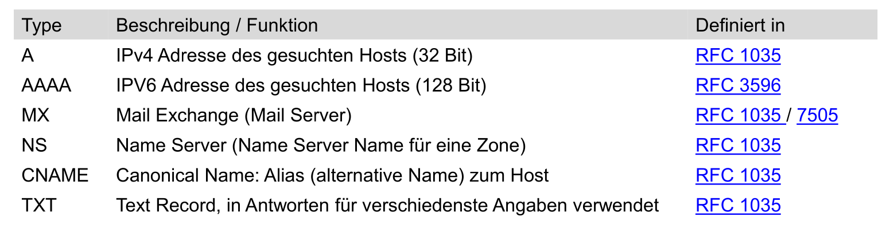
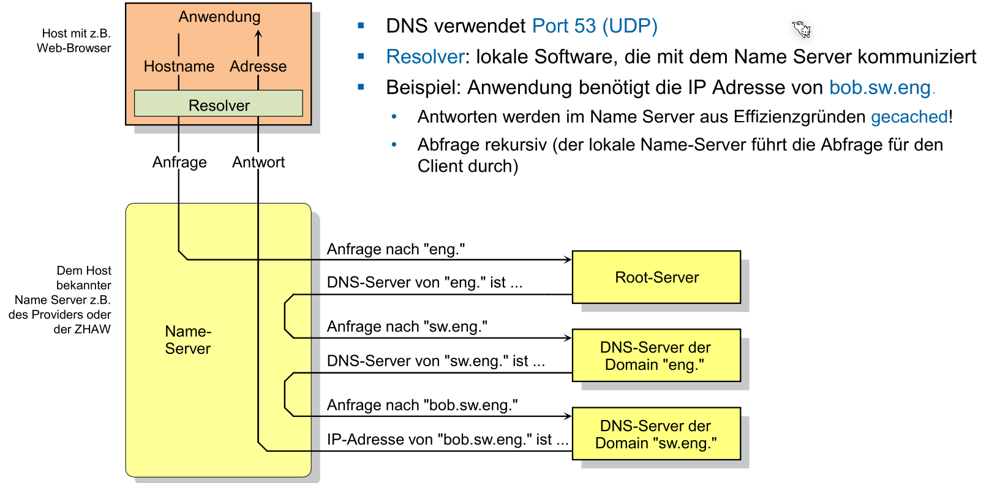
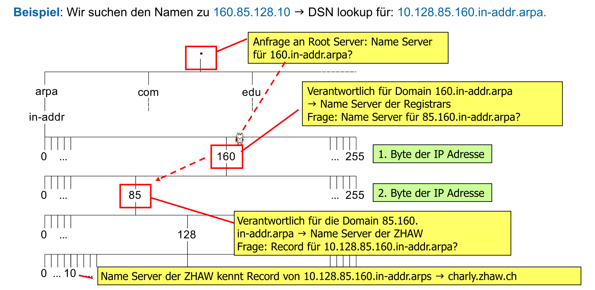
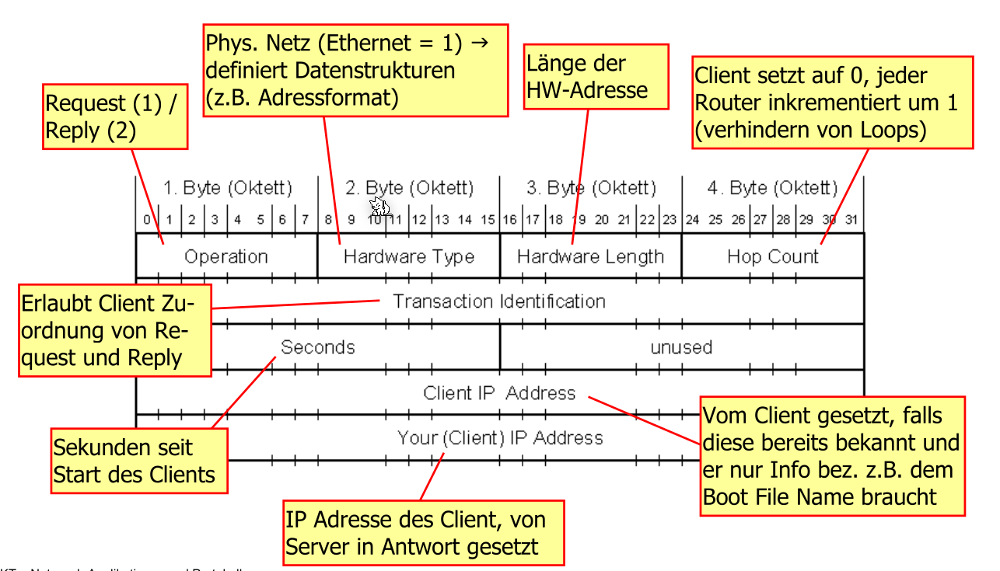
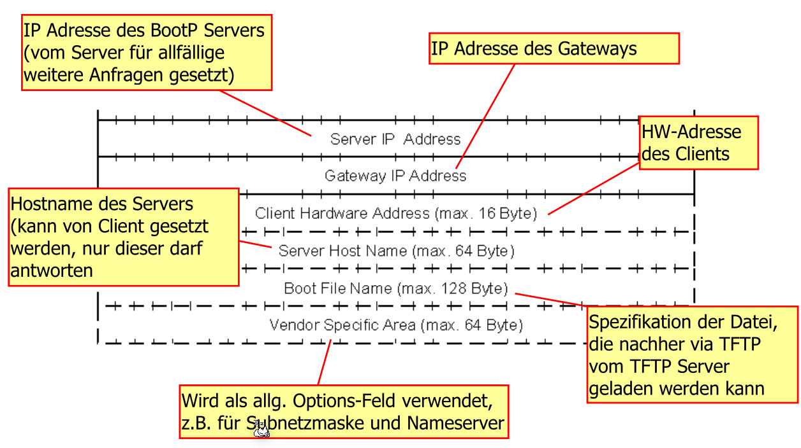
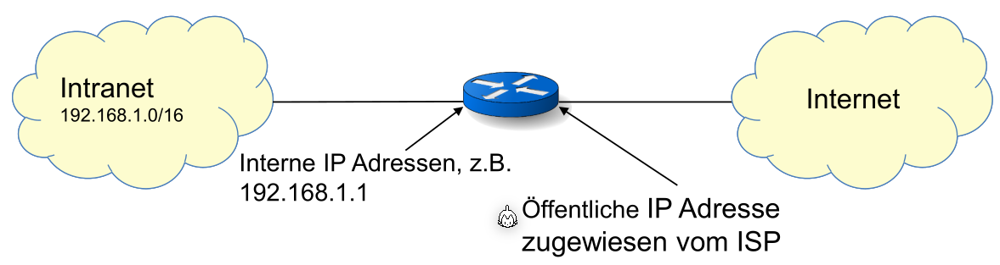
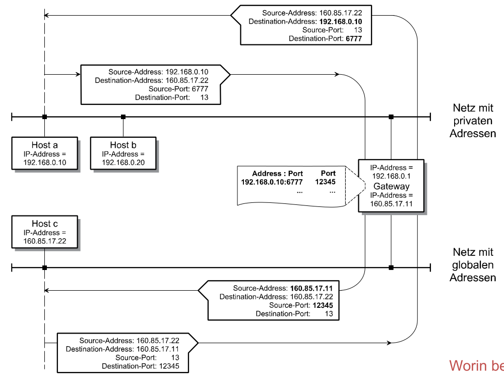

# Application Layer

[TOC]

## DNS

Jeder Full Qualified Domain Name (FQDN) muss eindeutig sein. Dass heisst, Geschwister-Knoten dürfen nicht den selben Namen haben.


### Record Arten

Es gibt mehrere Typen von Records, welche verschiedene Informationen enthalten.



### Root Servers

Ein Root Server ist ein DNS-Server, welcher weiss wo z.B. der `ch` DNS-Server ist. Er ist auf der obersten Stufe. Weltweit gibt es fast 4000 Root Servers.

### Ablauf eines Namensauflösung



### Reverse DNS



## BOOTP / DHCP

BOOTP läuft auf dem UDP Port 67 für den Server und 68 für den Client.

Zu begin kenn ein BOOTP-Client nur seine eigene Mac-Adresse (nicht aber seine IP-Adresse). Daher sendet er ein Broadcast-Adresse mit seiner Mac-Addresse. Der BootP-Server empfängt dieser und sendet die nötigen Netzwerk-Daten zurück und wo das Image-File liegt, dass der Client dies herunter laden kann. BOOTP benötigt zwei Ports, da der Client ein Brodcast auf dem Port  67 schickt und der Server eine Antwort als Broadcast an den Port 68.


Wenn dies über Netzwerkgrenzen funktionieren soll, muss der Router wissen, dass Pakete an den Port 67 und 68 weiter geleitet werden soll.


Ein BootP-Server kann ein Broadcast an alle Clients senden, wenn ein Update des Boot-Image gibt und so die Client benachrichtigen. Dies kann auch vom Server kommen ohne das ein Client anfragt.


Folgenden Screenshot ist das Paket Format gezeigt:



(fortsetzung des oberen Screenshots)

### Nachteile

* Nachteile:
  * Alles Statisch: Eine gesetzte IP-Adresse ist besetzt, auch wenn das Gerät nicht online ist
  * Manuelle Verwaltung: Alles muss manuell eingetragen werden

## DHCP

DHCP (Dynamic Host Configuration Protocol) ist rückwärtskompatibel mit BOOTP und benutzt dasselbe Paketformat und dieselben Ports. Damit der DHCP-Server noch weiss, ob ein Client noch gibt, müssen Clients ein DHCP-Response senden, bevor die Lease-Time ablauft. Sonst würde die Adresse wieder freigegeben werden.

Ein DHCP schickt mindestens:

* IP-Adresse
* Subnetzmaske
* Default Gateway Adresse
* DNS-Server Adresse
* Dynamischer Hostname
* Domain Name (z.B. "zhaw.ch")

Optional könnte unter anderem auch noch ein TFTP-Server und ein Boot Image File gesendet werden.

Ablauf eines DHCP-Reuqests.


## TFTP

TFTP ist der "sehr kleine Bruder" zu FTP und benützt den UDP Port 69.

**TODO**

## NAT

NAT steht für Network Address Translation und wird benützt, da es zu wenig IPv4 Adressen hat, um jeden eine solche Adresse zu verteilen.  



Dabei hat nur noch der Router eine öffentliche IP Adresse. Interne IP-Adressen sind in einem privaten Adressen bereich (wie 192.168.X.X, 172.X.X.X oder 10.X.X.X).

**TODO: Genaues vorgehen beschreiben**




### Port Mapping

**TODO**

### NAT und OSI

NAT folgt nicht dem OSI-Schichten Model, da der Router die TCP/UDP Pakete lesen und schreiben muss. Daher muss die IP-Adresse und Port unverschlüsselt bleiben.


## SMTP

SMTP steht für Simple Mail Protocol und benützt den TCP Port 25.


### Befehle

Es gibt mehrere Befehle, welche an den Server geschickt werden. Der Server Antwortet mit Status-Codes, ähnlich wie in HTTP.

* `HELLO ethz.ch`
  Client meldet sich beim Server
* `MAIL FROM max.muster@ethz.ch`
  Client meldet den Sender
* `RCPT TO hans.muster@zhaw.ch`
  Client meldet den Empfänger. Es können mehrere `RCPT TO` versendet werden.
* `DATA`
  Client möchte Mail versenden.  Die Daten sind fertig, wenn ein einzelnen `.` auf einer Zeile steht
* `QUIT`
  Baut die SMTP Verbindung ab

Hier nun ein Beispiel:

```smtp
> telnet mail.zhaw.ch 25
S: 220 mail.zhaw.ch ESMTP … ready
C: HELO zhaw.ch
S: 250 mail.zhaw.ch
C: MAIL FROM: <muth@zhaw.ch>
S: 250 OK
C: RCPT TO: <klsr@zhaw.ch>
S: 250 <klsr@zhaw.ch>... Recipient ok
C: RCPT TO: <ksha@zhaw.ch>
S: 250 <ksha@zhaw.ch>... Recipient ok
C: DATA
S: 354 Enter mail, end with "." on a line by itself
C: Date: Sat,6 Jan 2099 16:34:25 +0100
C: To: klsr@zhaw.ch
C: Cc: ksha@zhaw.ch
C: Subject: Test einer Mail.
C:
C: Damit ist der SMTP-Teil beendet.
C:
C: Gruss Thomas -- und jetzt?
C: .
S: 250 OK
C: QUIT
S: 221 mail.zhaw.ch closing connection
```

### Nachrichten

Nachrichten in SMTP werden mit 7-Bit ASCII verschickt. Dabei gibt es mehrere Header-Zeilen, welche von zwei Carriage Return und Line Feeds (`\r\n\r\n`) von der Nachricht getrennt sind.

## MIME

MIME steht für Multipurpose Internet Mail Extensions und stellt eine Codierung da, beliebige Daten über 7-Bit ASCII zu verschicken.

Dabei gibt es ein Mime-Separator, welcher die verschiedene MIME Teile teilt. Dieser wird mit dem Header `Boundary` angegeben. Der `Content-Type` der ganzen Nachricht ist `multipart/mixed`. Nach jedem Mime-Seperator gibt es zudem noch ein `Content-Type` Header, welcher die Art der Daten zwischen den Seperator darstellt.

Die Nachrichten selbst kann als Base64 oder Quote-Printable enkodiert werden.

```mime
MIME-Version: 1.0
Content-Type: Multipart/Mixed; 
Boundary="Mime-Separator-WAB02622.926626671"

Mime-Separator-WAB02622.926626671
Content-Type: text/plain

Hier folgt der Text... bla... fasel

Mime-Separator-WAB02622.926626671
Content-Type: text/html

<HTML>...</HTML>
```


**TODO: SMTP Status Codes**

### Base 64

**TODO**

### Quote Printable

**TODO**

## HTTP

HTTP steht für Hypertext Transfer Protocol und funktioniert auf dem TCP Port 80.

**TODO: HTTP**
