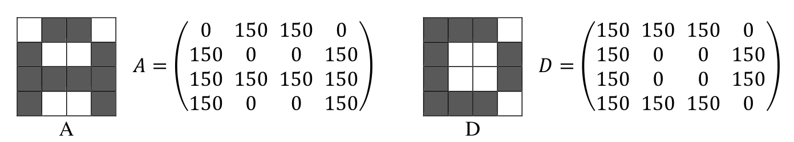
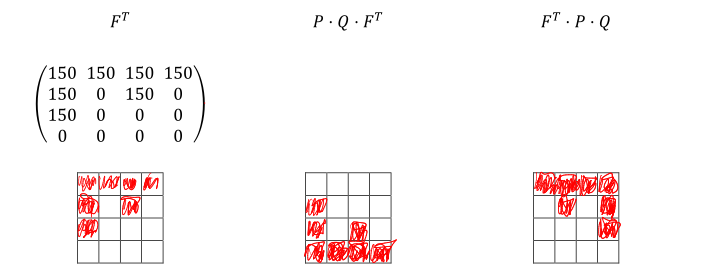

# Matrix

$$
\DeclareMathOperator{\rg}{rg}
$$

Eine Matrix ist ein rechteckiges Zahlenfeld, wie z.B. diese 3x2 Matrix: $\begin{bmatrix}7 & 6 & 2\\2 & 3 & 3\end{bmatrix}$

## Spezial-Typen

* Null-Matrix
  Eine Matrix, bei denen alle Elemente $0$ sind
* Spaltenmatrix
  Eine Matrix, welche nur eine Spalte haben und sind dasselbe, wie Vektoren

## Addition und Subtraktion

Matrizen addieren und subtrahieren ist denkbar einfach. Jede Zahl wird mir der Zahl an der gleichen Stelle in der anderen Matrix addiert, bzw. subtrahiert.
$$
\begin{bmatrix}x_1 & x_2 & x_3 \\ x_4 & x_5 & x_6\end{bmatrix} - 
\begin{bmatrix}y_1 & y_2 & y_3 \\ y_4 & y_5 & y_6\end{bmatrix} = 
\begin{bmatrix}x_1-y_1 & x_2-y_2 & x_3-y_3 \\ x_4-y_4 & x_5-y_5 & x_6-y_6\end{bmatrix}
$$
Dasselbe gilt auch für die Addition.

Für die Addition und Subtraktion müssen beide Matrizden dieselbe Grösse haben, sonst ist das Ergebnis undefiniert.

## Skalar Multiplikation

Wenn eine Matrix mit einem Wert, wie 3 multipliziert wird, entsteht eine neue Matrix, in welcher alle Werte mit diesem Wert multipliziert wurden:
$$
c \cdot
\begin{bmatrix}x_1 & x_2 & x_3 \\ x_4 & x_5 & x_6\end{bmatrix}= 
\begin{bmatrix}c\cdot x_1 & c\cdot x_2 & c\cdot x_3 \\ c\cdot x_4 & c\cdot x_5 & c\cdot x_6\end{bmatrix}
$$

## Matrix Multiplikation

Wenn zwei Matrizen multipliziert werden, wie $A\cdot B$, dann muss die Breite von $A$ gleich die Höhe von $B$ sein.  Das Resultat ist eine Matrix, welche so hoch ist, wie $A$ und so breit ist, wie $B$.

$$
\begin{bmatrix}x_{11} & x_{21} & x_{31} \\ x_{12} & x_{22} & x_{32}\end{bmatrix} \cdot
\begin{bmatrix}y_{11} & y_{21} \\ y_{12} & y_{22} \\ y_{13} & y_{23}\end{bmatrix} = 
\begin{bmatrix}
	x_{11}\cdot y_{11} + x_{21}\cdot y_{12} + x_{31}\cdot y_{13} & 
	x_{11}\cdot y_{21} + x_{21}\cdot y_{22} + x_{21}\cdot y_{23} \\
	x_{12}\cdot y_{12} + x_{22}\cdot y_{12} + x_{32}\cdot y_{13} & 
	x_{12}\cdot y_{21} + x_{22}\cdot y_{22} + x_{22}\cdot y_{23} 
\end{bmatrix}
$$
Wegen dieser Rechnenart, ist die Multiplikation mit zwei Matrizen nicht kommunikativ.

Eine weitere wichtige Eigenschaften von Matrix-Multiplikation ist, dass folgendes nicht gilt: $A\cdot B=C \text { und } A \cdot D = C  \not \Rightarrow B=D$, da es möglich ist, dass $B$ und $D$ verschiedene Matrix sein können, welche beide dasselbe Ergebniss $C$ gibt, wenn mit $A$ multipliziert. 

## Rechnungsregeln

Die folgenden Rechenregeln funktioniert für gleichgrosse Matrizen.

* Kommutativ-Gesetz: $A+B=B+A$ (Geht **NICHT** bei Multiplikation)
* Assoziativ-Gesetzt: $A+(B+C)=(A+B)+C$
* Distributiv-Gesetzt: $\lambda\cdot(A+B)=\lambda\cdot A + \lambda \cdot B$ 
  * Aber Achtung: $\lambda\cdot A + B\cdot \lambda$ kann **nicht** ausgeklammert werden (In könnte einfach $\lambda \cdot A$ und $B\cdot \lambda$ ausgerechnet werden)

* Distributiv-Gesetzt mit Transportierten Matrizen: 
  * $(A\cdot B)^T=B^T \cdot A^T$ (Beachte die Reihenfolge von A und B)
  * $(A+B)^T=A^T+B^T=B^T+A^T$
  * $(A-B)^T=A^T-B^T=B^T-A^T$

## Einheitsmatrix

Eine Einheitsmatrix, ist eine quadratische Matrix, welche Diagonal überall eine `1` hat und sonst `0`:
$$
\begin{bmatrix}
1 & 0 & 0 & 0\\
0 & 1 & 0 & 0\\
0 & 0 & 1 & 0\\
0 & 0 & 0 & 1
\end{bmatrix}
$$
Diese Matrix hat die Eigenschaft, dass wenn eine Matrix $A$ mit einer Identitätsmatrix multipliziert wird, dass wieder die Matrix $A$ herauskommt.

## Inverse Matrix

Die Inverse Matrix, ist die Matrix $A^{-1}$, welche mit der Matrix $A$, eine Identitätsmatrix $I$ ergibt:

$A\cdot A^{-1}=I$

Das Inverse Skalar-Multiplikationen kann folgendermassen gebildet werden: $(3A)^{-1}=\frac 1 3 A^{-1}$

Das Inverse einer Matrix kann gebildet werden, wenn die $\mathrm{det}(A)\neq 0$ ist, bzw. die "Vektoren" in der Matrix linear unabhängig sind.

### Inverse Matrix von 2x2-Matrix

Für 2x2-Matrizen gibt es eine Formel, um das Inverse zu errechnen. Dabei gilt aber: $ad\neq bc$
$$
\pmatrix{a & b\\ c & d}^{-1}=\frac 1 {ad-bc}\cdot \pmatrix{d & -b \\ -c & a}
$$

### Singuläre und reguläre Matrizen

Eine Matrix wird regulär genannt, wenn es ein Inverse von der Matrix gibt. Ansonsten wird sie Singulär genannt.

### Gauss-Jordan Verfahren zur Berechnung der Inverse

**TODO**

## Transponierte Matrix

Eine transponierte Matrix $A^T$ von $A$ ist, wenn die Spalten in $A$ zu Reihen werden und die Reihen in $A$ zu Spalten werden. Man kann es sich auch vorstellen, als ob man die Matrix um 90° gegen den Uhrzeigersinn dreht:
$$
B= \begin{bmatrix}
1 & 2 & 3\\
3 & 4 & 5
\end{bmatrix}\\
B^T= \begin{bmatrix}
1 & 3 \\
2 & 4\\
3 & 5
\end{bmatrix}
$$
Es gilt folgendes Gesetzt: $(A\cdot B)^T=B^T\cdot A^T$

Bemerke, dass sich die Reihenfolge von $A$ und $B$ sich ändert.

## Gleichheit

Zwei Matrizen sind gleich, wenn alle Elemente der Matritzen gleich sind.

## Determinanten

Wenn die Determinanten einer grösseren Matrix als 3x3 Berechnet werden soll, kann ein Verfahren nach Laplace eingesetzt werden:

1. Es wird eine feste Spalte oder Zeile gewählt

2. Nun wird nach der folgenden Formel entwickelt:
   $$
   \text{Entwicklung nach i-ten Zeilen: }\det(A)=\sum^n_{j=1} (-1)^{i+j}\cdot a_{ij}\cdot\det(A_{ij})\\
   \text{Entwicklung nach j-ten Spalte: }\det(A)=\sum^n_{i=1} (-1)^{i+j}\cdot a_{ij}\cdot\det(A_{ij})\\
   $$
   Dabei  ist $a_{ij}$, das Element an $i$-ter Zeile und $j$-ter Spalte und $A_{ij}$ die Matrix, bei welcher die $i$-te Zeile und $j$-Spalte weggelassen wurden

### Eigenschaften

Wenn der Determinant $\neq 0$ ist, dann gilt:

* $\rg(A)=0$
* Die Matrix ist invertierbar

Wenn der Determinant $=0$ ist, dann gilt:

* $\rg(A) < n$ (wobei $n$ die Anzahl Spalten der Matrix $A$ ist)

## Rechenoperation mit Bilder

Man kann die einzelnen Elemente einer Matrix als Pixel in einem Bild darstellen.

### Skalaroperation

Mit einer Skalarmultiplikation kann das ganze Bild heller oder dunkler gestalltet werden. Wenn zwei Matrizen addiert werden, überlagern sich ihre Pixel.

### Matrixen Produkt

Mit dem Matrizen-Produkt können Zeilen vertauscht werden.

### Transponieren

Wenn eine Matrix transponiert wird, wird das Bild entlang der Hauptdiagonalen g

